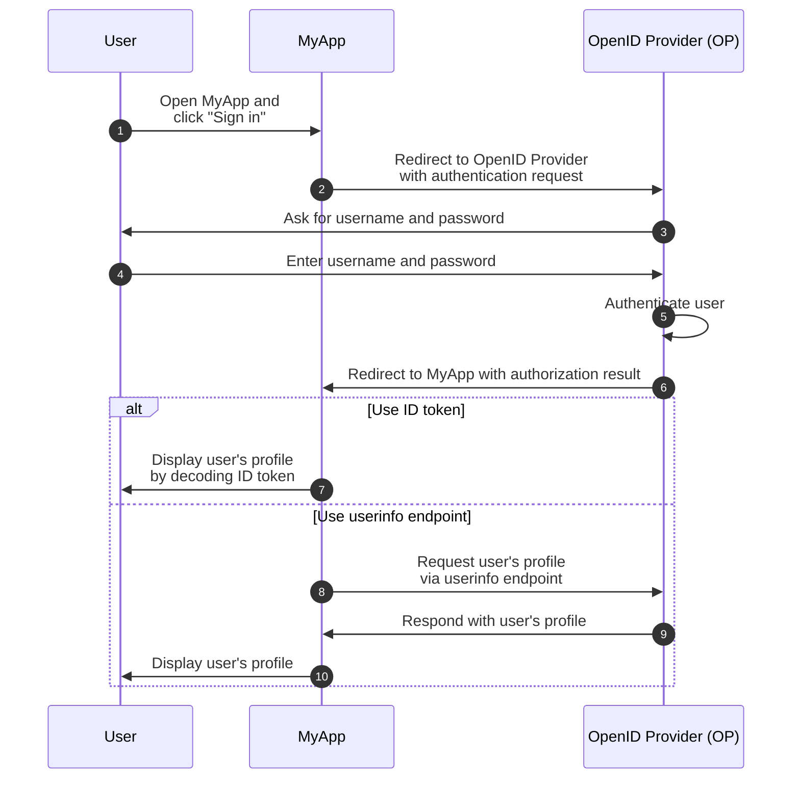

## What is OpenID Connect (OIDC)?

OpenID Connect (OIDC) adds the authentication capabilities to <Ref slug="oauth-2.0" />, an authorization framework, by introducing an identity layer on top of it. OIDC allows clients to authenticate users and obtain identity information in the form of <Ref slug="id-token">ID tokens</Ref> and <Ref slug="userinfo-endpoint" /> responses.

Let's take a look at an example. Suppose you have a web application called MyApp and users can sign in using username and password; after signing in, they can access their profile information. Here's a simplified flow:

Some terms may be new to you, so let's clarify them:

### OpenID Provider (OP)

An OpenID Provider (OP) is an <Ref slug="identity-provider" /> that implements the OIDC and OAuth 2.0 specification. That is to say, an OP is also an OAuth 2.0 <Ref slug="authorization-server" />.

OPs are responsible for authenticating users and issuing ID tokens and access tokens to clients.

### Tokens

- <Ref slug="id-token">ID tokens</Ref> are used to represent user identity information, such as name, email, and profile picture.
- <Ref slug="access-token">Access tokens</Ref> are used to access protected resources on behalf of the user (the same as in OAuth 2.0), for example, the userinfo endpoint.

### Authentication request and result

- <Ref slug="authentication-request" /> is a request made by the client to the OP to authenticate the user. It includes parameters to specify certain requirements and will affect the authentication process.
- Depending on the authentication request, the authentication result can vary. For now, just need to know that the result carries necessary information for the client to identify the user.

### Userinfo endpoint

<Ref slug="userinfo-endpoint" /> is an OIDC-specific endpoint that allows clients to retrieve user profile information. It's an alternative to using ID tokens since the userinfo endpoint typically provides more detailed user information than the ID token.

OIDC leaves the OpenID Provider (OP) to decide what information to include in the ID token and userinfo response. So before parsing the ID token or calling the userinfo endpoint, you should check the OP's documentation to understand what information is available.

## Term differences between OAuth 2.0 and OIDC

Since OIDC is built on top of OAuth 2.0, many terms are shared between the two specifications. However, while OAuth 2.0 focuses on authorization, OIDC introduces authentication and identity, making some terms unsuitable in the context of OIDC. Here are some notable differences:

| OAuth 2.0             | OpenID Connect (OIDC)  |
|-----------------------|------------------------|
| Authorization server  | OpenID Provider (OP)   |
| Authorization request | Authentication request |
| Grant                 | Flow                   |

In essence, the above terms may point to the same subject, but they have different meanings in the context of OAuth 2.0 and OIDC:

- **OpenID Provider (OP)** is an OAuth 2.0 <Ref slug="authorization-server" /> that has the capability to authenticate users and issue ID tokens.
- **<Ref slug="authentication-request" />** is an OAuth 2.0 <Ref slug="authorization-request" /> that uses OIDC-specific parameters to request end-user authentication and obtain an ID token.
- **Flow** is a more general term used in OIDC to describe the user authentication and authorization process, which may involve multiple steps and interactions rather than a single request-response cycle. It's essentially the same as an <Ref slug="oauth-2.0-grant" />.

## Authorization in OIDC

## OIDC flows

## OIDC scopes and claims

## OIDC security considerations
