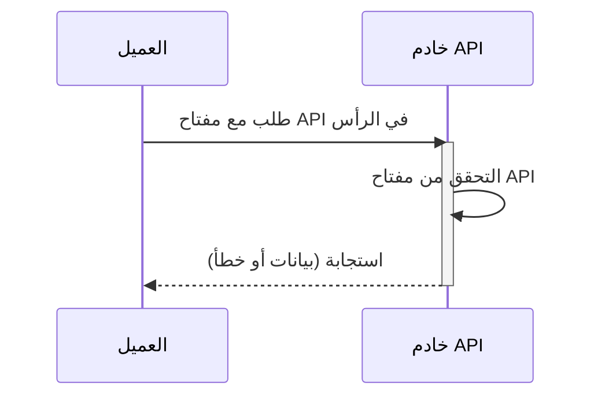

## ما هو مفتاح API؟

مفتاح API هو رمز سري يُستخدم لمصادقة العملاء الذين يصلون إلى API. إنه مثل كلمة المرور لتطبيقك، يسمح بالوصول إلى API محدد. فكر فيه كمفتاح بطاقة للوصول إلى مبنى. يمنحك مفتاح البطاقة الوصول، لكنه لا يحدد بالضرورة من أنت.

## كيف تعمل مفاتيح API؟

تعمل مفاتيح API من خلال عملية بسيطة من الطلب والاستجابة.

1. **الطلب:** يرسل تطبيقك طلبًا إلى API، متضمنًا مفتاح API. غالبًا ما يتم إرسال المفتاح في رأس الطلب. على سبيل المثال، قد يبدو الرأس هكذا: `x-api-key: your_actual_api_key`. لا يوجد معيار واحد لأسماء الرؤوس أو تنسيقات القيم.

2. **التحقق:** يتحقق خادم API من المفتاح المقدم مقابل قاعدة بياناته.

3. **الاستجابة:** إذا كان المفتاح صالحًا، يمنح الخادم الوصول ويرسل البيانات المطلوبة. إذا لم يكن كذلك، يتم رفض الوصول.

إليك رسم بياني يوضح العملية:

## ما هي مزايا وعيوب مفاتيح API؟

لنلقِ نظرة على ما يجعل مفاتيح API مفيدة وأين تقصر:

### المزايا

- **سهلة الاستخدام للغاية**: فقط أضف مفتاحًا إلى طلبك وستكون جاهزًا! إنه مثل استخدام مفتاح المنزل - لا خطوات معقدة مطلوبة.

- **سهلة التتبع**: هل تريد معرفة من يستخدم API الخاص بك؟ مفاتيح API تجعل الأمر بسيطًا. يمكنك رؤية التطبيقات التي تقوم بإجراء المكالمات وعدد مرات القيام بذلك.

- **تحديد معدل الاستخدام بسرعة**: أوقف الأشخاص من الإفراط في استخدام API الخاص بك عن طريق تحديد الحدود لكل مفتاح. إنه مثل وجود حارس في نادٍ يعد عدد المرات التي يدخل فيها شخص ما ويخرج.

- **مثالية للبيانات العامة**: إذا كنت تشارك معلومات غير حساسة (مثل بيانات الطقس أو الإحصائيات العامة)، فإن مفاتيح API مناسبة تمامًا.

### العيوب

- **أقل أمانًا من البدائل الحديثة**: مفاتيح API ليست فعالة مثل أشكال أخرى من مصادقة API، مثل <Ref slug="oauth-2.0" /> و<Ref slug="jwt" />. فكر فيها كقفل أساسي مقارنة بنظام أمان حديث. ومع ذلك، تظل شائعة لأنها أبسط طريقة لتتبع استخدام API والبدء في أمان API.

- **مخاطر الأمان**: مفاتيح API مثل ترك مفتاح منزلك تحت ممسحة الباب. إذا وجدها شخص ما، يمكنه استخدامها إلى الأبد. إليك السبب:
  - غالبًا ما تكون مرئية في الكود
  - لا تنتهي صلاحيتها تلقائيًا
  - إذا تم تسريبها (مثل في مستودعات GitHub العامة)، يمكن لأي شخص استخدامها

- **لا يمكنها تمييز المستخدمين**: بينما تستخدم بعض الشركات "مفاتيح API" التي يمكنها تحديد المستخدمين (مثل Stripe)، لا يمكن لمفاتيح API التقليدية إخبارك من هو من. إنها تخبرك فقط أي تطبيق يقوم بالطلب.

- **ثابتة بطبيعتها**: على عكس رموز المصادقة الحديثة التي تنتهي صلاحيتها، تبقى مفاتيح API عادة كما هي إلى الأبد. هذا يعني:
  - لا تحديثات أمان تلقائية
  - العمل اليدوي المطلوب لتدوير المفاتيح
  - خطر أعلى إذا تم كشف المفاتيح

## ما هي حالات الاستخدام لمفاتيح API؟

- الاتصال من خدمة إلى خدمة: مفاتيح API مناسبة للسيناريوهات التي تحتاج فيها التطبيقات إلى التواصل مع APIs مباشرة عبر واجهات سطر الأوامر. مثل الاتصال بـ OpenAI APIs.
- APIs العامة: عند كشف APIs للجمهور، توفر مفاتيح API طريقة بسيطة للتحكم في الوصول.
- إعداد مبسط: لاحتياجات المصادقة السريعة والبسيطة، خاصة في مرحلة التطوير. على عكس مصادقة Machine-to-machine، لا تتطلب مفاتيح API تسجيل العميل مسبقًا، ولا تحتاج إلى تبادل للحصول على access token أيضًا. فقط قم بتمرير مفتاح API الخاص بك كمعامل في طلبك وسيعمل ببساطة.

في السيناريوهات الواقعية، الغرض الأكثر شيوعًا عند بناء المنتجات هو تكامل المنتج. إليك حالة استخدام نموذجية:

### مثال: التكامل مع Stripe

يستخدم Stripe مفاتيح API للتكامل الآمن مع المنصات والتطبيقات المختلفة. يمكنك إنشاء وعرض وحذف وإدارة هذه المفاتيح من خلال لوحة تحكم المطورين. باستخدام مفاتيح API، يمكنك دمج ميزات الدفع والفوترة الخاصة بـ Stripe في منتجك.

## ما هو الفرق بين الرموز الشخصية للوصول (PAT) وMachine-to-Machine (M2M)؟

عند الحديث عن مفاتيح API، يمكن أيضًا ذكر الرموز الشخصية للوصول و<Ref slug="machine-to-machine" /> معًا لأنها جميعًا يمكنها الوصول برمجيًا إلى موارد API من خلال أوامر CLI، أو إقامة اتصال بين خدمات الخلفية.

### الرموز الشخصية للوصول (PATs)

الرمز الشخصي للوصول هو أيضًا سلسلة ولكنه يمثل ***هوية وامتيازات مستخدم محدد***، يتم إنشاؤه ديناميكيًا عند المصادقة أو تسجيل الدخول بنجاح، وعادة ما يكون له عمر محدود ولكن يمكن تحديثه. يوفر تحكمًا دقيقًا في الوصول إلى البيانات والقدرات الخاصة بالمستخدم ويُستخدم عادةً لأدوات CLI أو السكربتات أو الوصول الشخصي إلى API. الفرق الرئيسي هو أنه أكثر تحديدًا ويُستخدم للإجراءات الخاصة بالمستخدم.

### Machine-to-Machine (M2M)

الاتصال M2M هو عندما تتبادل الأجهزة البيانات تلقائيًا دون تدخل بشري بمعنى أوسع.

في سياق <Ref slug="openid-connect" /> (أو <Ref slug="oauth-2.0" />)، تستخدم تطبيقات M2M <Ref slug="client-credentials-flow" />، كما هو معرف في [بروتوكول OAuth 2.0 RFC 6749](https://datatracker.ietf.org/doc/html/rfc6749)، الذي يدعم بروتوكولات قياسية مماثلة. عادة ما يتضمن تطبيق عميل (آلة أو خدمة) الوصول إلى الموارد إما بمفرده أو نيابة عن مستخدم. إنه مثالي للمواقف التي يمكن فيها فقط للعملاء الموثوق بهم الوصول إلى خدمات الخلفية.

<SeeAlso slugs={["machine-to-machine"]} />