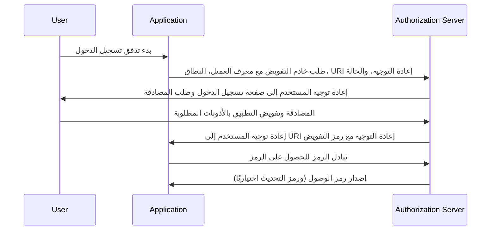

## ما هو تدفق رمز التفويض (authorization code flow)؟

تدفق رمز التفويض (المعروف أيضًا باسم منح رمز التفويض)، المحدد في [OAuth 2.0 RFC 6749، القسم 4.1](https://datatracker.ietf.org/doc/html/rfc6749#section-4.1)، هو آلية تفويض OAuth 2.0 مستخدمة على نطاق واسع تسمح للتطبيقات بالحصول على رمز وصول نيابة عن المستخدم.

هذا التدفق مثالي للتطبيقات السرية مثل تطبيقات الويب التقليدية من جانب الخادم التي يمكنها تخزين أسرار العميل بأمان.

يمكن أيضًا استخدامه بأمان للتطبيقات الأصلية وتطبيقات الصفحة الواحدة (SPAs) التي لا يمكنها تخزين أسرار العميل بأمان عند دمجها مع امتداد PKCE (<Ref slug="pkce" />).

## كيف يعمل تدفق رمز التفويض (authorization code flow)؟

يتضمن تدفق رمز التفويض الخطوات التالية:

1. **بدء التدفق**: يبدأ المستخدم التدفق عادةً بالنقر على رابط أو زر في التطبيق لتسجيل الدخول. يقوم التطبيق بإعادة توجيه المستخدم إلى نقطة نهاية التفويض لخادم التفويض، مع تمرير معرف العميل، النطاق المطلوب، URI إعادة التوجيه، ومعامل الحالة. يقوم خادم التفويض بالتحقق من صحة المعاملات ويطلب من المستخدم المصادقة على صفحة تسجيل الدخول لخادم التفويض.
2. **مصادقة المستخدم والتفويض**: يقوم المستخدم بالمصادقة مع خادم التفويض ويمنح التطبيق الإذن للوصول إلى الموارد المطلوبة.
3. **توليد الرمز وإعادة التوجيه**: يقوم خادم التفويض بتوليد رمز التفويض ويعيد توجيه المستخدم مرة أخرى إلى التطبيق باستخدام URI إعادة التوجيه المقدم سابقًا. يتم تضمين رمز التفويض في سلسلة الاستعلام لـ URI إعادة التوجيه.
4. **تبادل الرمز**: يستخرج التطبيق رمز التفويض من سلسلة الاستعلام ويقوم بإجراء طلب POST إلى نقطة نهاية الرمز لخادم التفويض لتبادل رمز التفويض برمز الوصول. يجب أن يتضمن التطبيق أيضًا معرف العميل، سر العميل، URI إعادة التوجيه، ورمز التفويض في الطلب.
5. **استرجاع رمز الوصول**: يقوم خادم التفويض بالتحقق من صحة رمز التفويض ويصدر رمز وصول (ورمز تحديث اختياريًا) للتطبيق عند التحقق الناجح. يمكن للتطبيق بعد ذلك استخدام رمز الوصول لإجراء طلبات API مصرح بها نيابة عن المستخدم.

يمكن توضيح الخطوات بواسطة مخطط التسلسل التالي:



## كيف يتم تنفيذ تدفق رمز التفويض (authorization code flow)؟

إليك مثال بسيط لتنفيذ تدفق رمز التفويض، باتباع الإرشادات الموضحة في [OAuth 2.0 RFC 6749، القسم 4.1](https://datatracker.ietf.org/doc/html/rfc6749#section-4.1):

### 1. الإعداد الأولي

تأكد من حصولك على المعلومات التالية من خدمة المصادقة الخاصة بك قبل البدء:

```javascript
const config = {
  clientId: "YOUR_CLIENT_ID",
  clientSecret: "YOUR_CLIENT_SECRET",
  authorizationEndpoint: "https://authorization-server.com/auth",
  tokenEndpoint: "https://authorization-server.com/token",
  redirectUri: "http://localhost:3000/callback",
};
```

معرف العميل، سر العميل، وURI إعادة التوجيه هي تكوينات تطبيقك في خدمة المصادقة.

يتم توفير `authorizationEndpoint` و`tokenEndpoint` من قبل خدمة المصادقة الخاصة بك.

إذا كان خادم المصادقة الخاص بك ينفذ OIDC (<Ref slug="openid-connect" />)، يمكنك الحصول على هذه المعلومات من خلال <Ref slug="openid-connect-discovery" />.

### 2. بدء طلب التفويض

يبدأ التدفق عندما يريد المستخدم تسجيل الدخول (على سبيل المثال، بالنقر على زر تسجيل الدخول). سيقوم التطبيق بإجراء طلب تسجيل الدخول.

يتضمن هذا الطلب معاملات مثل `معرف العميل`، `URI إعادة التوجيه`، و`النطاق`. ثم يقوم بإعادة توجيه المستخدم إلى نقطة نهاية التفويض لخدمة المصادقة (صفحة تسجيل الدخول لخدمة المصادقة).

سيقوم المستخدم بالمصادقة والتفويض على صفحة تسجيل الدخول هذه.

```javascript
app.get("/login", (req, res) => {
  const authUrl = new URL(config.authorizationEndpoint);
  authUrl.searchParams.append("response_type", "code");
  authUrl.searchParams.append("client_id", config.clientId);
  authUrl.searchParams.append("redirect_uri", config.redirectUri);
  authUrl.searchParams.append("scope", "openid profile email");
  authUrl.searchParams.append("state", "random_state_string");

  res.redirect(authUrl.toString());
});
```

ملاحظة: يمكنك إضافة المزيد من المعاملات بخلاف تلك الموضحة في كود المثال. انظر [التعريف الكامل لمعاملات طلب المصادقة](https://openid.net/specs/openid-connect-core-1_0.html#AuthRequest).

### 3. معالجة رد الاتصال لـ URI إعادة التوجيه وتبادل الرموز

بعد أن يكمل المستخدم المصادقة والتفويض على صفحة تسجيل الدخول لخدمة المصادقة، تقوم خدمة المصادقة بإعادة توجيه المستخدم مرة أخرى إلى URI إعادة التوجيه للتطبيق. يتضمن هذا URI إعادة التوجيه رمز التفويض ومعاملات الحالة.

يقوم التطبيق باستخراج رمز التفويض ومعاملات الحالة من URI إعادة التوجيه ويقوم بتبادلها للحصول على رموز الوصول والتحديث (إن وجدت) في نقطة نهاية الرمز لخدمة المصادقة.

```javascript
app.get("/callback", async (req, res) => {
  const { code, state } = req.query;

  try {
    // تبادل رمز التفويض للحصول على رمز الوصول ورمز التحديث
    const tokenResponse = await axios.post(config.tokenEndpoint, {
      grant_type: "authorization_code",
      code,
      redirect_uri: config.redirectUri,
      client_id: config.clientId,
      client_secret: config.clientSecret,
    });

    const { access_token, refresh_token } = tokenResponse.data;
    // تخزين الرموز للطلبات اللاحقة
    req.session.accessToken = access_token;

    res.send("تمت المصادقة بنجاح!");
  } catch (error) {
    res.status(500).send("فشل تبادل الرموز");
  }
});
```

### 4. استخدام رمز الوصول

بمجرد حصولك على الرمز، استخدمه للوصول إلى الموارد المحمية:

```javascript
async function fetchUserProfile(accessToken) {
  const response = await axios.get("https://api.example.com/userinfo", {
    headers: {
      Authorization: `Bearer ${accessToken}`,
    },
  });
  return response.data;
}
```

## كيف يتم استخدام تدفق رمز التفويض (authorization code flow) للعملاء العامين (التطبيقات الأصلية وSPAs)؟

يواجه العملاء العامون (مثل التطبيقات الأصلية وSPAs) تحديات أمان فريدة عند استخدام تدفق رمز التفويض. لا يمكن لهذه التطبيقات تخزين أسرار العميل بأمان. سيتم كشف سر العميل في كود JavaScript أو داخل تخزين الجهاز. هذا يجعل من السهل على المهاجمين استخراج السر واستخدامه بشكل غير صحيح.

لذلك، التحدي الرئيسي هو كيفية استخدام تدفق رمز التفويض بأمان دون سر العميل. قدمت مواصفة OAuth 2.0 امتداد PKCE (<Ref slug="pkce" />) لحل هذه المشكلة.

يضيف PKCE تدابير أمان إضافية لحماية تدفق رمز التفويض للعملاء العامين. يمنع هجمات اعتراض رمز التفويض حتى بدون استخدام سر العميل. تحقق من هذه المدونة لمعرفة المزيد عن [كيف يحمي PKCE تدفق رمز التفويض لـ OAuth 2.0](https://blog.logto.io/how-pkce-protects-the-authorization-code-flow-for-native-apps).

## كيف يتم استخدام تدفق رمز التفويض (authorization code flow) بأمان؟

### **استخدام "الحالة" لمنع هجمات CSRF**

تقوم هجمات CSRF (<Ref slug="csrf" />) بخداع المستخدمين للقيام بإجراءات غير مرغوب فيها في تطبيق ويب مصادق عليه. يساعد معامل الحالة في منع ذلك.

- توليد قيمة فريدة وعشوائية. قم بتخزين هذه القيمة على الخادم.
- تضمين معامل الحالة. أضفه إلى عنوان URL لطلب التفويض.
- التحقق من الحالة عند العودة. عندما يقوم خادم التفويض بإعادة التوجيه مرة أخرى إلى تطبيقك، قارن الحالة المعادة بالقيمة المخزنة. إذا لم تتطابق، ارفض الطلب. هذا يؤكد أن الطلب نشأ من تطبيقك.

### **تكوين URI إعادة توجيه آمن**

URI إعادة التوجيه هو المكان الذي يرسل فيه خادم التفويض رمز التفويض بعد مصادقة المستخدم. التكوين الآمن أمر بالغ الأهمية.

- تسجيل URI إعادة توجيه صالح. أثناء تسجيل التطبيق مع خادم التفويض، حدد URI إعادة التوجيه المسموح به.
- المطابقة الدقيقة. يجب أن يتطابق URI إعادة التوجيه في طلب التفويض تمامًا مع URI مسجل. حتى الاختلاف الطفيف يمكن أن يخلق ثغرة.
- تجنب URI البدل. إذا أمكن، تجنب استخدام URI البدل في الإنتاج. إنها توسع سطح الهجوم.
- HTTPS للإنتاج. استخدم دائمًا HTTPS لـ URI إعادة التوجيه في بيئات الإنتاج.

### **استخدام PKCE لجميع العملاء**

بينما تم تصميم PKCE في الأصل للعملاء العامين، تتطلب مواصفة <Ref slug="oauth-2.1" /> فرض PKCE لجميع العملاء، بما في ذلك العملاء السريين، لتعزيز الأمان العام لتدفق رمز التفويض. (انظر [فرض PKCE لجميع العملاء](https://auth.wiki/oauth-2.1#enforcing-pkce-for-all-clients))

## ما هو الفرق بين تدفق رمز التفويض (authorization code flow) وتدفق الضمني (implicit flow)؟

الفرق الرئيسي بين تدفق رمز التفويض وتدفق الضمني هو كيفية الحصول على رمز الوصول:

- **تدفق رمز التفويض**: يتلقى تطبيق العميل رمز التفويض أولاً من نقطة نهاية التفويض، ثم يقوم بتبادله للحصول على رمز الوصول في طلب POST لاحق إلى نقطة نهاية الرمز.
- **التدفق الضمني**: يتلقى تطبيق العميل رمز الوصول مباشرة في جزء URL لـ URI إعادة التوجيه بعد تفويض المستخدم.

تعرف على المزيد حول <Ref slug="implicit-flow" />.

## ما هو الفرق بين تدفق رمز التفويض (authorization code flow) وتدفق بيانات اعتماد العميل (client credentials flow)؟

الفرق الرئيسي بين تدفق رمز التفويض وتدفق بيانات اعتماد العميل هو السياق الذي يتم فيه استخدام التدفق:

- **تدفق رمز التفويض**: يستخدم عندما يحتاج تطبيق العميل إلى الوصول إلى الموارد نيابة عن المستخدم. يتضمن التدفق مصادقة المستخدم وتفويضه.
- **تدفق بيانات اعتماد العميل**: يستخدم عندما يحتاج تطبيق العميل إلى الوصول إلى الموارد نيابة عن نفسه. يتضمن التدفق مصادقة العميل ولكن ليس مصادقة المستخدم، وهو الأنسب للاتصالات بين الآلات.

تعرف على المزيد حول <Ref slug="client-credentials-flow" />.

<SeeAlso
  slugs={[
    "device-flow",
    "implicit-flow",
    "client-credentials-flow",
    "pkce",
    "openid-connect",
    "openid-connect-discovery",
    "csrf",
    "oauth-2.1",
  ]}
/>

<Resources urls={[
  "https://datatracker.ietf.org/doc/html/rfc6749",
  "https://openid.net/specs/openid-connect-core-1_0.html#AuthRequest",
  "https://blog.logto.io/how-pkce-protects-the-authorization-code-flow-for-native-apps"
]} />