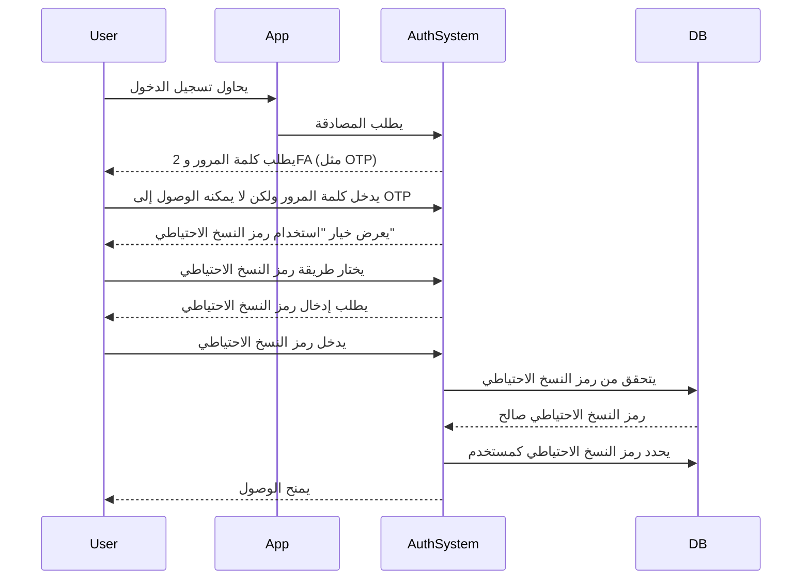

## ما هو رمز النسخ الاحتياطي (Backup code)؟

رمز النسخ الاحتياطي (Backup code) (ويُسمى أيضًا رمز الاسترداد) هو مجموعة من الرموز التي تُولد عشوائيًا وتُستخدم لمرة واحدة، وتعمل كطريقة مصادقة احتياطية عندما لا تكون خيارات MFA الأساسية الخاصة بك - مثل الرسائل القصيرة أو تطبيقات المصادقة أو مفاتيح المرور - متاحة. فكر فيها كمفاتيح طوارئ تضمن لك الوصول إلى حسابك دائمًا، حتى إذا فقدت هاتفك أو واجهت مشاكل في الشبكة أو تعرضت لأعطال تقنية.

## كيف يعمل رمز النسخ الاحتياطي (Backup code)؟

توفر رموز النسخ الاحتياطي طريقة بسيطة ولكن آمنة لاستعادة الوصول إلى حسابك عندما تفشل طرق MFA القياسية. إليك كيفية عملها:

1. **التوليد**: يقوم النظام بإنشاء مجموعة فريدة من الرموز (عادةً ما تكون كل منها مكونة من 8-12 حرفًا) أثناء إعداد MFA.
2. **التخزين**: يُطلب منك حفظ هذه الرموز بشكل آمن - إما دون اتصال (مثل طباعتها على ورق) أو في مدير كلمات مرور مشفر.
3. **الاستخدام**: إذا لم تتمكن من استخدام طريقة MFA الأساسية الخاصة بك، يمكنك إدخال أحد رموز النسخ الاحتياطي للتحقق من الهوية.
4. **الإبطال**: يتم تعطيل كل رمز تلقائيًا بعد الاستخدام لمنع إعادة الاستخدام.

## متى تستخدم رمز النسخ الاحتياطي (Backup code)؟

هل ستصبح رموز النسخ الاحتياطي قديمة؟ هل يجب أن يدعمها MFA؟

بالتأكيد. تظل رموز النسخ الاحتياطي شبكة أمان حيوية لـ MFA. بينما تكتسب الطرق الأحدث مثل مفاتيح المرور و FIDO2 زخمًا، تقدم رموز النسخ الاحتياطي خيار استرداد متاح عالميًا وغير معتمد على الجهاز. إنها وسيلة حماية منخفضة التكلفة وعالية القيمة ويجب دعمها دائمًا جنبًا إلى جنب مع طرق MFA الحديثة.

استخدم رمز النسخ الاحتياطي عندما:

- يكون جهاز MFA الأساسي الخاص بك غير متاح (مثل فقدان الهاتف، نفاد البطارية).
- تمنع مشاكل الشبكة تسليم الرسائل القصيرة/البريد الإلكتروني.
- يفشل تطبيق المصادقة الخاص بك في المزامنة.
- يتعطل رمز الأجهزة الخاص بك.

## كيفية استخدام رمز النسخ الاحتياطي (Backup code) بأمان؟

لضمان بقاء رموز النسخ الاحتياطي آمنة:

1. **احفظها دون اتصال**
    - احفظها في مجلد مشفر على جهازك.
    - اطبعها واحفظها في مكان آمن (مثل خزنة برقم سري).
    - تجنب حفظها في تنسيقات رقمية غير آمنة (مثل تطبيقات الملاحظات عبر الإنترنت).
2. **استخدم مدير كلمات المرور**
    - تقدم معظم مديري كلمات المرور (مثل 1Password، LastPass) ميزة الملاحظات الآمنة.
        - أنشئ إدخالًا جديدًا: "رموز النسخ الاحتياطي – [اسم الخدمة]"
        - انسخ والصق رموز النسخ الاحتياطي الخاصة بك، ثم قم بتمكين التشفير.
    - إذا كنت تستخدم Google Password Manager، يمكنك:
        - العثور على إدخال الخدمة ذات الصلة.
        - تحريره وإضافة ملاحظة لرموز النسخ الاحتياطي الخاصة بك، ووضع علامة على الرموز كـ "مستخدمة/غير مستخدمة" لتتبعها.
        - بهذه الطريقة، عند ملء كلمات المرور تلقائيًا، يمكنك الوصول بسرعة إلى رموز النسخ الاحتياطي الخاصة بك عند الحاجة.
3. **استبدل الرموز المستخدمة**
    - قم بتوليد رموز جديدة إذا كنت قد استخدمت معظمها أو تشك في أنها تعرضت للاختراق.

## تصميم تجربة MFA مع رموز النسخ الاحتياطي

بالنسبة للمطورين الذين يقومون بتنفيذ رموز النسخ الاحتياطي، اتبع هذه الممارسات الجيدة:

1. **لا تعتمد فقط على رموز النسخ الاحتياطي**
إنها وسيلة طوارئ احتياطية، وليست طريقة MFA الأساسية. قدم دائمًا TOTP، مفاتيح المرور، أو خيارات قوية أخرى.
2. **قدم 8-10 رموز بشكل افتراضي**
    
    هذا يوازن بين سهولة الاستخدام (كافية لحالات الطوارئ النادرة) والأمان (يقلل من خطر السرقة بالجملة).
    
3. **فرض الاستخدام لمرة واحدة**
    
    قم بإبطال الرموز تلقائيًا بعد الاستخدام.
    
4. **إعادة توليد الرموز تلقائيًا عند نفادها**
    
    منع الإغلاق عن طريق إصدار رموز جديدة بمجرد أن يستنفد المستخدم مجموعته الحالية.
    
5. **السماح بإعادة التوليد اليدوي مع التحقق الصارم**
    
    دع المستخدمين يولدون رموزًا جديدة إذا فقدوا رموزهم، ولكن تطلب إعادة المصادقة (مثل تأكيد البريد الإلكتروني/الرسائل القصيرة/كلمة المرور).
    

## رموز النسخ الاحتياطي مقابل كلمات المرور: ما الفرق؟

| الميزة | رموز النسخ الاحتياطي | كلمات المرور |
| --- | --- | --- |
| **الغرض** | وسيلة احتياطية لمرة واحدة عند فشل MFA | طريقة المصادقة الأساسية |
| **التنسيق** | تُولد بواسطة النظام، أبجدية رقمية | يختارها المستخدم، غالبًا مزيج من الأحرف |
| **التخزين** | تُخزن مشفرة (غالبًا بدون ملح، لأنها تُستخدم لمرة واحدة) | تُخزن مشفرة + مملحة (لمنع هجمات جداول قوس قزح) |
| **الاستخدام** | تُعطل بعد استخدام واحد | قابلة لإعادة الاستخدام حتى التغيير |
| **إعادة التوليد** | يصدر النظام مجموعات جديدة | يعيد المستخدم تعيينها يدويًا |
| **الأمان** | يجب حفظها بشكل آمن | عرضة للخطر إذا كانت ضعيفة أو معاد استخدامها |

**ملاحظات الأمان الرئيسية:**

- يجب أن تكون كلاهما طويلة وتُولد عشوائيًا لمقاومة هجمات القوة الغاشمة.
- تتطلب كلمات المرور التمليح لأن المستخدمين غالبًا ما يعيدون استخدامها.
- عادةً لا تحتاج رموز النسخ الاحتياطي إلى التمليح - فهي تُستخدم لمرة واحدة وتُولد عشوائيًا، مما يجعل الاستغلال على نطاق واسع غير محتمل.

<Resources
  urls={[
    "https://docs.logto.io/end-user-flows/mfa",
    "https://auth-wiki.logto.io/mfa",
    "https://auth-wiki.logto.io/totp"
  ]}
/>