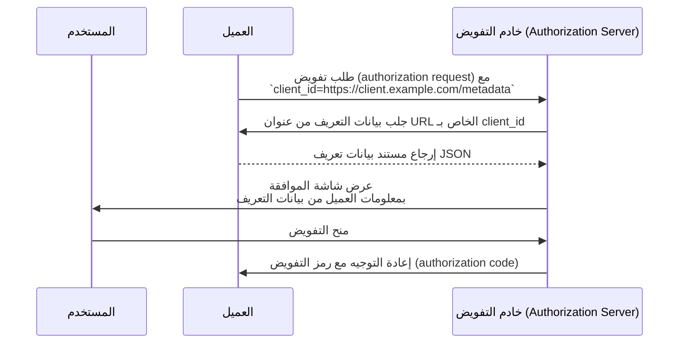

## ما هي وثيقة بيانات تعريف معرف العميل (Client ID Metadata Document)؟

وثيقة بيانات تعريف معرف العميل (Client ID Metadata Document) هي آلية تم تعريفها في [مواصفة OAuth Client ID Metadata Document](https://datatracker.ietf.org/doc/draft-ietf-oauth-client-id-metadata-document/) وتسمح لـ <Ref slug="client" /> في OAuth 2.0 بالتعريف بنفسه أمام <Ref slug="authorization-server" /> دون الحاجة إلى تسجيل مسبق.

الفكرة الأساسية: بدلاً من استلام `client_id` من خادم التفويض (authorization server) (عبر التسجيل اليدوي أو [التسجيل الديناميكي للعميل (Dynamic Client Registration)](https://datatracker.ietf.org/doc/html/rfc7591))، يقوم العميل **باستخدام عنوان URL عبر HTTPS كـ `client_id`**. يشير هذا العنوان إلى مستند JSON يحتوي على بيانات تعريف العميل — مثل الاسم، عناوين إعادة التوجيه (redirect URIs)، أنواع منح الصلاحيات المدعومة، وغيرها. يقوم خادم التفويض بجلب هذا المستند عند مواجهة `client_id` مبني على عنوان URL.

يُشار أحيانًا إلى هذا النهج بالاختصار **CIMD** (Client ID Metadata Document) في المجتمع التقني.

## كيف تعمل؟

عند استخدام العميل لوثيقة بيانات تعريف معرف العميل (Client ID Metadata Document)، يضيف تدفق OAuth خطوة إضافية: يقوم خادم التفويض بجلب بيانات تعريف العميل من عنوان URL الخاص بـ `client_id`.



ما يحدث خطوة بخطوة:

1. يبدأ العميل <Ref slug="authorization-request" /> مع عنوان URL الخاص به كـ `client_id` (مثال: `https://client.example.com/oauth-client`).
2. يتعرف خادم التفويض على أن `client_id` هو عنوان URL ويقوم بجلبه عبر HTTPS.
3. يكون الرد عبارة عن مستند JSON يحتوي على بيانات تعريف العميل القياسية في OAuth.
4. يتحقق خادم التفويض من صحة البيانات، ويعرض معلومات الموافقة للمستخدم، ويتابع تدفق OAuth.
5. يمكن استخدام بيانات التعريف المخبأة في الطلبات اللاحقة وفقًا لعناوين التخزين المؤقت (HTTP caching headers).

### مستند بيانات التعريف

مستند بيانات التعريف هو كائن JSON يستخدم نفس الحقول المعرفة في [RFC 7591 (بروتوكول التسجيل الديناميكي للعميل في OAuth 2.0)](https://datatracker.ietf.org/doc/html/rfc7591). يجب أن يتضمن حقل `client_id` بحيث يطابق قيمته عنوان URL بالضبط.

مثال:

```json
{
  "client_id": "https://client.example.com/oauth-client",
  "client_name": "تطبيقي",
  "redirect_uris": ["https://client.example.com/callback"],
  "grant_types": ["authorization_code", "refresh_token"],
  "response_types": ["code"],
  "token_endpoint_auth_method": "none",
  "scope": "openid profile email"
}
```

### متطلبات عنوان URL لمعرف العميل (client identifier URL)

تفرض المواصفة متطلبات صارمة على ما يشكل عنوان URL صالح لمعرف العميل:

- **يجب أن يستخدم HTTPS** — لا يُسمح بـ HTTP العادي أو أي بروتوكولات أخرى.
- **يجب أن يتضمن جزء المسار (path component)** — لا يُسمح بنطاق مجرد مثل `https://example.com`.
- **يجب ألا يحتوي** على جزء fragment أو اسم مستخدم أو كلمة مرور.
- **يجب ألا يحتوي** على مقاطع مسار منقطة (single-dot `.` أو double-dot `..`).
- يُسمح بسلاسل الاستعلام (query strings) لكن يُفضل تجنبها.
- يُسمح بأرقام المنافذ (port numbers).

أمثلة:
- `https://client.example.com/oauth-client` — صالح
- `http://client.example.com/oauth-client` — غير صالح (ليس HTTPS)
- `https://example.com` — غير صالح (لا يوجد مسار)
- `https://client.example.com/../oauth-client` — غير صالح (مقطع منقط)

## لماذا لا نستخدم طرق التسجيل الحالية؟

لفهم سبب وجود هذه المواصفة، يجب النظر إلى قيود الأساليب الحالية:

### التسجيل الثابت (Static registration)

في عمليات نشر OAuth التقليدية، يقوم المطور بتسجيل العميل يدويًا لدى خادم التفويض — عادةً عبر لوحة تحكم إدارية — ويحصل على `client_id`. هذا يعمل عندما تعرف عملاءك مسبقًا.

لا يعمل هذا في الأنظمة المفتوحة حيث قد يحتاج أي عميل إلى الاتصال. لا يمكنك تسجيل كل عميل محتمل مثل عميل AI أو MCP.

### التسجيل الديناميكي للعميل (Dynamic Client Registration - DCR)

[التسجيل الديناميكي للعميل (RFC 7591)](https://datatracker.ietf.org/doc/html/rfc7591) يسمح للعملاء بالتسجيل برمجيًا عن طريق إرسال بيانات تعريفهم إلى نقطة نهاية التسجيل. ينشئ الخادم `client_id` ويخزن التسجيل.

يعمل هذا، لكنه يخلق حالة على جانب الخادم: كل تسجيل ينتج عنه سجل يجب تخزينه وصيانته وحذفه لاحقًا. في نظام مفتوح مع العديد من العملاء، يتراكم لدى خادم التفويض سجلات تسجيل — معظمها قد يُستخدم مرة واحدة ثم يُهمل.

ولا يوجد في DCR آلية مدمجة للتحقق من هوية العميل. يمكن لأي عميل التسجيل بأي اسم أو شعار.

### مزايا وثيقة بيانات تعريف معرف العميل (Client ID Metadata Document)

نهج وثيقة بيانات تعريف معرف العميل (Client ID Metadata Document) يعالج هذه المشكلات:

| الجانب | التسجيل الثابت | DCR | وثيقة بيانات تعريف معرف العميل |
|--------|-------------------|-----|----------------------------|
| حالة على جانب الخادم | نعم (سجلات مخزنة) | نعم (سجلات مخزنة) | لا (يتم الجلب عند الطلب) |
| الحاجة لتسجيل مسبق | نعم | لا | لا |
| التحقق من الهوية | مراجعة يدوية | لا يوجد مدمج | ملكية النطاق عبر HTTPS |
| الحاجة للتنظيف | نعم | نعم (سجلات مهجورة) | لا (تنظيف ذاتي عبر التخزين المؤقت HTTP) |
| تحكم العميل في البيانات | لا | عند التسجيل فقط | نعم (يمكن التحديث في أي وقت) |

النقطة الجوهرية هي أن **ملكية النطاق تصبح مرساة الثقة**. فقط الكيان الذي يتحكم في `client.example.com` يمكنه استضافة محتوى على `https://client.example.com/oauth-client`. شهادة HTTPS تثبت ذلك دون الحاجة لأي خطوة تحقق إضافية.

## قيود المصادقة (Authentication constraints)

نظرًا لعدم وجود سر مشترك مسبقًا بين العميل وخادم التفويض، لا يمكن استخدام طرق المصادقة المعتمدة على الأسرار المتماثلة (symmetric secret-based authentication). يجب **ألا** يتضمن مستند بيانات التعريف:

- `client_secret_post`
- `client_secret_basic`
- `client_secret_jwt`
- أي طريقة تعتمد على سر متماثل مشترك

يجب أيضًا ألا تظهر الحقول `client_secret` و `client_secret_expires_at` في المستند.

إذا احتاج العميل إلى المصادقة بنفسه بما يتجاوز كونه عميلاً عامًا، يمكنه استخدام التشفير غير المتماثل (asymmetric cryptography). ينشر العميل مفاتيحه العامة في مستند بيانات التعريف (عبر خاصية `jwks` أو مرجع `jwks_uri`) ويصادق نفسه عند نقطة نهاية الرمز (token endpoint) باستخدام `private_key_jwt`. يتحقق خادم التفويض من توقيع JWT مقابل <Ref slug="jwk">JWK</Ref> المنشور.

## كيف يكتشف خادم التفويض الدعم؟

تشير خوادم التفويض إلى دعمها لوثائق بيانات تعريف معرف العميل (Client ID Metadata Documents) عبر تضمين الخاصية التالية في <Ref slug="authorization-server-metadata" />:

```json
{
  "client_id_metadata_document_supported": true
}
```

يمكن للعملاء التحقق من هذه العلامة قبل بدء تدفق التفويض باستخدام `client_id` مبني على عنوان URL. إذا لم يعلن خادم التفويض عن الدعم، يجب على العميل الرجوع إلى طرق التسجيل الأخرى.

## اعتبارات الأمان

### الحماية من SSRF

عند جلب خادم التفويض لعنوان بيانات التعريف، يقوم بطلب HTTP إلى عنوان يقدمه العميل. هذا يمثل احتمال هجوم تزوير طلب من جانب الخادم (SSRF). يجب على التطبيقات:

- حظر الطلبات إلى عناوين IP خاصة و loopback (مثل `127.0.0.1`، `10.x.x.x`، `192.168.x.x`)
- إعادة التحقق من العناوين المستهدفة بعد اتباع عمليات إعادة التوجيه
- فرض حدود على حجم الاستجابة (توصي المواصفة بحد أقصى 5 كيلوبايت)
- تعيين مهلات مناسبة

### التخزين المؤقت (Caching)

يجب على خوادم التفويض احترام عناوين التخزين المؤقت HTTP (`Cache-Control`، `ETag`) عند تخزين بيانات التعريف مؤقتًا. ومع ذلك:

- **لا تقم بتخزين الاستجابات الخاطئة مؤقتًا** — الفشل المؤقت لا يجب أن يمنع العميل بشكل دائم.
- قد تفرض الخوادم مدد تخزين مؤقت دنيا وعليا بغض النظر عما يحدده خادم العميل.

### منع التصيد (Phishing prevention)

قد يقوم عميل خبيث بتعيين `client_name` إلى اسم علامة تجارية موثوقة و`logo_uri` إلى شعارها. يجب على خوادم التفويض الحد من ذلك عبر:

- دائمًا عرض اسم مضيف `client_id` بجانب اسم العميل على شاشات الموافقة
- جلب ومراجعة صور الشعار مسبقًا بدلاً من تحميلها مباشرة من العميل

### إثبات صحة عناوين إعادة التوجيه (Redirect URI attestation)

ميزة أمان إضافية مقارنة بـ DCR: عناوين إعادة التوجيه (<Ref slug="redirect-uri">redirect URIs</Ref>) في مستند بيانات التعريف مستضافة على نطاق العميل، وتُخدم عبر HTTPS. هذا يخلق ارتباطًا أقوى بين هوية العميل وعناوين إعادة التوجيه مقارنة بالقيم المصرح بها ذاتيًا في طلب التسجيل.

## خدمات وثيقة بيانات تعريف معرف العميل (Client ID Metadata Document Services)

تحدد المواصفة أيضًا **خدمات وثيقة بيانات تعريف معرف العميل (Client ID Metadata Document Services)** — وهي خدمات ويب تابعة لجهات خارجية تستضيف مستندات بيانات التعريف نيابة عن المطورين.

هذا يعالج فجوة عملية: أثناء التطوير المحلي، لا يمتلك المطورون عنوان URL متاحًا للعامة لاستضافة بيانات التعريف الخاصة بهم. توفر خدمة وثيقة بيانات تعريف معرف العميل عنوان URL عامًا ثابتًا يمكن لخوادم التفويض جلبه، بينما يعمل المطور محليًا. هذا يلغي الحاجة إلى كشف الأجهزة المحلية على الإنترنت أو إعداد أنفاق لاختبار تدفقات OAuth.

<SeeAlso slugs={["client", "authorization-server-metadata", "redirect-uri", "jwk"]} />

<Resources
  urls={[
    "https://datatracker.ietf.org/doc/draft-ietf-oauth-client-id-metadata-document/",
    "https://datatracker.ietf.org/doc/html/rfc7591",
    "https://datatracker.ietf.org/doc/html/rfc8414",
  ]}
/>
