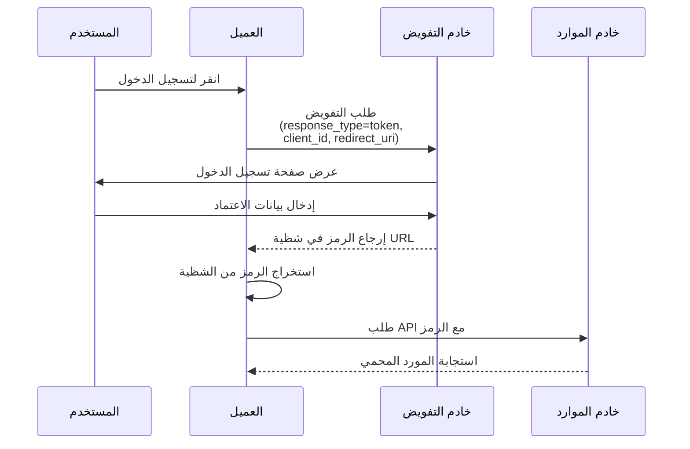

## ما هو التدفق الضمني (implicit flow)؟

التدفق الضمني (Implicit flow) في OAuth 2.0 هو طريقة مصادقة تسمح لتطبيقات العميل فقط (مثل SPAs والتطبيقات الأصلية) باستلام الرموز مباشرة من خلال شظايا URL من خادم التفويض دون تقديم سر العميل.

تم تصميم التدفق الضمني (Implicit flow) لتطبيقات العميل فقط، لأنها تعمل بالكامل في المتصفح أو على جهاز المستخدم ولا يمكنها تخزين أسرار العميل بأمان.

تم إلغاء التدفق الضمني (Implicit flow) رسميًا في <Ref slug="oauth-2.1" /> لأسباب أمنية (سيتم ذكرها أدناه). يجب على تطبيقات العميل فقط الآن استخدام <Ref slug="authorization-code-flow" /> مع امتداد <Ref slug="pkce" /> بدلاً من ذلك.

## كيف يعمل التدفق الضمني (implicit flow)؟

الخطوات الرئيسية للتدفق الضمني (Implicit flow) هي كما يلي:

ملاحظة:

- يحتاج العميل فقط إلى تقديم `client_id` في طلب التفويض، دون الحاجة إلى `client_secret`.  
  هذا لأن هذه العملاء لا يمكنها تخزين الأسرار بأمان، لذا لا يتطلب هذا التدفق سر العميل.

- يتم تعيين معامل `response_type` إلى `token`، مما يوجه خادم التفويض لإرجاع رمز الوصول مباشرة بدلاً من رمز التفويض.  
  في OIDC (<Ref slug="openid-connect" />)، يكون `response_type` إما `id_token` أو `id_token token`، وستقوم خدمة المصادقة بإرجاع الرموز المقابلة بناءً على أنواع الاستجابة المختلفة.

- يتم إرجاع الرمز مباشرة في شظية URL. هذا يعني أن الرمز مكشوف في URL ويمكن الوصول إليه بسهولة بواسطة تطبيقات أو نصوص أخرى.

## هل التدفق الضمني (implicit flow) آمن؟

لا، يعتبر التدفق الضمني (Implicit flow) في OAuth 2.0 عمومًا أقل أمانًا من التدفقات الأخرى مثل تدفق رمز التفويض (authorization code flow).

لا يُوصى به لمعظم حالات الاستخدام بسبب العديد من الثغرات الأمنية:

- **تعرض الرمز في URL**
   - تظهر رموز الوصول مباشرة في URL المتصفح (بعد رمز #)
   - يمكن أن تكون هذه الرموز:
     - محفوظة في تاريخ المتصفح
     - مسربة من خلال رؤوس الإحالة
     - ملتقطة بواسطة كود JavaScript ضار على نفس الصفحة

- **عدم وجود مصادقة للعميل**
   - لا يحتاج تطبيق العميل لإثبات هويته
   - هذا يعني أن أي شخص يعرف `client_id` يمكنه التظاهر بأنه عميل شرعي

- **عدم وجود رموز تحديث**
   - لا يدعم هذا التدفق رموز التحديث
   - يجب على المستخدمين تسجيل الدخول مرة أخرى عند انتهاء صلاحية رموز الوصول
   - لتجنب تسجيل الدخول المتكرر، قد يقوم المستخدمون بتخزين الرموز بطرق غير آمنة

- **عرضة لهجمات XSS**
   - تتم معالجة جميع الرموز في المتصفح
   - إذا تعرض الموقع لهجوم XSS (Cross-Site Scripting)
   - يمكن لكود JavaScript الخاص بالمهاجمين سرقة هذه الرموز بسهولة

بسبب هذه المخاوف الأمنية، تم إلغاء التدفق الضمني (Implicit flow) في <Ref slug="oauth-2.1" />. يجب على تطبيقات العميل فقط الآن استخدام <Ref slug="authorization-code-flow" /> مع امتداد <Ref slug="pkce" /> بدلاً من ذلك.

يمكنك الاطلاع على [ما هو PKCE: من المفاهيم الأساسية إلى الفهم العميق](https://blog.logto.io/how-pkce-protects-the-authorization-code-flow-for-native-apps) لتتعلم كيف يحمي PKCE تدفق رمز التفويض لتطبيقات العميل فقط.

<SeeAlso
  slugs={["oauth-2.1", "authorization-code-flow", "pkce", "openid-connect"]}
/>

<Resources
  urls={[
    "https://blog.logto.io/implicit-flow-is-dead",
    {
      url: "https://tools.ietf.org/html/rfc6749#section-4.2",
      result: {
        ogTitle: "The OAuth 2.0 Authorization Framework: Implicit Grant",
        ogDescription:
          "The implicit grant type is used to obtain access tokens (it does not support the issuance of refresh tokens) and is optimized for public clients known to operate a particular redirection URI. These clients are typically implemented in a browser using a scripting language such as JavaScript.",
      },
    },
    "https://openid.net/specs/openid-connect-core-1_0.html",
    "https://blog.logto.io/how-pkce-protects-the-authorization-code-flow-for-native-apps",
  ]}
/>