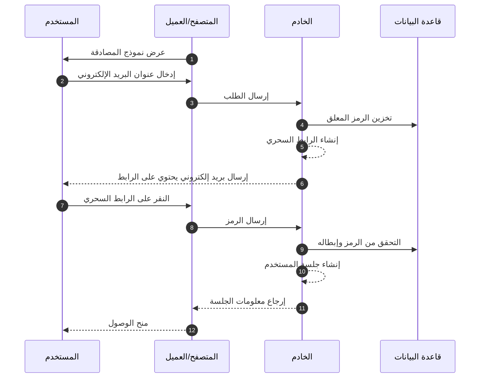
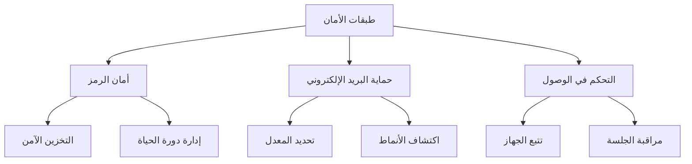

## ما هي الروابط السحرية (Magic links)؟

الرابط السحري هو عنوان URL آمن ومحدود الوقت يتيح المصادقة بدون كلمة مرور لعمليات التسجيل وتسجيل الدخول. بدلاً من إنشاء كلمات مرور وتذكرها، يتلقى المستخدمون رابطًا خاصًا عبر البريد الإلكتروني يمنحهم وصولاً فوريًا. فكر في الأمر كأنه مفتاح رقمي يعمل مرة واحدة فقط - عند النقر عليه، يتم المصادقة، ثم يصبح هذا المفتاح غير صالح.

على سبيل المثال، عند التسجيل في Medium أو محاولة تسجيل الدخول إلى Slack، بدلاً من إعداد أو إدخال كلمة مرور، ترسل لك هذه المنصات بريدًا إلكترونيًا يحتوي على رابط آمن. نقرة واحدة، ويتم المصادقة. لقد اكتسب هذا النهج شعبية كبيرة لأنه يجمع بين الأمان والبساطة.

## كيف تعمل الروابط السحرية (Magic links)؟

العملية بسيطة من منظور المستخدم، ولكنها تتضمن آليات أمان متقدمة خلف الكواليس. إليك ما يحدث خلال تدفق مصادقة الرابط السحري النموذجي:



## ما هي بنية الرابط السحري (Magic link)؟

يتكون الرابط السحري النموذجي من عدة مكونات:

- عنوان URL الأساسي للتطبيق
- نقطة نهاية المصادقة
- معلمة الرمز
- معلمات إضافية (اختياري)

على سبيل المثال:

```
https://app.example.com/verify-auth?token=abc123...&redirect=/dashboard
```

## كيف يتم إنشاء رمز الرابط السحري (Magic link)؟

عندما يطلب المستخدم رابطًا سحريًا (على سبيل المثال، النقر على "تسجيل الدخول بالبريد الإلكتروني")، نحتاج إلى إنشاء رمز آمن وغير متوقع. هذا الرمز مهم لأنه يصبح بمثابة كلمة مرور مؤقتة.

يجب أن يتم إنشاء الرمز باستخدام <Ref slug='csprng' />. يستخدم CSPRNG العشوائية من أجهزة النظام لديك (مثل توقيت لوحة المفاتيح، حركات الماوس، ضوضاء المروحة، إلخ) لتوليد أرقام عشوائية حقيقية لا يمكن التنبؤ بها، حتى إذا كان المهاجم يعرف المخرجات السابقة.

على سبيل المثال، في Node.js:

```javascript
import crypto from "node:crypto";

// توليد رمز عشوائي آمن
const token = crypto.randomBytes(32).toString("base64url");
// النتيجة: شيء مثل 'dBjftJeZ4CVP-mB92K27uhbUJU1p1r_wW1gFWFOEjXk'

// بديل باستخدام Web Crypto API (متاح في Node.js والمتصفحات)
const buffer = crypto.getRandomValues(new Uint8Array(32));
const token2 = Buffer.from(buffer).toString("base64url");
```

متطلبات الرمز الآمن:

- يتم توليده عبر CSPRNG لضمان عدم التنبؤ
- لا يقل عن 32 بايت (256 بت من العشوائية)
- مشفر بشكل آمن لعناوين URL (base64url يلغي الأحرف المشكلة)
- محدود الوقت ويستخدم مرة واحدة لمنع هجمات إعادة التشغيل
- مخزن بشكل آمن مع البيانات الوصفية (الانتهاء، معلومات المستخدم)

## كيفية تأمين مصادقة الرابط السحري (Magic link)

يتطلب أمان الرابط السحري نهجًا شاملاً عبر طبقات متعددة. بينما يعد تسليم البريد الإلكتروني وأنماط الوصول أمرًا حيويًا، يظل التعامل الآمن مع الرموز هو حجر الزاوية في أمان النظام.

### أساسيات أمان الرمز

يعتمد أمان الروابط السحرية بشكل كبير على التنفيذ الصحيح للرمز (انظر المحتوى أعلاه). يجب أن يكون كل رمز آمنًا من الناحية التشفيرية ومدارًا بشكل صحيح طوال دورة حياته. يجب على النظام فرض انتهاء صلاحية صارم للرمز (عادةً 15-30 دقيقة) وإبطاله فورًا بعد الاستخدام.

عند تخزين الرموز، تعامل معها بنفس مستوى الأمان مثل كلمات المرور:

- تجزئة الرموز قبل التخزين لمنع التعرض
- تنفيذ تنظيف تلقائي للرموز منتهية الصلاحية
- الحفاظ على سجل تدقيق لاستخدام الرموز وإبطالها
- تخزين البيانات الوصفية المرتبطة (وقت الإنشاء، المستخدم المقصود، معلومات الجهاز)

### أمان تسليم البريد الإلكتروني

يعمل البريد الإلكتروني كقناة التسليم الرئيسية للروابط السحرية، مما يجعله هدفًا محتملاً للهجمات. يعد تنفيذ تحديد المعدل أمرًا ضروريًا لمنع محاولات القوة الغاشمة وحماية ضد هجمات قصف البريد الإلكتروني. على سبيل المثال، قد تحد من طلبات الروابط السحرية إلى 5 طلبات في الساعة من نفس عنوان IP.

بالإضافة إلى ذلك، يساعد مراقبة أنماط النشاط غير العادية في اكتشاف الانتهاكات الأمنية المحتملة. يشمل ذلك:

- طلبات متعددة من عناوين IP مختلفة لنفس البريد الإلكتروني
- أنماط وصول جغرافية غير عادية
- طلبات سريعة تشير إلى هجمات آلية

### التحكم في الوصول والمراقبة

يضيف بصمة الجهاز طبقة إضافية من الأمان عن طريق تتبع أنماط سلوك المستخدم المتسقة. عندما تأتي محاولة تسجيل الدخول من جهاز أو موقع جديد، يمكنك تنفيذ خطوات تحقق إضافية أو تنبيه المستخدم.

للحصول على أمان محسن في التطبيقات الحساسة:

- دمج الروابط السحرية مع عوامل مصادقة إضافية
- تنفيذ مراقبة الجلسة المستمرة
- تسجيل جميع أحداث المصادقة لسجلات التدقيق
- إضافة تحقق قائم على الجهاز للمواقع الجديدة



## الروابط السحرية مقابل OTP عبر SMS / البريد الإلكتروني

تعتمد كل من الروابط السحرية و OTP عبر SMS / البريد الإلكتروني على قنوات خارجية للتحقق.

ترسل الروابط السحرية عنوان URL يستخدم مرة واحدة إلى بريد المستخدم الإلكتروني، بينما يرسل OTP رمز تحقق إلى هاتفهم أو بريدهم الإلكتروني.

توفر الروابط السحرية تجربة سطح مكتب متفوقة حيث ينقر المستخدمون ببساطة على الرابط لإكمال التحقق، مما يلغي الحاجة إلى إدخال الرموز يدويًا. يمكنها أيضًا حمل معلومات سياقية إضافية، مما يتيح تدفقات مصادقة أكثر تعقيدًا.

ومع ذلك، في السيناريوهات المحمولة، قد يوفر OTP عبر SMS قابلية استخدام أفضل حيث يمكن للمستخدمين عرض وإدخال رموز التحقق بسرعة.

## الروابط السحرية مقابل تطبيقات المصادقة

مقارنةً برموز OTP التي تولدها تطبيقات المصادقة، لا تتطلب الروابط السحرية من المستخدمين تثبيت تطبيقات إضافية وتعمل بسلاسة عبر جميع الأجهزة. هذا يقلل من الاحتكاك، خاصة للمستخدمين غير التقنيين. ومع ذلك، تولد تطبيقات المصادقة رموز OTP بموثوقية أفضل في الوقت الفعلي، بغض النظر عن سرعات تسليم خادم البريد الإلكتروني وتوافره.

بالنسبة للسيناريوهات التي تتطلب مصادقة متكررة مع متطلبات أمان عالية، قد تكون تطبيقات المصادقة الخيار المفضل.

## متى تستخدم الروابط السحرية

تكون الروابط السحرية فعالة بشكل خاص للتطبيقات التجارية والمؤسسات حيث يقوم المستخدمون عادةً بتسجيل الدخول بشكل أقل تكرارًا، مثل أدوات إدارة المشاريع أو لوحات التقارير. في هذه السيناريوهات، يكون التأخير الطفيف في تسليم البريد الإلكتروني ضئيلاً مقارنةً بالراحة في عدم إدارة كلمات المرور.

### السيناريوهات المثالية

تتألق هذه الأساليب في سياقات الأعمال حيث يكون البريد الإلكتروني بالفعل قناة الاتصال الرئيسية. على سبيل المثال، تستفيد منصات التعاون مثل Slack أو Notion من الروابط السحرية بشكل فعال لأن:

- المستخدمون يراقبون بريدهم الإلكتروني بنشاط
- تميل جلسات تسجيل الدخول إلى أن تكون طويلة الأمد
- التركيز على تقليل الاحتكاك في عملية المصادقة

تعتبر الروابط السحرية أيضًا ممتازة لتدفقات تسجيل المستخدم في منتجات SaaS حيث يكون تحسين التحويل أمرًا حاسمًا. عندما يمكن للمستخدمين بدء استخدام خدمتك باستخدام عنوان بريد إلكتروني فقط، فإنه يقلل بشكل كبير من معدلات الانسحاب أثناء عملية الإعداد.

### متى يجب النظر في البدائل

ومع ذلك، قد لا تكون الروابط السحرية الخيار الأفضل للتطبيقات التي تتطلب مصادقة متكررة. تحتاج تطبيقات البنوك المحمولة، على سبيل المثال، إلى طرق مصادقة سريعة وموثوقة حيث قد يتحقق المستخدمون من رصيدهم عدة مرات في اليوم. في مثل هذه الحالات، غالبًا ما توفر المصادقة البيومترية أو رموز PIN تجربة مستخدم أفضل.

فكر في طرق المصادقة البديلة عندما:

- يكون تطبيقك قائمًا بشكل أساسي على الأجهزة المحمولة
- يحتاج المستخدمون إلى وصول فوري بدون الاعتماد على البريد الإلكتروني
- يتطلب البيئة مصادقة متعددة العوامل
- يمكن أن تؤثر تأخيرات تسليم البريد الإلكتروني بشكل كبير على تجربة المستخدم

المفتاح هو مواءمة طريقة المصادقة الخاصة بك مع أنماط سلوك المستخدمين ومتطلبات الأمان. بينما توفر الروابط السحرية أمانًا ممتازًا مع احتكاك ضئيل، يجب أن تكون جزءًا من استراتيجية مصادقة أوسع بدلاً من الحل الوحيد.

<SeeAlso slugs={["csprng", "passwordless", "otp", "totp"]} />