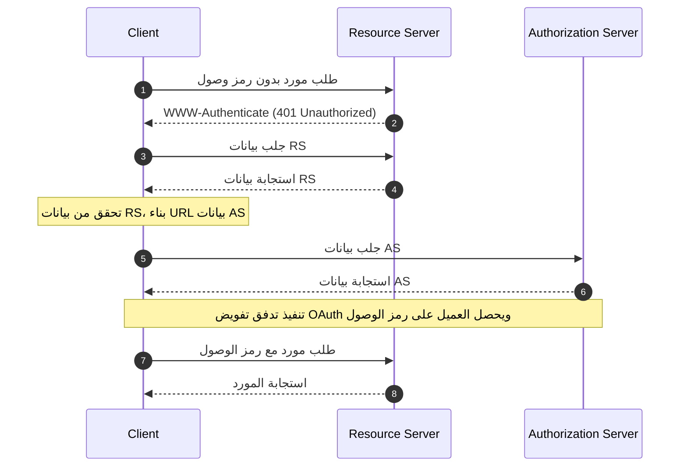

## ما هي بيانات الموارد المحمية في OAuth 2.0؟

بيانات الموارد المحمية في OAuth 2.0 هي تنسيق موحد تم تعريفه في [RFC 9728](https://datatracker.ietf.org/doc/html/rfc9728). يساعد العملاء وخوادم التفويض على فهم كيفية التفاعل مع الموارد المحمية.

يوفر هذا التنسيق للبيانات معلومات أساسية حول:
- قدرات خادم الموارد
- تنسيقات الرموز المدعومة
- الآليات الأمنية المطلوبة
- علاقات خادم التفويض
- النطاقات والأذونات المتاحة

## ما هي فوائد بيانات الموارد المحمية؟

في نظام OAuth 2.0، هناك أربعة أدوار أساسية:
- <Ref slug="authorization-server"/>: يصدر رموز الوصول للعملاء بعد التحقق بنجاح من مالك المورد
- <Ref slug="client"/>: تطبيق يطلب الوصول إلى الموارد المحمية
- <Ref slug="resource-owner"/>: كيان قادر على منح الوصول إلى الموارد المحمية
- <Ref slug="resource-server"/>: خادم يستضيف الموارد المحمية

تقليديًا، عندما يحتاج العميل إلى الوصول إلى الموارد المحمية، يجب عليه أولاً اكتشاف والتفاعل مع خادم التفويض للحصول على الرموز اللازمة. كان دور خادم الموارد يقتصر بشكل أساسي على التحقق من الرموز وتقديم الموارد، مع تنسيق جميع تفاصيل التحقق والتفويض من خلال خادم التفويض وتطبيق العميل.

هذا يعني أن العملاء لم يكن لديهم طريقة موحدة لاكتشاف متطلبات أو قدرات خادم الموارد مباشرة.

تحول بيانات الموارد المحمية هذه الديناميكية من خلال تمكين خوادم الموارد من نشر متطلباتها وقدراتها بنشاط، وتقدم عدة فوائد رئيسية:
- الاكتشاف المباشر: يمكن للعملاء الآن معرفة متطلبات خادم الموارد مباشرة من المصدر
- تعزيز الاستقلالية: يمكن لخوادم الموارد تحديد تنسيقات الرموز المدعومة، والآليات الأمنية، وخوادم التفويض الموثوقة بشكل صريح
- تحسين التوافق: يضمن التنسيق الموحد التواصل المتسق لمتطلبات الوصول عبر تطبيقات مختلفة
- التكوين الديناميكي: يمكن لخوادم الموارد تحديث متطلباتها دون الاعتماد على تغييرات خادم التفويض

## كيف تعمل بيانات الموارد المحمية في OAuth 2.0؟

تعمل بيانات الموارد المحمية ضمن نظام OAuth 2.0 من خلال عملية اكتشاف وتفاعل موحدة:



وثيقة بيانات خادم الموارد هي كائن JSON يحتوي على الحقول التالية:

```json
   {
     "resource": "https://api.example.com",
     "authorization_servers": [
       "https://auth.example.com"
     ],
     "scopes_supported": ["read", "write"],
     "token_formats_supported": ["jwt"],
     "token_introspection_endpoint": "https://api.example.com/introspect",
     "dpop_signing_alg_values_supported": ["ES256", "PS256"]
   }
   ```

وبمجرد أن يتلقى العميل وثيقة البيانات، يمكنه استخدامها لتكوين نفسه والتفاعل مع خادم الموارد بشكل رئيسي وفقًا للحقول التالية:

- `resource`: معرف المورد المحمي
- `authorization_servers`: قائمة بخوادم التفويض المصرح بها
- `scopes_supported`: النطاقات المتاحة لهذا المورد
- `token_formats_supported`: تنسيقات الرموز المدعومة
- `token_introspection_endpoint`: نقطة النهاية للتحقق من صحة الرموز
- `dpop_signing_alg_values_supported`: خوارزميات DPoP المدعومة

## كيف تكتشف نقاط نهاية بيانات الموارد المحمية في OAuth 2.0؟

هناك آليتان رئيسيتان لاكتشاف بيانات الموارد المحمية:

1. **اكتشاف رأس WWW-Authenticate (المستند إلى التدفق)**:

عندما يقوم العميل بإجراء طلب غير مصرح به لمورد محمي، يستجيب الخادم برمز حالة 401 ويتضمن URL البيانات في رأس WWW-Authenticate:

```bash
# 1. يقوم العميل بإجراء طلب بدون رمز
GET /api/resource HTTP/1.1
Host: api.example.com

# 2. يستجيب الخادم بـ 401 و URL البيانات
HTTP/1.1 401 Unauthorized
WWW-Authenticate: Bearer realm="example",
  scope="read write",
  resource_metadata_url="https://api.example.com/.well-known/oauth-resource-server"
```

يوفر الرأس:
- تعريف نطاق المورد
- النطاقات المطلوبة
- موقع URL البيانات

2. **اكتشاف URI المباشر المعروف جيدًا**:

يمكنك الوصول مباشرة إلى البيانات عن طريق إجراء طلب GET إلى نقطة النهاية المعروفة جيدًا:

```bash
GET /.well-known/oauth-resource-server HTTP/1.1
Host: api.example.com
```

تتبع نقطة النهاية تنسيقًا موحدًا:
- URI الأساسي: `https://api.example.com`
- المسار المعروف جيدًا: `/.well-known/oauth-resource-server`
- URL الكامل: `https://api.example.com/.well-known/oauth-resource-server`

## كيف يعمل رأس WWW-Authenticate في بيانات الموارد المحمية؟

يعد رأس WWW-Authenticate مكونًا رئيسيًا في بيانات الموارد المحمية لتنفيذ آلية الاكتشاف التلقائي. يستفيد من رأس HTTP القياسي `WWW-Authenticate` لنقل معلومات البيانات، مما يمكّن العملاء من اكتشاف وتكوين متطلبات الوصول تلقائيًا لخوادم الموارد.

عندما يحاول العميل لأول مرة الوصول إلى مورد محمي دون تقديم رمز وصول، يستجيب خادم الموارد برمز حالة 401 Unauthorized ويتضمن رأس WWW-Authenticate:

```
WWW-Authenticate: Bearer realm="example",
  scope="read write",
  resource_metadata_url="https://api.example.com/.well-known/oauth-resource-server"
```

قد يحتوي هذا الرأس على عدة قطع رئيسية من المعلومات:
- `Bearer`: يشير إلى أن هذا هو نظام مصادقة رمز OAuth 2.0 Bearer
- `realm`: يحدد مساحة الحماية للمورد
- `scope`: يحدد الأذونات المطلوبة للوصول
- `resource_metadata_url`: يشير إلى موقع وثيقة البيانات التي تحتوي على تكوين خادم الموارد الكامل

عند تلقي هذا الرأس، يستخرج العميل `resource_metadata_url` ويسترجع وثيقة البيانات الكاملة من ذلك URL.

بناءً على معلومات البيانات التي تم الحصول عليها، يمكن للعميل تحديد خوادم التفويض المناسبة، تنسيقات الرموز المدعومة، النطاقات المتاحة، وتفاصيل التكوين الأخرى لتكوين طلبات التحقق بشكل صحيح.

## كيف تؤمن بيانات الموارد المحمية في OAuth 2.0؟

تشمل الاعتبارات الأمنية الأساسية:

1. **أمان النقل**:
   - استخدام TLS إلزامي
   - التحقق من الشهادات
   - معالجة الاتصال الآمن

2. **سلامة البيانات**:
   - التحقق من المصدر
   - التحقق من التوقيع
   - استراتيجيات التخزين المؤقت الآمنة

3. **التحكم في الوصول**:
   - تحديد معدل الوصول
   - التحقق من الطلبات
   - مراقبة الإساءة

## كيف تنفذ بيانات الموارد المحمية في OAuth 2.0؟

إليك كيفية تنفيذ بيانات الموارد المحمية في OAuth 2.0 عبر المكونات المختلفة:

1. **تنفيذ خادم الموارد**

يستجيب خادم الموارد بحالة 401 Unauthorized ويتضمن URL البيانات في رأس WWW-Authenticate عند تلقي محاولة وصول غير مصرح بها:

```
HTTP/1.1 401 Unauthorized
WWW-Authenticate: Bearer realm="example",
  resource_metadata_url="https://api.example.com/.well-known/oauth-resource-server"
```

2. **تنفيذ العميل**

ينفذ العميل وظيفة غير متزامنة للتعامل مع الوصول إلى الموارد. عند تلقي استجابة 401، تستخرج هذه الوظيفة URL البيانات من رأس WWW-Authenticate، وتجلب البيانات، وتستخدمها لتكوين العميل:

```javascript
async function handleResourceAccess(response) {
  if (response.status === 401) {
    const wwwAuthenticate = response.headers.get('WWW-Authenticate');
    const metadataUrl = extractMetadataUrl(wwwAuthenticate);
    const metadata = await fetchMetadata(metadataUrl);
    // تكوين العميل بناءً على البيانات
  }
}
```

3. **هيكل وثيقة البيانات**

يوفر خادم الموارد وثيقة بيانات ككائن JSON يحتوي على:
- معرف المورد
- قائمة بخوادم التفويض المصرح بها
- النطاقات المدعومة
- تنسيقات الرموز المدعومة
- خوارزميات توقيع DPoP المدعومة

إليك مثال على وثيقة البيانات:

```json
{
  "resource": "https://api.example.com",
  "authorization_servers": ["https://auth.example.com"],
  "scopes_supported": ["read", "write"],
  "token_formats_supported": ["jwt"],
  "dpop_signing_alg_values_supported": ["ES256"]
}
```

تعمل هذه المكونات معًا لتشكيل تنفيذ كامل لبيانات الموارد المحمية في OAuth 2.0. من خلال هذا التنفيذ، يمكن للعملاء اكتشاف وتكوين المعلمات اللازمة للوصول إلى الموارد المحمية تلقائيًا.

<SeeAlso slugs={["resource-server", "authorization-server"]} />

<Resources urls={[
  "https://datatracker.ietf.org/doc/html/rfc9728",
]} />