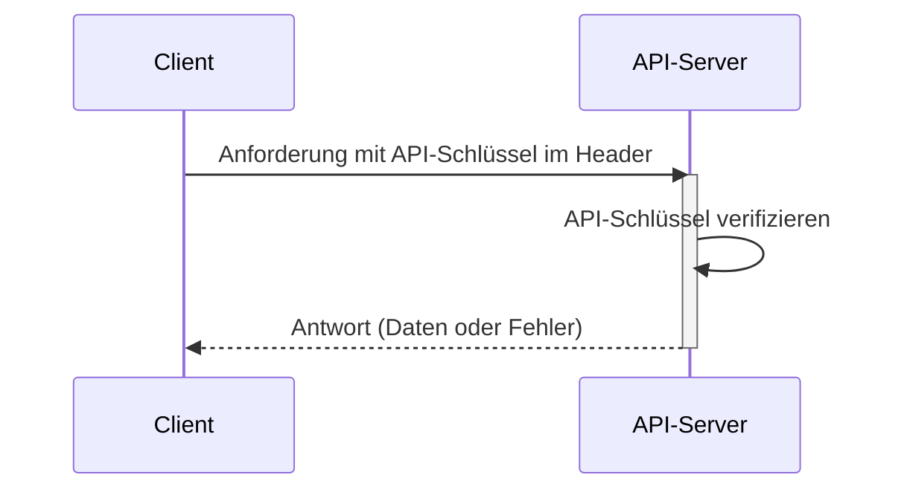

## Was ist ein API-Schlüssel?

Ein API-Schlüssel ist ein geheimer Token, der zur Authentifizierung von Clients verwendet wird, die auf eine API zugreifen. Er ist wie ein Passwort für deine Anwendung und ermöglicht den Zugriff auf eine bestimmte API. Stell dir vor, es ist wie eine Schlüsselkarte, um Zugang zu einem Gebäude zu erhalten. Die Schlüsselkarte gewährt Zugang, identifiziert aber nicht unbedingt, wer du bist.

## Wie funktionieren API-Schlüssel?

API-Schlüssel funktionieren durch einen einfachen Anforderungs- und Antwortprozess.

1. **Anforderung:** Deine Anwendung sendet eine Anforderung an die API, einschließlich des API-Schlüssels. Der Schlüssel wird oft im Header der Anforderung gesendet. Zum Beispiel könnte der Header so aussehen: `x-api-key: your_actual_api_key`. Es gibt keinen einheitlichen Standard für Header-Namen oder Wertformate.

2. **Verifizierung:** Der API-Server überprüft den bereitgestellten Schlüssel mit seiner Datenbank.

3. **Antwort:** Wenn der Schlüssel gültig ist, gewährt der Server Zugriff und sendet die angeforderten Daten zurück. Wenn nicht, wird der Zugriff verweigert.

Hier ist ein Sequenzdiagramm, das den Prozess veranschaulicht:

## Was sind die Vor- und Nachteile von API-Schlüsseln?

Schauen wir uns an, was API-Schlüssel nützlich macht und wo sie Schwächen haben:

### Vorteile

- **Super einfach zu verwenden**: Füge einfach einen Schlüssel zu deiner Anforderung hinzu und los geht's! Es ist wie die Verwendung eines Hausschlüssels - keine komplizierten Schritte erforderlich.

- **Einfach zu verfolgen**: Möchtest du wissen, wer deine API verwendet? API-Schlüssel machen es einfach. Du kannst sehen, welche Apps Anfragen stellen und wie oft sie das tun.

- **Schnelle Ratenbegrenzung**: Verhindere, dass Leute deine API übermäßig nutzen, indem du Limits pro Schlüssel setzt. Es ist wie ein Türsteher in einem Club, der zählt, wie oft jemand rein und raus geht.

- **Perfekt für öffentliche Daten**: Wenn du nicht sensible Informationen teilst (wie Wetterdaten oder öffentliche Statistiken), sind API-Schlüssel genau richtig.

### Nachteile

- **Weniger sicher als moderne Alternativen**: API-Schlüssel sind nicht so effektiv wie andere Formen der API-Authentifizierung, wie <Ref slug="oauth-2.0" /> und <Ref slug="jwt" />. Denk an sie als ein einfaches Schloss im Vergleich zu einem modernen Sicherheitssystem. Sie bleiben jedoch beliebt, weil sie der einfachste Weg sind, die API-Nutzung zu verfolgen und mit der API-Sicherheit zu beginnen.

- **Sicherheitsrisiken**: API-Schlüssel sind wie ein Hausschlüssel unter der Fußmatte. Wenn jemand ihn findet, kann er ihn für immer verwenden. Hier ist der Grund:
  - Sie sind oft im Code sichtbar
  - Sie laufen nicht automatisch ab
  - Wenn sie geleakt werden (wie in öffentlichen GitHub-Repos), kann sie jeder verwenden

- **Können Benutzer nicht unterscheiden**: Während einige Unternehmen "API-Schlüssel" verwenden, die Benutzer identifizieren können (wie Stripe), können traditionelle API-Schlüssel nicht sagen, wer wer ist. Sie sagen dir nur, welche Anwendung die Anforderung stellt.

- **Statisch von Natur aus**: Im Gegensatz zu modernen Auth-Tokens, die ablaufen, bleiben API-Schlüssel normalerweise für immer gleich. Das bedeutet:
  - Keine automatischen Sicherheitsaktualisierungen
  - Manuelle Arbeit erforderlich, um Schlüssel zu rotieren
  - Höheres Risiko, wenn Schlüssel offengelegt werden

## Was sind die Anwendungsfälle für API-Schlüssel?

- Service-zu-Service-Kommunikation: API-Schlüssel eignen sich für Szenarien, in denen Anwendungen direkt über CLIs mit APIs kommunizieren müssen. Z.B. Aufrufen von OpenAI-APIs.
- Öffentliche APIs: Beim Bereitstellen von APIs für die Öffentlichkeit bieten API-Schlüssel eine einfache Methode der Zugriffskontrolle.
- Vereinfachte Einrichtung: Für schnelle und einfache Authentifizierungsanforderungen, insbesondere in der Entwicklungsphase. Im Gegensatz zu Machine-to-Machine (M2M) Authentifizierung erfordern API-Schlüssel keine vorherige Client-Registrierung und müssen nicht gegen ein access token ausgetauscht werden. Du übergibst einfach deinen API-Schlüssel als Parameter in deiner Anforderung und es funktioniert einfach.

In realen Szenarien ist der häufigste Zweck beim Erstellen von Produkten die Produktintegration. Hier ist ein typischer Anwendungsfall:

### Beispiel: Integration mit Stripe

Stripe verwendet API-Schlüssel für die sichere Integration mit verschiedenen Plattformen und Anwendungen. Du kannst diese Schlüssel über das Entwickler-Dashboard erstellen, anzeigen, löschen und verwalten. Durch die Verwendung von API-Schlüsseln kannst du Stripes Checkout- und Abrechnungsfunktionen in dein Produkt integrieren.

## Was ist der Unterschied zwischen Personal Access Tokens (PAT) und Machine-to-Machine (M2M)?

Wenn man über API-Schlüssel spricht, können auch Personal Access Tokens und <Ref slug="machine-to-machine" /> erwähnt werden, da sie alle programmatisch auf API-Ressourcen über CLI-Befehle zugreifen oder die Kommunikation zwischen Backend-Diensten herstellen können.

### Personal Access Tokens (PATs)

Ein Personal Access Token ist ebenfalls eine Zeichenfolge, repräsentiert jedoch ***die Identität und Berechtigungen eines bestimmten Benutzers***, wird dynamisch bei erfolgreicher Authentifizierung oder Anmeldung generiert und hat typischerweise eine begrenzte Lebensdauer, kann jedoch erneuert werden. Es bietet fein abgestimmte Zugriffskontrolle auf benutzerspezifische Daten und Fähigkeiten und wird häufig für CLI-Tools, Skripte oder persönlichen API-Zugriff verwendet. Der Hauptunterschied besteht darin, dass es spezifischer ist und für benutzerspezifische Aktionen verwendet wird.

### Machine-to-Machine (M2M)

M2M-Kommunikation ist, wenn Geräte automatisch Daten austauschen, ohne dass menschliches Eingreifen erforderlich ist.

Im Kontext von <Ref slug="openid-connect" /> (oder <Ref slug="oauth-2.0" />) verwenden M2M-Anwendungen den <Ref slug="client-credentials-flow" />, wie im [OAuth 2.0 RFC 6749-Protokoll](https://datatracker.ietf.org/doc/html/rfc6749) definiert, das ähnliche Standardprotokolle unterstützt. Es beinhaltet normalerweise eine Client-Anwendung (eine Maschine oder ein Dienst), die entweder im eigenen Namen oder im Namen eines Benutzers auf Ressourcen zugreift. Es ist ideal für Situationen, in denen nur vertrauenswürdige Clients auf Backend-Dienste zugreifen können.

<SeeAlso slugs={["machine-to-machine"]} />