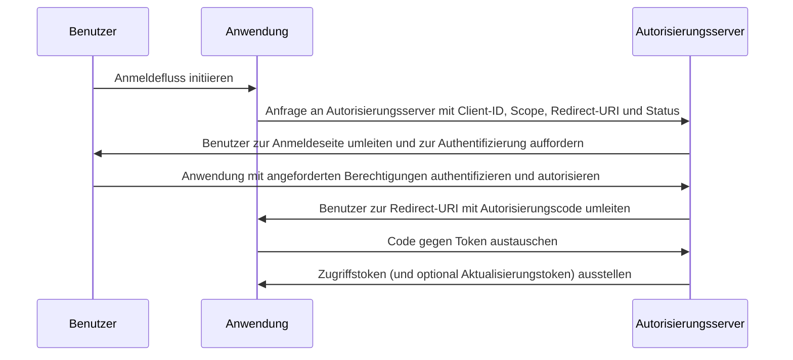

## Was ist der Autorisierungscodefluss (Authorization Code Flow)?

Der Autorisierungscodefluss (Authorization Code Flow) (auch bekannt als Autorisierungscodegewährung), definiert in [OAuth 2.0 RFC 6749, Abschnitt 4.1](https://datatracker.ietf.org/doc/html/rfc6749#section-4.1), ist ein weit verbreiteter OAuth 2.0-Autorisierungsmechanismus, der es Anwendungen ermöglicht, ein Zugriffstoken im Namen eines Benutzers zu erhalten.

Dieser Fluss ist ideal für vertrauliche Anwendungen wie traditionelle serverseitige Webanwendungen, die Client-Geheimnisse sicher speichern können.

Er kann auch sicher für native Apps und Single Page Applications (SPAs) verwendet werden, die Client-Geheimnisse nicht sicher speichern können, wenn sie mit der PKCE (<Ref slug="pkce" />) Erweiterung kombiniert werden.

## Wie funktioniert der Autorisierungscodefluss (Authorization Code Flow)?

Der Autorisierungscodefluss umfasst die folgenden Schritte:

1. **Flussinitiierung**: Der Benutzer initiiert den Fluss, indem er typischerweise auf einen Link oder Button in der Anwendung klickt, um sich anzumelden. Die Anwendung leitet den Benutzer zum Autorisierungsendpunkt des Autorisierungsservers weiter und übergibt die Client-ID, den angeforderten Scope, eine Redirect-URI und einen Statusparameter. Der Autorisierungsserver validiert die Parameter und fordert den Benutzer auf, sich auf der Anmeldeseite des Autorisierungsservers zu authentifizieren.
2. **Benutzerauthentifizierung und -autorisierung**: Der Benutzer authentifiziert sich beim Autorisierungsserver und erteilt der Anwendung die Erlaubnis, auf die angeforderten Ressourcen zuzugreifen.
3. **Codegenerierung und Umleitung**: Der Autorisierungsserver generiert einen Autorisierungscode und leitet den Benutzer mit der zuvor bereitgestellten Redirect-URI zurück zur Anwendung. Der Autorisierungscode ist in der Abfragezeichenfolge der Redirect-URI enthalten.
4. **Codeaustausch**: Die Anwendung extrahiert den Autorisierungscode aus der Abfragezeichenfolge und sendet eine POST-Anfrage an den Token-Endpunkt des Autorisierungsservers, um den Autorisierungscode gegen ein Zugriffstoken auszutauschen. Die Anwendung muss auch die Client-ID, das Client-Geheimnis, die Redirect-URI und den Autorisierungscode in der Anfrage enthalten.
5. **Abruf des Zugriffstokens**: Der Autorisierungsserver validiert den Autorisierungscode und stellt der Anwendung bei erfolgreicher Validierung ein Zugriffstoken (und optional ein Aktualisierungstoken) aus. Die Anwendung kann dann das Zugriffstoken verwenden, um autorisierte API-Anfragen im Namen des Benutzers zu stellen.

Die Schritte können durch das folgende Sequenzdiagramm veranschaulicht werden:



## Wie implementiert man den Autorisierungscodefluss (Authorization Code Flow)?

Hier ist ein einfaches Beispiel zur Implementierung des Autorisierungscodeflusses, gemäß den Richtlinien in [OAuth 2.0 RFC 6749, Abschnitt 4.1](https://datatracker.ietf.org/doc/html/rfc6749#section-4.1):

### 1. Erste Einrichtung

Stelle sicher, dass du die folgenden Informationen von deinem Auth-Dienst hast, bevor du beginnst:

```javascript
const config = {
  clientId: "YOUR_CLIENT_ID",
  clientSecret: "YOUR_CLIENT_SECRET",
  authorizationEndpoint: "https://authorization-server.com/auth",
  tokenEndpoint: "https://authorization-server.com/token",
  redirectUri: "http://localhost:3000/callback",
};
```

Client-ID, Client-Geheimnis und Redirect-URI sind die Konfiguration deiner Anwendung im Auth-Dienst.

Der `authorizationEndpoint` und `tokenEndpoint` werden von deinem Auth-Dienst bereitgestellt.

Wenn dein Auth-Server OIDC (<Ref slug="openid-connect" />) implementiert, kannst du diese Informationen über <Ref slug="openid-connect-discovery" /> erhalten.

### 2. Autorisierungsanfrage initiieren

Der Fluss beginnt, wenn ein Benutzer sich anmelden möchte (zum Beispiel durch Klicken auf einen Anmeldebutton). Die Anwendung wird eine Anmeldeanfrage stellen.

Diese Anfrage enthält Parameter wie `client ID`, `redirect URI` und `scope`. Dann leitet sie den Benutzer zum Autorisierungsendpunkt des Auth-Dienstes (die Anmeldeseite des Auth-Dienstes) weiter.

Der Benutzer wird sich auf dieser Anmeldeseite authentifizieren und autorisieren.

```javascript
app.get("/login", (req, res) => {
  const authUrl = new URL(config.authorizationEndpoint);
  authUrl.searchParams.append("response_type", "code");
  authUrl.searchParams.append("client_id", config.clientId);
  authUrl.searchParams.append("redirect_uri", config.redirectUri);
  authUrl.searchParams.append("scope", "openid profile email");
  authUrl.searchParams.append("state", "random_state_string");

  res.redirect(authUrl.toString());
});
```

Hinweis: Du kannst weitere Parameter hinzufügen, die über die im Beispielcode gezeigten hinausgehen. Siehe [Vollständige Definition der Authentifizierungsanfrageparameter](https://openid.net/specs/openid-connect-core-1_0.html#AuthRequest).

### 3. Redirect-URI-Callback und Token-Austausch behandeln

Nachdem der Benutzer die Authentifizierung und Autorisierung auf der Anmeldeseite des Auth-Dienstes abgeschlossen hat, leitet der Auth-Dienst den Benutzer zurück zur Redirect-URI der Anwendung. Diese Redirect-URI enthält die Autorisierungscode- und Statusparameter.

Die Anwendung extrahiert die Autorisierungscode- und Statusparameter aus der Redirect-URI und tauscht sie am Token-Endpunkt des Auth-Dienstes gegen Zugriffs- und Aktualisierungstoken (falls vorhanden) aus.

```javascript
app.get("/callback", async (req, res) => {
  const { code, state } = req.query;

  try {
    // Den Autorisierungscode gegen ein Zugriffstoken und Aktualisierungstoken austauschen
    const tokenResponse = await axios.post(config.tokenEndpoint, {
      grant_type: "authorization_code",
      code,
      redirect_uri: config.redirectUri,
      client_id: config.clientId,
      client_secret: config.clientSecret,
    });

    const { access_token, refresh_token } = tokenResponse.data;
    // Tokens für nachfolgende Anfragen speichern
    req.session.accessToken = access_token;

    res.send("Authentifizierung erfolgreich!");
  } catch (error) {
    res.status(500).send("Token-Austausch fehlgeschlagen");
  }
});
```

### 4. Zugriffstoken verwenden

Sobald du das Token hast, verwende es, um auf geschützte Ressourcen zuzugreifen:

```javascript
async function fetchUserProfile(accessToken) {
  const response = await axios.get("https://api.example.com/userinfo", {
    headers: {
      Authorization: `Bearer ${accessToken}`,
    },
  });
  return response.data;
}
```

## Wie verwendet man den Autorisierungscodefluss (Authorization Code Flow) für öffentliche Clients (native Apps und SPAs)?

Öffentliche Clients (wie native Apps und SPAs) stehen vor einzigartigen Sicherheitsherausforderungen bei der Verwendung des Autorisierungscodeflusses. Diese Anwendungen können Client-Geheimnisse nicht sicher speichern. Das Client-Geheimnis würde im JavaScript-Code oder im Speicher des Geräts offengelegt. Dies macht es Angreifern leicht, das Geheimnis zu extrahieren und zu missbrauchen.

Daher besteht die Hauptaufgabe darin, den Autorisierungscodefluss sicher ohne ein Client-Geheimnis zu verwenden. Die OAuth 2.0-Spezifikation führte die PKCE (<Ref slug="pkce" />) Erweiterung ein, um dieses Problem zu lösen.

PKCE fügt zusätzliche Sicherheitsmaßnahmen hinzu, um den Autorisierungscodefluss für öffentliche Clients zu schützen. Es verhindert Autorisierungscode-Abfangangriffe, selbst ohne Verwendung eines Client-Geheimnisses. Schau dir diesen Blog an, um mehr darüber zu erfahren, [wie PKCE den OAuth 2.0-Autorisierungscodefluss schützt](https://blog.logto.io/how-pkce-protects-the-authorization-code-flow-for-native-apps).

## Wie verwendet man den Autorisierungscodefluss (Authorization Code Flow) sicher?

### **Verwendung von "state", um CSRF-Angriffe zu verhindern**

CSRF (<Ref slug="csrf" />) Angriffe verleiten Benutzer dazu, unerwünschte Aktionen in einer authentifizierten Webanwendung auszuführen. Der Statusparameter hilft, dies zu verhindern.

- Generiere einen eindeutigen, zufälligen Wert. Speichere diesen Wert serverseitig.
- Füge den Statusparameter hinzu. Hänge ihn an die URL der Autorisierungsanfrage an.
- Überprüfe den Status bei der Rückkehr. Wenn der Autorisierungsserver zu deiner App zurückleitet, vergleiche den zurückgegebenen Status mit dem gespeicherten Wert. Wenn sie nicht übereinstimmen, lehne die Anfrage ab. Dies bestätigt, dass die Anfrage von deiner Anwendung stammt.

### **Sichere Redirect-URIs konfigurieren**

Die Redirect-URI ist der Ort, an den der Autorisierungsserver den Autorisierungscode nach der Benutzerauthentifizierung sendet. Eine sichere Konfiguration ist entscheidend.

- Registriere gültige Redirect-URIs. Gib während der App-Registrierung beim Autorisierungsserver die erlaubten Redirect-URIs an.
- Exakte Übereinstimmung. Die Redirect-URI in der Autorisierungsanfrage muss genau mit einer registrierten URI übereinstimmen. Selbst ein kleiner Unterschied kann eine Schwachstelle schaffen.
- Vermeide Wildcard-URIs. Wenn möglich, vermeide die Verwendung von Wildcard-URIs in der Produktion. Sie erweitern die Angriffsfläche.
- HTTPS für die Produktion. Verwende immer HTTPS für Redirect-URIs in Produktionsumgebungen.

### **Verwendung von PKCE für alle Clients**

Während PKCE ursprünglich für öffentliche Clients entwickelt wurde, verlangt die <Ref slug="oauth-2.1" />-Spezifikation, dass PKCE für alle Clients, einschließlich vertraulicher Clients, durchgesetzt wird, um die allgemeine Sicherheit des Autorisierungscodeflusses zu verbessern. (Siehe [PKCE für alle Clients durchsetzen](https://auth.wiki/oauth-2.1#enforcing-pkce-for-all-clients))

## Was ist der Unterschied zwischen Autorisierungscodefluss (Authorization Code Flow) und implizitem Fluss (Implicit Flow)?

Der Hauptunterschied zwischen dem Autorisierungscodefluss (Authorization Code Flow) und dem impliziten Fluss (Implicit Flow) besteht darin, wie das Zugriffstoken erhalten wird:

- **Autorisierungscodefluss (Authorization Code Flow)**: Die Client-Anwendung erhält zuerst einen Autorisierungscode vom Autorisierungsendpunkt und tauscht diesen dann in einer nachfolgenden POST-Anfrage an den Token-Endpunkt gegen ein Zugriffstoken aus.
- **Impliziter Fluss (Implicit Flow)**: Die Client-Anwendung erhält das Zugriffstoken direkt im URL-Fragment der Redirect-URI nach der Benutzerauthorisierung.

Erfahre mehr über <Ref slug="implicit-flow" />.

## Was ist der Unterschied zwischen Autorisierungscodefluss (Authorization Code Flow) und Client-Anmeldefluss (Client Credentials Flow)?

Der Hauptunterschied zwischen dem Autorisierungscodefluss (Authorization Code Flow) und dem Client-Anmeldefluss (Client Credentials Flow) besteht im Kontext, in dem der Fluss verwendet wird:

- **Autorisierungscodefluss (Authorization Code Flow)**: Wird verwendet, wenn die Client-Anwendung Ressourcen im Namen eines Benutzers zugreifen muss. Der Fluss umfasst Benutzerauthentifizierung und -autorisierung.
- **Client-Anmeldefluss (Client Credentials Flow)**: Wird verwendet, wenn die Client-Anwendung Ressourcen in ihrem eigenen Namen zugreifen muss. Der Fluss umfasst die Client-Authentifizierung, jedoch nicht die Benutzerauthentifizierung, und ist am besten für die Kommunikation von Maschine zu Maschine geeignet.

Erfahre mehr über <Ref slug="client-credentials-flow" />.

<SeeAlso
  slugs={[
    "device-flow",
    "implicit-flow",
    "client-credentials-flow",
    "pkce",
    "openid-connect",
    "openid-connect-discovery",
    "csrf",
    "oauth-2.1",
  ]}
/>

<Resources urls={[
  "https://datatracker.ietf.org/doc/html/rfc6749",
  "https://openid.net/specs/openid-connect-core-1_0.html#AuthRequest",
  "https://blog.logto.io/how-pkce-protects-the-authorization-code-flow-for-native-apps"
]} />