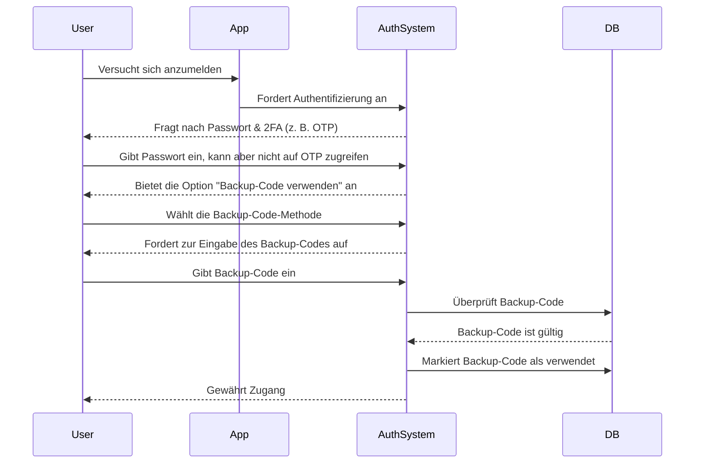

## Was ist ein Backup-Code?

Ein Backup-Code (auch Wiederherstellungscode genannt) ist eine Reihe von zufällig generierten, einmal verwendbaren Codes, die als alternative Authentifizierungsmethode dienen, wenn deine primären MFA-Optionen – wie SMS, Authentifizierungs-Apps oder Passkeys – nicht verfügbar sind. Betrachte sie als Notfallschlüssel, die sicherstellen, dass du immer auf dein Konto zugreifen kannst, selbst wenn du dein Telefon verlierst, Netzwerkprobleme hast oder technische Ausfälle erlebst.

## Wie funktioniert ein Backup-Code?

Backup-Codes bieten eine einfache, aber sichere Möglichkeit, den Zugang zu deinem Konto wiederzuerlangen, wenn Standard-MFA-Methoden fehlschlagen. So funktionieren sie:

1. **Erstellung**: Das System erstellt während der MFA-Einrichtung eine einzigartige Reihe von Codes (typischerweise 8–12 Zeichen pro Code).
2. **Speicherung**: Du wirst aufgefordert, diese Codes sicher zu speichern – entweder offline (z. B. auf Papier gedruckt) oder in einem verschlüsselten Passwort-Manager.
3. **Verwendung**: Wenn du deine primäre MFA-Methode nicht verwenden kannst, gibst du einen deiner Backup-Codes ein, um dich zu authentifizieren.
4. **Ungültigmachung**: Jeder Code wird nach der Verwendung automatisch deaktiviert, um eine Wiederverwendung zu verhindern.

## Wann sollte man einen Backup-Code verwenden?

Werden Backup-Codes obsolet? Sollte MFA sie weiterhin unterstützen?

Absolut. Backup-Codes bleiben ein kritisches Sicherheitsnetz für MFA. Während neuere Methoden wie Passkeys und FIDO2 an Bedeutung gewinnen, bieten Backup-Codes eine universell zugängliche, geräteunabhängige Wiederherstellungsoption. Sie sind eine kostengünstige, wertvolle Absicherung und sollten immer neben modernen MFA-Methoden unterstützt werden.

Verwende einen Backup-Code, wenn:

- Dein primäres MFA-Gerät nicht verfügbar ist (z. B. verlorenes Telefon, leere Batterie).
- Netzwerkprobleme die Zustellung von SMS/E-Mails verhindern.
- Deine Authentifizierungs-App nicht synchronisiert.
- Dein Hardware-Token nicht funktioniert.

## Wie verwendet man einen Backup-Code sicher?

Um sicherzustellen, dass deine Backup-Codes sicher bleiben:

1. **Offline speichern**
    - Speichere sie in einem verschlüsselten Ordner auf deinem Gerät.
    - Drucke sie aus und bewahre sie an einem sicheren Ort auf (z. B. in einem Tresor mit Tastatur).
    - Vermeide es, sie in ungesicherten digitalen Formaten zu speichern (z. B. Online-Notiz-Apps).
2. **Einen Passwort-Manager verwenden**
    - Die meisten Passwort-Manager (z. B. 1Password, LastPass) bieten eine sichere Notizfunktion.
        - Erstelle einen neuen Eintrag: "Backup-Codes – [Dienstname]"
        - Kopiere und füge deine Backup-Codes ein und aktiviere die Verschlüsselung.
    - Wenn du den Google Password Manager verwendest, kannst du:
        - Den relevanten Dienst-Eintrag finden.
        - Ihn bearbeiten und eine Notiz für deine Backup-Codes hinzufügen und die Codes als "Verwendet/Ungenutzt" kennzeichnen, um den Überblick zu behalten.
        - Auf diese Weise kannst du beim automatischen Ausfüllen von Passwörtern schnell auf deine Backup-Codes zugreifen, wenn nötig.
3. **Verwendete Codes ersetzen**
    - Generiere neue Codes, wenn du die meisten verwendet hast oder vermutest, dass sie kompromittiert wurden.

## Gestaltung einer MFA-Erfahrung mit Backup-Codes

Für Entwickler, die Backup-Codes implementieren, gelten folgende Best Practices:

1. **Nicht ausschließlich auf Backup-Codes verlassen**
Sie sind ein Notfall-Backup, keine primäre MFA-Methode. Biete immer TOTP, Passkeys oder andere robuste Optionen an.
2. **Standardmäßig 8–10 Codes bereitstellen**
    
    Dies balanciert Benutzerfreundlichkeit (genug für seltene Notfälle) und Sicherheit (minimiert das Risiko von Massen-Diebstahl).
    
3. **Einmalige Nutzung erzwingen**
    
    Codes nach der Verwendung automatisch ungültig machen.
    
4. **Automatische Neugenerierung von Codes bei Erschöpfung**
    
    Verhindere Sperren, indem du neue Codes ausstellst, sobald ein Benutzer seinen aktuellen Satz aufgebraucht hat.
    
5. **Manuelle Neugenerierung mit strenger Verifizierung erlauben**
    
    Lass Benutzer neue Codes generieren, wenn sie ihre verlieren, aber verlange eine erneute Authentifizierung (z. B. E-Mail/SMS/Passwort-Bestätigung).
    

## Backup-Codes vs. Passwörter: Was ist der Unterschied?

| Merkmal | Backup-Codes | Passwörter |
| --- | --- | --- |
| **Zweck** | Einmaliges Backup, wenn MFA fehlschlägt | Primäre Authentifizierungsmethode |
| **Format** | Systemgeneriert, alphanumerisch | Vom Benutzer gewählt, oft Mischung aus Zeichen |
| **Speicherung** | Gehasht (oft ohne Salt, da sie einmalig sind) | Gehasht + gesalzen (um Rainbow-Table-Angriffe zu verhindern) |
| **Verwendung** | Nach einmaliger Nutzung deaktiviert | Wiederverwendbar bis zur Änderung |
| **Neugenerierung** | System stellt neue Sätze aus | Benutzer setzt manuell zurück |
| **Sicherheit** | Muss sicher gespeichert werden | Verwundbar, wenn schwach oder wiederverwendet |

**Wichtige Sicherheitshinweise:**

- Beide sollten lang und zufällig generiert sein, um Brute-Force-Angriffe zu widerstehen.
- Passwörter erfordern Salting, weil Benutzer sie oft wiederverwenden.
- Backup-Codes benötigen typischerweise kein Salting – sie sind einmalig und zufällig generiert, was großangelegte Exploits unwahrscheinlich macht.

<Resources
  urls={[
    "https://docs.logto.io/end-user-flows/mfa",
    "https://auth-wiki.logto.io/mfa",
    "https://auth-wiki.logto.io/totp"
  ]}
/>