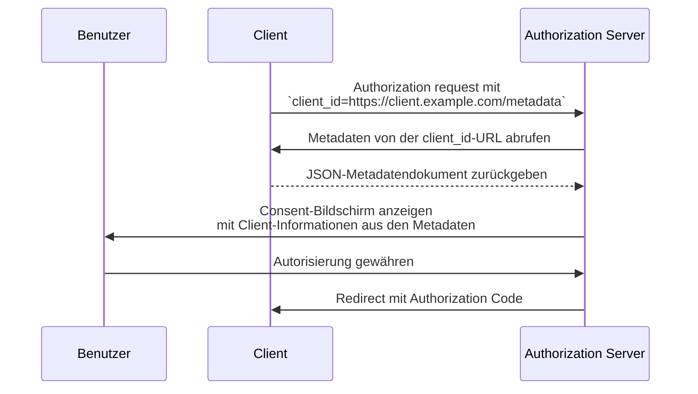

## Was ist ein Client ID Metadata Document (CIMD)?

Ein Client ID Metadata Document (CIMD) ist ein Mechanismus, der in der [OAuth Client ID Metadata Document](https://datatracker.ietf.org/doc/draft-ietf-oauth-client-id-metadata-document/) Spezifikation definiert ist und es einem OAuth 2.0 <Ref slug="client" /> ermöglicht, sich gegenüber einem <Ref slug="authorization-server" /> ohne vorherige Registrierung zu identifizieren.

Die Kernidee: Anstatt eine `client_id` vom Authorization Server (durch manuelle Registrierung oder [Dynamic Client Registration](https://datatracker.ietf.org/doc/html/rfc7591)) zu erhalten, **verwendet der Client eine HTTPS-URL als seine `client_id`**. Diese URL verweist auf ein JSON-Dokument, das die Metadaten des Clients enthält – Name, Redirect URIs, unterstützte Grant Types und mehr. Der Authorization Server ruft dieses Dokument ab, wenn er auf die URL-basierte `client_id` trifft.

Dieser Ansatz wird in der Community manchmal als **CIMD** (Client ID Metadata Document) abgekürzt.

## Wie funktioniert das?

Wenn ein Client ein Client ID Metadata Document (CIMD) verwendet, fügt der OAuth-Flow einen Schritt hinzu: Der Authorization Server löst die `client_id`-URL auf, um die Metadaten des Clients abzurufen.



So läuft der Ablauf Schritt für Schritt ab:

1. Der Client startet eine <Ref slug="authorization-request" /> mit seiner URL als `client_id` (z. B. `https://client.example.com/oauth-client`).
2. Der Authorization Server erkennt die `client_id` als URL und ruft sie per HTTPS ab.
3. Die Antwort ist ein JSON-Dokument mit den standardmäßigen OAuth-Client-Metadaten.
4. Der Authorization Server validiert die Metadaten, zeigt dem Benutzer die Consent-Informationen an und fährt mit dem OAuth-Flow fort.
5. Nachfolgende Anfragen können gemäß HTTP-Caching-Headern auf zwischengespeicherte Metadaten zugreifen.

### Das Metadatendokument

Das Metadatendokument ist ein JSON-Objekt, das die gleichen Felder wie in [RFC 7591 (OAuth 2.0 Dynamic Client Registration Protocol)](https://datatracker.ietf.org/doc/html/rfc7591) definiert verwendet. Es muss ein `client_id`-Feld enthalten, dessen Wert exakt mit der URL übereinstimmt.

Hier ein Beispiel:

```json
{
  "client_id": "https://client.example.com/oauth-client",
  "client_name": "My Application",
  "redirect_uris": ["https://client.example.com/callback"],
  "grant_types": ["authorization_code", "refresh_token"],
  "response_types": ["code"],
  "token_endpoint_auth_method": "none",
  "scope": "openid profile email"
}
```

### Anforderungen an die Client identifier URL (Client identifier URL)

Die Spezifikation stellt strenge Anforderungen daran, was eine gültige Client identifier URL (Client identifier URL) ist:

- **Muss HTTPS verwenden** – kein plain HTTP oder andere Schemen.
- **Muss einen Pfad enthalten** – eine reine Domain wie `https://example.com` ist ungültig.
- **Darf keine** Fragment-, Benutzername- oder Passwort-Komponenten enthalten.
- **Darf keine** Einzelpunkt (`.`) oder Doppelpunkt (`..`) Pfadsegmente enthalten.
- Query-Strings sind erlaubt, aber nicht empfohlen.
- Portnummern sind erlaubt.

Beispiele:
- `https://client.example.com/oauth-client` — gültig
- `http://client.example.com/oauth-client` — ungültig (kein HTTPS)
- `https://example.com` — ungültig (kein Pfad)
- `https://client.example.com/../oauth-client` — ungültig (Punktsegment)

## Warum nicht bestehende Registrierungsverfahren verwenden?

Um zu verstehen, warum diese Spezifikation existiert, sollte man die Einschränkungen bestehender Ansätze betrachten:

### Statische Registrierung

In traditionellen OAuth-Implementierungen registriert ein Entwickler den Client manuell beim Authorization Server – typischerweise über eine Admin-Konsole – und erhält eine `client_id`. Das funktioniert, wenn die Clients im Voraus bekannt sind.

Für offene Ökosysteme, in denen jeder Client sich verbinden können muss, funktioniert das nicht. Man kann nicht jeden möglichen AI-Agenten oder MCP-Client vorab registrieren.

### Dynamic Client Registration (DCR) (Dynamic Client Registration (DCR))

[Dynamic Client Registration (RFC 7591)](https://datatracker.ietf.org/doc/html/rfc7591) ermöglicht es Clients, sich programmatisch zu registrieren, indem sie ihre Metadaten an einen Registrierungsendpunkt senden. Der Server erstellt eine `client_id` und speichert die Registrierung.

Das funktioniert, erzeugt aber serverseitigen Zustand: Jede Registrierung erzeugt einen Datensatz, der gespeichert, gepflegt und irgendwann bereinigt werden muss. In einem offenen Ökosystem mit vielen Clients sammelt der Authorization Server Registrierungen an – von denen die meisten vielleicht nur einmal verwendet und dann aufgegeben werden.

DCR hat außerdem keinen eingebauten Mechanismus, um zu überprüfen, ob ein Client wirklich der ist, der er vorgibt zu sein. Jeder Client kann sich mit beliebigem Namen oder Logo registrieren.

### Vorteile des Client ID Metadata Document (CIMD)

Der Ansatz des Client ID Metadata Document (CIMD) adressiert diese Probleme:

| Aspekt | Statische Registrierung | DCR | Client ID Metadata Document |
|--------|------------------------|-----|----------------------------|
| Serverseitiger Zustand | Ja (gespeicherte Datensätze) | Ja (gespeicherte Datensätze) | Nein (bei Bedarf abgerufen) |
| Vorab-Registrierung erforderlich | Ja | Nein | Nein |
| Identitätsprüfung | Manuelle Überprüfung | Keine eingebaut | Domain-Besitz durch HTTPS |
| Bereinigung nötig | Ja | Ja (verwaiste Datensätze) | Nein (Selbstbereinigung via HTTP-Cache) |
| Client kontrolliert Metadaten | Nein | Bei Registrierung | Ja (jederzeit aktualisierbar) |

Der entscheidende Punkt ist, dass **Domain-Besitz zum Vertrauensanker wird**. Nur die Entität, die `client.example.com` kontrolliert, kann Inhalte unter `https://client.example.com/oauth-client` bereitstellen. Das HTTPS-Zertifikat beweist dies ohne weiteren Verifizierungsschritt.

## Einschränkungen bei der Authentifizierung

Da es kein vorab geteiltes Geheimnis zwischen Client und Authorization Server gibt, können symmetrische, geheimnisbasierte Authentifizierungsmethoden nicht verwendet werden. Das Metadatendokument **darf nicht** enthalten:

- `client_secret_post`
- `client_secret_basic`
- `client_secret_jwt`
- Jegliche Methode, die auf einem geteilten symmetrischen Geheimnis basiert

Die Felder `client_secret` und `client_secret_expires_at` dürfen ebenfalls nicht im Dokument erscheinen.

Wenn sich der Client über die Rolle eines Public Client hinaus authentifizieren muss, kann er asymmetrische Kryptografie verwenden. Der Client veröffentlicht seine öffentlichen Schlüssel im Metadatendokument (über eine `jwks`-Eigenschaft oder einen `jwks_uri`-Verweis) und authentifiziert sich am Token-Endpunkt mit `private_key_jwt`. Der Authorization Server prüft die JWT-Signatur gegen den veröffentlichten <Ref slug="jwk">JWK</Ref>.

## Wie erkennt der Authorization Server die Unterstützung?

Authorization Server signalisieren die Unterstützung für Client ID Metadata Documents, indem sie folgende Eigenschaft in ihre <Ref slug="authorization-server-metadata" /> aufnehmen:

```json
{
  "client_id_metadata_document_supported": true
}
```

Clients können dieses Flag prüfen, bevor sie einen Authorization Flow mit einer URL-basierten `client_id` starten. Wenn der Authorization Server keine Unterstützung signalisiert, sollte der Client auf andere Registrierungsverfahren zurückgreifen.

## Sicherheitshinweise

### SSRF-Schutz

Wenn der Authorization Server die Metadaten-URL abruft, führt er eine HTTP-Anfrage an eine vom Client bereitgestellte URL aus. Dies ist ein potenzieller Server-Side Request Forgery (SSRF)-Angriffsvektor. Implementierungen sollten:

- Anfragen an private und Loopback-IP-Adressen blockieren (z. B. `127.0.0.1`, `10.x.x.x`, `192.168.x.x`)
- Zieladressen nach Weiterleitungen erneut validieren
- Antwortgrößen begrenzen (die Spezifikation empfiehlt maximal 5 KB)
- Angemessene Timeouts setzen

### Caching

Authorization Server sollten HTTP-Cache-Header (`Cache-Control`, `ETag`) beim Caching von Metadaten respektieren. Allerdings gilt:

- **Fehlerantworten nicht cachen** – ein temporärer Fehler sollte einen Client nicht dauerhaft blockieren.
- Server können Mindest- und Höchst-Cachedauern unabhängig von den Angaben des Client-Servers erzwingen.

### Phishing-Prävention

Ein bösartiger Client könnte `client_name` auf einen vertrauenswürdigen Markennamen und `logo_uri` auf dessen Logo setzen. Authorization Server sollten dies verhindern, indem sie:

- Immer den Hostnamen der `client_id` zusammen mit dem Client-Namen auf dem Consent-Bildschirm anzeigen
- Logo-Bilder vorab abrufen und moderieren, anstatt sie direkt vom Client zu laden

### Redirect URI Attestation (Redirect URI Attestation)

Ein Sicherheitsvorteil gegenüber DCR: Die <Ref slug="redirect-uri">redirect URIs</Ref> im Metadatendokument werden auf der Domain des Clients gehostet und über HTTPS bereitgestellt. Dadurch entsteht eine stärkere Bindung zwischen der Client-Identität und den Redirect URIs als bei selbst deklarierten Werten in einer Registrierungsanfrage.

## Client ID Metadata Document Services

Die Spezifikation definiert außerdem **Client ID Metadata Document Services** – Webdienste von Drittanbietern, die Metadatendokumente im Auftrag von Entwicklern hosten.

Dies schließt eine praktische Lücke: Während der lokalen Entwicklung haben Entwickler keine öffentlich erreichbare URL, um ihre Metadaten zu hosten. Ein Client ID Metadata Document Service stellt eine stabile öffentliche URL bereit, die Authorization Server abrufen können, während der Entwickler lokal arbeitet. So muss der lokale Rechner nicht ins Internet exponiert oder ein Tunnel für OAuth-Tests eingerichtet werden.

<SeeAlso slugs={["client", "authorization-server-metadata", "redirect-uri", "jwk"]} />

<Resources
  urls={[
    "https://datatracker.ietf.org/doc/draft-ietf-oauth-client-id-metadata-document/",
    "https://datatracker.ietf.org/doc/html/rfc7591",
    "https://datatracker.ietf.org/doc/html/rfc8414",
  ]}
/>
