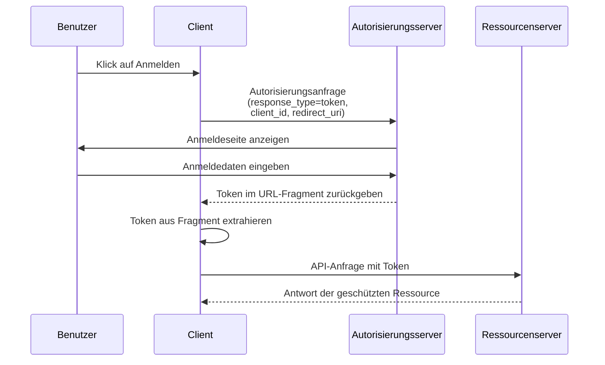

## Was ist der implizite Flow (Implicit Flow)?

Der OAuth 2.0 implizite Flow (Implicit Flow) ist eine Authentifizierungsmethode, die es clientseitigen Anwendungen (wie SPAs und nativen Apps) ermöglicht, Tokens direkt über URL-Fragmente vom Autorisierungsserver zu erhalten, ohne ein Client-Geheimnis bereitzustellen.

Der implizite Flow (Implicit Flow) ist für clientseitige Anwendungen konzipiert, da sie vollständig im Browser oder auf dem Gerät des Benutzers ausgeführt werden und Client-Geheimnisse nicht sicher speichern können.

Der implizite Flow (Implicit Flow) wurde aus Sicherheitsgründen (die unten erwähnt werden) offiziell in <Ref slug="oauth-2.1" /> als veraltet erklärt. Clientseitige Anwendungen sollten jetzt den <Ref slug="authorization-code-flow" /> mit der <Ref slug="pkce" />-Erweiterung verwenden.

## Wie funktioniert der implizite Flow (Implicit Flow)?

Die Hauptschritte des impliziten Flows (Implicit Flow) sind wie folgt:

Beachten:

- Der Client muss in der Autorisierungsanfrage nur eine `client_id` angeben, ohne ein `client_secret` zu benötigen.  
  Dies liegt daran, dass diese Clients Geheimnisse nicht sicher speichern können, sodass dieser Flow kein Client-Geheimnis erfordert.

- Der `response_type`-Parameter ist auf `token` gesetzt, was den Autorisierungsserver anweist, das access token direkt anstelle eines Autorisierungscodes zurückzugeben.  
  In OIDC (<Ref slug="openid-connect" />) ist der `response_type` entweder `id_token` oder `id_token token`, und der Auth-Dienst gibt die entsprechenden Tokens basierend auf verschiedenen Antworttypen zurück.

- Das Token wird direkt im URL-Fragment zurückgegeben. Das bedeutet, dass das Token in der URL exponiert ist und leicht von anderen Anwendungen oder Skripten abgerufen werden kann.

## Ist der implizite Flow (Implicit Flow) sicher?

Nein, der implizite Flow (Implicit Flow) in OAuth 2.0 wird im Allgemeinen als weniger sicher angesehen als andere Flows wie der authorization code flow.

Er wird für die meisten Anwendungsfälle aufgrund mehrerer Schwachstellen nicht empfohlen:

- **Token-Exposition in der URL**
   - Access tokens erscheinen direkt in der URL des Browsers (nach dem # Symbol)
   - Diese Tokens können:
     - Im Browserverlauf gespeichert werden
     - Durch Referrer-Header geleakt werden
     - Von bösartigem JavaScript-Code auf derselben Seite erfasst werden

- **Keine Client-Authentifizierung**
   - Die Client-Anwendung muss ihre Identität nicht nachweisen
   - Das bedeutet, dass jeder, der die `client_id` kennt, sich als legitimer Client ausgeben kann

- **Keine Refresh Tokens**
   - Dieser Flow unterstützt keine refresh tokens
   - Benutzer müssen sich erneut anmelden, wenn access tokens ablaufen
   - Um häufige Anmeldungen zu vermeiden, könnten Benutzer Tokens auf unsichere Weise speichern

- **Anfällig für XSS-Angriffe**
   - Alle Tokens werden im Browser verarbeitet
   - Wenn die Website von einem XSS-Angriff (Cross-Site Scripting) betroffen ist
   - Kann der JavaScript-Code von Angreifern diese Tokens leicht stehlen

Aufgrund dieser Sicherheitsbedenken wurde der implizite Flow (Implicit Flow) in <Ref slug="oauth-2.1" /> als veraltet erklärt. Clientseitige Anwendungen sollten jetzt den <Ref slug="authorization-code-flow" /> mit der <Ref slug="pkce" />-Erweiterung verwenden.

Du kannst [Was ist PKCE: von grundlegenden Konzepten bis zum tiefen Verständnis](https://blog.logto.io/how-pkce-protects-the-authorization-code-flow-for-native-apps) lesen, um zu erfahren, wie PKCE den authorization code flow für clientseitige Anwendungen schützt.

<SeeAlso
  slugs={["oauth-2.1", "authorization-code-flow", "pkce", "openid-connect"]}
/>

<Resources
  urls={[
    "https://blog.logto.io/implicit-flow-is-dead",
    {
      url: "https://tools.ietf.org/html/rfc6749#section-4.2",
      result: {
        ogTitle: "The OAuth 2.0 Authorization Framework: Implicit Grant",
        ogDescription:
          "Der implizite Grant-Typ wird verwendet, um access tokens zu erhalten (er unterstützt nicht die Ausgabe von refresh tokens) und ist für öffentliche Clients optimiert, die eine bestimmte Umleitungs-URI betreiben. Diese Clients werden typischerweise in einem Browser mit einer Skriptsprache wie JavaScript implementiert.",
      },
    },
    "https://openid.net/specs/openid-connect-core-1_0.html",
    "https://blog.logto.io/how-pkce-protects-the-authorization-code-flow-for-native-apps",
  ]}
/>