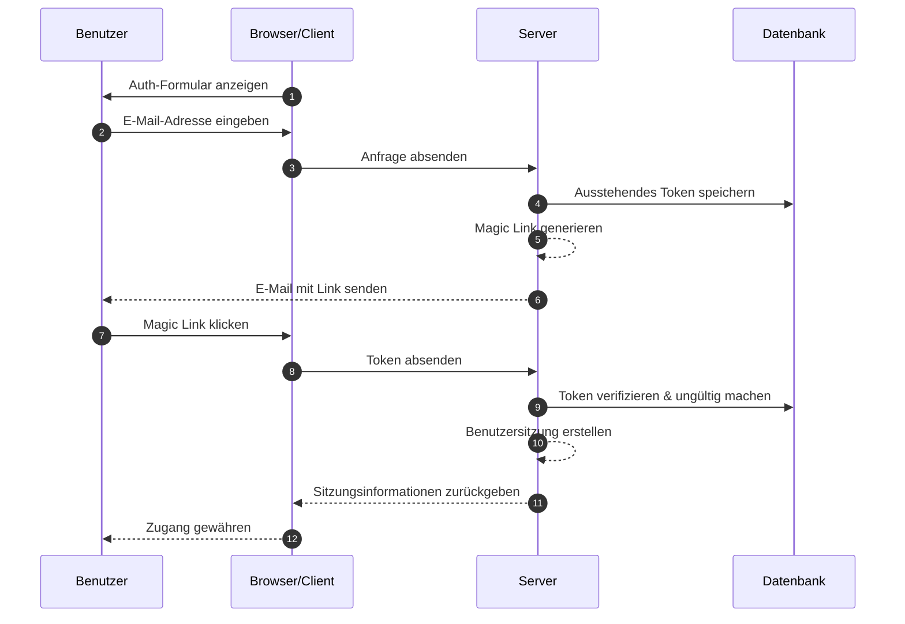
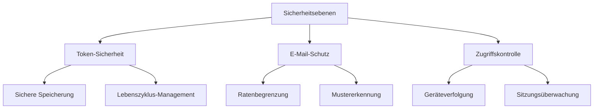

## Was sind Magic Links?

Ein Magic Link ist eine sichere, zeitlich begrenzte URL, die eine passwortlose Authentifizierung sowohl für Registrierungs- als auch Anmeldeprozesse ermöglicht. Anstatt Passwörter zu erstellen und sich zu merken, erhalten Benutzer einen speziellen Link per E-Mail, der ihnen sofortigen Zugang gewährt. Man kann es sich wie einen digitalen Schlüssel vorstellen, der nur einmal funktioniert - wenn du darauf klickst, bist du authentifiziert, und dann wird dieser Schlüssel ungültig.

Zum Beispiel, wenn du dich bei Medium anmeldest oder versuchst, dich bei Slack einzuloggen, senden dir diese Plattformen anstelle der Einrichtung oder Eingabe eines Passworts eine E-Mail mit einem sicheren Link. Ein Klick, und du bist authentifiziert. Dieser Ansatz hat an Popularität gewonnen, weil er Sicherheit mit Einfachheit kombiniert.

## Wie funktionieren Magic Links?

Der Prozess ist aus der Sicht des Benutzers einfach, beinhaltet jedoch komplexe Sicherheitsmechanismen im Hintergrund. Hier ist, was während eines typischen Magic Link Authentication Flows passiert:



## Wie ist die Struktur eines Magic Links?

Ein typischer Magic Link besteht aus mehreren Komponenten:

- Basis-URL der Anwendung
- Authentifizierungs-Endpunkt
- Token-Parameter
- Zusätzliche Parameter (optional)

Zum Beispiel:

```
https://app.example.com/verify-auth?token=abc123...&redirect=/dashboard
```

## Wie wird das Token eines Magic Links generiert?

Wenn ein Benutzer einen Magic Link anfordert (z. B. durch Klicken auf "Mit E-Mail anmelden"), müssen wir ein sicheres, unvorhersehbares Token generieren. Dieses Token ist entscheidend, da es im Wesentlichen zu einem temporären Passwort wird.

Das Token muss mit einem <Ref slug='csprng' /> generiert werden. Ein CSPRNG verwendet Entropie von der Hardware deines Systems (wie Tastaturzeiten, Mausbewegungen, Lüftergeräusche usw.), um wirklich zufällige Zahlen zu erzeugen, die unmöglich vorherzusagen sind, selbst wenn ein Angreifer frühere Ausgaben kennt.

Zum Beispiel in Node.js:

```javascript
import crypto from "node:crypto";

// Sicheres zufälliges Token generieren
const token = crypto.randomBytes(32).toString("base64url");
// Ergebnis: etwas wie 'dBjftJeZ4CVP-mB92K27uhbUJU1p1r_wW1gFWFOEjXk'

// Alternative mit Web Crypto API (verfügbar in Node.js und Browsern)
const buffer = crypto.getRandomValues(new Uint8Array(32));
const token2 = Buffer.from(buffer).toString("base64url");
```

Anforderungen für ein sicheres Token:

- Generiert über CSPRNG, um Unvorhersehbarkeit zu gewährleisten
- Mindestens 32 Bytes lang (256 Bit Entropie)
- URL-sicher kodiert (base64url eliminiert problematische Zeichen)
- Zeitlich begrenzt und einmalig verwendbar, um Replay-Angriffe zu verhindern
- Sicher mit Metadaten gespeichert (Ablauf, Benutzerinformationen)

## Wie sichert man die Magic Link Authentifizierung

Die Sicherheit von Magic Links erfordert einen umfassenden Ansatz über mehrere Ebenen. Während die E-Mail-Zustellung und Zugriffsmuster entscheidend sind, bleibt die sichere Token-Verwaltung das Herzstück der Systemsicherheit.

### Grundlagen der Token-Sicherheit

Die Sicherheit von Magic Links hängt stark von der ordnungsgemäßen Token-Implementierung ab (siehe oben). Jedes Token muss kryptografisch sicher sein und während seines gesamten Lebenszyklus ordnungsgemäß verwaltet werden. Das System sollte ein striktes Token-Ablaufdatum durchsetzen (typischerweise 15-30 Minuten) und sofortige Ungültigmachung nach der Verwendung.

Beim Speichern von Tokens sollten sie mit der gleichen Sicherheitsstufe wie Passwörter behandelt werden:

- Tokens vor der Speicherung hashen, um eine Exposition zu verhindern
- Automatische Bereinigung abgelaufener Tokens implementieren
- Ein Audit-Trail der Token-Nutzung und Ungültigmachung führen
- Zugehörige Metadaten speichern (Erstellungszeit, vorgesehener Benutzer, Geräteinformationen)

### Sicherheit der E-Mail-Zustellung

E-Mail dient als primärer Zustellungskanal für Magic Links und ist somit ein potenzielles Ziel für Angriffe. Die Implementierung von Ratenbegrenzung ist entscheidend, um Brute-Force-Versuche zu verhindern und gegen E-Mail-Bombenangriffe zu schützen. Zum Beispiel könntest du Benutzer auf 5 Magic Link-Anfragen pro Stunde von derselben IP-Adresse beschränken.

Darüber hinaus hilft die Überwachung ungewöhnlicher Aktivitätsmuster, potenzielle Sicherheitsverletzungen zu erkennen. Dazu gehören:

- Mehrere Anfragen von verschiedenen IPs für dieselbe E-Mail
- Ungewöhnliche geografische Zugriffsmuster
- Schnellfeuer-Anfragen, die auf automatisierte Angriffe hinweisen

### Zugriffskontrolle und Überwachung

Geräte-Fingerprinting fügt eine zusätzliche Sicherheitsebene hinzu, indem konsistente Muster des Benutzerverhaltens verfolgt werden. Wenn ein Anmeldeversuch von einem neuen Gerät oder Standort kommt, kannst du zusätzliche Verifizierungsschritte implementieren oder den Benutzer benachrichtigen.

Für erhöhte Sicherheit in sensiblen Anwendungen:

- Kombiniere Magic Links mit zusätzlichen Authentifizierungsfaktoren
- Implementiere kontinuierliche Sitzungsüberwachung
- Protokolliere alle Authentifizierungsereignisse für Audit-Trails
- Füge gerätebasierte Verifizierung für neue Standorte hinzu



## Magic Links vs. SMS / E-Mail OTP

Sowohl Magic Links als auch SMS / E-Mail OTP verlassen sich auf externe Kanäle zur Verifizierung.

Magic Links senden eine einmalige URL an die E-Mail des Benutzers, während OTP einen Verifizierungscode an deren Telefon oder E-Mail sendet.

Magic Links bieten eine überlegene Desktop-Erfahrung, da Benutzer einfach auf den Link klicken, um die Verifizierung abzuschließen, und nicht manuell Codes eingeben müssen. Sie können auch zusätzliche Kontextinformationen tragen, die komplexere Authentifizierungsabläufe ermöglichen.

In mobilen Szenarien könnte jedoch SMS OTP eine bessere Benutzerfreundlichkeit bieten, da Benutzer schnell Verifizierungscodes anzeigen und eingeben können.

## Magic Links vs. Authenticator Apps

Im Vergleich zu OTP-Codes, die von Authenticator Apps generiert werden, erfordern Magic Links nicht, dass Benutzer zusätzliche Anwendungen installieren, und funktionieren nahtlos auf allen Geräten. Dies reduziert die Reibung, insbesondere für nicht-technische Benutzer. Authenticator Apps generieren jedoch OTP-Codes mit besserer Echtzeit-Zuverlässigkeit, unabhängig von der E-Mail-Server-Zustellungsgeschwindigkeit und Verfügbarkeit.

Für Szenarien, die häufige Authentifizierung mit hohen Sicherheitsanforderungen erfordern, könnten Authenticator Apps die bevorzugte Wahl sein.

## Wann sollte man Magic Links verwenden

Magic Links sind besonders effektiv für Geschäfts- und Unternehmensanwendungen, bei denen Benutzer typischerweise seltener einloggen, wie z. B. Projektmanagement-Tools oder Berichtsdashboards. In diesen Szenarien ist die leichte Verzögerung bei der E-Mail-Zustellung im Vergleich zur Bequemlichkeit, keine Passwörter verwalten zu müssen, vernachlässigbar.

### Ideale Szenarien

Diese Authentifizierungsmethoden glänzen in Geschäftskontexten, in denen E-Mail bereits der primäre Kommunikationskanal ist. Zum Beispiel nutzen Kollaborationsplattformen wie Slack oder Notion Magic Links effektiv, weil:

- Benutzer bereits aktiv ihre E-Mails überwachen
- Anmeldesitzungen tendenziell langanhaltend sind
- Der Fokus darauf liegt, die Reibung im Authentifizierungsprozess zu reduzieren

Magic Links sind auch hervorragend für Benutzerregistrierungsabläufe in SaaS-Produkten geeignet, bei denen die Optimierung der Konvertierung entscheidend ist. Wenn Benutzer deinen Dienst nur mit einer E-Mail-Adresse nutzen können, reduziert dies die Abbruchraten während des Onboarding-Prozesses erheblich.

### Wann man Alternativen in Betracht ziehen sollte

Magic Links sind jedoch möglicherweise nicht die beste Wahl für Anwendungen, die häufige Authentifizierung erfordern. Mobile Banking-Apps benötigen beispielsweise schnelle und zuverlässige Authentifizierungsmethoden, da Benutzer möglicherweise mehrmals täglich ihren Kontostand überprüfen. In solchen Fällen bieten biometrische Authentifizierung oder PIN-Codes oft eine bessere Benutzererfahrung.

Ziehe alternative Authentifizierungsmethoden in Betracht, wenn:

- Deine Anwendung hauptsächlich mobilbasiert ist
- Benutzer sofortigen Zugriff ohne E-Mail-Abhängigkeit benötigen
- Die Umgebung eine Multi-Faktor-Authentifizierung erfordert
- E-Mail-Zustellungsverzögerungen die Benutzererfahrung erheblich beeinträchtigen könnten

Der Schlüssel ist, deine Authentifizierungsmethode mit den Verhaltensmustern und Sicherheitsanforderungen deiner Benutzer in Einklang zu bringen. Während Magic Links hervorragende Sicherheit mit minimaler Reibung bieten, sollten sie Teil einer umfassenderen Authentifizierungsstrategie sein und nicht die einzige Lösung.

<SeeAlso slugs={["csprng", "passwordless", "otp", "totp"]} />