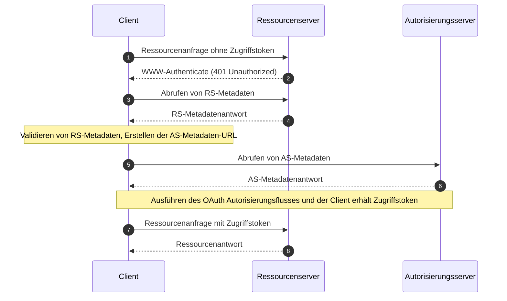

## Was sind OAuth 2.0 Geschützte Ressourcen-Metadaten (Protected Resource Metadata)?

OAuth 2.0 Geschützte Ressourcen-Metadaten (Protected Resource Metadata) sind ein standardisiertes Format, das in [RFC 9728](https://datatracker.ietf.org/doc/html/rfc9728) definiert ist. Es hilft Clients und Autorisierungsservern zu verstehen, wie sie mit geschützten Ressourcen interagieren können.

Dieses Metadatenformat liefert wesentliche Informationen über:
- Fähigkeiten des Ressourcenservers
- Unterstützte Token-Formate
- Erforderliche Sicherheitsmechanismen
- Beziehungen zu Autorisierungsservern
- Verfügbare Scopes und Berechtigungen

## Was sind die Vorteile von Geschützten Ressourcen-Metadaten (Protected Resource Metadata)?

Im OAuth 2.0 System gibt es vier grundlegende Rollen:
- <Ref slug="authorization-server"/>: Gibt Zugriffstoken an Clients aus, nachdem der Ressourcenbesitzer erfolgreich authentifiziert wurde
- <Ref slug="client"/>: Anwendung, die Zugriff auf geschützte Ressourcen anfordert
- <Ref slug="resource-owner"/>: Entität, die in der Lage ist, Zugriff auf geschützte Ressourcen zu gewähren
- <Ref slug="resource-server"/>: Server, der geschützte Ressourcen hostet

Traditionell musste ein Client, wenn er auf geschützte Ressourcen zugreifen wollte, zuerst den Autorisierungsserver entdecken und mit ihm interagieren, um die erforderlichen Token zu erhalten. Die Rolle des Ressourcenservers war hauptsächlich darauf beschränkt, Token zu validieren und Ressourcen bereitzustellen, wobei alle Authentifizierungs- und Autorisierungsdetails über den Autorisierungsserver und die Client-Anwendung koordiniert wurden.

Dies bedeutete, dass Clients keine standardisierte Möglichkeit hatten, die spezifischen Anforderungen oder Fähigkeiten eines Ressourcenservers direkt zu entdecken.

Geschützte Ressourcen-Metadaten (Protected Resource Metadata) verändern diese Dynamik, indem sie Ressourcenservern ermöglichen, aktiv ihre Anforderungen und Fähigkeiten zu veröffentlichen, und sie bringen mehrere wichtige Vorteile:
- Direkte Entdeckung: Clients können nun direkt von der Quelle über die Anforderungen eines Ressourcenservers erfahren
- Erhöhte Autonomie: Ressourcenserver können explizit ihre unterstützten Token-Formate, Sicherheitsmechanismen und vertrauenswürdigen Autorisierungsserver angeben
- Verbesserte Interoperabilität: Ein standardisiertes Format sorgt für eine konsistente Kommunikation der Zugriffsanforderungen über verschiedene Implementierungen hinweg
- Dynamische Konfiguration: Ressourcenserver können ihre Anforderungen aktualisieren, ohne auf Änderungen des Autorisierungsservers angewiesen zu sein

## Wie funktionieren OAuth 2.0 Geschützte Ressourcen-Metadaten (Protected Resource Metadata)?

Geschützte Ressourcen-Metadaten (Protected Resource Metadata) operieren innerhalb des OAuth 2.0 Ökosystems durch einen standardisierten Entdeckungs- und Interaktionsprozess:



Das Ressourcenserver-Metadatendokument ist ein JSON-Objekt, das die folgenden Felder enthält:

```json
   {
     "resource": "https://api.example.com",
     "authorization_servers": [
       "https://auth.example.com"
     ],
     "scopes_supported": ["read", "write"],
     "token_formats_supported": ["jwt"],
     "token_introspection_endpoint": "https://api.example.com/introspect",
     "dpop_signing_alg_values_supported": ["ES256", "PS256"]
   }
   ```

Und sobald der Client das Metadatendokument erhalten hat, kann er es verwenden, um sich selbst zu konfigurieren und hauptsächlich gemäß den folgenden Feldern mit dem Ressourcenserver zu interagieren:

- `resource`: Bezeichner für die geschützte Ressource
- `authorization_servers`: Liste der autorisierten Autorisierungsserver
- `scopes_supported`: Verfügbare Scopes für diese Ressource
- `token_formats_supported`: Unterstützte Token-Formate
- `token_introspection_endpoint`: Endpunkt zur Token-Validierung
- `dpop_signing_alg_values_supported`: Unterstützte DPoP-Algorithmen

## Wie entdeckt man OAuth 2.0 Geschützte Ressourcen-Metadaten-Endpunkte?

Es gibt zwei primäre Entdeckungsmechanismen für Geschützte Ressourcen-Metadaten (Protected Resource Metadata):

1. **WWW-Authenticate Header Discovery (Flow-basiert)**:

Wenn ein Client eine unautorisierte Anfrage an eine geschützte Ressource stellt, antwortet der Server mit einem 401-Statuscode und enthält die Metadaten-URL im WWW-Authenticate-Header:

```bash
# 1. Client stellt Anfrage ohne Token
GET /api/resource HTTP/1.1
Host: api.example.com

# 2. Server antwortet mit 401 und Metadaten-URL
HTTP/1.1 401 Unauthorized
WWW-Authenticate: Bearer realm="example",
  scope="read write",
  resource_metadata_url="https://api.example.com/.well-known/oauth-resource-server"
```

Der Header bietet:
- Identifikation des Ressourcenbereichs
- Erforderliche Scopes
- Standort der Metadaten-URL

2. **Direkte Well-Known URI Discovery**:

Du kannst direkt auf die Metadaten zugreifen, indem du eine GET-Anfrage an den Well-Known-Endpunkt stellst:

```bash
GET /.well-known/oauth-resource-server HTTP/1.1
Host: api.example.com
```

Der Endpunkt folgt einem standardisierten Format:
- Basis-URI: `https://api.example.com`
- Well-Known-Pfad: `/.well-known/oauth-resource-server`
- Vollständige URL: `https://api.example.com/.well-known/oauth-resource-server`

## Wie funktioniert der WWW-Authenticate-Header in Geschützten Ressourcen-Metadaten (Protected Resource Metadata)?

Der WWW-Authenticate-Header ist ein Schlüsselelement in Geschützten Ressourcen-Metadaten (Protected Resource Metadata) zur Implementierung eines automatischen Entdeckungsmechanismus. Er nutzt den standardmäßigen HTTP `WWW-Authenticate`-Header, um Metadateninformationen zu übertragen, sodass Clients automatisch die Zugriffsanforderungen für Ressourcenserver entdecken und konfigurieren können.

Wenn ein Client erstmals versucht, auf eine geschützte Ressource zuzugreifen, ohne ein Zugriffstoken bereitzustellen, antwortet der Ressourcenserver mit einem 401 Unauthorized-Statuscode und enthält einen WWW-Authenticate-Header:

```
WWW-Authenticate: Bearer realm="example",
  scope="read write",
  resource_metadata_url="https://api.example.com/.well-known/oauth-resource-server"
```

Dieser Header kann mehrere wichtige Informationen enthalten:
- `Bearer`: Gibt an, dass es sich um ein OAuth 2.0 Bearer Token-Authentifizierungsschema handelt
- `realm`: Definiert den Schutzbereich der Ressource
- `scope`: Gibt die erforderlichen Zugriffsberechtigungen an
- `resource_metadata_url`: Zeigt auf den Standort des Metadatendokuments, das die vollständige Ressourcenserverkonfiguration enthält

Nach Erhalt dieses Headers extrahiert der Client die `resource_metadata_url` und ruft das vollständige Metadatendokument von dieser URL ab.

Basierend auf den erhaltenen Metadateninformationen kann der Client geeignete Autorisierungsserver, unterstützte Token-Formate, verfügbare Scopes und andere Konfigurationsdetails bestimmen, um Authentifizierungsanfragen ordnungsgemäß zu konfigurieren.

## Wie sichert man OAuth 2.0 Geschützte Ressourcen-Metadaten (Protected Resource Metadata)?

Wesentliche Sicherheitsüberlegungen umfassen:

1. **Transportsicherheit**:
   - Obligatorische TLS-Nutzung
   - Zertifikatsvalidierung
   - Sichere Verbindungsbehandlung

2. **Metadatenintegrität**:
   - Quellvalidierung
   - Signaturüberprüfung
   - Sichere Caching-Strategien

3. **Zugriffskontrolle**:
   - Ratenbegrenzung
   - Anfragenvalidierung
   - Missbrauchsüberwachung

## Wie implementiert man OAuth 2.0 Geschützte Ressourcen-Metadaten (Protected Resource Metadata)?

So wird OAuth 2.0 Geschützte Ressourcen-Metadaten (Protected Resource Metadata) über verschiedene Komponenten hinweg implementiert:

1. **Ressourcenserver-Implementierung**

Der Ressourcenserver antwortet mit einem 401 Unauthorized-Status und enthält die Metadaten-URL im WWW-Authenticate-Header, wenn er einen unautorisierten Zugriffsversuch erhält:

```
HTTP/1.1 401 Unauthorized
WWW-Authenticate: Bearer realm="example",
  resource_metadata_url="https://api.example.com/.well-known/oauth-resource-server"
```

2. **Client-Implementierung**

Der Client implementiert eine asynchrone Funktion zur Handhabung des Ressourcenzugriffs. Beim Empfang einer 401-Antwort extrahiert diese Funktion die Metadaten-URL aus dem WWW-Authenticate-Header, ruft die Metadaten ab und verwendet sie zur Client-Konfiguration:

```javascript
async function handleResourceAccess(response) {
  if (response.status === 401) {
    const wwwAuthenticate = response.headers.get('WWW-Authenticate');
    const metadataUrl = extractMetadataUrl(wwwAuthenticate);
    const metadata = await fetchMetadata(metadataUrl);
    // Client-Konfiguration basierend auf Metadaten
  }
}
```

3. **Metadatendokumentstruktur**

Der Ressourcenserver stellt ein Metadatendokument als JSON-Objekt bereit, das enthält:
- Ressourcenbezeichner
- Liste der autorisierten Autorisierungsserver
- Unterstützte Scopes
- Unterstützte Token-Formate
- Unterstützte DPoP-Signaturalgorithmen

Hier ist ein Beispiel für das Metadatendokument:

```json
{
  "resource": "https://api.example.com",
  "authorization_servers": ["https://auth.example.com"],
  "scopes_supported": ["read", "write"],
  "token_formats_supported": ["jwt"],
  "dpop_signing_alg_values_supported": ["ES256"]
}
```

Diese Komponenten arbeiten zusammen, um eine vollständige Implementierung von OAuth 2.0 Geschützten Ressourcen-Metadaten (Protected Resource Metadata) zu bilden. Durch diese Implementierung können Clients automatisch die notwendigen Parameter für den Zugriff auf geschützte Ressourcen entdecken und konfigurieren.

<SeeAlso slugs={["resource-server", "authorization-server"]} />

<Resources urls={[
  "https://datatracker.ietf.org/doc/html/rfc9728",
]} />