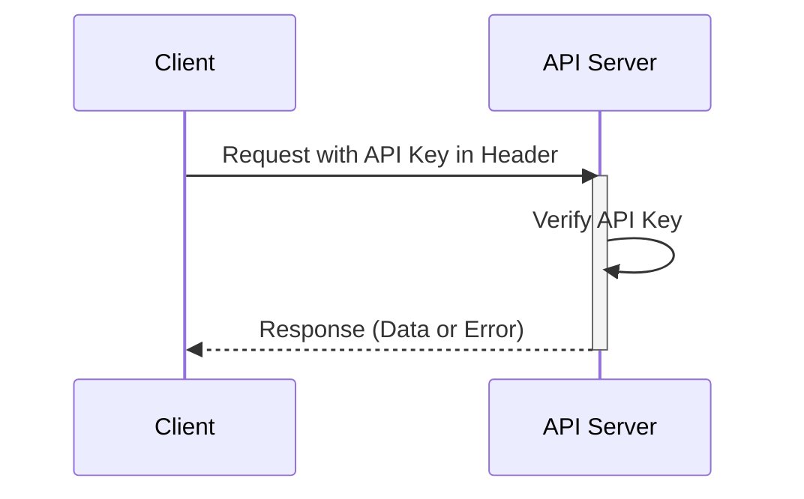

## What is an API key?

An API key is a secret token used to authenticate clients accessing an API. It's like a password for your application, allows access to a specific API. Think of it as a keycard to access a building. The keycard grants access, but doesn't necessarily identify who you are.

## How do API keys work?

API keys work through a simple request and response process.

1. **Request:** Your application sends a request to the API, including the API key.  The key is often sent in the header of the request.  For example, the header might look like this: `x-api-key: your_actual_api_key`.  There's no single standard for header names or value formats.

2. **Verification:** The API server checks the provided key against its database.

3. **Response:** If the key is valid, the server grants access and sends back the requested data. If not, access is denied.

Here's a sequence diagram illustrating the process:

## What are the pros and cons of API Keys?

Let's look at what makes API keys useful and where they fall short:

### Pros

- **Super simple to use**: Just add a key to your request and you're good to go! It's like using a house key - no complicated steps needed.

- **Easy to track**: Want to know who's using your API? API keys make it simple. You can see which apps are making calls and how often they're doing it.

- **Quick rate limiting**: Stop people from overusing your API by setting limits per key. It's like having a bouncer at a club who counts how many times someone goes in and out.

- **Perfect for public data**: If you're sharing non-sensitive info (like weather data or public stats), API keys are just right.

### Cons

- **Less secure than modern alternatives**: API keys are not as effective as other forms of API authentication, such as <Ref slug="oauth-2.0" /> and <Ref slug="jwt" />. Think of them as a basic lock compared to a modern security system. However, they remain popular because they're the simplest way to track API usage and get started with API security.

- **Security risks**: API keys are like leaving your house key under the doormat. If someone finds it, they can use it forever. Here's why:
  - They're often visible in code
  - They don't expire automatically
  - If leaked (like in public GitHub repos), anyone can use them

- **Can't tell users apart**: While some companies use "API keys" that can identify users (like Stripe), traditional API keys can't tell you who's who. They only tell you which application is making the request.

- **Static by nature**: Unlike modern auth tokens that expire, API keys usually stay the same forever. This means:
  - No automatic security refreshes
  - Manual work needed to rotate keys
  - Higher risk if keys are exposed

## What are the use cases for API keys?

- Service-to-service communication: API keys are suitable for scenarios where applications need to communicate with APIs directly through CLIs. E.g. Calling OpenAI APIs.
- Public APIs: When exposing APIs to the public, API keys provide a straightforward method of access control.
- Simplified setup: For quick and simple authentication needs, especially in development phase. Unlike Machine-to-machine authentication, API keys do not require client registration in prior, and do not need to exchange for an access token, either. You just pass your API key as a parameter in your request and it just simply works.

In real-world scenarios, the most common purpose when building products is product integration. Here is one typical use case:

### Example: Integration with Stripe

Stripe uses API keys for secure integration with different platforms and applications. You can create, view, delete, and manage these keys through the Developers Dashboard. By using API keys, you can integrate Stripe’s checkout and billing features into your product.

## What is the difference between Personal Access Tokens (PAT) and Machine-to-Machine (M2M)?

When talking about API keys, personal access tokens and <Ref slug="machine-to-machine" /> can be also mentioned together since they all can programmatically access API resource through CLI commands, or establish communication between backend services.

### Personal Access Tokens (PATs)

A personal access token is also a string but represents ***a specific user’s*** identity and permissions, is dynamically generated upon successful authentication or login, and typically has a limited lifespan but can be refreshed. It provides fine-grained access control to user-specific data and capabilities and are commonly used for CLI tools, scripts, or personal API access. The main difference is that it’s more specific and used for user-specific actions.

### Machine-to-Machine (M2M)

M2M communication is when devices automatically exchange data without human involvement in a broader sense.

In the context of <Ref slug="openid-connect" /> (or <Ref slug="oauth-2.0" />), M2M applications use the <Ref slug="client-credentials-flow" />, as defined in the [OAuth 2.0 RFC 6749 protocol](https://datatracker.ietf.org/doc/html/rfc6749), which supports similar standard protocols. It usually involves a client application (a machine or service) accessing resources either on its own or on behalf of a user. It is ideal for situations where only trusted clients can access backend services. 

<SeeAlso slugs={["machine-to-machine"]} />
