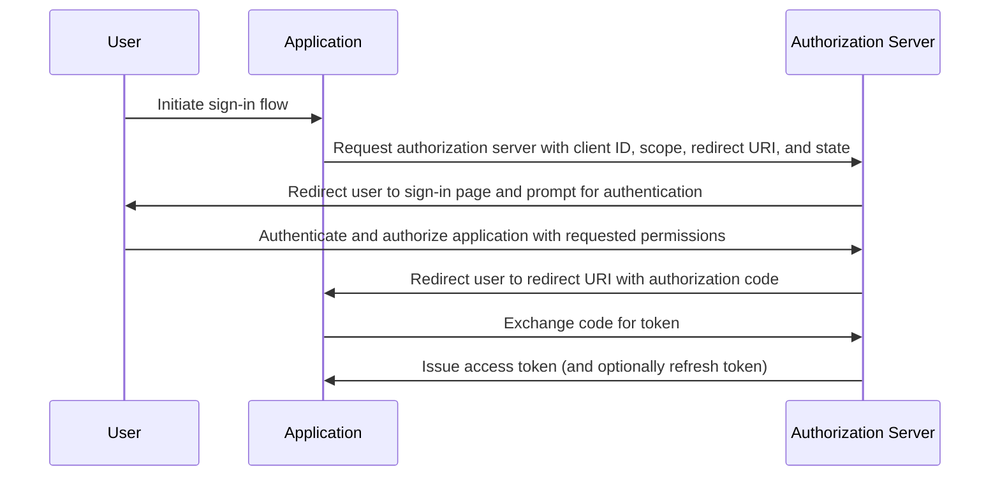

## What is authorization code flow?

The authorization code flow (a.k.a authorization code grant), defined in [OAuth 2.0 RFC 6749, section 4.1](https://datatracker.ietf.org/doc/html/rfc6749#section-4.1), is a widely used OAuth 2.0 authorization mechanism that allows applications to obtain an access token on behalf of a user.

This flow is ideal for confidential applications like traditional server-side web apps that can safely store client secrets.

It can also be used securely for native apps and Single Page Applications (SPAs) that cannot securely store client secrets when combined with PKCE (<Ref slug="pkce" />) extension.

## How does authorization code flow work?

The authorization code flow involves the following steps:

1. **Flow initiation**: The user initiates the flow by typically clicking a link or button in the application to sign in. The application redirects the user to the authorization server's authorization endpoint, passing along the client ID, the requested scope, a redirect URI, and a state parameter. Authorization server validates the parameters and prompts the user to authenticate on the authorization server's sign-in page.
2. **User authentication and authorization**: The user authenticates with the authorization server and grants the application permission to access the requested resources.
3. **Code generation and redirection**: The authorization server generates an authorization code and redirects the user back to the application using the redirect URI provided earlier. The authorization code is included in the query string of the redirect URI.
4. **Code exchange**: The application extracts the authorization code from the query string and makes a POST request to the authorization server's token endpoint to exchange the authorization code for an access token. The application must also include the client ID, client secret, redirect URI, and the authorization code in the request.
5. **Access token retrieval**: The authorization server validates the authorization code and issues an access token (and optionally a refresh token) to the application upon successful validation. The application can then use the access token to make authorized API requests on behalf of the user.

The steps can be illustrated by the following sequence diagram:



## How to implement authorization code flow?

Here's a simple example of implementing the authorization code flow, following the guidelines outlined in [OAuth 2.0 RFC 6749, section 4.1](https://datatracker.ietf.org/doc/html/rfc6749#section-4.1):

### 1. Initial setup

Ensure you have the following information from your auth service before you start:

```javascript
const config = {
  clientId: "YOUR_CLIENT_ID",
  clientSecret: "YOUR_CLIENT_SECRET",
  authorizationEndpoint: "https://authorization-server.com/auth",
  tokenEndpoint: "https://authorization-server.com/token",
  redirectUri: "http://localhost:3000/callback",
};
```

Client ID, client secret, and redirect URI are your application's configuration in the auth service.

The `authorizationEndpoint` and `tokenEndpoint` are provided by your auth service.

If your auth server implements OIDC (<Ref slug="openid-connect" />), you can get this information through <Ref slug="openid-connect-discovery" />.

### 2. Initiate authorization request

The flow starts when a user wants to log in (for example, by clicking a login button). The application will make a login request.

This request includes parameters like `client ID`, `redirect URI`, and `scope`. Then it redirects the user to the auth service's authorization endpoint (the auth service's login page).

The user will authenticate and authorize on this login page.

```javascript
app.get("/login", (req, res) => {
  const authUrl = new URL(config.authorizationEndpoint);
  authUrl.searchParams.append("response_type", "code");
  authUrl.searchParams.append("client_id", config.clientId);
  authUrl.searchParams.append("redirect_uri", config.redirectUri);
  authUrl.searchParams.append("scope", "openid profile email");
  authUrl.searchParams.append("state", "random_state_string");

  res.redirect(authUrl.toString());
});
```

Note: You can add more parameters beyond those shown in the example code. See [Full authentication request parameter definition](https://openid.net/specs/openid-connect-core-1_0.html#AuthRequest).

### 3. Handle redirect URI callback and token exchange

After the user completes authentication and authorization on the auth service's login page, the auth service redirects the user back to the application's redirect URI. This redirect URI includes the authorization code and state parameters.

The application extracts the authorization code and state parameters from the redirect URI and exchanges them for access and refresh tokens (if any) at the auth service's token endpoint.

```javascript
app.get("/callback", async (req, res) => {
  const { code, state } = req.query;

  try {
    // Exchange the authorization code for an access token and refresh token
    const tokenResponse = await axios.post(config.tokenEndpoint, {
      grant_type: "authorization_code",
      code,
      redirect_uri: config.redirectUri,
      client_id: config.clientId,
      client_secret: config.clientSecret,
    });

    const { access_token, refresh_token } = tokenResponse.data;
    // Store tokens for subsequent requests
    req.session.accessToken = access_token;

    res.send("Authentication successful!");
  } catch (error) {
    res.status(500).send("Token exchange failed");
  }
});
```

### 4. Use access token

Once you have the token, use it to access protected resources:

```javascript
async function fetchUserProfile(accessToken) {
  const response = await axios.get("https://api.example.com/userinfo", {
    headers: {
      Authorization: `Bearer ${accessToken}`,
    },
  });
  return response.data;
}
```

## How to use authorization code flow for public clients (native apps and SPAs)?

Public clients (like native apps and SPAs) face unique security challenges when using the authorization code flow. These applications cannot securely store client secrets. The client secret would be exposed in JavaScript code or within the device's storage. This makes it easy for attackers to extract and misuse the secret.

Therefore, the key challenge is how to use the authorization code flow securely without a client secret. The OAuth 2.0 specification introduced PKCE (<Ref slug="pkce" />) extension to solve this problem.

PKCE adds additional security measures to protect the authorization code flow for public clients. It prevents authorization code interception attacks even without using a client secret. Check out this blog to learn more about [How PKCE secures OAuth 2.0 authorization code flow](https://blog.logto.io/how-pkce-protects-the-authorization-code-flow-for-native-apps).

## How to use authorization code flow securely?

### **Using "state" to Prevent CSRF Attacks**

CSRF (<Ref slug="csrf" />) attacks trick users into performing unwanted actions in an authenticated web application. The state parameter helps prevent this.

- Generate a unique, random value. Store this value server-side.
- Include the state parameter. Append it to the authorization request URL.
- Verify the state upon return. When the authorization server redirects back to your app, compare the returned state with the stored value. If they don't match, reject the request. This confirms the request originated from your application.

### **Configuring secure redirect URIs**

The redirect URI is where the authorization server sends the authorization code after user authentication. Secure configuration is crucial.

- Register valid redirect URIs. During app registration with the authorization server, specify the allowed redirect URIs.
- Exact matching. The redirect URI in the authorization request must exactly match a registered URI. Even a slight difference can create a vulnerability.
- Avoid wildcard URIs. If possible, avoid using wildcard URIs in production. They broaden the attack surface.
- HTTPS for production. Always use HTTPS for redirect URIs in production environments.

### **Using PKCE for all clients**

While PKCE was originally designed for public clients, <Ref slug="oauth-2.1" /> specification requires PKCE to be enforced for all clients, including confidential clients, to enhance the overall security of the authorization code flow. (See [Enforce PKCE for all clients](https://auth.wiki/oauth-2.1#enforcing-pkce-for-all-clients))

## What is the difference between authorization code flow and implicit flow?

The main difference between the authorization code flow and the implicit flow is how the access token is obtained:

- **Authorization code flow**: The client application receives an authorization code first from the authorization endpoint, then exchanges it for an access token in a subsequent POST request to the token endpoint.
- **Implicit flow**: The client application receives the access token directly in the URL fragment of the redirect URI after user authorization.

Learn more about <Ref slug="implicit-flow" />.

## What is the difference between authorization code flow and client credentials flow?

The main difference between the authorization code flow and the client credentials flow is the context in which the flow is used:

- **Authorization code flow**: Used when the client application needs to access resources on behalf of a user. The flow involves user authentication and authorization.
- **Client credentials flow**: Used when the client application needs to access resources on its own behalf. The flow involves client authentication but not user authentication, best suited for machine-to-machine communication.

Learn more about <Ref slug="client-credentials-flow" />.

<SeeAlso
  slugs={[
    "device-flow",
    "implicit-flow",
    "client-credentials-flow",
    "pkce",
    "openid-connect",
    "openid-connect-discovery",
    "csrf",
    "oauth-2.1",
  ]}
/>

<Resources urls={[
  "https://datatracker.ietf.org/doc/html/rfc6749",
  "https://openid.net/specs/openid-connect-core-1_0.html#AuthRequest",
  "https://blog.logto.io/how-pkce-protects-the-authorization-code-flow-for-native-apps"
]} />
