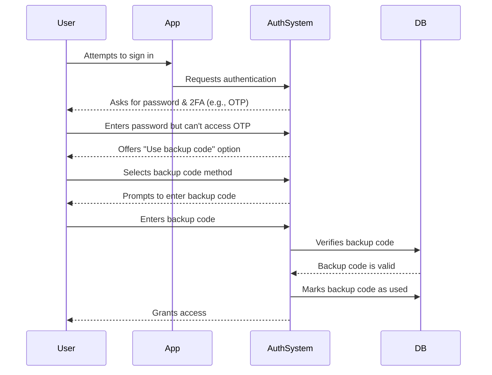

## What is a backup code?

A backup code (also called a recovery code) is a set of randomly generated, single-use codes that serve as a fallback authentication method when your primary MFA options—such as SMS, authenticator apps, or passkeys—aren’t available. Think of them as emergency keys that ensure you can always access your account, even if you lose your phone, experience network issues, or encounter technical failures.

## How does a backup code work?

Backup codes provide a straightforward yet secure way to regain access to your account when standard MFA methods fail. Here’s how they work:

1. **Generation**: The system creates a unique set of codes (typically 8–12 characters each) during MFA setup.
2. **Storage**: You’re prompted to save these codes securely—either offline (e.g., printed on paper) or in an encrypted password manager.
3. **Usage**: If you can’t use your primary MFA method, you enter one of your backup codes to authenticate.
4. **Invalidation**: Each code is automatically disabled after use to prevent reuse.

## When to use backup code?

Will backup codes become obsolete? Should MFA still support them?

Absolutely. Backup codes remain a critical safety net for MFA. While newer methods like passkeys and FIDO2 are gaining traction, backup codes offer a universally accessible, device-agnostic recovery option. They’re a low-cost, high-value safeguard and should always be supported alongside modern MFA methods.

Use a backup code when:

- Your primary MFA device is unavailable (e.g., lost phone, dead battery).
- Network issues prevent SMS/email delivery.
- Your authenticator app fails to sync.
- Your hardware token malfunctions.

## How to use backup code safely?

To ensure your backup codes remain secure:

1. **Store them offline**
    - Save them in an encrypted folder on your device.
    - Print them and store them in a secure location (e.g., a keypad safe).
    - Avoid storing them in unsecured digital formats (e.g., online note apps).
2. **Use a password manager**
    - Most password managers (e.g., 1Password, LastPass) offer a secure notes feature.
        - Create a new entry: "Backup Codes – [Service Name]"
        - Copy and paste your backup codes, then enable encryption.
    - If using Google Password Manager, you can:
        - Find the relevant service entry.
        - Edit it and add a note for your backup codes, and label codes as "Used/Unused**"** to keep track of them.
        - This way, when auto-filling passwords, you can quickly access your backup codes when needed.
3. **Replace used codes**
    - Regenerate new codes if you’ve used most of them or suspect they’ve been compromised.

## Designing an MFA experience with backup codes

For developers implementing backup codes, follow these best practices:

1. **Don’t rely solely on backup codes**
They’re an emergency fallback, not a primary MFA method. Always offer TOTP, passkeys, or other robust options.
2. **Provide 8–10 codes by default**
    
    This balances usability (enough for rare emergencies) and security (minimizes bulk theft risk).
    
3. **Enforce one-time usage**
    
    Automatically invalidate codes after use.
    
4. **Auto-regenerate codes when depleted**
    
    Prevent lockouts by issuing new codes once a user exhausts their current set.
    
5. **Allow manual regeneration with strict verification**
    
    Let users generate new codes if they lose theirs, but require re-authentication (e.g., email/SMS/password confirmation).
    

## Backup codes vs. Passwords: What's the difference?

| Feature | Backup codes | Passwords |
| --- | --- | --- |
| **Purpose** | One-time fallback when MFA fails | Primary authentication method |
| **Format** | System-generated, alphanumeric | User-chosen, often mix of characters |
| **Storage** | Hashed (often unsalted, since they’re single-use)	 | Hashed + salted (to prevent rainbow table attacks) |
| **Usage** | Disabled after one use | Reusable until changed |
| **Regeneration** | System issues new sets | User manually resets |
| **Security** | Must be stored securely | Vulnerable if weak or reused |

**Key security notes:**

- Both should be long and randomly generated to resist brute-force attacks.
- Passwords require salting because users often reuse them.
- Backup codes typically don’t need salting—they’re single-use and randomly generated, making large-scale exploits unlikely.

<Resources
  urls={[
    "https://docs.logto.io/end-user-flows/mfa",
    "https://auth-wiki.logto.io/mfa",
    "https://auth-wiki.logto.io/totp"
  ]}
/>
