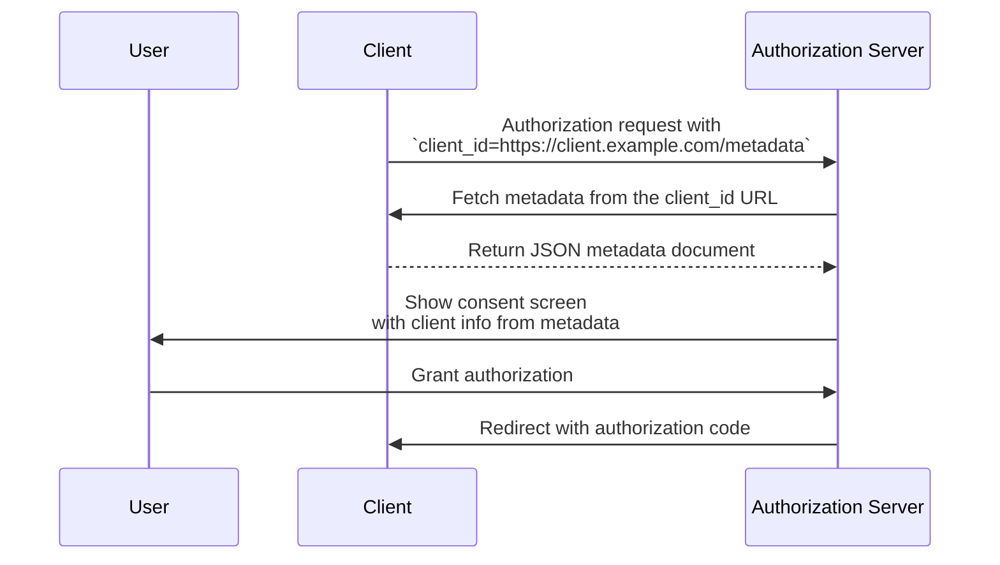

## What is a Client ID Metadata Document?

A Client ID Metadata Document is a mechanism defined in the [OAuth Client ID Metadata Document](https://datatracker.ietf.org/doc/draft-ietf-oauth-client-id-metadata-document/) specification that allows an OAuth 2.0 <Ref slug="client" /> to identify itself to an <Ref slug="authorization-server" /> without prior registration.

The core idea: instead of receiving a `client_id` from the authorization server (through manual registration or [Dynamic Client Registration](https://datatracker.ietf.org/doc/html/rfc7591)), the client **uses an HTTPS URL as its `client_id`**. That URL points to a JSON document containing the client's metadata — name, redirect URIs, supported grant types, and more. The authorization server fetches this document when it encounters the URL-based `client_id`.

This approach is sometimes abbreviated as **CIMD** (Client ID Metadata Document) in the community.

## How does it work?

When a client uses a Client ID Metadata Document, the OAuth flow adds one step: the authorization server resolves the `client_id` URL to retrieve the client's metadata.



Here's what happens step by step:

1. The client initiates an <Ref slug="authorization-request" /> with its URL as the `client_id` (e.g., `https://client.example.com/oauth-client`).
2. The authorization server recognizes the `client_id` as a URL and fetches it via HTTPS.
3. The response is a JSON document containing standard OAuth client metadata.
4. The authorization server validates the metadata, displays consent information to the user, and proceeds with the OAuth flow.
5. Subsequent requests can use cached metadata according to HTTP caching headers.

### The metadata document

The metadata document is a JSON object that uses the same fields defined in [RFC 7591 (OAuth 2.0 Dynamic Client Registration Protocol)](https://datatracker.ietf.org/doc/html/rfc7591). It must include a `client_id` field whose value matches the URL exactly.

Here's an example:

```json
{
  "client_id": "https://client.example.com/oauth-client",
  "client_name": "My Application",
  "redirect_uris": ["https://client.example.com/callback"],
  "grant_types": ["authorization_code", "refresh_token"],
  "response_types": ["code"],
  "token_endpoint_auth_method": "none",
  "scope": "openid profile email"
}
```

### Client identifier URL requirements

The specification places strict requirements on what constitutes a valid client identifier URL:

- **Must use HTTPS** — no plain HTTP or other schemes.
- **Must include a path component** — a bare domain like `https://example.com` is not valid.
- **Must not contain** fragment, username, or password components.
- **Must not contain** single-dot (`.`) or double-dot (`..`) path segments.
- Query strings are allowed but discouraged.
- Port numbers are allowed.

For example:
- `https://client.example.com/oauth-client` — valid
- `http://client.example.com/oauth-client` — invalid (not HTTPS)
- `https://example.com` — invalid (no path)
- `https://client.example.com/../oauth-client` — invalid (dot segment)

## Why not use existing registration methods?

To understand why this specification exists, consider the limitations of existing approaches:

### Static registration

In traditional OAuth deployments, a developer manually registers the client with the authorization server — typically through an admin console — and receives a `client_id`. This works when you know your clients in advance.

It doesn't work for open ecosystems where any client might need to connect. You can't pre-register every possible AI agent or MCP client.

### Dynamic Client Registration (DCR)

[Dynamic Client Registration (RFC 7591)](https://datatracker.ietf.org/doc/html/rfc7591) lets clients register programmatically by sending their metadata to a registration endpoint. The server creates a `client_id` and stores the registration.

This works, but creates server-side state: every registration produces a record that needs to be stored, maintained, and eventually cleaned up. In an open ecosystem with many clients, the authorization server accumulates registrations — most of which may be used once and abandoned.

DCR also has no built-in mechanism to verify that a client is who it claims to be. Any client can register with any name or logo.

### Client ID Metadata Document advantages

The Client ID Metadata Document approach addresses these issues:

| Aspect | Static registration | DCR | Client ID Metadata Document |
|--------|-------------------|-----|----------------------------|
| Server-side state | Yes (stored records) | Yes (stored records) | No (fetched on demand) |
| Pre-registration required | Yes | No | No |
| Identity verification | Manual review | None built-in | Domain ownership via HTTPS |
| Cleanup needed | Yes | Yes (abandoned records) | No (self-cleaning via HTTP cache) |
| Client controls metadata | No | At registration time | Yes (update anytime) |

The key insight is that **domain ownership becomes the trust anchor**. Only the entity that controls `client.example.com` can host content at `https://client.example.com/oauth-client`. The HTTPS certificate proves this without any additional verification step.

## Authentication constraints

Because there is no pre-shared secret between the client and the authorization server, symmetric secret-based authentication methods cannot be used. The metadata document **must not** include:

- `client_secret_post`
- `client_secret_basic`
- `client_secret_jwt`
- Any method that relies on a shared symmetric secret

The `client_secret` and `client_secret_expires_at` fields must also not appear in the document.

If the client needs to authenticate itself beyond being a public client, it can use asymmetric cryptography. The client publishes its public keys in the metadata document (via a `jwks` property or a `jwks_uri` reference) and authenticates at the token endpoint using `private_key_jwt`. The authorization server verifies the JWT signature against the published <Ref slug="jwk">JWK</Ref>.

## How does the authorization server discover support?

Authorization servers indicate support for Client ID Metadata Documents by including the following property in their <Ref slug="authorization-server-metadata" />:

```json
{
  "client_id_metadata_document_supported": true
}
```

Clients can check this flag before initiating an authorization flow with a URL-based `client_id`. If the authorization server doesn't advertise support, the client should fall back to other registration methods.

## Security considerations

### SSRF protection

When the authorization server fetches the metadata URL, it's making an HTTP request to a client-provided URL. This is a potential Server-Side Request Forgery (SSRF) vector. Implementations should:

- Block requests to private and loopback IP addresses (e.g., `127.0.0.1`, `10.x.x.x`, `192.168.x.x`)
- Re-validate target addresses after following redirects
- Enforce response size limits (the specification recommends a maximum of 5 KB)
- Set appropriate timeouts

### Caching

Authorization servers should respect HTTP cache headers (`Cache-Control`, `ETag`) when caching metadata. However:

- **Don't cache error responses** — a temporary failure shouldn't permanently block a client.
- Servers may enforce minimum and maximum cache durations regardless of what the client's server specifies.

### Phishing prevention

A malicious client could set `client_name` to a trusted brand name and `logo_uri` to its logo. Authorization servers should mitigate this by:

- Always displaying the `client_id` hostname alongside the client name on consent screens
- Prefetching and moderating logo images rather than loading them directly from the client

### Redirect URI attestation

One security advantage over DCR: the <Ref slug="redirect-uri">redirect URIs</Ref> in the metadata document are hosted at the client's domain, served over HTTPS. This creates a stronger binding between the client identity and its redirect URIs than self-asserted values in a registration request.

## Client ID Metadata Document Services

The specification also defines **Client ID Metadata Document Services** — third-party web services that host metadata documents on behalf of developers.

This addresses a practical gap: during local development, developers don't have a publicly accessible URL to host their metadata. A Client ID Metadata Document Service provides a stable public URL that authorization servers can fetch, while the developer works locally. This avoids the need to expose local machines to the internet or set up tunnels for testing OAuth flows.

<SeeAlso slugs={["client", "authorization-server-metadata", "redirect-uri", "jwk"]} />

<Resources
  urls={[
    "https://datatracker.ietf.org/doc/draft-ietf-oauth-client-id-metadata-document/",
    "https://datatracker.ietf.org/doc/html/rfc7591",
    "https://datatracker.ietf.org/doc/html/rfc8414",
  ]}
/>
