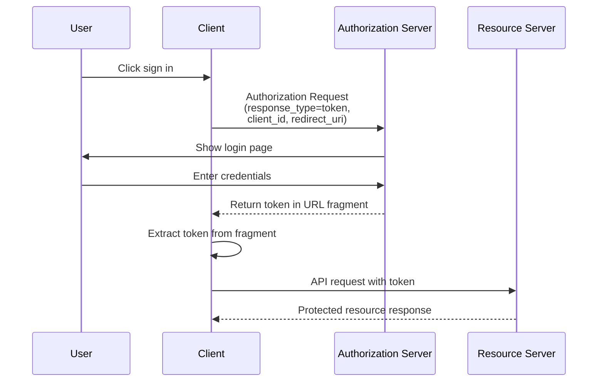

## What is implicit flow?

The OAuth 2.0 implicit flow is an authentication method that allows client-only applications (like SPAs and native apps) to receive tokens directly through URL fragments from the authorization server without providing a client secret.

Implicit flow is designed for client-only applications, because they run completely in the browser or on the user's device and cannot safely store client secrets.

Implicit flow has been officially deprecated in <Ref slug="oauth-2.1" /> for the security reasons (will be mentioned below). Client-only applications should now use the <Ref slug="authorization-code-flow" /> with the <Ref slug="pkce" /> extension instead.

## How does implicit flow work?

The main steps of the implicit flow are as follows:

Notice:

- The client only needs to provide a `client_id` in the authorization request, without requiring a `client_secret`.  
  This is because these clients cannot securely store secrets, so this flow does not require a client secret.

- The `response_type` parameter is set to `token`, instructing the authorization server to return the access token directly instead of an authorization code.  
  In OIDC (<Ref slug="openid-connect" />), the `response_type` is either `id_token` or `id_token token`, and the auth service will return the corresponding tokens based on different response types.

- The token is returned directly in the URL fragment. This means the token is exposed in the URL and can be easily accessed by other applications or scripts.

## Is implicit flow secure?

No, the implicit flow in OAuth 2.0 is generally considered less secure than other flows like the authorization code flow.

It's not recommended for most use cases due to several vulnerabilities:

- **Token exposure in URL**
   - Access tokens appear directly in the browser's URL (after the # symbol)
   - These tokens can be:
     - Saved in browser history
     - Leaked through referrer headers
     - Captured by malicious JavaScript code on the same page

- **No client authentication**
   - The client application doesn't need to prove its identity
   - This means anyone who knows the `client_id` can pretend to be a legitimate client

- **No refresh tokens**
   - This flow doesn't support refresh tokens
   - Users must log in again when access tokens expire
   - To avoid frequent logins, users might store tokens in unsafe ways

- **Vulnerable to XSS attacks**
   - All tokens are handled in the browser
   - If the website suffers from an XSS attack (Cross-Site Scripting)
   - Attackers' JavaScript code can easily steal these tokens

Due to these security concerns, implicit flow has been deprecated in <Ref slug="oauth-2.1" />. Client-only applications should now use the <Ref slug="authorization-code-flow" /> with the <Ref slug="pkce" /> extension instead.

You can check out [What is PKCE: from basic concepts to deep understanding](https://blog.logto.io/how-pkce-protects-the-authorization-code-flow-for-native-apps) to learn how PKCE protects the authorization code flow for client-only applications.

<SeeAlso
  slugs={["oauth-2.1", "authorization-code-flow", "pkce", "openid-connect"]}
/>

<Resources
  urls={[
    "https://blog.logto.io/implicit-flow-is-dead",
    {
      url: "https://tools.ietf.org/html/rfc6749#section-4.2",
      result: {
        ogTitle: "The OAuth 2.0 Authorization Framework: Implicit Grant",
        ogDescription:
          "The implicit grant type is used to obtain access tokens (it does not support the issuance of refresh tokens) and is optimized for public clients known to operate a particular redirection URI. These clients are typically implemented in a browser using a scripting language such as JavaScript.",
      },
    },
    "https://openid.net/specs/openid-connect-core-1_0.html",
    "https://blog.logto.io/how-pkce-protects-the-authorization-code-flow-for-native-apps",
  ]}
/>
