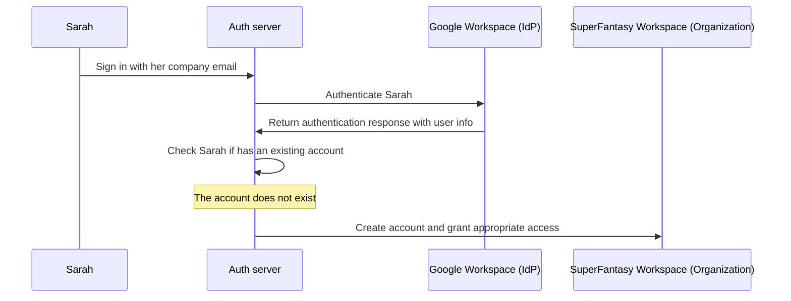
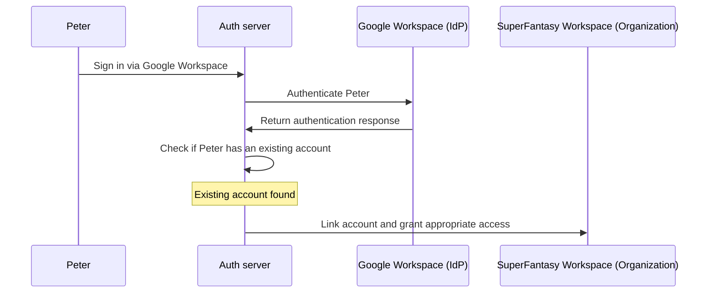

## What is just-in-time provisioning?

**Just-in-time (JIT) provisioning** is a process used in identity and access management systems to create user accounts on the fly as they sign in to a system for the first time. Instead of pre-provisioning accounts for users in advance, JIT provisioning creates and configures the necessary user accounts dynamically when a user authenticates. Just-in-time provisioning is a popular feature with its own characteristics, such as efficiency, no administrative involvement, and automated organization membership, etc. 

## What are the use cases for just-in-time provisioning?

These cases are common when building a B2B app that involves multi-tenant architecture, Enterprise SSO, working with enterprises, or requiring team onboarding features. Here are some sample scenarios your client may encounter.

### Rapid onboarding

You have a client experiencing frequent hiring or rapid growth can use JIT provisioning to quickly set up user accounts for new employees. Here is an example:

Sarah is a new employee at SuperFantasy, which uses Google Workspace as its <Ref slug="identity-provider" />. The HR team adds her to Google Workspace once. When Sarah first signs in to SmartWorkspace with her email, the system automatically creates her account and assigns the appropriate role, eliminating extra steps for the HR team.

### Mergers, acquisitions, and temporary workers

You have a client experiencing merging or acquiring others, JIT provisioning can simplify the process of granting access to the acquiring company’s systems for many new users. Let’s take another example,

Peter works for MagicTech, which was recently acquired by SuperFantasy. Although MagicTech doesn’t have Enterprise SSO, it uses SmartWorkspace, where Peter has a business account with his corporate email.

The HR team adds Peter to Google Workspace with the same email. When he signs into SmartWorkspace via Google Workspace, his account links automatically, giving him the correct access for SuperFantasy.

The scenarios above are ideal for implementing the JIT feature.

## Is it specific to SAML and Enterprise SSO?

Just-in-time (JIT) provisioning is often associated with <Ref slug="enterprise-sso" /> in SAML authentication, but it is not exclusive to <Ref slug="saml" />. JIT provisioning can also be used with other authentication protocols like <Ref slug="oauth-2.0" /> and <Ref slug="openid-connect" />, and it doesn’t always require an <Ref slug="enterprise-sso" /> set-up.

For instance, email-based JIT provisioning can streamline team onboarding by automatically adding users to a workspace based on their email domain. This is particularly useful for organizations that lack the budget and resources to purchase and manage Enterprise SSO.

The fundamental idea behind JIT provisioning is to automate user account creation or updates when a user first attempts to access a service, regardless of the specific protocol used.

## Does it apply to new or existing users of the app?

Just-in-time (JIT) provisioning generally refers to the first attempt to access an app. However, different products perceive this functionality differently. Some use JIT provisioning just for identity and account creation, while others also include just-in-time account updates, such as re-provisioning and attribute synchronization.

In addition to automatic user creation, SAML JIT Provisioning allows granting and revoking group memberships as part of provisioning. It can also update provisioned users to keep their attributes in the <Ref slug="service-provider" /> store in sync with the <Ref slug="identity-provider" /> user store attributes.

If you do want to consider the subsequent existing user sign-in scenario, make sure you have a robust provisioning system along with your JIT system. For example,

- **Conflict resolution**: Your system should have a strategy for handling conflicts if an account already exists with different information than what’s provided by the IdP during the JIT process. This may require detailed control of your organization’s policies and IdP configuration.
- **Audit trails**: It's important to maintain logs of both new account creations and updates to existing accounts through JIT processes for security and compliance reasons.
- **Performance**: While JIT provisioning happens quickly, consider the potential impact on sign-in times, especially for existing users if you're updating their information at each sign-in.
- **Data consistency**: Ensure that your JIT provisioning process maintains data consistency, especially when updating existing user accounts.

## What is the difference between JIT and SCIM (System for Cross-domain Identity Management)?

SCIM is an open standard protocol designed to simplify and automate user identity management across different systems and domains. It is commonly used in Directory Sync scenarios.

The main difference between JIT and SCIM is that JIT creates accounts during the user’s sign-in attempt, while SCIM can provision users through an offline automated process, independent of user login attempts.

This means JIT focuses on new user onboarding, while SCIM focuses on the full lifecycle management of users.

Furthermore, JIT is often an extension of SAML and lacks a standardized implementation across systems, whereas SCIM is a well-defined, standardized protocol [RFC 7644](https://datatracker.ietf.org/doc/html/rfc7644) for identity management.

Some larger organizations use SCIM for account provisioning, integrating it with their own systems. This can be very complex and vary case by case. These organizations often have a provisioning system that involves both automated processes and manual admin involvement.

<Resources urls={['https://blog.logto.io/jit-provisioning']} />
