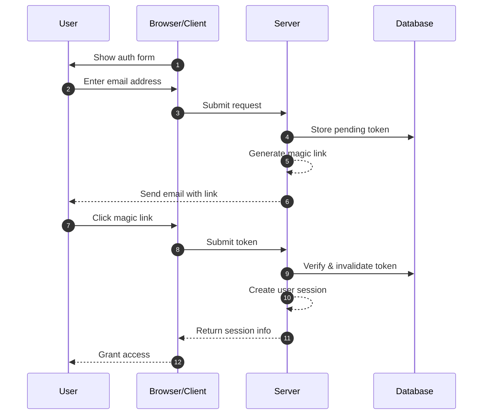
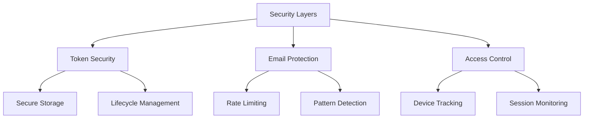

## What are magic links?

A magic link is a secure, time-limited URL that enables passwordless authentication for both registration and login processes. Instead of creating and remembering passwords, users receive a special link via email that grants them immediate access. Think of it like a digital key that works only once - when you click it, you're authenticated, and then that key becomes invalid.

For example, when you sign up for Medium or try to log into Slack, rather than setting up or entering a password, these platforms send you an email with a secure link. One click, and you're authenticated. This approach has gained significant popularity because it combines security with simplicity.

## How do magic links work?

The process is straightforward from a user's perspective, but involves sophisticated security mechanisms behind the scenes. Here's what happens during a typical magic link authentication flow:



## What is the structure of a magic link?

A typical magic link consists of several components:

- Base URL of the application
- Authentication endpoint
- Token parameter
- Additional parameters (optional)

For example:

```
https://app.example.com/verify-auth?token=abc123...&redirect=/dashboard
```

## How is the token of a magic link generated?

When a user requests a magic link (e.g., clicking "Sign in with Email"), we need to generate a secure, unpredictable token. This token is crucial as it essentially becomes a temporary password.

The token must be generated using a <Ref slug='csprng' />. A CSPRNG uses entropy from your system's hardware (like keyboard timing, mouse movements, fan noise, etc.) to generate truly random numbers that are impossible to predict, even if an attacker knows previous outputs.

For example, in Node.js:

```javascript
import crypto from "node:crypto";

// Generate a secure random token
const token = crypto.randomBytes(32).toString("base64url");
// Result: something like 'dBjftJeZ4CVP-mB92K27uhbUJU1p1r_wW1gFWFOEjXk'

// Alternative using Web Crypto API (available in Node.js and browsers)
const buffer = crypto.getRandomValues(new Uint8Array(32));
const token2 = Buffer.from(buffer).toString("base64url");
```

Requirements for a secure token:

- Generated via CSPRNG to ensure unpredictability
- At least 32 bytes long (256 bits of entropy)
- URL-safe encoded (base64url eliminates problematic characters)
- Time-limited and single-use to prevent replay attacks
- Stored securely with metadata (expiration, user info)

## How to secure magic link authentication

Magic link security requires a comprehensive approach across multiple layers. While email delivery and access patterns are critical, secure token handling remains the cornerstone of the system's security.

### Token security fundamentals

The security of magic links heavily depends on proper token implementation (see the content above). Each token must be cryptographically secure and properly managed throughout its lifecycle. The system should enforce strict token expiration (typically 15-30 minutes) and immediate invalidation after use.

When storing tokens, treat them with the same level of security as passwords:

- Hash tokens before storage to prevent exposure
- Implement automatic cleanup of expired tokens
- Maintain an audit trail of token usage and invalidation
- Store associated metadata (creation time, intended user, device info)

### Email delivery security

Email serves as the primary delivery channel for magic links, making it a potential target for attacks. Implementing rate limiting is essential to prevent brute force attempts and protect against email bombing attacks. For example, you might limit users to 5 magic link requests per hour from the same IP address.

Additionally, monitoring unusual activity patterns helps detect potential security breaches. This includes:

- Multiple requests from different IPs for the same email
- Unusual geographic access patterns
- Rapid-fire requests that indicate automated attacks

### Access control and monitoring

Device fingerprinting adds an extra layer of security by tracking consistent patterns of user behavior. When a login attempt comes from a new device or location, you can implement additional verification steps or alert the user.

For enhanced security in sensitive applications:

- Combine magic links with additional authentication factors
- Implement continuous session monitoring
- Log all authentication events for audit trails
- Add device-based verification for new locations



## Magic links vs SMS / Email OTP

Both Magic Links and SMS / Email OTP rely on external channels for verification.

Magic Links send a one-time URL to the user's email, while OTP sends a verification code to their phone or email.

Magic Links provide a superior desktop experience as users simply click the link to complete verification, eliminating the need to manually enter codes. They can also carry additional context information, enabling more sophisticated authentication flows.

However, in mobile scenarios, SMS OTP might offer better usability as users can quickly view and input verification codes.

## Magic links vs authenticator apps

Compared to OTP codes generated by Authenticator Apps, Magic Links don't require users to install additional applications and work seamlessly across all devices. This reduces friction, particularly for non-technical users. However, Authenticator Apps generate OTP codes with better real-time reliability, independent of email server delivery speeds and availability.

For scenarios requiring frequent authentication with high security requirements, Authenticator Apps might be the preferred choice.

## When to use magic links

Magic links are particularly effective for business and enterprise applications where users typically log in less frequently, such as project management tools or reporting dashboards. In these scenarios, the slight delay in email delivery is negligible compared to the convenience of not managing passwords.

### Ideal scenarios

These authentication methods shine in business contexts where email is already the primary communication channel. For example, collaboration platforms like Slack or Notion leverage magic links effectively because:

- Users are already actively monitoring their email
- Login sessions tend to be long-lived
- The focus is on reducing friction in the authentication process

Magic links are also excellent for user registration flows in SaaS products where conversion optimization is crucial. When users can start using your service with just an email address, it significantly reduces drop-off rates during the onboarding process.

### When to consider alternatives

However, magic links may not be the best choice for applications requiring frequent authentication. Mobile banking apps, for instance, need quick and reliable authentication methods since users might check their balance multiple times per day. In such cases, biometric authentication or PIN codes often provide a better user experience.

Consider alternative authentication methods when:

- Your application is primarily mobile-based
- Users need immediate access without email dependency
- The environment requires multi-factor authentication
- Email delivery delays could significantly impact user experience

The key is to align your authentication method with your users' behavior patterns and security requirements. While magic links offer excellent security with minimal friction, they should be part of a broader authentication strategy rather than the sole solution.

<SeeAlso slugs={["csprng", "passwordless", "otp", "totp"]} />
