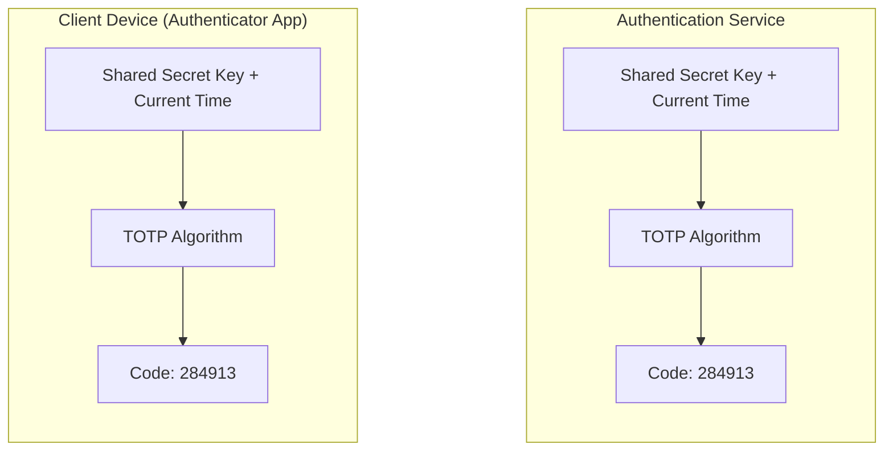
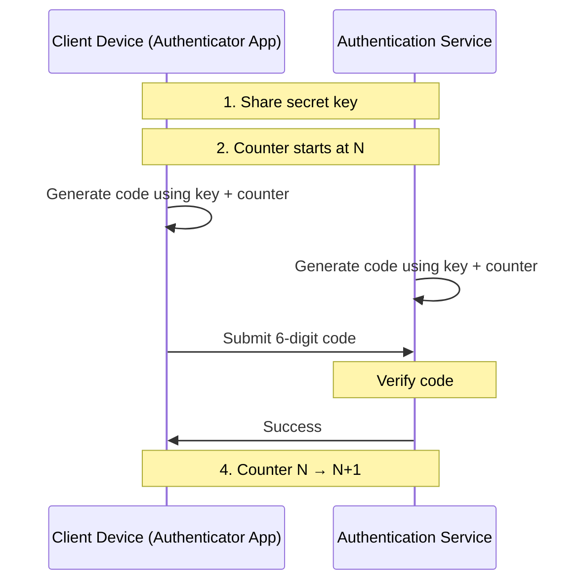

## What is OTP?

A One-time password (OTP) is a unique, automatically generated temporary password that can only be used once, and it is commonly used for a single transaction or sign-in session.

Unlike traditional passwords, which are static and remain the same until changed by the user, OTPs are dynamic and expire quickly after their issuance, usually within a few minutes. This dynamic nature makes OTPs significantly more secure because they greatly reduce the risk of unauthorized access even if the OTP is intercepted by malicious parties.

OTPs are typically generated using algorithms based on time synchronization or mathematical computations, ensuring that each code is unique and unpredictable. Users often receive OTPs via SMS, email, mobile apps, or hardware tokens.

## Types of OTP

OTPs can be delivered and generated in several ways, each suited for different security needs and use cases.

Here are some of the most common types of OTPs:

### SMS OTP

SMS OTP is one of the most common forms of OTPs. When you register a new account, sign in, or perform sensitive operations, the system may send a random one-time password to your mobile phone. Once received, you need to enter this code within a limited time window (typically 5-15 minutes) before it expires.

An example of an SMS OTP message is like this:

"Your verification code is: 847295. Valid for 10 minutes. Don't share this code with anyone."

### Email OTP

Similar to SMS OTP, email-based OTPs involve sending randomly generated codes via email. These are often used for account verification and password reset processes, with slightly longer validity periods to accommodate email delivery times and user interaction.

### Time-based One-time Password (TOTP)

TOTP is one of the most widely used OTP algorithms. It generates passwords based on the current time and a shared secret key.

The generated code typically remains valid for a short period (usually 30 seconds) before a new code is created.

TOTP is widely implemented in popular authentication services and platforms, such as GitHub's two-factor authentication, Google Authenticator and Microsoft Authenticator.

Learn more about <Ref slug="totp" />.

### HMAC-based One-time Password (HOTP)

HOTP generates passwords based on a counter value and a shared secret key.

Unlike time-based TOTP, HOTP-generated passwords don't automatically expire but become invalid after use. The server and client need to maintain synchronized counters that increment after each password use.

HOTP is primarily used in hardware security tokens and devices like YubiKey. While it has the advantage of not depending on device time, it requires maintaining counter synchronization between both parties. In contrast, TOTP uses time to generate passwords that automatically refresh every 30 seconds and is widely used in mobile authenticator apps.

## Why use OTP?

### Enhanced Security
OTPs provide superior protection compared to traditional passwords because they are valid for only a single use and expire quickly. Even if an OTP is intercepted by malicious actors, it becomes completely useless after its first use or expiration. This dynamic nature significantly reduces the risk of credential theft and replay attacks.

### User-Friendly Authentication
The OTP system eliminates the need for users to remember complex passwords while maintaining high security standards. The verification process is straightforward and intuitive, requiring only a simple code input. Modern OTP systems seamlessly integrate with devices that users already own, such as smartphones and email accounts.

### Reduced Fraud Risk
OTP implementation enables real-time verification of user identity during critical operations. This additional security layer is particularly valuable for financial transactions and sensitive data access. Organizations can better comply with security regulations and standards by incorporating OTP authentication into their security infrastructure.

## What are the common use cases of OTP?

Here are some of the primary uses of OTPs:

### Passwordless sign-in

Many websites and applications now offer passwordless sign-in options to enhance security and user convenience. Users can request an OTP sent to their registered mobile number or email to authenticate their identity, without the need to remember complex passwords. This approach not only simplifies the sign-in process but also reduces the risk of password-related breaches.

### Password recovery

In instances where users forget their passwords, OTPs serve as a secure method for account recovery. Users can request an OTP, which is sent to their registered email or phone number, to verify their identity before resetting their password. This process helps ensure that only the legitimate account owner can perform the recovery.

### Multi-factor authentication (MFA)

OTPs are a vital component of Multi-Factor Authentication (MFA), which combines something the user knows (like a password) with something the user has (like a mobile device). After entering their primary password, users receive an OTP that they must enter to gain access. This added layer of security significantly reduces the likelihood of unauthorized access, even if the primary password is compromised.

### Sensitive transaction confirmation

For activities that involve sensitive data or significant transactions, such as online banking or making high-value purchases, OTPs serve as a security measure to confirm user consent. Before completing these actions, an OTP is sent to the user's registered contact method, which must be entered to finalize the transaction. This ensures that even if someone gains access to the user’s account, they cannot perform critical actions without the OTP.

## How to use OTP safely

One-time passwords add an extra layer of security, but they need to be used correctly to be effective.

- Never share your OTP with anyone, including customer service
- Use OTPs immediately and only once
- Keep your OTP receiving devices secure with lock screens
- Be cautious of suspicious SMS or emails requesting OTP
- Use trusted authenticator apps and keep them updated
- Always verify your identity (e.g., fingerprint, PIN) when accessing authenticator apps

## How should I implement a secure OTP system?

When building an OTP system, here's what you need to consider:

### Code Format

Most authenticator apps (Google Auth, Microsoft Auth) use 6-digit codes because they're easy to read and type. While you might be tempted to make codes longer or add letters for extra security, remember that users often need to switch between apps to copy codes - keeping it simple reduces input errors significantly.

### Timing Windows

Different OTP types need different expiration strategies:
- For TOTP, stick with the standard 30-second window - it's what users expect from authenticator apps
- With SMS/email OTPs, consider network delays and user behavior - 5-15 minutes usually works well. Any longer creates security risks, any shorter frustrates users who might need to request new codes

### Rate Limiting

Real-world attacks often involve rapid-fire attempts. Implement progressive delays:
- Start with a 3-attempt limit before adding delays
- Add exponential backoff (e.g., 5s, 30s, 2min) between retries
- After 10 failed attempts, consider requiring account recovery

### Secure Storage

OTP compromises often happen at the storage level. Protect against this by:
- Using proper hashing (bcrypt/argon2) - plain text or simple hashes are too risky
- Implementing time-constant comparisons to prevent timing attacks
- Setting up automated cleanup jobs to purge expired tokens (they're useless after expiration anyway)

### Delivery Method

Each delivery method has its tradeoffs:
- TOTP is most secure but requires users to install an authenticator app
- SMS is convenient but vulnerable to SIM-swapping - major banks still use it because users trust it
- Email is unreliable for time-sensitive auth - use it as a last resort or for less critical operations

## References

- [RFC 4226: HOTP Algorithm](https://datatracker.ietf.org/doc/html/rfc4226) - IETF specification for HMAC-Based One-Time Password Algorithm
- [RFC 6238: TOTP Algorithm](https://datatracker.ietf.org/doc/html/rfc6238) - IETF specification for Time-Based One-Time Password Algorithm
- [NIST Special Publication 800-63B](https://pages.nist.gov/800-63-3/sp800-63b.html) - Digital Identity Guidelines: Authentication and Lifecycle Management
- [OWASP Authentication Cheat Sheet](https://cheatsheetseries.owasp.org/cheatsheets/Authentication_Cheat_Sheet.html#one-time-passwords) - Best practices for OTP implementation
- [Google 2-Step Verification](https://www.google.com/landing/2step/) - Reference implementation of TOTP in production

<SeeAlso slugs={['mfa']} />
