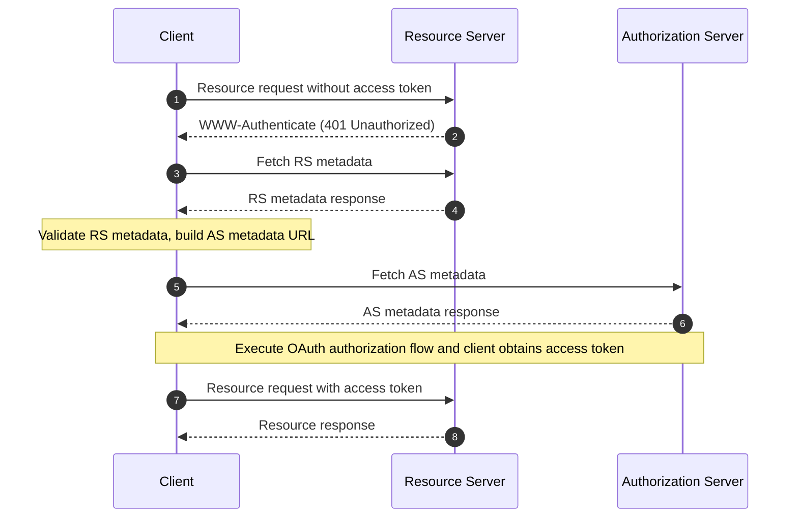

## What is OAuth 2.0 Protected Resource Metadata?

OAuth 2.0 Protected Resource Metadata is a standardized format defined in [RFC 9728](https://datatracker.ietf.org/doc/html/rfc9728). It helps clients and authorization servers understand how to interact with protected resources.

This metadata format provides essential information about:
- Resource server capabilities
- Supported token formats
- Required security mechanisms
- Authorization server relationships
- Available scopes and permissions

## What are the benefits of Protected Resource Metadata?

In the OAuth 2.0 system, there are four basic roles:
- <Ref slug="authorization-server"/>: Issues access tokens to clients after successfully authenticating the resource owner
- <Ref slug="client"/>: Application requesting access to protected resources
- <Ref slug="resource-owner"/>: Entity capable of granting access to protected resources
- <Ref slug="resource-server"/>: Server hosting protected resources

Traditionally, when a client needs to access protected resources, it must first discover and interact with the authorization server to obtain the necessary tokens. The Resource Server's role was primarily limited to validating tokens and serving resources, with all authentication and authorization details being coordinated through the authorization server and the client application.

This meant that clients had no standardized way to discover a Resource Server's specific requirements or capabilities directly.

Protected Resource Metadata transforms this dynamic by enabling Resource Servers to actively publish their requirements and capabilities and it brings several key benefits:
- Direct Discovery: Clients can now learn about a Resource Server's requirements directly from the source
- Enhanced Autonomy: Resource Servers can explicitly specify their supported token formats, security mechanisms, and trusted authorization servers
- Improved Interoperability: A standardized format ensures consistent communication of access requirements across different implementations
- Dynamic Configuration: Resource Servers can update their requirements without relying on authorization server changes

## How does OAuth 2.0 Protected Resource Metadata work?

Protected Resource Metadata operates within the OAuth 2.0 ecosystem through a standardized discovery and interaction process:



The resource server metadata document is a JSON object that contains the following fields:

```json
   {
     "resource": "https://api.example.com",
     "authorization_servers": [
       "https://auth.example.com"
     ],
     "scopes_supported": ["read", "write"],
     "token_formats_supported": ["jwt"],
     "token_introspection_endpoint": "https://api.example.com/introspect",
     "dpop_signing_alg_values_supported": ["ES256", "PS256"]
   }
   ```

And once the client has received the metadata document, it can use it to configure itself and interact with the resource server mainly according to the following fields:

- `resource`: Identifier for the protected resource
- `authorization_servers`: List of authorized authorization servers
- `scopes_supported`: Available scopes for this resource
- `token_formats_supported`: Supported token formats
- `token_introspection_endpoint`: Endpoint for token validation
- `dpop_signing_alg_values_supported`: Supported DPoP algorithms

## How to discover OAuth 2.0 Protected Resource Metadata endpoints?

There are two primary discovery mechanisms for Protected Resource Metadata:

1. **WWW-Authenticate Header Discovery (Flow-based)**:

When a client makes an unauthorized request to a protected resource, the server responds with a 401 status code and includes the metadata URL in the WWW-Authenticate header:

```bash
# 1. Client makes request without token
GET /api/resource HTTP/1.1
Host: api.example.com

# 2. Server responds with 401 and metadata URL
HTTP/1.1 401 Unauthorized
WWW-Authenticate: Bearer realm="example",
  scope="read write",
  resource_metadata_url="https://api.example.com/.well-known/oauth-resource-server"
```

The header provides:
- Resource realm identification
- Required scopes
- Metadata URL location

2. **Direct Well-Known URI Discovery**:

You can directly access the metadata by making a GET request to the well-known endpoint:

```bash
GET /.well-known/oauth-resource-server HTTP/1.1
Host: api.example.com
```

The endpoint follows a standardized format:
- Base URI: `https://api.example.com`
- Well-known path: `/.well-known/oauth-resource-server`
- Full URL: `https://api.example.com/.well-known/oauth-resource-server`

## How does WWW-Authenticate header work in Protected Resource Metadata?

The WWW-Authenticate header is a key component in Protected Resource Metadata for implementing automatic discovery mechanism. It leverages the standard HTTP `WWW-Authenticate` header to transmit metadata information, enabling clients to automatically discover and configure access requirements for resource servers.

When a client first attempts to access a protected resource without providing an access token, the resource server responds with a 401 Unauthorized status code and includes a WWW-Authenticate header:

```
WWW-Authenticate: Bearer realm="example",
  scope="read write",
  resource_metadata_url="https://api.example.com/.well-known/oauth-resource-server"
```

This header may contain several key pieces of information:
- `Bearer`: Indicates this is an OAuth 2.0 Bearer Token authentication scheme
- `realm`: Defines the protection space of the resource
- `scope`: Specifies the required access permissions
- `resource_metadata_url`: Points to the location of the metadata document containing complete resource server configuration

Upon receiving this header, the client extracts the `resource_metadata_url` and retrieves the complete metadata document from that URL.

Based on the metadata information obtained, the client can determine appropriate authorization servers, supported token formats, available scopes, and other configuration details to properly configure authentication requests.

## How to secure OAuth 2.0 Protected Resource Metadata?

Essential security considerations include:

1. **Transport Security**:
   - Mandatory TLS usage
   - Certificate validation
   - Secure connection handling

2. **Metadata Integrity**:
   - Source validation
   - Signature verification
   - Secure caching strategies

3. **Access Control**:
   - Rate limiting
   - Request validation
   - Abuse monitoring

## How to implement OAuth 2.0 Protected Resource Metadata?

Here's how OAuth 2.0 Protected Resource Metadata is implemented across different components:

1. **Resource Server Implementation**

The resource server responds with a 401 Unauthorized status and includes the metadata URL in the WWW-Authenticate header when receiving an unauthorized access attempt:

```
HTTP/1.1 401 Unauthorized
WWW-Authenticate: Bearer realm="example",
  resource_metadata_url="https://api.example.com/.well-known/oauth-resource-server"
```

2. **Client Implementation**

The client implements an async function to handle resource access. When receiving a 401 response, this function extracts the metadata URL from the WWW-Authenticate header, fetches the metadata, and uses it for client configuration:

```javascript
async function handleResourceAccess(response) {
  if (response.status === 401) {
    const wwwAuthenticate = response.headers.get('WWW-Authenticate');
    const metadataUrl = extractMetadataUrl(wwwAuthenticate);
    const metadata = await fetchMetadata(metadataUrl);
    // Client configuration based on metadata
  }
}
```

3. **Metadata Document Structure**

The resource server provides a metadata document as a JSON object containing:
- Resource identifier
- List of authorized authorization servers
- Supported scopes
- Supported token formats
- Supported DPoP signing algorithms

Here's an example of the metadata document:

```json
{
  "resource": "https://api.example.com",
  "authorization_servers": ["https://auth.example.com"],
  "scopes_supported": ["read", "write"],
  "token_formats_supported": ["jwt"],
  "dpop_signing_alg_values_supported": ["ES256"]
}
```

These components work together to form a complete OAuth 2.0 Protected Resource Metadata implementation. Through this implementation, clients can automatically discover and configure the necessary parameters for accessing protected resources.

<SeeAlso slugs={["resource-server", "authorization-server"]} />

<Resources urls={[
  "https://datatracker.ietf.org/doc/html/rfc9728",
]} />
