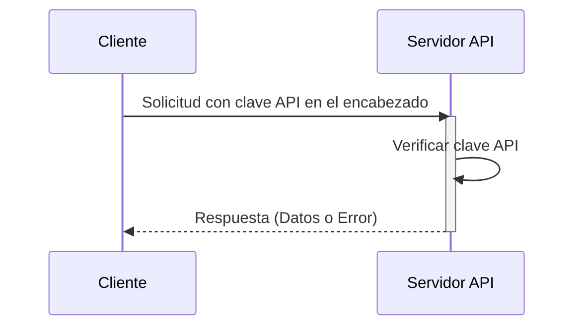

## ¿Qué es una clave API?

Una clave API es un token secreto utilizado para autenticar clientes que acceden a una API. Es como una contraseña para tu aplicación, permite el acceso a una API específica. Piénsalo como una tarjeta de acceso para entrar a un edificio. La tarjeta de acceso otorga acceso, pero no necesariamente identifica quién eres.

## ¿Cómo funcionan las claves API?

Las claves API funcionan a través de un proceso simple de solicitud y respuesta.

1. **Solicitud:** Tu aplicación envía una solicitud a la API, incluyendo la clave API. La clave a menudo se envía en el encabezado de la solicitud. Por ejemplo, el encabezado podría verse así: `x-api-key: your_actual_api_key`. No hay un estándar único para los nombres de encabezado o formatos de valor.

2. **Verificación:** El servidor de la API verifica la clave proporcionada contra su base de datos.

3. **Respuesta:** Si la clave es válida, el servidor otorga acceso y envía de vuelta los datos solicitados. Si no, se niega el acceso.

Aquí hay un diagrama de secuencia que ilustra el proceso:

## ¿Cuáles son las ventajas y desventajas de las claves API?

Veamos qué hace que las claves API sean útiles y dónde fallan:

### Ventajas

- **Súper simples de usar**: Solo agrega una clave a tu solicitud y listo. Es como usar una llave de casa: no se necesitan pasos complicados.

- **Fáciles de rastrear**: ¿Quieres saber quién está usando tu API? Las claves API lo hacen simple. Puedes ver qué aplicaciones están haciendo llamadas y con qué frecuencia lo hacen.

- **Limitación de tasa rápida**: Evita que las personas abusen de tu API estableciendo límites por clave. Es como tener un portero en un club que cuenta cuántas veces alguien entra y sale.

- **Perfectas para datos públicos**: Si estás compartiendo información no sensible (como datos meteorológicos o estadísticas públicas), las claves API son perfectas.

### Desventajas

- **Menos seguras que las alternativas modernas**: Las claves API no son tan efectivas como otras formas de autenticación de API, como <Ref slug="oauth-2.0" /> y <Ref slug="jwt" />. Piénsalas como un candado básico en comparación con un sistema de seguridad moderno. Sin embargo, siguen siendo populares porque son la forma más simple de rastrear el uso de la API y comenzar con la seguridad de la API.

- **Riesgos de seguridad**: Las claves API son como dejar la llave de tu casa debajo del felpudo. Si alguien la encuentra, puede usarla para siempre. Aquí está el porqué:
  - A menudo son visibles en el código
  - No expiran automáticamente
  - Si se filtran (como en repositorios públicos de GitHub), cualquiera puede usarlas

- **No pueden diferenciar usuarios**: Aunque algunas empresas usan "claves API" que pueden identificar usuarios (como Stripe), las claves API tradicionales no pueden decirte quién es quién. Solo te dicen qué aplicación está haciendo la solicitud.

- **Estáticas por naturaleza**: A diferencia de los tokens de auth modernos que expiran, las claves API generalmente permanecen iguales para siempre. Esto significa:
  - No hay actualizaciones automáticas de seguridad
  - Se necesita trabajo manual para rotar claves
  - Mayor riesgo si las claves se exponen

## ¿Cuáles son los casos de uso para las claves API?

- Comunicación de servicio a servicio: Las claves API son adecuadas para escenarios donde las aplicaciones necesitan comunicarse con APIs directamente a través de CLIs. Por ejemplo, llamar a APIs de OpenAI.
- APIs públicas: Al exponer APIs al público, las claves API proporcionan un método sencillo de control de acceso.
- Configuración simplificada: Para necesidades de autenticación rápidas y simples, especialmente en la fase de desarrollo. A diferencia de la autenticación Machine-to-machine, las claves API no requieren registro previo del cliente, y tampoco necesitan intercambiarse por un access token. Simplemente pasas tu clave API como un parámetro en tu solicitud y simplemente funciona.

En escenarios del mundo real, el propósito más común al construir productos es la integración de productos. Aquí hay un caso de uso típico:

### Ejemplo: Integración con Stripe

Stripe utiliza claves API para una integración segura con diferentes plataformas y aplicaciones. Puedes crear, ver, eliminar y gestionar estas claves a través del Developers Dashboard. Al usar claves API, puedes integrar las funciones de pago y facturación de Stripe en tu producto.

## ¿Cuál es la diferencia entre Tokens de Acceso Personal (PAT) y Machine-to-Machine (M2M)?

Al hablar de claves API, los tokens de acceso personal y <Ref slug="machine-to-machine" /> también pueden mencionarse juntos ya que todos pueden acceder programáticamente a recursos de API a través de comandos CLI, o establecer comunicación entre servicios de backend.

### Tokens de Acceso Personal (PATs)

Un token de acceso personal también es una cadena pero representa la identidad y permisos de ***un usuario específico***, se genera dinámicamente tras una autenticación o inicio de sesión exitoso, y típicamente tiene una vida útil limitada pero puede ser renovado. Proporciona control de acceso detallado a datos y capacidades específicas del usuario y se utilizan comúnmente para herramientas CLI, scripts o acceso personal a API. La principal diferencia es que es más específico y se utiliza para acciones específicas del usuario.

### Machine-to-Machine (M2M)

La comunicación M2M es cuando los dispositivos intercambian datos automáticamente sin intervención humana en un sentido más amplio.

En el contexto de <Ref slug="openid-connect" /> (o <Ref slug="oauth-2.0" />), las aplicaciones M2M utilizan el <Ref slug="client-credentials-flow" />, como se define en el [protocolo OAuth 2.0 RFC 6749](https://datatracker.ietf.org/doc/html/rfc6749), que admite protocolos estándar similares. Generalmente involucra una aplicación cliente (una máquina o servicio) que accede a recursos ya sea por sí misma o en nombre de un usuario. Es ideal para situaciones donde solo los clientes de confianza pueden acceder a servicios de backend.

<SeeAlso slugs={["machine-to-machine"]} />