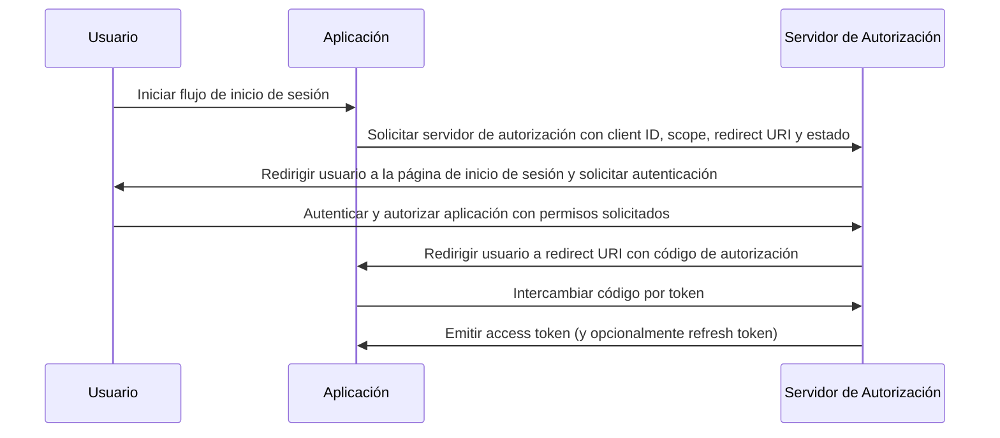

## ¿Qué es el flujo de código de autorización (authorization code flow)?

El flujo de código de autorización (authorization code flow) (también conocido como autorización de código de concesión), definido en [OAuth 2.0 RFC 6749, sección 4.1](https://datatracker.ietf.org/doc/html/rfc6749#section-4.1), es un mecanismo de autorización de OAuth 2.0 ampliamente utilizado que permite a las aplicaciones obtener un access token en nombre de un usuario.

Este flujo es ideal para aplicaciones confidenciales como aplicaciones web tradicionales del lado del servidor que pueden almacenar de manera segura los secretos del cliente.

También se puede usar de manera segura para aplicaciones nativas y aplicaciones de una sola página (SPAs) que no pueden almacenar de manera segura los secretos del cliente cuando se combinan con la extensión PKCE (<Ref slug="pkce" />).

## ¿Cómo funciona el flujo de código de autorización (authorization code flow)?

El flujo de código de autorización (authorization code flow) involucra los siguientes pasos:

1. **Inicio del flujo**: El usuario inicia el flujo generalmente haciendo clic en un enlace o botón en la aplicación para iniciar sesión. La aplicación redirige al usuario al endpoint de autorización del servidor de autorización, pasando el client ID, el scope solicitado, un redirect URI y un parámetro de estado. El servidor de autorización valida los parámetros y solicita al usuario que se autentique en la página de inicio de sesión del servidor de autorización.
2. **Autenticación y autorización del usuario**: El usuario se autentica con el servidor de autorización y otorga a la aplicación permiso para acceder a los recursos solicitados.
3. **Generación de código y redirección**: El servidor de autorización genera un código de autorización y redirige al usuario de regreso a la aplicación utilizando el redirect URI proporcionado anteriormente. El código de autorización se incluye en la cadena de consulta del redirect URI.
4. **Intercambio de código**: La aplicación extrae el código de autorización de la cadena de consulta y realiza una solicitud POST al endpoint de token del servidor de autorización para intercambiar el código de autorización por un access token. La aplicación también debe incluir el client ID, el client secret, el redirect URI y el código de autorización en la solicitud.
5. **Recuperación del access token**: El servidor de autorización valida el código de autorización y emite un access token (y opcionalmente un refresh token) a la aplicación tras una validación exitosa. La aplicación puede entonces usar el access token para realizar solicitudes API autorizadas en nombre del usuario.

Los pasos se pueden ilustrar con el siguiente diagrama de secuencia:



## ¿Cómo implementar el flujo de código de autorización (authorization code flow)?

Aquí hay un ejemplo simple de implementación del flujo de código de autorización (authorization code flow), siguiendo las pautas descritas en [OAuth 2.0 RFC 6749, sección 4.1](https://datatracker.ietf.org/doc/html/rfc6749#section-4.1):

### 1. Configuración inicial

Asegúrate de tener la siguiente información de tu servicio de auth antes de comenzar:

```javascript
const config = {
  clientId: "YOUR_CLIENT_ID",
  clientSecret: "YOUR_CLIENT_SECRET",
  authorizationEndpoint: "https://authorization-server.com/auth",
  tokenEndpoint: "https://authorization-server.com/token",
  redirectUri: "http://localhost:3000/callback",
};
```

Client ID, client secret y redirect URI son la configuración de tu aplicación en el servicio de auth.

El `authorizationEndpoint` y `tokenEndpoint` son proporcionados por tu servicio de auth.

Si tu servidor de auth implementa OIDC (<Ref slug="openid-connect" />), puedes obtener esta información a través de <Ref slug="openid-connect-discovery" />.

### 2. Iniciar solicitud de autorización

El flujo comienza cuando un usuario quiere iniciar sesión (por ejemplo, haciendo clic en un botón de inicio de sesión). La aplicación realizará una solicitud de inicio de sesión.

Esta solicitud incluye parámetros como `client ID`, `redirect URI` y `scope`. Luego redirige al usuario al endpoint de autorización del servicio de auth (la página de inicio de sesión del servicio de auth).

El usuario se autenticará y autorizará en esta página de inicio de sesión.

```javascript
app.get("/login", (req, res) => {
  const authUrl = new URL(config.authorizationEndpoint);
  authUrl.searchParams.append("response_type", "code");
  authUrl.searchParams.append("client_id", config.clientId);
  authUrl.searchParams.append("redirect_uri", config.redirectUri);
  authUrl.searchParams.append("scope", "openid profile email");
  authUrl.searchParams.append("state", "random_state_string");

  res.redirect(authUrl.toString());
});
```

Nota: Puedes agregar más parámetros además de los mostrados en el código de ejemplo. Consulta [Definición completa de parámetros de solicitud de autenticación](https://openid.net/specs/openid-connect-core-1_0.html#AuthRequest).

### 3. Manejar la devolución de llamada del redirect URI e intercambio de tokens

Después de que el usuario complete la autenticación y autorización en la página de inicio de sesión del servicio de auth, el servicio de auth redirige al usuario de regreso al redirect URI de la aplicación. Este redirect URI incluye los parámetros de código de autorización y estado.

La aplicación extrae los parámetros de código de autorización y estado del redirect URI y los intercambia por access y refresh tokens (si los hay) en el endpoint de token del servicio de auth.

```javascript
app.get("/callback", async (req, res) => {
  const { code, state } = req.query;

  try {
    // Intercambiar el código de autorización por un access token y refresh token
    const tokenResponse = await axios.post(config.tokenEndpoint, {
      grant_type: "authorization_code",
      code,
      redirect_uri: config.redirectUri,
      client_id: config.clientId,
      client_secret: config.clientSecret,
    });

    const { access_token, refresh_token } = tokenResponse.data;
    // Almacenar tokens para solicitudes posteriores
    req.session.accessToken = access_token;

    res.send("¡Autenticación exitosa!");
  } catch (error) {
    res.status(500).send("Intercambio de token fallido");
  }
});
```

### 4. Usar el access token

Una vez que tengas el token, úsalo para acceder a recursos protegidos:

```javascript
async function fetchUserProfile(accessToken) {
  const response = await axios.get("https://api.example.com/userinfo", {
    headers: {
      Authorization: `Bearer ${accessToken}`,
    },
  });
  return response.data;
}
```

## ¿Cómo usar el flujo de código de autorización (authorization code flow) para clientes públicos (aplicaciones nativas y SPAs)?

Los clientes públicos (como aplicaciones nativas y SPAs) enfrentan desafíos de seguridad únicos al usar el flujo de código de autorización (authorization code flow). Estas aplicaciones no pueden almacenar de manera segura los secretos del cliente. El client secret se expondría en el código JavaScript o dentro del almacenamiento del dispositivo. Esto facilita que los atacantes extraigan y usen indebidamente el secreto.

Por lo tanto, el desafío clave es cómo usar el flujo de código de autorización (authorization code flow) de manera segura sin un client secret. La especificación OAuth 2.0 introdujo la extensión PKCE (<Ref slug="pkce" />) para resolver este problema.

PKCE agrega medidas de seguridad adicionales para proteger el flujo de código de autorización (authorization code flow) para clientes públicos. Previene ataques de interceptación de códigos de autorización incluso sin usar un client secret. Consulta este blog para obtener más información sobre [Cómo PKCE asegura el flujo de código de autorización (authorization code flow) de OAuth 2.0](https://blog.logto.io/how-pkce-protects-the-authorization-code-flow-for-native-apps).

## ¿Cómo usar el flujo de código de autorización (authorization code flow) de manera segura?

### **Usar "state" para prevenir ataques CSRF**

Los ataques CSRF (<Ref slug="csrf" />) engañan a los usuarios para que realicen acciones no deseadas en una aplicación web autenticada. El parámetro de estado ayuda a prevenir esto.

- Genera un valor único y aleatorio. Almacena este valor en el servidor.
- Incluye el parámetro de estado. Añádelo a la URL de solicitud de autorización.
- Verifica el estado al regresar. Cuando el servidor de autorización redirige de regreso a tu aplicación, compara el estado devuelto con el valor almacenado. Si no coinciden, rechaza la solicitud. Esto confirma que la solicitud se originó desde tu aplicación.

### **Configurar URIs de redirección seguras**

El redirect URI es donde el servidor de autorización envía el código de autorización después de la autenticación del usuario. La configuración segura es crucial.

- Registra URIs de redirección válidas. Durante el registro de la aplicación con el servidor de autorización, especifica los URIs de redirección permitidos.
- Coincidencia exacta. El redirect URI en la solicitud de autorización debe coincidir exactamente con un URI registrado. Incluso una pequeña diferencia puede crear una vulnerabilidad.
- Evita URIs comodín. Si es posible, evita usar URIs comodín en producción. Amplían la superficie de ataque.
- HTTPS para producción. Siempre usa HTTPS para los URIs de redirección en entornos de producción.

### **Usar PKCE para todos los clientes**

Aunque PKCE fue diseñado originalmente para clientes públicos, la especificación <Ref slug="oauth-2.1" /> requiere que PKCE se aplique a todos los clientes, incluidos los clientes confidenciales, para mejorar la seguridad general del flujo de código de autorización (authorization code flow). (Consulta [Aplicar PKCE para todos los clientes](https://auth.wiki/oauth-2.1#enforcing-pkce-for-all-clients))

## ¿Cuál es la diferencia entre el flujo de código de autorización (authorization code flow) y el flujo implícito (implicit flow)?

La principal diferencia entre el flujo de código de autorización (authorization code flow) y el flujo implícito (implicit flow) es cómo se obtiene el access token:

- **Flujo de código de autorización (authorization code flow)**: La aplicación cliente recibe primero un código de autorización del endpoint de autorización, luego lo intercambia por un access token en una solicitud POST posterior al endpoint de token.
- **Flujo implícito (implicit flow)**: La aplicación cliente recibe el access token directamente en el fragmento de URL del redirect URI después de la autorización del usuario.

Aprende más sobre <Ref slug="implicit-flow" />.

## ¿Cuál es la diferencia entre el flujo de código de autorización (authorization code flow) y el flujo de credenciales de cliente (client credentials flow)?

La principal diferencia entre el flujo de código de autorización (authorization code flow) y el flujo de credenciales de cliente (client credentials flow) es el contexto en el que se utiliza el flujo:

- **Flujo de código de autorización (authorization code flow)**: Se utiliza cuando la aplicación cliente necesita acceder a recursos en nombre de un usuario. El flujo involucra autenticación y autorización del usuario.
- **Flujo de credenciales de cliente (client credentials flow)**: Se utiliza cuando la aplicación cliente necesita acceder a recursos en su propio nombre. El flujo involucra autenticación del cliente pero no autenticación del usuario, siendo más adecuado para la comunicación máquina a máquina.

Aprende más sobre <Ref slug="client-credentials-flow" />.

<SeeAlso
  slugs={[
    "device-flow",
    "implicit-flow",
    "client-credentials-flow",
    "pkce",
    "openid-connect",
    "openid-connect-discovery",
    "csrf",
    "oauth-2.1",
  ]}
/>

<Resources urls={[
  "https://datatracker.ietf.org/doc/html/rfc6749",
  "https://openid.net/specs/openid-connect-core-1_0.html#AuthRequest",
  "https://blog.logto.io/how-pkce-protects-the-authorization-code-flow-for-native-apps"
]} />