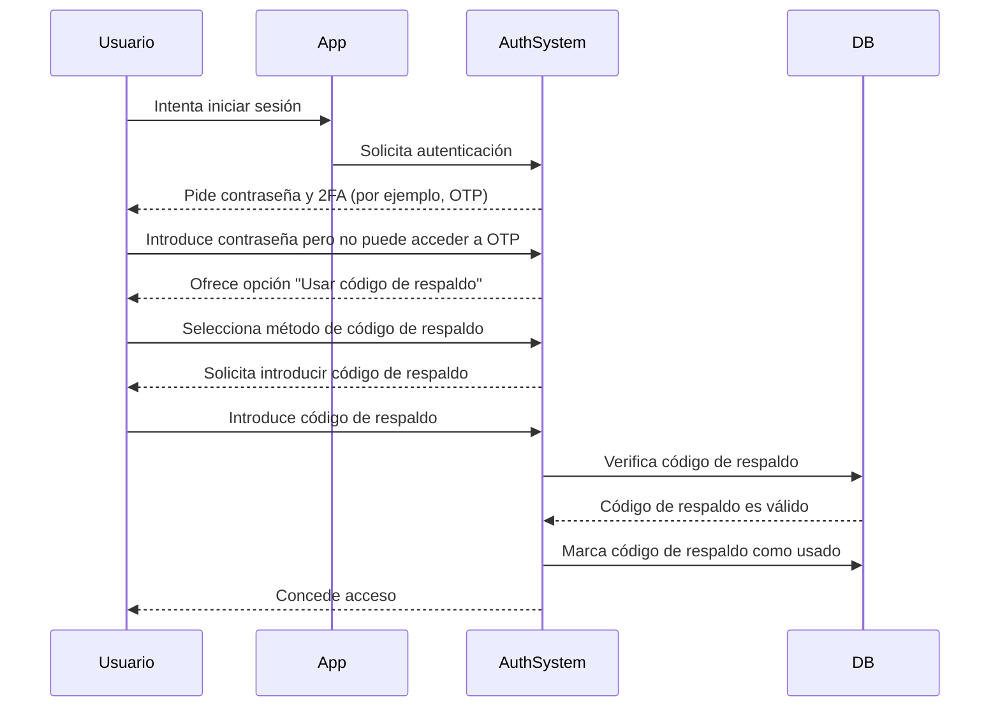

## ¿Qué es un código de respaldo (backup code)?

Un código de respaldo (también llamado código de recuperación) es un conjunto de códigos generados aleatoriamente, de un solo uso, que sirven como método de autenticación de respaldo cuando tus opciones principales de MFA, como SMS, aplicaciones de autenticación o passkeys, no están disponibles. Piénsalos como llaves de emergencia que aseguran que siempre puedas acceder a tu cuenta, incluso si pierdes tu teléfono, experimentas problemas de red o encuentras fallos técnicos.

## ¿Cómo funciona un código de respaldo (backup code)?

Los códigos de respaldo proporcionan una forma sencilla pero segura de recuperar el acceso a tu cuenta cuando los métodos estándar de MFA fallan. Así es como funcionan:

1. **Generación**: El sistema crea un conjunto único de códigos (típicamente de 8 a 12 caracteres cada uno) durante la configuración de MFA.
2. **Almacenamiento**: Se te pide que guardes estos códigos de manera segura, ya sea offline (por ejemplo, impresos en papel) o en un gestor de contraseñas cifrado.
3. **Uso**: Si no puedes usar tu método principal de MFA, introduces uno de tus códigos de respaldo para autenticarte.
4. **Invalidación**: Cada código se desactiva automáticamente después de su uso para prevenir su reutilización.

## ¿Cuándo usar un código de respaldo (backup code)?

¿Se volverán obsoletos los códigos de respaldo? ¿Debería MFA seguir soportándolos?

Absolutamente. Los códigos de respaldo siguen siendo una red de seguridad crítica para MFA. Aunque métodos más nuevos como passkeys y FIDO2 están ganando terreno, los códigos de respaldo ofrecen una opción de recuperación universalmente accesible y agnóstica al dispositivo. Son una salvaguarda de bajo costo y alto valor y siempre deben ser soportados junto con métodos modernos de MFA.

Usa un código de respaldo cuando:

- Tu dispositivo principal de MFA no está disponible (por ejemplo, teléfono perdido, batería agotada).
- Problemas de red impiden la entrega de SMS/correo electrónico.
- Tu aplicación de autenticación falla al sincronizar.
- Tu token de hardware presenta fallos.

## ¿Cómo usar un código de respaldo (backup code) de manera segura?

Para asegurar que tus códigos de respaldo permanezcan seguros:

1. **Guárdalos offline**
    - Guárdalos en una carpeta cifrada en tu dispositivo.
    - Imprímelos y guárdalos en un lugar seguro (por ejemplo, una caja fuerte con teclado).
    - Evita guardarlos en formatos digitales no seguros (por ejemplo, aplicaciones de notas en línea).
2. **Usa un gestor de contraseñas**
    - La mayoría de los gestores de contraseñas (por ejemplo, 1Password, LastPass) ofrecen una función de notas seguras.
        - Crea una nueva entrada: "Códigos de Respaldo – [Nombre del Servicio]"
        - Copia y pega tus códigos de respaldo, luego habilita el cifrado.
    - Si usas Google Password Manager, puedes:
        - Encontrar la entrada del servicio relevante.
        - Editarla y añadir una nota para tus códigos de respaldo, y etiquetar los códigos como "Usados/No usados" para llevar un seguimiento.
        - De esta manera, al autocompletar contraseñas, puedes acceder rápidamente a tus códigos de respaldo cuando sea necesario.
3. **Reemplaza los códigos usados**
    - Regenera nuevos códigos si has usado la mayoría de ellos o sospechas que han sido comprometidos.

## Diseñando una experiencia de MFA con códigos de respaldo

Para los desarrolladores que implementan códigos de respaldo, sigan estas mejores prácticas:

1. **No dependas únicamente de los códigos de respaldo**
Son un recurso de emergencia, no un método principal de MFA. Siempre ofrece TOTP, passkeys u otras opciones robustas.
2. **Proporciona de 8 a 10 códigos por defecto**
    
    Esto equilibra la usabilidad (suficiente para emergencias raras) y la seguridad (minimiza el riesgo de robo masivo).
    
3. **Aplica el uso único**
    
    Invalida automáticamente los códigos después de su uso.
    
4. **Regenera automáticamente los códigos cuando se agoten**
    
    Previene bloqueos emitiendo nuevos códigos una vez que un usuario agota su conjunto actual.
    
5. **Permite la regeneración manual con verificación estricta**
    
    Permite a los usuarios generar nuevos códigos si pierden los suyos, pero requiere re-autenticación (por ejemplo, confirmación por correo electrónico/SMS/contraseña).
    

## Códigos de respaldo (backup codes) vs. Contraseñas: ¿Cuál es la diferencia?

| Característica | Códigos de respaldo | Contraseñas |
| --- | --- | --- |
| **Propósito** | Recurso de emergencia cuando MFA falla | Método principal de autenticación |
| **Formato** | Generado por el sistema, alfanumérico | Elegido por el usuario, a menudo mezcla de caracteres |
| **Almacenamiento** | Hashed (a menudo sin sal, ya que son de un solo uso) | Hashed + sal (para prevenir ataques de tabla arcoíris) |
| **Uso** | Desactivado después de un uso | Reutilizable hasta que se cambie |
| **Regeneración** | El sistema emite nuevos conjuntos | El usuario restablece manualmente |
| **Seguridad** | Deben almacenarse de manera segura | Vulnerables si son débiles o reutilizados |

**Notas clave de seguridad:**

- Ambos deben ser largos y generados aleatoriamente para resistir ataques de fuerza bruta.
- Las contraseñas requieren sal porque los usuarios a menudo las reutilizan.
- Los códigos de respaldo típicamente no necesitan sal, ya que son de un solo uso y generados aleatoriamente, lo que hace poco probable los exploits a gran escala.

<Resources
  urls={[
    "https://docs.logto.io/end-user-flows/mfa",
    "https://auth-wiki.logto.io/mfa",
    "https://auth-wiki.logto.io/totp"
  ]}
/>