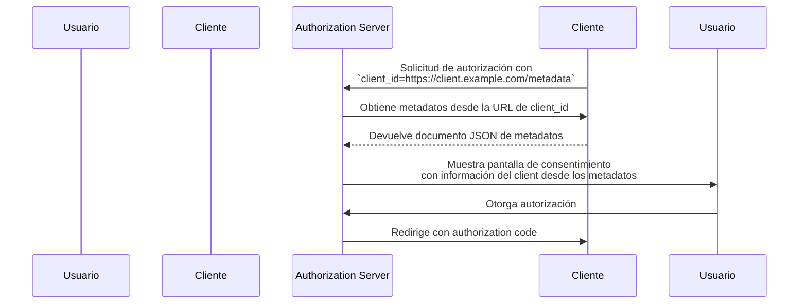

## ¿Qué es un Documento de Metadatos de Client ID (Client ID Metadata Document, CIMD)?

Un Documento de Metadatos de Client ID (Client ID Metadata Document, CIMD) es un mecanismo definido en la especificación [OAuth Client ID Metadata Document](https://datatracker.ietf.org/doc/draft-ietf-oauth-client-id-metadata-document/) que permite que un <Ref slug="client" /> de OAuth 2.0 se identifique ante un <Ref slug="authorization-server" /> sin registro previo.

La idea principal: en lugar de recibir un `client_id` del authorization server (mediante registro manual o [Dynamic Client Registration](https://datatracker.ietf.org/doc/html/rfc7591)), el client **utiliza una URL HTTPS como su `client_id`**. Esa URL apunta a un documento JSON que contiene los metadatos del client — nombre, redirect URIs, grant types soportados y más. El authorization server obtiene este documento cuando encuentra el `client_id` basado en URL.

Este enfoque a veces se abrevia como **CIMD** (Client ID Metadata Document) en la comunidad.

## ¿Cómo funciona?

Cuando un client utiliza un Documento de Metadatos de Client ID (Client ID Metadata Document, CIMD), el flujo de OAuth agrega un paso: el authorization server resuelve la URL de `client_id` para recuperar los metadatos del client.



Esto es lo que ocurre paso a paso:

1. El client inicia una <Ref slug="authorization-request" /> usando su URL como `client_id` (por ejemplo, `https://client.example.com/oauth-client`).
2. El authorization server reconoce el `client_id` como una URL y la obtiene vía HTTPS.
3. La respuesta es un documento JSON que contiene los metadatos estándar del client de OAuth.
4. El authorization server valida los metadatos, muestra la información de consentimiento al usuario y continúa con el flujo de OAuth.
5. Las solicitudes posteriores pueden usar los metadatos en caché según los encabezados de caché HTTP.

### El documento de metadatos

El documento de metadatos es un objeto JSON que utiliza los mismos campos definidos en [RFC 7591 (OAuth 2.0 Dynamic Client Registration Protocol)](https://datatracker.ietf.org/doc/html/rfc7591). Debe incluir un campo `client_id` cuyo valor coincida exactamente con la URL.

Aquí tienes un ejemplo:

```json
{
  "client_id": "https://client.example.com/oauth-client",
  "client_name": "My Application",
  "redirect_uris": ["https://client.example.com/callback"],
  "grant_types": ["authorization_code", "refresh_token"],
  "response_types": ["code"],
  "token_endpoint_auth_method": "none",
  "scope": "openid profile email"
}
```

### Requisitos para la URL del identificador de client

La especificación impone requisitos estrictos sobre lo que constituye una URL válida de identificador de client:

- **Debe usar HTTPS** — no se permite HTTP simple ni otros esquemas.
- **Debe incluir un componente de ruta (path)** — un dominio sin ruta como `https://example.com` no es válido.
- **No debe contener** fragmentos, nombre de usuario ni contraseña.
- **No debe contener** segmentos de ruta de punto simple (`.`) o doble punto (`..`).
- Las cadenas de consulta están permitidas pero no se recomiendan.
- Los números de puerto están permitidos.

Por ejemplo:
- `https://client.example.com/oauth-client` — válido
- `http://client.example.com/oauth-client` — inválido (no es HTTPS)
- `https://example.com` — inválido (sin ruta)
- `https://client.example.com/../oauth-client` — inválido (segmento de punto)

## ¿Por qué no usar métodos de registro existentes?

Para entender por qué existe esta especificación, considera las limitaciones de los enfoques existentes:

### Registro estático

En implementaciones tradicionales de OAuth, un desarrollador registra manualmente el client en el authorization server — normalmente a través de una consola de administración — y recibe un `client_id`. Esto funciona cuando conoces tus clients de antemano.

No funciona para ecosistemas abiertos donde cualquier client podría necesitar conectarse. No puedes pre-registrar cada posible agente de IA o client MCP.

### Dynamic Client Registration (DCR)

[Dynamic Client Registration (RFC 7591)](https://datatracker.ietf.org/doc/html/rfc7591) permite que los clients se registren programáticamente enviando sus metadatos a un endpoint de registro. El servidor crea un `client_id` y almacena el registro.

Esto funciona, pero crea estado del lado del servidor: cada registro produce un registro que debe ser almacenado, mantenido y eventualmente eliminado. En un ecosistema abierto con muchos clients, el authorization server acumula registros — la mayoría de los cuales pueden usarse una vez y luego abandonarse.

DCR tampoco tiene un mecanismo incorporado para verificar que un client es quien dice ser. Cualquier client puede registrarse con cualquier nombre o logo.

### Ventajas del Documento de Metadatos de Client ID (Client ID Metadata Document, CIMD)

El enfoque de Documento de Metadatos de Client ID (Client ID Metadata Document, CIMD) aborda estos problemas:

| Aspecto | Registro estático | DCR | Client ID Metadata Document |
|--------|-------------------|-----|----------------------------|
| Estado del lado del servidor | Sí (registros almacenados) | Sí (registros almacenados) | No (se obtiene bajo demanda) |
| ¿Requiere pre-registro? | Sí | No | No |
| Verificación de identidad | Revisión manual | Ninguna incorporada | Propiedad de dominio vía HTTPS |
| ¿Requiere limpieza? | Sí | Sí (registros abandonados) | No (autolimpieza vía caché HTTP) |
| ¿El client controla los metadatos? | No | Al momento del registro | Sí (puede actualizar en cualquier momento) |

La clave es que **la propiedad del dominio se convierte en el ancla de confianza**. Solo la entidad que controla `client.example.com` puede alojar contenido en `https://client.example.com/oauth-client`. El certificado HTTPS lo prueba sin pasos de verificación adicionales.

## Restricciones de autenticación

Como no hay un secreto compartido previamente entre el client y el authorization server, no se pueden usar métodos de autenticación basados en secretos simétricos. El documento de metadatos **no debe** incluir:

- `client_secret_post`
- `client_secret_basic`
- `client_secret_jwt`
- Cualquier método que dependa de un secreto simétrico compartido

Los campos `client_secret` y `client_secret_expires_at` tampoco deben aparecer en el documento.

Si el client necesita autenticarse más allá de ser un client público, puede usar criptografía asimétrica. El client publica sus claves públicas en el documento de metadatos (mediante una propiedad `jwks` o una referencia `jwks_uri`) y se autentica en el token endpoint usando `private_key_jwt`. El authorization server verifica la firma JWT contra el <Ref slug="jwk">JWK</Ref> publicado.

## ¿Cómo descubre el authorization server si hay soporte?

Los authorization servers indican soporte para Documentos de Metadatos de Client ID (Client ID Metadata Documents) incluyendo la siguiente propiedad en su <Ref slug="authorization-server-metadata" />:

```json
{
  "client_id_metadata_document_supported": true
}
```

Los clients pueden comprobar este indicador antes de iniciar un flujo de autorización con un `client_id` basado en URL. Si el authorization server no anuncia soporte, el client debe recurrir a otros métodos de registro.

## Consideraciones de seguridad

### Protección contra SSRF

Cuando el authorization server obtiene la URL de metadatos, está haciendo una solicitud HTTP a una URL proporcionada por el client. Esto es un posible vector de Server-Side Request Forgery (SSRF). Las implementaciones deben:

- Bloquear solicitudes a direcciones IP privadas y de loopback (por ejemplo, `127.0.0.1`, `10.x.x.x`, `192.168.x.x`)
- Revalidar las direcciones de destino después de seguir redirecciones
- Imponer límites de tamaño de respuesta (la especificación recomienda un máximo de 5 KB)
- Establecer tiempos de espera apropiados

### Caché

Los authorization servers deben respetar los encabezados de caché HTTP (`Cache-Control`, `ETag`) al almacenar en caché los metadatos. Sin embargo:

- **No caches respuestas de error** — un fallo temporal no debe bloquear permanentemente a un client.
- Los servidores pueden imponer duraciones mínimas y máximas de caché independientemente de lo que especifique el servidor del client.

### Prevención de phishing

Un client malicioso podría establecer `client_name` como el nombre de una marca confiable y `logo_uri` como su logo. Los authorization servers deben mitigar esto:

- Mostrando siempre el hostname de `client_id` junto al nombre del client en las pantallas de consentimiento
- Prefetching y moderando imágenes de logo en lugar de cargarlas directamente desde el client

### Atestación de redirect URI

Una ventaja de seguridad sobre DCR: las <Ref slug="redirect-uri">redirect URIs</Ref> en el documento de metadatos están alojadas en el dominio del client, servidas por HTTPS. Esto crea una vinculación más fuerte entre la identidad del client y sus redirect URIs que los valores autoafirmados en una solicitud de registro.

## Servicios de Documento de Metadatos de Client ID (Client ID Metadata Document Services)

La especificación también define **Servicios de Documento de Metadatos de Client ID (Client ID Metadata Document Services)** — servicios web de terceros que alojan documentos de metadatos en nombre de los desarrolladores.

Esto resuelve una brecha práctica: durante el desarrollo local, los desarrolladores no tienen una URL pública accesible para alojar sus metadatos. Un Servicio de Documento de Metadatos de Client ID (Client ID Metadata Document Service) proporciona una URL pública estable que los authorization servers pueden obtener, mientras el desarrollador trabaja localmente. Esto evita la necesidad de exponer máquinas locales a internet o configurar túneles para probar flujos de OAuth.

<SeeAlso slugs={["client", "authorization-server-metadata", "redirect-uri", "jwk"]} />

<Resources
  urls={[
    "https://datatracker.ietf.org/doc/draft-ietf-oauth-client-id-metadata-document/",
    "https://datatracker.ietf.org/doc/html/rfc7591",
    "https://datatracker.ietf.org/doc/html/rfc8414",
  ]}
/>
