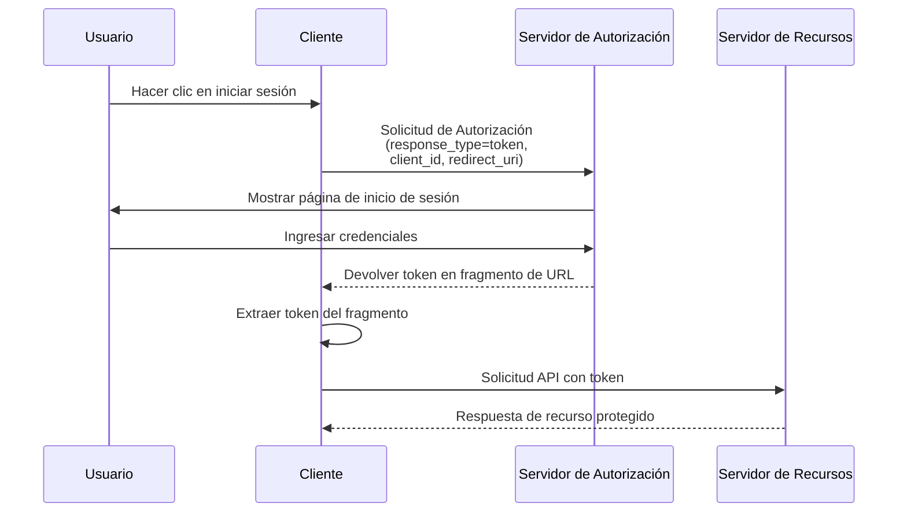

## ¿Qué es el flujo implícito (implicit flow)?

El flujo implícito (implicit flow) de OAuth 2.0 es un método de autenticación que permite a las aplicaciones solo cliente (como SPAs y aplicaciones nativas) recibir tokens directamente a través de fragmentos de URL desde el servidor de autorización sin proporcionar un secreto de cliente.

El flujo implícito (implicit flow) está diseñado para aplicaciones solo cliente, porque se ejecutan completamente en el navegador o en el dispositivo del usuario y no pueden almacenar de manera segura secretos de cliente.

El flujo implícito (implicit flow) ha sido oficialmente desaprobado en <Ref slug="oauth-2.1" /> por razones de seguridad (se mencionarán a continuación). Las aplicaciones solo cliente ahora deben usar el <Ref slug="authorization-code-flow" /> con la extensión <Ref slug="pkce" />.

## ¿Cómo funciona el flujo implícito (implicit flow)?

Los pasos principales del flujo implícito (implicit flow) son los siguientes:

Aviso:

- El cliente solo necesita proporcionar un `client_id` en la solicitud de autorización, sin requerir un `client_secret`.  
  Esto se debe a que estos clientes no pueden almacenar secretos de manera segura, por lo que este flujo no requiere un secreto de cliente.

- El parámetro `response_type` se establece en `token`, instruyendo al servidor de autorización a devolver el access token directamente en lugar de un código de autorización.  
  En OIDC (<Ref slug="openid-connect" />), el `response_type` es `id_token` o `id_token token`, y el servicio de auth devolverá los tokens correspondientes según los diferentes tipos de respuesta.

- El token se devuelve directamente en el fragmento de URL. Esto significa que el token está expuesto en la URL y puede ser fácilmente accedido por otras aplicaciones o scripts.

## ¿Es seguro el flujo implícito (implicit flow)?

No, el flujo implícito (implicit flow) en OAuth 2.0 generalmente se considera menos seguro que otros flujos como el flujo de código de autorización.

No se recomienda para la mayoría de los casos de uso debido a varias vulnerabilidades:

- **Exposición del token en la URL**
   - Los access tokens aparecen directamente en la URL del navegador (después del símbolo #)
   - Estos tokens pueden ser:
     - Guardados en el historial del navegador
     - Filtrados a través de encabezados de referencia
     - Capturados por código JavaScript malicioso en la misma página

- **Sin autenticación del cliente**
   - La aplicación cliente no necesita probar su identidad
   - Esto significa que cualquiera que conozca el `client_id` puede hacerse pasar por un cliente legítimo

- **Sin refresh tokens**
   - Este flujo no admite refresh tokens
   - Los usuarios deben iniciar sesión nuevamente cuando los access tokens expiran
   - Para evitar inicios de sesión frecuentes, los usuarios podrían almacenar tokens de manera insegura

- **Vulnerable a ataques XSS**
   - Todos los tokens se manejan en el navegador
   - Si el sitio web sufre un ataque XSS (Cross-Site Scripting)
   - El código JavaScript de los atacantes puede robar fácilmente estos tokens

Debido a estas preocupaciones de seguridad, el flujo implícito (implicit flow) ha sido desaprobado en <Ref slug="oauth-2.1" />. Las aplicaciones solo cliente ahora deben usar el <Ref slug="authorization-code-flow" /> con la extensión <Ref slug="pkce" />.

Puedes consultar [Qué es PKCE: desde conceptos básicos hasta una comprensión profunda](https://blog.logto.io/how-pkce-protects-the-authorization-code-flow-for-native-apps) para aprender cómo PKCE protege el flujo de código de autorización para aplicaciones solo cliente.

<SeeAlso
  slugs={["oauth-2.1", "authorization-code-flow", "pkce", "openid-connect"]}
/>

<Resources
  urls={[
    "https://blog.logto.io/implicit-flow-is-dead",
    {
      url: "https://tools.ietf.org/html/rfc6749#section-4.2",
      result: {
        ogTitle: "The OAuth 2.0 Authorization Framework: Implicit Grant",
        ogDescription:
          "The implicit grant type is used to obtain access tokens (it does not support the issuance of refresh tokens) and is optimized for public clients known to operate a particular redirection URI. These clients are typically implemented in a browser using a scripting language such as JavaScript.",
      },
    },
    "https://openid.net/specs/openid-connect-core-1_0.html",
    "https://blog.logto.io/how-pkce-protects-the-authorization-code-flow-for-native-apps",
  ]}
/>