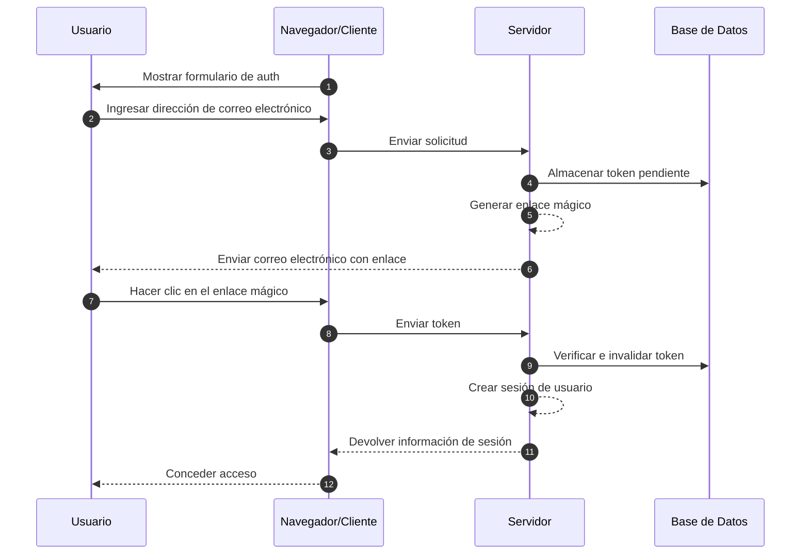
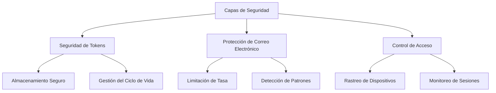

## ¿Qué son los enlaces mágicos (magic links)?

Un enlace mágico (magic link) es una URL segura y de tiempo limitado que permite la autenticación sin contraseña tanto para los procesos de registro como de inicio de sesión. En lugar de crear y recordar contraseñas, los usuarios reciben un enlace especial por correo electrónico que les otorga acceso inmediato. Piénsalo como una llave digital que funciona solo una vez: cuando haces clic en ella, estás autenticado, y luego esa llave se vuelve inválida.

Por ejemplo, cuando te registras en Medium o intentas iniciar sesión en Slack, en lugar de configurar o ingresar una contraseña, estas plataformas te envían un correo electrónico con un enlace seguro. Un clic, y estás autenticado. Este enfoque ha ganado una popularidad significativa porque combina seguridad con simplicidad.

## ¿Cómo funcionan los enlaces mágicos (magic links)?

El proceso es sencillo desde la perspectiva del usuario, pero involucra mecanismos de seguridad sofisticados detrás de escena. Esto es lo que sucede durante un flujo típico de autenticación con enlace mágico (magic link):



## ¿Cuál es la estructura de un enlace mágico (magic link)?

Un enlace mágico típico consta de varios componentes:

- URL base de la aplicación
- Endpoint de autenticación
- Parámetro de token
- Parámetros adicionales (opcionales)

Por ejemplo:

```
https://app.example.com/verify-auth?token=abc123...&redirect=/dashboard
```

## ¿Cómo se genera el token de un enlace mágico (magic link)?

Cuando un usuario solicita un enlace mágico (magic link) (por ejemplo, haciendo clic en "Iniciar sesión con correo electrónico"), necesitamos generar un token seguro e impredecible. Este token es crucial ya que esencialmente se convierte en una contraseña temporal.

El token debe generarse utilizando un <Ref slug='csprng' />. Un CSPRNG utiliza la entropía del hardware de tu sistema (como el tiempo del teclado, movimientos del ratón, ruido del ventilador, etc.) para generar números verdaderamente aleatorios que son imposibles de predecir, incluso si un atacante conoce salidas anteriores.

Por ejemplo, en Node.js:

```javascript
import crypto from "node:crypto";

// Generar un token aleatorio seguro
const token = crypto.randomBytes(32).toString("base64url");
// Resultado: algo como 'dBjftJeZ4CVP-mB92K27uhbUJU1p1r_wW1gFWFOEjXk'

// Alternativa usando Web Crypto API (disponible en Node.js y navegadores)
const buffer = crypto.getRandomValues(new Uint8Array(32));
const token2 = Buffer.from(buffer).toString("base64url");
```

Requisitos para un token seguro:

- Generado a través de CSPRNG para asegurar la imprevisibilidad
- Al menos 32 bytes de longitud (256 bits de entropía)
- Codificado de manera segura para URL (base64url elimina caracteres problemáticos)
- Limitado en el tiempo y de un solo uso para prevenir ataques de repetición
- Almacenado de manera segura con metadatos (expiración, información del usuario)

## Cómo asegurar la autenticación con enlace mágico (magic link)

La seguridad de los enlaces mágicos (magic links) requiere un enfoque integral en múltiples capas. Mientras que la entrega de correos electrónicos y los patrones de acceso son críticos, el manejo seguro de tokens sigue siendo la piedra angular de la seguridad del sistema.

### Fundamentos de seguridad de tokens

La seguridad de los enlaces mágicos (magic links) depende en gran medida de la implementación adecuada de tokens (ver el contenido anterior). Cada token debe ser criptográficamente seguro y gestionado adecuadamente a lo largo de su ciclo de vida. El sistema debe imponer una expiración estricta de tokens (típicamente de 15 a 30 minutos) e invalidación inmediata después de su uso.

Al almacenar tokens, trátalos con el mismo nivel de seguridad que las contraseñas:

- Hashear tokens antes de almacenarlos para prevenir su exposición
- Implementar limpieza automática de tokens expirados
- Mantener un registro de auditoría del uso e invalidación de tokens
- Almacenar metadatos asociados (hora de creación, usuario previsto, información del dispositivo)

### Seguridad en la entrega de correos electrónicos

El correo electrónico sirve como el canal principal de entrega para los enlaces mágicos (magic links), convirtiéndolo en un objetivo potencial para ataques. Implementar limitación de tasa es esencial para prevenir intentos de fuerza bruta y proteger contra ataques de bombardeo de correos electrónicos. Por ejemplo, podrías limitar a los usuarios a 5 solicitudes de enlace mágico por hora desde la misma dirección IP.

Además, monitorear patrones de actividad inusuales ayuda a detectar posibles brechas de seguridad. Esto incluye:

- Múltiples solicitudes desde diferentes IPs para el mismo correo electrónico
- Patrones de acceso geográfico inusuales
- Solicitudes rápidas que indican ataques automatizados

### Control de acceso y monitoreo

La huella digital del dispositivo agrega una capa adicional de seguridad al rastrear patrones consistentes de comportamiento del usuario. Cuando un intento de inicio de sesión proviene de un nuevo dispositivo o ubicación, puedes implementar pasos de verificación adicionales o alertar al usuario.

Para una seguridad mejorada en aplicaciones sensibles:

- Combina enlaces mágicos (magic links) con factores de autenticación adicionales
- Implementa monitoreo continuo de sesiones
- Registra todos los eventos de autenticación para auditorías
- Agrega verificación basada en dispositivos para nuevas ubicaciones



## Enlaces mágicos (magic links) vs SMS / Email OTP

Tanto los enlaces mágicos (magic links) como los SMS / Email OTP dependen de canales externos para la verificación.

Los enlaces mágicos (magic links) envían una URL de un solo uso al correo electrónico del usuario, mientras que OTP envía un código de verificación a su teléfono o correo electrónico.

Los enlaces mágicos (magic links) proporcionan una experiencia superior en el escritorio, ya que los usuarios simplemente hacen clic en el enlace para completar la verificación, eliminando la necesidad de ingresar códigos manualmente. También pueden llevar información de contexto adicional, permitiendo flujos de autenticación más sofisticados.

Sin embargo, en escenarios móviles, SMS OTP podría ofrecer mejor usabilidad ya que los usuarios pueden ver rápidamente e ingresar los códigos de verificación.

## Enlaces mágicos (magic links) vs aplicaciones de autenticación

En comparación con los códigos OTP generados por aplicaciones de autenticación, los enlaces mágicos (magic links) no requieren que los usuarios instalen aplicaciones adicionales y funcionan sin problemas en todos los dispositivos. Esto reduce la fricción, particularmente para usuarios no técnicos. Sin embargo, las aplicaciones de autenticación generan códigos OTP con mejor fiabilidad en tiempo real, independientemente de las velocidades de entrega y disponibilidad del servidor de correo electrónico.

Para escenarios que requieren autenticación frecuente con altos requisitos de seguridad, las aplicaciones de autenticación podrían ser la opción preferida.

## Cuándo usar enlaces mágicos (magic links)

Los enlaces mágicos (magic links) son particularmente efectivos para aplicaciones empresariales y de negocios donde los usuarios típicamente inician sesión con menos frecuencia, como herramientas de gestión de proyectos o paneles de informes. En estos escenarios, el ligero retraso en la entrega del correo electrónico es insignificante en comparación con la conveniencia de no gestionar contraseñas.

### Escenarios ideales

Estos métodos de autenticación brillan en contextos empresariales donde el correo electrónico ya es el canal de comunicación principal. Por ejemplo, plataformas de colaboración como Slack o Notion aprovechan eficazmente los enlaces mágicos (magic links) porque:

- Los usuarios ya están monitoreando activamente su correo electrónico
- Las sesiones de inicio de sesión tienden a ser de larga duración
- El enfoque está en reducir la fricción en el proceso de autenticación

Los enlaces mágicos (magic links) también son excelentes para flujos de registro de usuarios en productos SaaS donde la optimización de la conversión es crucial. Cuando los usuarios pueden comenzar a usar tu servicio con solo una dirección de correo electrónico, reduce significativamente las tasas de abandono durante el proceso de incorporación.

### Cuándo considerar alternativas

Sin embargo, los enlaces mágicos (magic links) pueden no ser la mejor opción para aplicaciones que requieren autenticación frecuente. Las aplicaciones de banca móvil, por ejemplo, necesitan métodos de autenticación rápidos y confiables ya que los usuarios podrían verificar su saldo varias veces al día. En tales casos, la autenticación biométrica o los códigos PIN a menudo proporcionan una mejor experiencia de usuario.

Considera métodos de autenticación alternativos cuando:

- Tu aplicación es principalmente móvil
- Los usuarios necesitan acceso inmediato sin dependencia del correo electrónico
- El entorno requiere autenticación multifactor
- Los retrasos en la entrega de correos electrónicos podrían impactar significativamente la experiencia del usuario

La clave es alinear tu método de autenticación con los patrones de comportamiento de tus usuarios y los requisitos de seguridad. Mientras que los enlaces mágicos (magic links) ofrecen excelente seguridad con mínima fricción, deben ser parte de una estrategia de autenticación más amplia en lugar de la única solución.

<SeeAlso slugs={["csprng", "passwordless", "otp", "totp"]} />