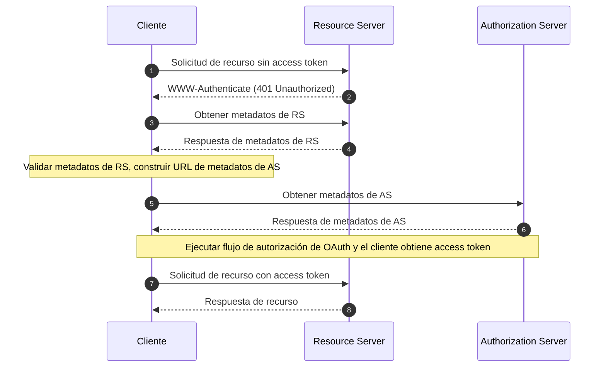

## ¿Qué son los Metadatos de Recursos Protegidos de OAuth 2.0?

Los Metadatos de Recursos Protegidos de OAuth 2.0 son un formato estandarizado definido en [RFC 9728](https://datatracker.ietf.org/doc/html/rfc9728). Ayuda a los clientes y servidores de autorización a entender cómo interactuar con los recursos protegidos.

Este formato de metadatos proporciona información esencial sobre:
- Capacidades del servidor de recursos
- Formatos de token soportados
- Mecanismos de seguridad requeridos
- Relaciones con el servidor de autorización
- Alcances y permisos disponibles

## ¿Cuáles son los beneficios de los Metadatos de Recursos Protegidos?

En el sistema OAuth 2.0, hay cuatro roles básicos:
- <Ref slug="authorization-server"/>: Emite access tokens a los clientes después de autenticar exitosamente al resource owner
- <Ref slug="client"/>: Aplicación que solicita acceso a recursos protegidos
- <Ref slug="resource-owner"/>: Entidad capaz de otorgar acceso a recursos protegidos
- <Ref slug="resource-server"/>: Servidor que aloja recursos protegidos

Tradicionalmente, cuando un cliente necesita acceder a recursos protegidos, primero debe descubrir e interactuar con el servidor de autorización para obtener los tokens necesarios. El rol del Resource Server se limitaba principalmente a validar tokens y servir recursos, con todos los detalles de autenticación y autorización coordinados a través del servidor de autorización y la aplicación cliente.

Esto significaba que los clientes no tenían una forma estandarizada de descubrir los requisitos o capacidades específicos de un Resource Server directamente.

Los Metadatos de Recursos Protegidos transforman esta dinámica al permitir que los Resource Servers publiquen activamente sus requisitos y capacidades, y trae varios beneficios clave:
- Descubrimiento Directo: Los clientes ahora pueden conocer los requisitos de un Resource Server directamente desde la fuente
- Autonomía Mejorada: Los Resource Servers pueden especificar explícitamente sus formatos de token soportados, mecanismos de seguridad y servidores de autorización de confianza
- Interoperabilidad Mejorada: Un formato estandarizado asegura una comunicación consistente de los requisitos de acceso a través de diferentes implementaciones
- Configuración Dinámica: Los Resource Servers pueden actualizar sus requisitos sin depender de cambios en el servidor de autorización

## ¿Cómo funcionan los Metadatos de Recursos Protegidos de OAuth 2.0?

Los Metadatos de Recursos Protegidos operan dentro del ecosistema OAuth 2.0 a través de un proceso estandarizado de descubrimiento e interacción:



El documento de metadatos del servidor de recursos es un objeto JSON que contiene los siguientes campos:

```json
   {
     "resource": "https://api.example.com",
     "authorization_servers": [
       "https://auth.example.com"
     ],
     "scopes_supported": ["read", "write"],
     "token_formats_supported": ["jwt"],
     "token_introspection_endpoint": "https://api.example.com/introspect",
     "dpop_signing_alg_values_supported": ["ES256", "PS256"]
   }
   ```

Y una vez que el cliente ha recibido el documento de metadatos, puede usarlo para configurarse e interactuar con el servidor de recursos principalmente de acuerdo con los siguientes campos:

- `resource`: Identificador del recurso protegido
- `authorization_servers`: Lista de servidores de autorización autorizados
- `scopes_supported`: Alcances disponibles para este recurso
- `token_formats_supported`: Formatos de token soportados
- `token_introspection_endpoint`: Endpoint para la validación de tokens
- `dpop_signing_alg_values_supported`: Algoritmos DPoP soportados

## ¿Cómo descubrir los endpoints de Metadatos de Recursos Protegidos de OAuth 2.0?

Existen dos mecanismos principales de descubrimiento para los Metadatos de Recursos Protegidos:

1. **Descubrimiento de Cabecera WWW-Authenticate (Basado en Flujo)**:

Cuando un cliente realiza una solicitud no autorizada a un recurso protegido, el servidor responde con un código de estado 401 e incluye la URL de metadatos en la cabecera WWW-Authenticate:

```bash
# 1. El cliente realiza una solicitud sin token
GET /api/resource HTTP/1.1
Host: api.example.com

# 2. El servidor responde con 401 y URL de metadatos
HTTP/1.1 401 Unauthorized
WWW-Authenticate: Bearer realm="example",
  scope="read write",
  resource_metadata_url="https://api.example.com/.well-known/oauth-resource-server"
```

La cabecera proporciona:
- Identificación del ámbito del recurso
- Alcances requeridos
- Ubicación de la URL de metadatos

2. **Descubrimiento Directo de URI Bien Conocido**:

Puedes acceder directamente a los metadatos realizando una solicitud GET al endpoint bien conocido:

```bash
GET /.well-known/oauth-resource-server HTTP/1.1
Host: api.example.com
```

El endpoint sigue un formato estandarizado:
- URI base: `https://api.example.com`
- Ruta bien conocida: `/.well-known/oauth-resource-server`
- URL completa: `https://api.example.com/.well-known/oauth-resource-server`

## ¿Cómo funciona la cabecera WWW-Authenticate en los Metadatos de Recursos Protegidos?

La cabecera WWW-Authenticate es un componente clave en los Metadatos de Recursos Protegidos para implementar el mecanismo de descubrimiento automático. Aprovecha la cabecera estándar HTTP `WWW-Authenticate` para transmitir información de metadatos, permitiendo a los clientes descubrir y configurar automáticamente los requisitos de acceso para los servidores de recursos.

Cuando un cliente intenta acceder por primera vez a un recurso protegido sin proporcionar un access token, el servidor de recursos responde con un código de estado 401 Unauthorized e incluye una cabecera WWW-Authenticate:

```
WWW-Authenticate: Bearer realm="example",
  scope="read write",
  resource_metadata_url="https://api.example.com/.well-known/oauth-resource-server"
```

Esta cabecera puede contener varias piezas clave de información:
- `Bearer`: Indica que este es un esquema de autenticación de OAuth 2.0 Bearer Token
- `realm`: Define el espacio de protección del recurso
- `scope`: Especifica los permisos de acceso requeridos
- `resource_metadata_url`: Apunta a la ubicación del documento de metadatos que contiene la configuración completa del servidor de recursos

Al recibir esta cabecera, el cliente extrae el `resource_metadata_url` y recupera el documento de metadatos completo desde esa URL.

Basado en la información de metadatos obtenida, el cliente puede determinar los servidores de autorización apropiados, los formatos de token soportados, los alcances disponibles y otros detalles de configuración para configurar adecuadamente las solicitudes de autenticación.

## ¿Cómo asegurar los Metadatos de Recursos Protegidos de OAuth 2.0?

Las consideraciones de seguridad esenciales incluyen:

1. **Seguridad de Transporte**:
   - Uso obligatorio de TLS
   - Validación de certificados
   - Manejo seguro de conexiones

2. **Integridad de Metadatos**:
   - Validación de la fuente
   - Verificación de firmas
   - Estrategias de almacenamiento en caché seguras

3. **Control de Acceso**:
   - Limitación de tasa
   - Validación de solicitudes
   - Monitoreo de abuso

## ¿Cómo implementar los Metadatos de Recursos Protegidos de OAuth 2.0?

Así es como se implementan los Metadatos de Recursos Protegidos de OAuth 2.0 en diferentes componentes:

1. **Implementación del Resource Server**

El servidor de recursos responde con un estado 401 Unauthorized e incluye la URL de metadatos en la cabecera WWW-Authenticate cuando recibe un intento de acceso no autorizado:

```
HTTP/1.1 401 Unauthorized
WWW-Authenticate: Bearer realm="example",
  resource_metadata_url="https://api.example.com/.well-known/oauth-resource-server"
```

2. **Implementación del Cliente**

El cliente implementa una función asíncrona para manejar el acceso a recursos. Al recibir una respuesta 401, esta función extrae la URL de metadatos de la cabecera WWW-Authenticate, obtiene los metadatos y los utiliza para la configuración del cliente:

```javascript
async function handleResourceAccess(response) {
  if (response.status === 401) {
    const wwwAuthenticate = response.headers.get('WWW-Authenticate');
    const metadataUrl = extractMetadataUrl(wwwAuthenticate);
    const metadata = await fetchMetadata(metadataUrl);
    // Configuración del cliente basada en metadatos
  }
}
```

3. **Estructura del Documento de Metadatos**

El servidor de recursos proporciona un documento de metadatos como un objeto JSON que contiene:
- Identificador del recurso
- Lista de servidores de autorización autorizados
- Alcances soportados
- Formatos de token soportados
- Algoritmos de firma DPoP soportados

Aquí hay un ejemplo del documento de metadatos:

```json
{
  "resource": "https://api.example.com",
  "authorization_servers": ["https://auth.example.com"],
  "scopes_supported": ["read", "write"],
  "token_formats_supported": ["jwt"],
  "dpop_signing_alg_values_supported": ["ES256"]
}
```

Estos componentes trabajan juntos para formar una implementación completa de Metadatos de Recursos Protegidos de OAuth 2.0. A través de esta implementación, los clientes pueden descubrir y configurar automáticamente los parámetros necesarios para acceder a recursos protegidos.

<SeeAlso slugs={["resource-server", "authorization-server"]} />

<Resources urls={[
  "https://datatracker.ietf.org/doc/html/rfc9728",
]} />