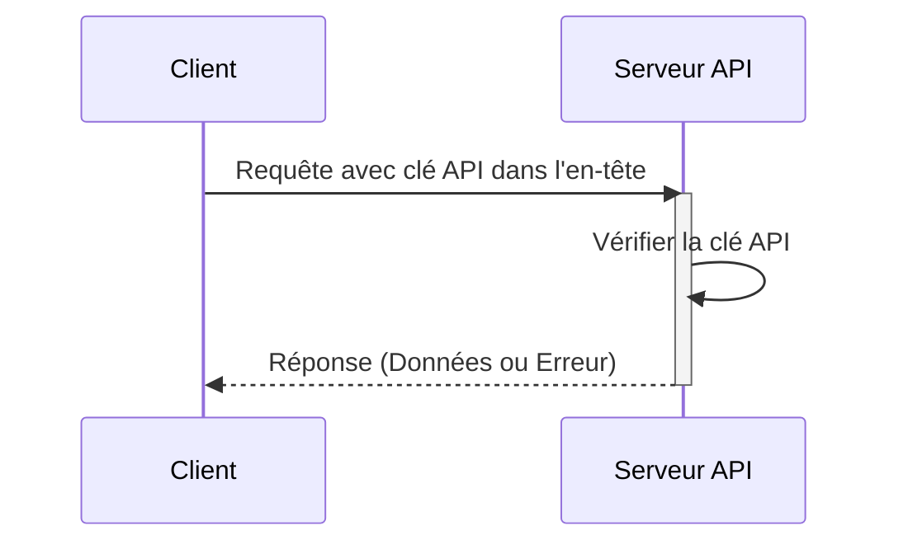

## Qu'est-ce qu'une clé API ?

Une clé API est un jeton secret utilisé pour authentifier les clients accédant à une API. C'est comme un mot de passe pour votre application, permettant l'accès à une API spécifique. Pensez-y comme une carte d'accès pour entrer dans un bâtiment. La carte accorde l'accès, mais n'identifie pas nécessairement qui vous êtes.

## Comment fonctionnent les clés API ?

Les clés API fonctionnent via un processus simple de requête et de réponse.

1. **Requête :** Votre application envoie une requête à l'API, incluant la clé API. La clé est souvent envoyée dans l'en-tête de la requête. Par exemple, l'en-tête pourrait ressembler à ceci : `x-api-key: your_actual_api_key`. Il n'existe pas de norme unique pour les noms d'en-tête ou les formats de valeur.

2. **Vérification :** Le serveur API vérifie la clé fournie par rapport à sa base de données.

3. **Réponse :** Si la clé est valide, le serveur accorde l'accès et renvoie les données demandées. Sinon, l'accès est refusé.

Voici un diagramme de séquence illustrant le processus :

## Quels sont les avantages et les inconvénients des clés API ?

Voyons ce qui rend les clés API utiles et où elles sont limitées :

### Avantages

- **Super simple à utiliser** : Il suffit d'ajouter une clé à votre requête et c'est parti ! C'est comme utiliser une clé de maison - pas de démarches compliquées nécessaires.

- **Facile à suivre** : Vous voulez savoir qui utilise votre API ? Les clés API rendent cela simple. Vous pouvez voir quelles applications font des appels et à quelle fréquence.

- **Limitation de taux rapide** : Empêchez les gens de surutiliser votre API en définissant des limites par clé. C'est comme avoir un videur dans un club qui compte combien de fois quelqu'un entre et sort.

- **Parfait pour les données publiques** : Si vous partagez des informations non sensibles (comme des données météorologiques ou des statistiques publiques), les clés API sont idéales.

### Inconvénients

- **Moins sécurisées que les alternatives modernes** : Les clés API ne sont pas aussi efficaces que d'autres formes d'authentification API, telles que <Ref slug="oauth-2.0" /> et <Ref slug="jwt" />. Pensez-y comme une serrure basique par rapport à un système de sécurité moderne. Cependant, elles restent populaires car elles sont le moyen le plus simple de suivre l'utilisation de l'API et de commencer avec la sécurité de l'API.

- **Risques de sécurité** : Les clés API sont comme laisser votre clé de maison sous le paillasson. Si quelqu'un la trouve, il peut l'utiliser indéfiniment. Voici pourquoi :
  - Elles sont souvent visibles dans le code
  - Elles n'expirent pas automatiquement
  - Si elles sont divulguées (comme dans des dépôts GitHub publics), n'importe qui peut les utiliser

- **Impossible de distinguer les utilisateurs** : Bien que certaines entreprises utilisent des "clés API" qui peuvent identifier les utilisateurs (comme Stripe), les clés API traditionnelles ne peuvent pas vous dire qui est qui. Elles vous indiquent seulement quelle application fait la requête.

- **Statique par nature** : Contrairement aux jetons d'auth modernes qui expirent, les clés API restent généralement les mêmes pour toujours. Cela signifie :
  - Pas de rafraîchissement automatique de la sécurité
  - Travail manuel nécessaire pour faire tourner les clés
  - Risque accru si les clés sont exposées

## Quels sont les cas d'utilisation des clés API ?

- Communication de service à service : Les clés API conviennent aux scénarios où les applications doivent communiquer directement avec les API via des CLI. Par exemple, appeler les API d'OpenAI.
- API publiques : Lors de l'exposition d'API au public, les clés API fournissent une méthode simple de contrôle d'accès.
- Configuration simplifiée : Pour des besoins d'authentification rapides et simples, surtout en phase de développement. Contrairement à l'authentification Machine-to-machine, les clés API ne nécessitent pas d'enregistrement préalable du client, et n'ont pas besoin d'être échangées contre un access token. Vous passez simplement votre clé API en tant que paramètre dans votre requête et cela fonctionne simplement.

Dans des scénarios réels, l'objectif le plus courant lors de la création de produits est l'intégration de produits. Voici un cas d'utilisation typique :

### Exemple : Intégration avec Stripe

Stripe utilise des clés API pour une intégration sécurisée avec différentes plateformes et applications. Vous pouvez créer, visualiser, supprimer et gérer ces clés via le tableau de bord des développeurs. En utilisant des clés API, vous pouvez intégrer les fonctionnalités de paiement et de facturation de Stripe dans votre produit.

## Quelle est la différence entre les jetons d'accès personnel (PAT) et Machine-to-Machine (M2M) ?

En parlant de clés API, les jetons d'accès personnel et <Ref slug="machine-to-machine" /> peuvent également être mentionnés ensemble puisqu'ils peuvent tous accéder de manière programmatique aux ressources API via des commandes CLI, ou établir une communication entre les services backend.

### Jetons d'accès personnel (PAT)

Un jeton d'accès personnel est également une chaîne mais représente ***l'identité et les permissions d'un utilisateur spécifique***, est généré dynamiquement après une authentification ou une connexion réussie, et a généralement une durée de vie limitée mais peut être rafraîchi. Il fournit un contrôle d'accès granulaire aux données et capacités spécifiques à l'utilisateur et est couramment utilisé pour les outils CLI, les scripts ou l'accès personnel à l'API. La principale différence est qu'il est plus spécifique et utilisé pour des actions spécifiques à l'utilisateur.

### Machine-to-Machine (M2M)

La communication M2M est lorsque les appareils échangent automatiquement des données sans intervention humaine dans un sens plus large.

Dans le contexte de <Ref slug="openid-connect" /> (ou <Ref slug="oauth-2.0" />), les applications M2M utilisent le <Ref slug="client-credentials-flow" />, tel que défini dans le [protocole OAuth 2.0 RFC 6749](https://datatracker.ietf.org/doc/html/rfc6749), qui prend en charge des protocoles standard similaires. Cela implique généralement qu'une application cliente (une machine ou un service) accède à des ressources soit par elle-même, soit pour le compte d'un utilisateur. C'est idéal pour les situations où seuls les clients de confiance peuvent accéder aux services backend.

<SeeAlso slugs={["machine-to-machine"]} />