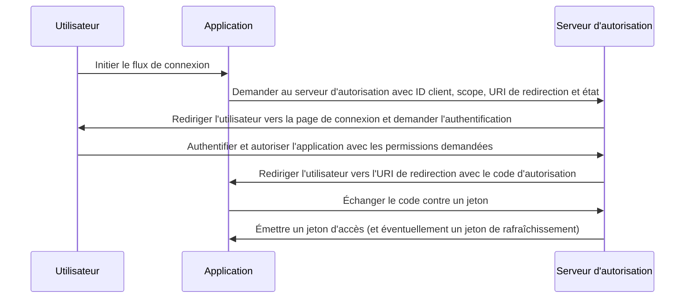

## Qu'est-ce que le flux de code d'autorisation (authorization code flow) ?

Le flux de code d'autorisation (authorization code flow, également connu sous le nom de autorisation code grant), défini dans [OAuth 2.0 RFC 6749, section 4.1](https://datatracker.ietf.org/doc/html/rfc6749#section-4.1), est un mécanisme d'autorisation OAuth 2.0 largement utilisé qui permet aux applications d'obtenir un jeton d'accès (access token) au nom d'un utilisateur.

Ce flux est idéal pour les applications confidentielles comme les applications web traditionnelles côté serveur qui peuvent stocker en toute sécurité les secrets des clients.

Il peut également être utilisé de manière sécurisée pour les applications natives et les applications monopage (SPAs) qui ne peuvent pas stocker en toute sécurité les secrets des clients lorsqu'il est combiné avec l'extension PKCE (<Ref slug="pkce" />).

## Comment fonctionne le flux de code d'autorisation (authorization code flow) ?

Le flux de code d'autorisation (authorization code flow) implique les étapes suivantes :

1. **Initiation du flux** : L'utilisateur initie le flux en cliquant généralement sur un lien ou un bouton dans l'application pour se connecter. L'application redirige l'utilisateur vers le point de terminaison d'autorisation du serveur d'autorisation, en transmettant l'ID client, le scope demandé, une URI de redirection et un paramètre d'état. Le serveur d'autorisation valide les paramètres et invite l'utilisateur à s'authentifier sur la page de connexion du serveur d'autorisation.
2. **Authentification et autorisation de l'utilisateur** : L'utilisateur s'authentifie auprès du serveur d'autorisation et accorde à l'application la permission d'accéder aux ressources demandées.
3. **Génération de code et redirection** : Le serveur d'autorisation génère un code d'autorisation et redirige l'utilisateur vers l'application en utilisant l'URI de redirection fournie précédemment. Le code d'autorisation est inclus dans la chaîne de requête de l'URI de redirection.
4. **Échange de code** : L'application extrait le code d'autorisation de la chaîne de requête et effectue une requête POST au point de terminaison de jeton du serveur d'autorisation pour échanger le code d'autorisation contre un jeton d'accès (access token). L'application doit également inclure l'ID client, le secret client, l'URI de redirection et le code d'autorisation dans la requête.
5. **Récupération du jeton d'accès** : Le serveur d'autorisation valide le code d'autorisation et émet un jeton d'accès (et éventuellement un jeton de rafraîchissement) à l'application après une validation réussie. L'application peut ensuite utiliser le jeton d'accès pour effectuer des requêtes API autorisées au nom de l'utilisateur.

Les étapes peuvent être illustrées par le diagramme de séquence suivant :



## Comment implémenter le flux de code d'autorisation (authorization code flow) ?

Voici un exemple simple d'implémentation du flux de code d'autorisation (authorization code flow), en suivant les directives décrites dans [OAuth 2.0 RFC 6749, section 4.1](https://datatracker.ietf.org/doc/html/rfc6749#section-4.1) :

### 1. Configuration initiale

Assurez-vous d'avoir les informations suivantes de votre service d'authentification avant de commencer :

```javascript
const config = {
  clientId: "YOUR_CLIENT_ID",
  clientSecret: "YOUR_CLIENT_SECRET",
  authorizationEndpoint: "https://authorization-server.com/auth",
  tokenEndpoint: "https://authorization-server.com/token",
  redirectUri: "http://localhost:3000/callback",
};
```

L'ID client, le secret client et l'URI de redirection sont la configuration de votre application dans le service d'authentification.

Le `authorizationEndpoint` et le `tokenEndpoint` sont fournis par votre service d'authentification.

Si votre serveur d'authentification implémente OIDC (<Ref slug="openid-connect" />), vous pouvez obtenir ces informations via <Ref slug="openid-connect-discovery" />.

### 2. Initier la demande d'autorisation

Le flux commence lorsqu'un utilisateur souhaite se connecter (par exemple, en cliquant sur un bouton de connexion). L'application effectuera une demande de connexion.

Cette demande inclut des paramètres tels que `client ID`, `redirect URI` et `scope`. Ensuite, elle redirige l'utilisateur vers le point de terminaison d'autorisation du service d'authentification (la page de connexion du service d'authentification).

L'utilisateur s'authentifiera et autorisera sur cette page de connexion.

```javascript
app.get("/login", (req, res) => {
  const authUrl = new URL(config.authorizationEndpoint);
  authUrl.searchParams.append("response_type", "code");
  authUrl.searchParams.append("client_id", config.clientId);
  authUrl.searchParams.append("redirect_uri", config.redirectUri);
  authUrl.searchParams.append("scope", "openid profile email");
  authUrl.searchParams.append("state", "random_state_string");

  res.redirect(authUrl.toString());
});
```

Remarque : Vous pouvez ajouter plus de paramètres au-delà de ceux montrés dans le code d'exemple. Voir [Définition complète des paramètres de la demande d'authentification](https://openid.net/specs/openid-connect-core-1_0.html#AuthRequest).

### 3. Gérer le rappel de l'URI de redirection et l'échange de jetons

Après que l'utilisateur a terminé l'authentification et l'autorisation sur la page de connexion du service d'authentification, le service d'authentification redirige l'utilisateur vers l'URI de redirection de l'application. Cette URI de redirection inclut le code d'autorisation et les paramètres d'état.

L'application extrait le code d'autorisation et les paramètres d'état de l'URI de redirection et les échange contre des jetons d'accès et de rafraîchissement (le cas échéant) au point de terminaison de jeton du service d'authentification.

```javascript
app.get("/callback", async (req, res) => {
  const { code, state } = req.query;

  try {
    // Échanger le code d'autorisation contre un jeton d'accès et un jeton de rafraîchissement
    const tokenResponse = await axios.post(config.tokenEndpoint, {
      grant_type: "authorization_code",
      code,
      redirect_uri: config.redirectUri,
      client_id: config.clientId,
      client_secret: config.clientSecret,
    });

    const { access_token, refresh_token } = tokenResponse.data;
    // Stocker les jetons pour les requêtes ultérieures
    req.session.accessToken = access_token;

    res.send("Authentification réussie !");
  } catch (error) {
    res.status(500).send("Échec de l'échange de jetons");
  }
});
```

### 4. Utiliser le jeton d'accès

Une fois que vous avez le jeton, utilisez-le pour accéder aux ressources protégées :

```javascript
async function fetchUserProfile(accessToken) {
  const response = await axios.get("https://api.example.com/userinfo", {
    headers: {
      Authorization: `Bearer ${accessToken}`,
    },
  });
  return response.data;
}
```

## Comment utiliser le flux de code d'autorisation (authorization code flow) pour les clients publics (applications natives et SPAs) ?

Les clients publics (comme les applications natives et les SPAs) rencontrent des défis de sécurité uniques lors de l'utilisation du flux de code d'autorisation (authorization code flow). Ces applications ne peuvent pas stocker en toute sécurité les secrets des clients. Le secret client serait exposé dans le code JavaScript ou dans le stockage de l'appareil. Cela facilite l'extraction et l'utilisation abusive du secret par des attaquants.

Par conséquent, le principal défi est de savoir comment utiliser le flux de code d'autorisation (authorization code flow) de manière sécurisée sans un secret client. La spécification OAuth 2.0 a introduit l'extension PKCE (<Ref slug="pkce" />) pour résoudre ce problème.

PKCE ajoute des mesures de sécurité supplémentaires pour protéger le flux de code d'autorisation (authorization code flow) pour les clients publics. Il empêche les attaques d'interception de code d'autorisation même sans utiliser un secret client. Consultez ce blog pour en savoir plus sur [Comment PKCE sécurise le flux de code d'autorisation OAuth 2.0](https://blog.logto.io/how-pkce-protects-the-authorization-code-flow-for-native-apps).

## Comment utiliser le flux de code d'autorisation (authorization code flow) de manière sécurisée ?

### **Utiliser "state" pour prévenir les attaques CSRF**

Les attaques CSRF (<Ref slug="csrf" />) trompent les utilisateurs pour qu'ils effectuent des actions non désirées dans une application web authentifiée. Le paramètre d'état aide à prévenir cela.

- Générez une valeur unique et aléatoire. Stockez cette valeur côté serveur.
- Incluez le paramètre d'état. Ajoutez-le à l'URL de la demande d'autorisation.
- Vérifiez l'état au retour. Lorsque le serveur d'autorisation redirige vers votre application, comparez l'état retourné avec la valeur stockée. S'ils ne correspondent pas, rejetez la demande. Cela confirme que la demande provient de votre application.

### **Configurer des URIs de redirection sécurisées**

L'URI de redirection est l'endroit où le serveur d'autorisation envoie le code d'autorisation après l'authentification de l'utilisateur. Une configuration sécurisée est cruciale.

- Enregistrez des URIs de redirection valides. Lors de l'enregistrement de l'application avec le serveur d'autorisation, spécifiez les URIs de redirection autorisées.
- Correspondance exacte. L'URI de redirection dans la demande d'autorisation doit correspondre exactement à une URI enregistrée. Même une légère différence peut créer une vulnérabilité.
- Évitez les URIs génériques. Si possible, évitez d'utiliser des URIs génériques en production. Elles élargissent la surface d'attaque.
- HTTPS pour la production. Utilisez toujours HTTPS pour les URIs de redirection dans les environnements de production.

### **Utiliser PKCE pour tous les clients**

Bien que PKCE ait été initialement conçu pour les clients publics, la spécification <Ref slug="oauth-2.1" /> exige que PKCE soit appliqué à tous les clients, y compris les clients confidentiels, pour améliorer la sécurité globale du flux de code d'autorisation (authorization code flow). (Voir [Appliquer PKCE pour tous les clients](https://auth.wiki/oauth-2.1#enforcing-pkce-for-all-clients))

## Quelle est la différence entre le flux de code d'autorisation (authorization code flow) et le flux implicite (implicit flow) ?

La principale différence entre le flux de code d'autorisation (authorization code flow) et le flux implicite (implicit flow) est la manière dont le jeton d'accès (access token) est obtenu :

- **Flux de code d'autorisation (authorization code flow)** : L'application cliente reçoit d'abord un code d'autorisation du point de terminaison d'autorisation, puis l'échange contre un jeton d'accès dans une requête POST ultérieure au point de terminaison de jeton.
- **Flux implicite (implicit flow)** : L'application cliente reçoit directement le jeton d'accès dans le fragment d'URL de l'URI de redirection après l'autorisation de l'utilisateur.

En savoir plus sur <Ref slug="implicit-flow" />.

## Quelle est la différence entre le flux de code d'autorisation (authorization code flow) et le flux des informations d'identification client (client credentials flow) ?

La principale différence entre le flux de code d'autorisation (authorization code flow) et le flux des informations d'identification client (client credentials flow) est le contexte dans lequel le flux est utilisé :

- **Flux de code d'autorisation (authorization code flow)** : Utilisé lorsque l'application cliente doit accéder à des ressources au nom d'un utilisateur. Le flux implique l'authentification et l'autorisation de l'utilisateur.
- **Flux des informations d'identification client (client credentials flow)** : Utilisé lorsque l'application cliente doit accéder à des ressources en son propre nom. Le flux implique l'authentification du client mais pas l'authentification de l'utilisateur, le mieux adapté pour la communication machine à machine.

En savoir plus sur <Ref slug="client-credentials-flow" />.

<SeeAlso
  slugs={[
    "device-flow",
    "implicit-flow",
    "client-credentials-flow",
    "pkce",
    "openid-connect",
    "openid-connect-discovery",
    "csrf",
    "oauth-2.1",
  ]}
/>

<Resources urls={[
  "https://datatracker.ietf.org/doc/html/rfc6749",
  "https://openid.net/specs/openid-connect-core-1_0.html#AuthRequest",
  "https://blog.logto.io/how-pkce-protects-the-authorization-code-flow-for-native-apps"
]} />