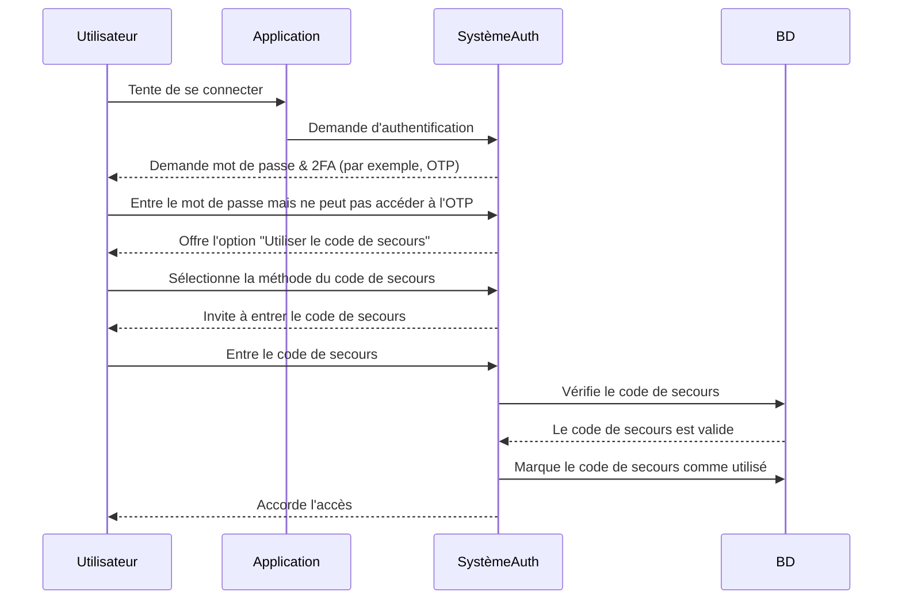

## Qu'est-ce qu'un code de secours ?

Un code de secours (également appelé code de récupération) est un ensemble de codes à usage unique générés aléatoirement qui servent de méthode d'authentification de secours lorsque vos options principales de MFA, telles que les SMS, les applications d'authentification ou les passkeys, ne sont pas disponibles. Pensez à eux comme des clés d'urgence qui garantissent que vous pouvez toujours accéder à votre compte, même si vous perdez votre téléphone, rencontrez des problèmes de réseau ou faites face à des pannes techniques.

## Comment fonctionne un code de secours ?

Les codes de secours offrent un moyen simple mais sécurisé de retrouver l'accès à votre compte lorsque les méthodes standard de MFA échouent. Voici comment ils fonctionnent :

1. **Génération** : Le système crée un ensemble unique de codes (généralement de 8 à 12 caractères chacun) lors de la configuration de la MFA.
2. **Stockage** : Vous êtes invité à enregistrer ces codes de manière sécurisée, soit hors ligne (par exemple, imprimés sur papier) soit dans un gestionnaire de mots de passe chiffré.
3. **Utilisation** : Si vous ne pouvez pas utiliser votre méthode principale de MFA, vous entrez l'un de vos codes de secours pour vous authentifier.
4. **Invalidation** : Chaque code est automatiquement désactivé après utilisation pour éviter toute réutilisation.

## Quand utiliser un code de secours ?

Les codes de secours deviendront-ils obsolètes ? La MFA devrait-elle encore les prendre en charge ?

Absolument. Les codes de secours restent un filet de sécurité essentiel pour la MFA. Bien que des méthodes plus récentes comme les passkeys et FIDO2 gagnent en popularité, les codes de secours offrent une option de récupération universellement accessible et indépendante des appareils. Ils sont une sauvegarde à faible coût et de grande valeur et devraient toujours être pris en charge aux côtés des méthodes modernes de MFA.

Utilisez un code de secours lorsque :

- Votre appareil principal de MFA n'est pas disponible (par exemple, téléphone perdu, batterie déchargée).
- Des problèmes de réseau empêchent la livraison des SMS/emails.
- Votre application d'authentification ne parvient pas à se synchroniser.
- Votre jeton matériel fonctionne mal.

## Comment utiliser un code de secours en toute sécurité ?

Pour garantir que vos codes de secours restent sécurisés :

1. **Stockez-les hors ligne**
    - Enregistrez-les dans un dossier chiffré sur votre appareil.
    - Imprimez-les et stockez-les dans un endroit sécurisé (par exemple, un coffre à clavier).
    - Évitez de les stocker dans des formats numériques non sécurisés (par exemple, applications de notes en ligne).
2. **Utilisez un gestionnaire de mots de passe**
    - La plupart des gestionnaires de mots de passe (par exemple, 1Password, LastPass) offrent une fonction de notes sécurisées.
        - Créez une nouvelle entrée : "Codes de secours – [Nom du service]"
        - Copiez et collez vos codes de secours, puis activez le chiffrement.
    - Si vous utilisez Google Password Manager, vous pouvez :
        - Trouver l'entrée de service pertinente.
        - La modifier et ajouter une note pour vos codes de secours, et étiqueter les codes comme "Utilisés/Non utilisés" pour les suivre.
        - De cette façon, lors du remplissage automatique des mots de passe, vous pouvez accéder rapidement à vos codes de secours si nécessaire.
3. **Remplacez les codes utilisés**
    - Régénérez de nouveaux codes si vous en avez utilisé la plupart ou si vous soupçonnez qu'ils ont été compromis.

## Concevoir une expérience MFA avec des codes de secours

Pour les développeurs implémentant des codes de secours, suivez ces meilleures pratiques :

1. **Ne vous fiez pas uniquement aux codes de secours**
Ils sont un recours d'urgence, pas une méthode principale de MFA. Offrez toujours TOTP, passkeys ou d'autres options robustes.
2. **Fournissez 8 à 10 codes par défaut**
    
    Cela équilibre l'utilisabilité (suffisamment pour des urgences rares) et la sécurité (minimise le risque de vol en masse).
    
3. **Imposez une utilisation unique**
    
    Invalidez automatiquement les codes après utilisation.
    
4. **Régénérez automatiquement les codes lorsqu'ils sont épuisés**
    
    Évitez les verrouillages en émettant de nouveaux codes une fois qu'un utilisateur a épuisé son ensemble actuel.
    
5. **Autorisez la régénération manuelle avec une vérification stricte**
    
    Permettez aux utilisateurs de générer de nouveaux codes s'ils perdent les leurs, mais exigez une ré-authentification (par exemple, confirmation par email/SMS/mot de passe).
    

## Codes de secours vs. Mots de passe : Quelle est la différence ?

| Fonctionnalité | Codes de secours | Mots de passe |
| --- | --- | --- |
| **Objectif** | Recours unique lorsque la MFA échoue | Méthode d'authentification principale |
| **Format** | Généré par le système, alphanumérique | Choisi par l'utilisateur, souvent mélange de caractères |
| **Stockage** | Haché (souvent non salé, car ils sont à usage unique) | Haché + salé (pour prévenir les attaques par table arc-en-ciel) |
| **Utilisation** | Désactivé après une utilisation | Réutilisable jusqu'à modification |
| **Régénération** | Le système émet de nouveaux ensembles | L'utilisateur réinitialise manuellement |
| **Sécurité** | Doit être stocké en toute sécurité | Vulnérable si faible ou réutilisé |

**Notes de sécurité clés :**

- Les deux doivent être longs et générés aléatoirement pour résister aux attaques par force brute.
- Les mots de passe nécessitent un salage car les utilisateurs les réutilisent souvent.
- Les codes de secours n'ont généralement pas besoin de salage - ils sont à usage unique et générés aléatoirement, rendant les exploits à grande échelle peu probables.

<Resources
  urls={[
    "https://docs.logto.io/end-user-flows/mfa",
    "https://auth-wiki.logto.io/mfa",
    "https://auth-wiki.logto.io/totp"
  ]}
/>