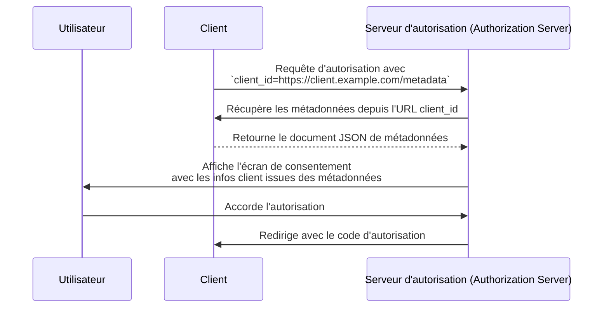

## Qu'est-ce qu'un document de métadonnées d'identifiant client (Client ID Metadata Document) ?

Un document de métadonnées d'identifiant client (Client ID Metadata Document) est un mécanisme défini dans la spécification [OAuth Client ID Metadata Document](https://datatracker.ietf.org/doc/draft-ietf-oauth-client-id-metadata-document/) qui permet à un <Ref slug="client" /> OAuth 2.0 de s'identifier auprès d'un <Ref slug="authorization-server" /> sans enregistrement préalable.

L'idée principale : au lieu de recevoir un `client_id` du serveur d'autorisation (par enregistrement manuel ou via [Dynamic Client Registration](https://datatracker.ietf.org/doc/html/rfc7591)), le client **utilise une URL HTTPS comme `client_id`**. Cette URL pointe vers un document JSON contenant les métadonnées du client — nom, URI de redirection, types de flux supportés, etc. Le serveur d'autorisation récupère ce document lorsqu'il rencontre un `client_id` basé sur une URL.

Cette approche est parfois abrégée en **CIMD** (Client ID Metadata Document) dans la communauté.

## Comment cela fonctionne-t-il ?

Lorsqu'un client utilise un document de métadonnées d'identifiant client (Client ID Metadata Document), le flux OAuth ajoute une étape : le serveur d'autorisation résout l'URL `client_id` pour récupérer les métadonnées du client.



Voici ce qui se passe étape par étape :

1. Le client initie une <Ref slug="authorization-request" /> avec son URL comme `client_id` (par exemple, `https://client.example.com/oauth-client`).
2. Le serveur d'autorisation reconnaît le `client_id` comme une URL et la récupère via HTTPS.
3. La réponse est un document JSON contenant les métadonnées standard du client OAuth.
4. Le serveur d'autorisation valide les métadonnées, affiche les informations de consentement à l'utilisateur, puis poursuit le flux OAuth.
5. Les requêtes suivantes peuvent utiliser les métadonnées en cache selon les en-têtes de cache HTTP.

### Le document de métadonnées

Le document de métadonnées est un objet JSON qui utilise les mêmes champs que ceux définis dans [RFC 7591 (OAuth 2.0 Dynamic Client Registration Protocol)](https://datatracker.ietf.org/doc/html/rfc7591). Il doit inclure un champ `client_id` dont la valeur correspond exactement à l'URL.

Exemple :

```json
{
  "client_id": "https://client.example.com/oauth-client",
  "client_name": "Mon application",
  "redirect_uris": ["https://client.example.com/callback"],
  "grant_types": ["authorization_code", "refresh_token"],
  "response_types": ["code"],
  "token_endpoint_auth_method": "none",
  "scope": "openid profile email"
}
```

### Exigences pour l'URL d'identifiant client

La spécification impose des exigences strictes sur ce qui constitue une URL d'identifiant client valide :

- **Doit utiliser HTTPS** — pas de HTTP simple ou d'autres schémas.
- **Doit inclure un composant de chemin** — un domaine nu comme `https://example.com` n'est pas valide.
- **Ne doit pas contenir** de fragment, nom d'utilisateur ou mot de passe.
- **Ne doit pas contenir** de segments de chemin en point (`.`) ou double point (`..`).
- Les chaînes de requête sont autorisées mais déconseillées.
- Les numéros de port sont autorisés.

Par exemple :
- `https://client.example.com/oauth-client` — valide
- `http://client.example.com/oauth-client` — invalide (pas HTTPS)
- `https://example.com` — invalide (pas de chemin)
- `https://client.example.com/../oauth-client` — invalide (segment point)

## Pourquoi ne pas utiliser les méthodes d'enregistrement existantes ?

Pour comprendre pourquoi cette spécification existe, il faut considérer les limites des approches existantes :

### Enregistrement statique

Dans les déploiements OAuth traditionnels, un développeur enregistre manuellement le client auprès du serveur d'autorisation — généralement via une console d'administration — et reçoit un `client_id`. Cela fonctionne lorsque tu connais tes clients à l'avance.

Cela ne fonctionne pas pour les écosystèmes ouverts où n'importe quel client peut avoir besoin de se connecter. Tu ne peux pas pré-enregistrer chaque agent IA ou client MCP possible.

### Dynamic Client Registration (DCR)

[Dynamic Client Registration (RFC 7591)](https://datatracker.ietf.org/doc/html/rfc7591) permet aux clients de s'enregistrer de manière programmatique en envoyant leurs métadonnées à un point de terminaison d'enregistrement. Le serveur crée un `client_id` et stocke l'enregistrement.

Cela fonctionne, mais crée un état côté serveur : chaque enregistrement produit un enregistrement qui doit être stocké, maintenu et éventuellement supprimé. Dans un écosystème ouvert avec de nombreux clients, le serveur d'autorisation accumule des enregistrements — dont la plupart peuvent être utilisés une seule fois puis abandonnés.

DCR n'a également aucun mécanisme intégré pour vérifier qu'un client est bien celui qu'il prétend être. N'importe quel client peut s'enregistrer avec n'importe quel nom ou logo.

### Avantages du document de métadonnées d'identifiant client (Client ID Metadata Document)

L'approche du document de métadonnées d'identifiant client (Client ID Metadata Document) répond à ces problèmes :

| Aspect | Enregistrement statique | DCR | Document de métadonnées d'identifiant client |
|--------|------------------------|-----|---------------------------------------------|
| État côté serveur | Oui (enregistrements stockés) | Oui (enregistrements stockés) | Non (récupéré à la demande) |
| Pré-enregistrement requis | Oui | Non | Non |
| Vérification d'identité | Revue manuelle | Aucune intégrée | Propriété du domaine via HTTPS |
| Nettoyage nécessaire | Oui | Oui (enregistrements abandonnés) | Non (auto-nettoyage via cache HTTP) |
| Le client contrôle les métadonnées | Non | À l'enregistrement | Oui (mise à jour à tout moment) |

L'idée clé est que **la propriété du domaine devient l'ancre de confiance**. Seule l'entité qui contrôle `client.example.com` peut héberger du contenu à `https://client.example.com/oauth-client`. Le certificat HTTPS le prouve sans étape de vérification supplémentaire.

## Contraintes d'authentification

Comme il n'y a pas de secret partagé à l'avance entre le client et le serveur d'autorisation, les méthodes d'authentification basées sur un secret symétrique ne peuvent pas être utilisées. Le document de métadonnées **ne doit pas** inclure :

- `client_secret_post`
- `client_secret_basic`
- `client_secret_jwt`
- Toute méthode reposant sur un secret symétrique partagé

Les champs `client_secret` et `client_secret_expires_at` ne doivent pas non plus apparaître dans le document.

Si le client doit s'authentifier au-delà d'être un client public, il peut utiliser la cryptographie asymétrique. Le client publie ses clés publiques dans le document de métadonnées (via une propriété `jwks` ou une référence `jwks_uri`) et s'authentifie au point de terminaison de jeton en utilisant `private_key_jwt`. Le serveur d'autorisation vérifie la signature du JWT avec le <Ref slug="jwk">JWK</Ref> publié.

## Comment le serveur d'autorisation découvre-t-il la prise en charge ?

Les serveurs d'autorisation indiquent la prise en charge des documents de métadonnées d'identifiant client (Client ID Metadata Document) en incluant la propriété suivante dans leur <Ref slug="authorization-server-metadata" /> :

```json
{
  "client_id_metadata_document_supported": true
}
```

Les clients peuvent vérifier ce drapeau avant d'initier un flux d'autorisation avec un `client_id` basé sur une URL. Si le serveur d'autorisation n'annonce pas la prise en charge, le client doit revenir à d'autres méthodes d'enregistrement.

## Considérations de sécurité

### Protection contre les SSRF

Lorsque le serveur d'autorisation récupère l'URL de métadonnées, il effectue une requête HTTP vers une URL fournie par le client. C'est un vecteur potentiel de Server-Side Request Forgery (SSRF). Les implémentations doivent :

- Bloquer les requêtes vers les adresses IP privées et de loopback (par exemple, `127.0.0.1`, `10.x.x.x`, `192.168.x.x`)
- Revalider les adresses cibles après avoir suivi les redirections
- Imposer des limites de taille de réponse (la spécification recommande un maximum de 5 Ko)
- Définir des délais d'attente appropriés

### Mise en cache

Les serveurs d'autorisation doivent respecter les en-têtes de cache HTTP (`Cache-Control`, `ETag`) lors de la mise en cache des métadonnées. Cependant :

- **Ne pas mettre en cache les réponses d'erreur** — une défaillance temporaire ne doit pas bloquer définitivement un client.
- Les serveurs peuvent imposer des durées de cache minimales et maximales, quel que soit ce que spécifie le serveur du client.

### Prévention du phishing

Un client malveillant pourrait définir `client_name` sur le nom d'une marque de confiance et `logo_uri` sur son logo. Les serveurs d'autorisation doivent atténuer ce risque en :

- Affichant toujours le nom d'hôte du `client_id` à côté du nom du client sur les écrans de consentement
- Préchargeant et modérant les images de logo plutôt que de les charger directement depuis le client

### Attestation de l'URI de redirection

Un avantage de sécurité par rapport à DCR : les <Ref slug="redirect-uri">URI de redirection</Ref> dans le document de métadonnées sont hébergées sur le domaine du client, servies via HTTPS. Cela crée un lien plus fort entre l'identité du client et ses URI de redirection que des valeurs auto-déclarées dans une requête d'enregistrement.

## Services de document de métadonnées d'identifiant client (Client ID Metadata Document Services)

La spécification définit également les **services de document de métadonnées d'identifiant client (Client ID Metadata Document Services)** — des services web tiers qui hébergent des documents de métadonnées pour le compte des développeurs.

Cela répond à un besoin pratique : lors du développement local, les développeurs n'ont pas d'URL publique pour héberger leurs métadonnées. Un service de document de métadonnées d'identifiant client fournit une URL publique stable que les serveurs d'autorisation peuvent récupérer, pendant que le développeur travaille localement. Cela évite d'exposer les machines locales à Internet ou de mettre en place des tunnels pour tester les flux OAuth.

<SeeAlso slugs={["client", "authorization-server-metadata", "redirect-uri", "jwk"]} />

<Resources
  urls={[
    "https://datatracker.ietf.org/doc/draft-ietf-oauth-client-id-metadata-document/",
    "https://datatracker.ietf.org/doc/html/rfc7591",
    "https://datatracker.ietf.org/doc/html/rfc8414",
  ]}
/>
