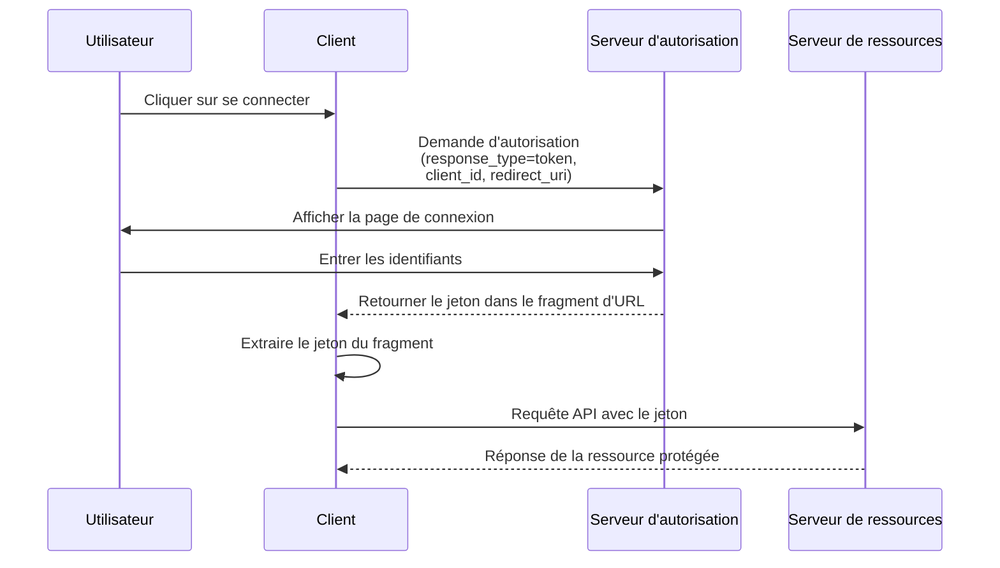

## Qu'est-ce que le flux implicite (implicit flow) ?

Le flux implicite (implicit flow) d'OAuth 2.0 est une méthode d'authentification qui permet aux applications uniquement clientes (comme les SPAs et les applications natives) de recevoir des jetons directement via des fragments d'URL depuis le serveur d'autorisation sans fournir de secret client.

Le flux implicite (implicit flow) est conçu pour les applications uniquement clientes, car elles fonctionnent entièrement dans le navigateur ou sur l'appareil de l'utilisateur et ne peuvent pas stocker en toute sécurité les secrets clients.

Le flux implicite (implicit flow) a été officiellement déprécié dans <Ref slug="oauth-2.1" /> pour des raisons de sécurité (qui seront mentionnées ci-dessous). Les applications uniquement clientes devraient maintenant utiliser le <Ref slug="authorization-code-flow" /> avec l'extension <Ref slug="pkce" /> à la place.

## Comment fonctionne le flux implicite (implicit flow) ?

Les principales étapes du flux implicite (implicit flow) sont les suivantes :

Remarques :

- Le client n'a besoin de fournir qu'un `client_id` dans la demande d'autorisation, sans nécessiter de `client_secret`.  
  Cela est dû au fait que ces clients ne peuvent pas stocker en toute sécurité les secrets, donc ce flux ne nécessite pas de secret client.

- Le paramètre `response_type` est défini sur `token`, indiquant au serveur d'autorisation de retourner directement le jeton d'accès au lieu d'un code d'autorisation.  
  Dans OIDC (<Ref slug="openid-connect" />), le `response_type` est soit `id_token` soit `id_token token`, et le service d'auth retournera les jetons correspondants en fonction des différents types de réponse.

- Le jeton est retourné directement dans le fragment d'URL. Cela signifie que le jeton est exposé dans l'URL et peut être facilement accessible par d'autres applications ou scripts.

## Le flux implicite (implicit flow) est-il sécurisé ?

Non, le flux implicite (implicit flow) dans OAuth 2.0 est généralement considéré comme moins sécurisé que d'autres flux comme le flux de code d'autorisation.

Il n'est pas recommandé pour la plupart des cas d'utilisation en raison de plusieurs vulnérabilités :

- **Exposition du jeton dans l'URL**
   - Les jetons d'accès apparaissent directement dans l'URL du navigateur (après le symbole #)
   - Ces jetons peuvent être :
     - Enregistrés dans l'historique du navigateur
     - Fuités via les en-têtes de référent
     - Capturés par du code JavaScript malveillant sur la même page

- **Pas d'authentification du client**
   - L'application cliente n'a pas besoin de prouver son identité
   - Cela signifie que quiconque connaît le `client_id` peut prétendre être un client légitime

- **Pas de jetons de rafraîchissement**
   - Ce flux ne prend pas en charge les jetons de rafraîchissement
   - Les utilisateurs doivent se reconnecter lorsque les jetons d'accès expirent
   - Pour éviter des connexions fréquentes, les utilisateurs pourraient stocker les jetons de manière non sécurisée

- **Vulnérable aux attaques XSS**
   - Tous les jetons sont gérés dans le navigateur
   - Si le site web subit une attaque XSS (Cross-Site Scripting)
   - Le code JavaScript des attaquants peut facilement voler ces jetons

En raison de ces préoccupations de sécurité, le flux implicite (implicit flow) a été déprécié dans <Ref slug="oauth-2.1" />. Les applications uniquement clientes devraient maintenant utiliser le <Ref slug="authorization-code-flow" /> avec l'extension <Ref slug="pkce" /> à la place.

Vous pouvez consulter [Qu'est-ce que PKCE : des concepts de base à une compréhension approfondie](https://blog.logto.io/how-pkce-protects-the-authorization-code-flow-for-native-apps) pour apprendre comment PKCE protège le flux de code d'autorisation pour les applications uniquement clientes.

<SeeAlso
  slugs={["oauth-2.1", "authorization-code-flow", "pkce", "openid-connect"]}
/>

<Resources
  urls={[
    "https://blog.logto.io/implicit-flow-is-dead",
    {
      url: "https://tools.ietf.org/html/rfc6749#section-4.2",
      result: {
        ogTitle: "The OAuth 2.0 Authorization Framework: Implicit Grant",
        ogDescription:
          "The implicit grant type is used to obtain access tokens (it does not support the issuance of refresh tokens) and is optimized for public clients known to operate a particular redirection URI. These clients are typically implemented in a browser using a scripting language such as JavaScript.",
      },
    },
    "https://openid.net/specs/openid-connect-core-1_0.html",
    "https://blog.logto.io/how-pkce-protects-the-authorization-code-flow-for-native-apps",
  ]}
/>