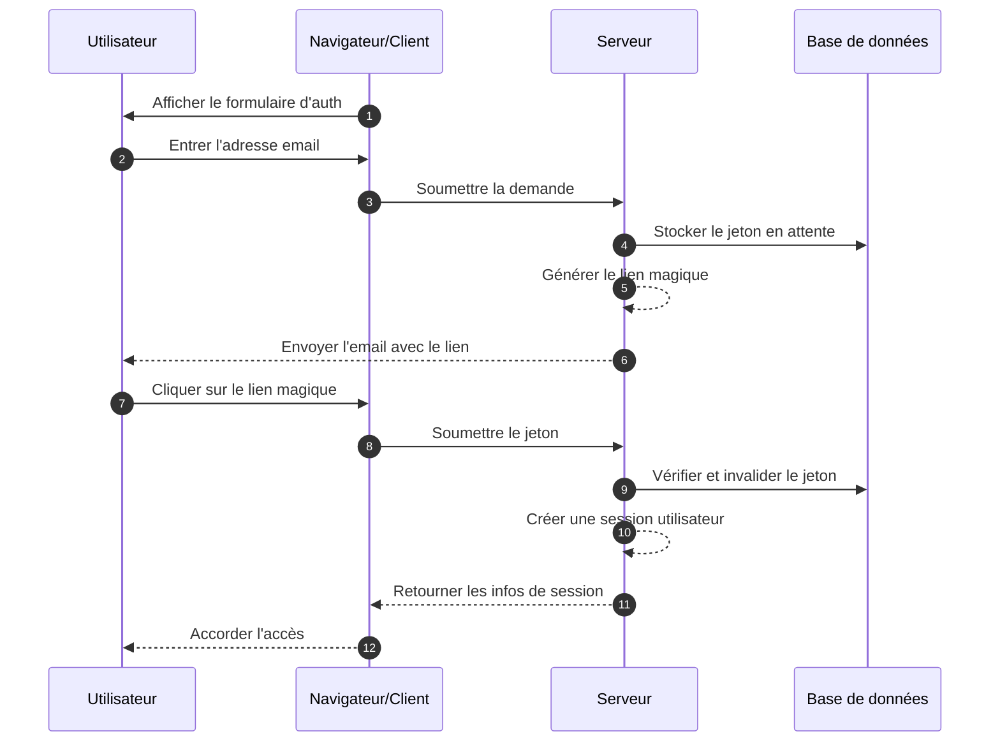
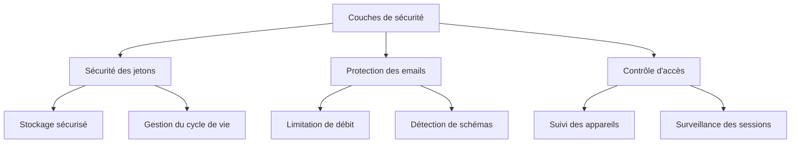

## Qu'est-ce qu'un lien magique ?

Un lien magique est une URL sécurisée et limitée dans le temps qui permet une authentification sans mot de passe pour les processus d'inscription et de connexion. Au lieu de créer et de mémoriser des mots de passe, les utilisateurs reçoivent un lien spécial par email qui leur accorde un accès immédiat. Pensez-y comme une clé numérique qui ne fonctionne qu'une seule fois - lorsque vous cliquez dessus, vous êtes authentifié, et ensuite cette clé devient invalide.

Par exemple, lorsque vous vous inscrivez sur Medium ou essayez de vous connecter à Slack, au lieu de configurer ou de saisir un mot de passe, ces plateformes vous envoient un email avec un lien sécurisé. Un clic, et vous êtes authentifié. Cette approche a gagné en popularité car elle combine sécurité et simplicité.

## Comment fonctionnent les liens magiques ?

Le processus est simple du point de vue de l'utilisateur, mais implique des mécanismes de sécurité sophistiqués en coulisses. Voici ce qui se passe lors d'un flux d'authentification par lien magique typique :



## Quelle est la structure d'un lien magique ?

Un lien magique typique se compose de plusieurs composants :

- URL de base de l'application
- Point de terminaison d'authentification
- Paramètre de jeton
- Paramètres supplémentaires (optionnels)

Par exemple :

```
https://app.example.com/verify-auth?token=abc123...&redirect=/dashboard
```

## Comment le jeton d'un lien magique est-il généré ?

Lorsqu'un utilisateur demande un lien magique (par exemple, en cliquant sur "Se connecter avec Email"), nous devons générer un jeton sécurisé et imprévisible. Ce jeton est crucial car il devient essentiellement un mot de passe temporaire.

Le jeton doit être généré en utilisant un <Ref slug='csprng' />. Un CSPRNG utilise l'entropie du matériel de votre système (comme le timing du clavier, les mouvements de la souris, le bruit du ventilateur, etc.) pour générer des nombres vraiment aléatoires impossibles à prédire, même si un attaquant connaît les sorties précédentes.

Par exemple, en Node.js :

```javascript
import crypto from "node:crypto";

// Générer un jeton aléatoire sécurisé
const token = crypto.randomBytes(32).toString("base64url");
// Résultat : quelque chose comme 'dBjftJeZ4CVP-mB92K27uhbUJU1p1r_wW1gFWFOEjXk'

// Alternative utilisant l'API Web Crypto (disponible en Node.js et navigateurs)
const buffer = crypto.getRandomValues(new Uint8Array(32));
const token2 = Buffer.from(buffer).toString("base64url");
```

Exigences pour un jeton sécurisé :

- Généré via CSPRNG pour garantir l'imprévisibilité
- Au moins 32 octets de long (256 bits d'entropie)
- Encodé de manière sûre pour les URL (base64url élimine les caractères problématiques)
- Limité dans le temps et à usage unique pour prévenir les attaques par relecture
- Stocké en toute sécurité avec des métadonnées (expiration, infos utilisateur)

## Comment sécuriser l'authentification par lien magique

La sécurité des liens magiques nécessite une approche globale à travers plusieurs couches. Bien que la livraison par email et les schémas d'accès soient critiques, la gestion sécurisée des jetons reste la pierre angulaire de la sécurité du système.

### Fondamentaux de la sécurité des jetons

La sécurité des liens magiques dépend fortement de la mise en œuvre correcte des jetons (voir le contenu ci-dessus). Chaque jeton doit être cryptographiquement sécurisé et correctement géré tout au long de son cycle de vie. Le système doit imposer une expiration stricte des jetons (généralement 15-30 minutes) et une invalidation immédiate après utilisation.

Lors du stockage des jetons, traitez-les avec le même niveau de sécurité que les mots de passe :

- Hachez les jetons avant le stockage pour éviter leur exposition
- Implémentez un nettoyage automatique des jetons expirés
- Maintenez une piste d'audit de l'utilisation et de l'invalidation des jetons
- Stockez les métadonnées associées (heure de création, utilisateur prévu, infos sur l'appareil)

### Sécurité de la livraison par email

L'email sert de canal de livraison principal pour les liens magiques, ce qui en fait une cible potentielle pour les attaques. La mise en œuvre de la limitation de débit est essentielle pour prévenir les tentatives de force brute et protéger contre les attaques de bombardement d'emails. Par exemple, vous pourriez limiter les utilisateurs à 5 demandes de lien magique par heure depuis la même adresse IP.

De plus, la surveillance des schémas d'activité inhabituels aide à détecter les violations de sécurité potentielles. Cela inclut :

- Plusieurs demandes provenant d'IP différentes pour le même email
- Schémas d'accès géographiques inhabituels
- Demandes en rafale indiquant des attaques automatisées

### Contrôle d'accès et surveillance

Le fingerprinting des appareils ajoute une couche de sécurité supplémentaire en suivant les schémas cohérents de comportement des utilisateurs. Lorsqu'une tentative de connexion provient d'un nouvel appareil ou d'un nouvel emplacement, vous pouvez mettre en œuvre des étapes de vérification supplémentaires ou alerter l'utilisateur.

Pour une sécurité renforcée dans les applications sensibles :

- Combinez les liens magiques avec des facteurs d'authentification supplémentaires
- Implémentez une surveillance continue des sessions
- Enregistrez tous les événements d'authentification pour les pistes d'audit
- Ajoutez une vérification basée sur l'appareil pour les nouveaux emplacements



## Liens magiques vs SMS / Email OTP

Les liens magiques et les SMS / Email OTP reposent tous deux sur des canaux externes pour la vérification.

Les liens magiques envoient une URL à usage unique à l'email de l'utilisateur, tandis que les OTP envoient un code de vérification à leur téléphone ou email.

Les liens magiques offrent une expérience de bureau supérieure car les utilisateurs cliquent simplement sur le lien pour compléter la vérification, éliminant le besoin de saisir manuellement des codes. Ils peuvent également transporter des informations contextuelles supplémentaires, permettant des flux d'authentification plus sophistiqués.

Cependant, dans les scénarios mobiles, les SMS OTP peuvent offrir une meilleure convivialité car les utilisateurs peuvent rapidement voir et saisir les codes de vérification.

## Liens magiques vs applications d'authentification

Comparés aux codes OTP générés par les applications d'authentification, les liens magiques ne nécessitent pas que les utilisateurs installent des applications supplémentaires et fonctionnent de manière transparente sur tous les appareils. Cela réduit les frictions, en particulier pour les utilisateurs non techniques. Cependant, les applications d'authentification génèrent des codes OTP avec une meilleure fiabilité en temps réel, indépendamment des vitesses de livraison et de la disponibilité des serveurs de messagerie.

Pour les scénarios nécessitant une authentification fréquente avec des exigences de sécurité élevées, les applications d'authentification peuvent être le choix préféré.

## Quand utiliser les liens magiques

Les liens magiques sont particulièrement efficaces pour les applications professionnelles et d'entreprise où les utilisateurs se connectent généralement moins fréquemment, comme les outils de gestion de projet ou les tableaux de bord de reporting. Dans ces scénarios, le léger délai de livraison par email est négligeable par rapport à la commodité de ne pas gérer de mots de passe.

### Scénarios idéaux

Ces méthodes d'authentification brillent dans les contextes professionnels où l'email est déjà le canal de communication principal. Par exemple, les plateformes de collaboration comme Slack ou Notion utilisent efficacement les liens magiques parce que :

- Les utilisateurs surveillent déjà activement leur email
- Les sessions de connexion ont tendance à être de longue durée
- L'accent est mis sur la réduction des frictions dans le processus d'authentification

Les liens magiques sont également excellents pour les flux d'inscription des utilisateurs dans les produits SaaS où l'optimisation de la conversion est cruciale. Lorsque les utilisateurs peuvent commencer à utiliser votre service avec juste une adresse email, cela réduit considérablement les taux d'abandon pendant le processus d'intégration.

### Quand envisager des alternatives

Cependant, les liens magiques peuvent ne pas être le meilleur choix pour les applications nécessitant une authentification fréquente. Les applications bancaires mobiles, par exemple, ont besoin de méthodes d'authentification rapides et fiables puisque les utilisateurs peuvent vérifier leur solde plusieurs fois par jour. Dans de tels cas, l'authentification biométrique ou les codes PIN offrent souvent une meilleure expérience utilisateur.

Envisagez des méthodes d'authentification alternatives lorsque :

- Votre application est principalement basée sur mobile
- Les utilisateurs ont besoin d'un accès immédiat sans dépendance à l'email
- L'environnement nécessite une authentification multi-facteurs
- Les retards de livraison par email pourraient avoir un impact significatif sur l'expérience utilisateur

La clé est d'aligner votre méthode d'authentification avec les schémas de comportement de vos utilisateurs et les exigences de sécurité. Bien que les liens magiques offrent une excellente sécurité avec un minimum de friction, ils devraient faire partie d'une stratégie d'authentification plus large plutôt que d'être la seule solution.

<SeeAlso slugs={["csprng", "passwordless", "otp", "totp"]} />