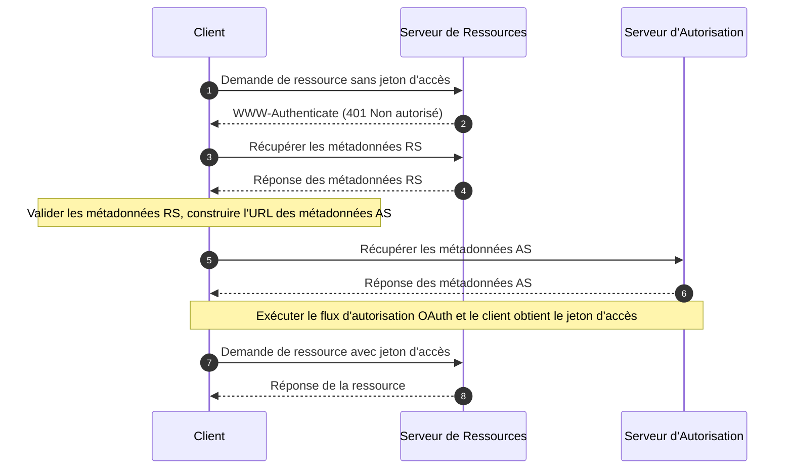

## Qu'est-ce que les métadonnées des ressources protégées OAuth 2.0 ?

Les métadonnées des ressources protégées OAuth 2.0 sont un format standardisé défini dans [RFC 9728](https://datatracker.ietf.org/doc/html/rfc9728). Elles aident les clients et les serveurs d'autorisation à comprendre comment interagir avec les ressources protégées.

Ce format de métadonnées fournit des informations essentielles sur :
- Les capacités du serveur de ressources
- Les formats de jetons pris en charge
- Les mécanismes de sécurité requis
- Les relations avec le serveur d'autorisation
- Les portées et permissions disponibles

## Quels sont les avantages des métadonnées des ressources protégées ?

Dans le système OAuth 2.0, il y a quatre rôles de base :
- <Ref slug="authorization-server"/> : Émet des jetons d'accès aux clients après avoir authentifié avec succès le propriétaire de la ressource
- <Ref slug="client"/> : Application demandant l'accès aux ressources protégées
- <Ref slug="resource-owner"/> : Entité capable d'accorder l'accès aux ressources protégées
- <Ref slug="resource-server"/> : Serveur hébergeant des ressources protégées

Traditionnellement, lorsqu'un client doit accéder à des ressources protégées, il doit d'abord découvrir et interagir avec le serveur d'autorisation pour obtenir les jetons nécessaires. Le rôle du serveur de ressources était principalement limité à la validation des jetons et à la fourniture des ressources, tous les détails d'authentification et d'autorisation étant coordonnés par le serveur d'autorisation et l'application cliente.

Cela signifiait que les clients n'avaient aucun moyen standardisé de découvrir les exigences ou capacités spécifiques d'un serveur de ressources directement.

Les métadonnées des ressources protégées transforment cette dynamique en permettant aux serveurs de ressources de publier activement leurs exigences et capacités, et elles apportent plusieurs avantages clés :
- Découverte directe : Les clients peuvent désormais apprendre directement des exigences d'un serveur de ressources
- Autonomie renforcée : Les serveurs de ressources peuvent spécifier explicitement leurs formats de jetons pris en charge, mécanismes de sécurité et serveurs d'autorisation de confiance
- Interopérabilité améliorée : Un format standardisé assure une communication cohérente des exigences d'accès à travers différentes implémentations
- Configuration dynamique : Les serveurs de ressources peuvent mettre à jour leurs exigences sans dépendre des changements du serveur d'autorisation

## Comment fonctionnent les métadonnées des ressources protégées OAuth 2.0 ?

Les métadonnées des ressources protégées fonctionnent dans l'écosystème OAuth 2.0 à travers un processus standardisé de découverte et d'interaction :



Le document de métadonnées du serveur de ressources est un objet JSON qui contient les champs suivants :

```json
   {
     "resource": "https://api.example.com",
     "authorization_servers": [
       "https://auth.example.com"
     ],
     "scopes_supported": ["read", "write"],
     "token_formats_supported": ["jwt"],
     "token_introspection_endpoint": "https://api.example.com/introspect",
     "dpop_signing_alg_values_supported": ["ES256", "PS256"]
   }
   ```

Et une fois que le client a reçu le document de métadonnées, il peut l'utiliser pour se configurer et interagir avec le serveur de ressources principalement selon les champs suivants :

- `resource`: Identifiant de la ressource protégée
- `authorization_servers`: Liste des serveurs d'autorisation autorisés
- `scopes_supported`: Portées disponibles pour cette ressource
- `token_formats_supported`: Formats de jetons pris en charge
- `token_introspection_endpoint`: Point de terminaison pour la validation des jetons
- `dpop_signing_alg_values_supported`: Algorithmes DPoP pris en charge

## Comment découvrir les points de terminaison des métadonnées des ressources protégées OAuth 2.0 ?

Il existe deux principaux mécanismes de découverte pour les métadonnées des ressources protégées :

1. **Découverte par en-tête WWW-Authenticate (basée sur le flux)** :

Lorsqu'un client fait une demande non autorisée à une ressource protégée, le serveur répond avec un code d'état 401 et inclut l'URL des métadonnées dans l'en-tête WWW-Authenticate :

```bash
# 1. Le client fait une demande sans jeton
GET /api/resource HTTP/1.1
Host: api.example.com

# 2. Le serveur répond avec 401 et l'URL des métadonnées
HTTP/1.1 401 Unauthorized
WWW-Authenticate: Bearer realm="example",
  scope="read write",
  resource_metadata_url="https://api.example.com/.well-known/oauth-resource-server"
```

L'en-tête fournit :
- Identification du domaine de la ressource
- Portées requises
- Emplacement de l'URL des métadonnées

2. **Découverte directe par URI bien connu** :

Vous pouvez accéder directement aux métadonnées en faisant une requête GET au point de terminaison bien connu :

```bash
GET /.well-known/oauth-resource-server HTTP/1.1
Host: api.example.com
```

Le point de terminaison suit un format standardisé :
- URI de base : `https://api.example.com`
- Chemin bien connu : `/.well-known/oauth-resource-server`
- URL complète : `https://api.example.com/.well-known/oauth-resource-server`

## Comment fonctionne l'en-tête WWW-Authenticate dans les métadonnées des ressources protégées ?

L'en-tête WWW-Authenticate est un composant clé dans les métadonnées des ressources protégées pour mettre en œuvre un mécanisme de découverte automatique. Il utilise l'en-tête HTTP standard `WWW-Authenticate` pour transmettre des informations de métadonnées, permettant aux clients de découvrir et de configurer automatiquement les exigences d'accès pour les serveurs de ressources.

Lorsqu'un client tente d'accéder pour la première fois à une ressource protégée sans fournir de jeton d'accès, le serveur de ressources répond avec un code d'état 401 Non autorisé et inclut un en-tête WWW-Authenticate :

```
WWW-Authenticate: Bearer realm="example",
  scope="read write",
  resource_metadata_url="https://api.example.com/.well-known/oauth-resource-server"
```

Cet en-tête peut contenir plusieurs informations clés :
- `Bearer`: Indique qu'il s'agit d'un schéma d'authentification OAuth 2.0 Bearer Token
- `realm`: Définit l'espace de protection de la ressource
- `scope`: Spécifie les permissions d'accès requises
- `resource_metadata_url`: Indique l'emplacement du document de métadonnées contenant la configuration complète du serveur de ressources

En recevant cet en-tête, le client extrait le `resource_metadata_url` et récupère le document de métadonnées complet à partir de cette URL.

En se basant sur les informations de métadonnées obtenues, le client peut déterminer les serveurs d'autorisation appropriés, les formats de jetons pris en charge, les portées disponibles et d'autres détails de configuration pour configurer correctement les demandes d'authentification.

## Comment sécuriser les métadonnées des ressources protégées OAuth 2.0 ?

Les considérations de sécurité essentielles incluent :

1. **Sécurité du transport** :
   - Utilisation obligatoire de TLS
   - Validation des certificats
   - Gestion sécurisée des connexions

2. **Intégrité des métadonnées** :
   - Validation de la source
   - Vérification de la signature
   - Stratégies de mise en cache sécurisées

3. **Contrôle d'accès** :
   - Limitation du débit
   - Validation des requêtes
   - Surveillance des abus

## Comment implémenter les métadonnées des ressources protégées OAuth 2.0 ?

Voici comment les métadonnées des ressources protégées OAuth 2.0 sont implémentées à travers différents composants :

1. **Implémentation du serveur de ressources**

Le serveur de ressources répond avec un statut 401 Non autorisé et inclut l'URL des métadonnées dans l'en-tête WWW-Authenticate lors de la réception d'une tentative d'accès non autorisée :

```
HTTP/1.1 401 Unauthorized
WWW-Authenticate: Bearer realm="example",
  resource_metadata_url="https://api.example.com/.well-known/oauth-resource-server"
```

2. **Implémentation du client**

Le client implémente une fonction asynchrone pour gérer l'accès aux ressources. Lors de la réception d'une réponse 401, cette fonction extrait l'URL des métadonnées de l'en-tête WWW-Authenticate, récupère les métadonnées et les utilise pour la configuration du client :

```javascript
async function handleResourceAccess(response) {
  if (response.status === 401) {
    const wwwAuthenticate = response.headers.get('WWW-Authenticate');
    const metadataUrl = extractMetadataUrl(wwwAuthenticate);
    const metadata = await fetchMetadata(metadataUrl);
    // Configuration du client basée sur les métadonnées
  }
}
```

3. **Structure du document de métadonnées**

Le serveur de ressources fournit un document de métadonnées sous forme d'objet JSON contenant :
- Identifiant de la ressource
- Liste des serveurs d'autorisation autorisés
- Portées prises en charge
- Formats de jetons pris en charge
- Algorithmes de signature DPoP pris en charge

Voici un exemple de document de métadonnées :

```json
{
  "resource": "https://api.example.com",
  "authorization_servers": ["https://auth.example.com"],
  "scopes_supported": ["read", "write"],
  "token_formats_supported": ["jwt"],
  "dpop_signing_alg_values_supported": ["ES256"]
}
```

Ces composants travaillent ensemble pour former une implémentation complète des métadonnées des ressources protégées OAuth 2.0. Grâce à cette implémentation, les clients peuvent découvrir et configurer automatiquement les paramètres nécessaires pour accéder aux ressources protégées.

<SeeAlso slugs={["resource-server", "authorization-server"]} />

<Resources urls={[
  "https://datatracker.ietf.org/doc/html/rfc9728",
]} />