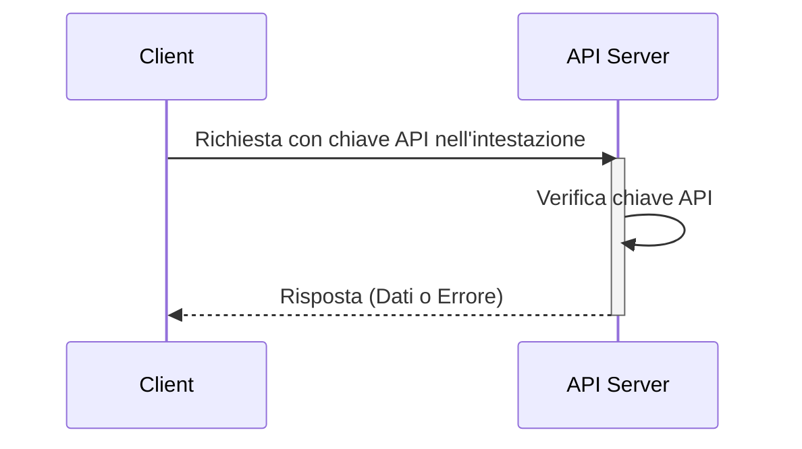

## Che cos'è una chiave API?

Una chiave API è un token segreto utilizzato per autenticare i client che accedono a un'API. È come una password per la tua applicazione, consente l'accesso a una specifica API. Pensala come una tessera magnetica per accedere a un edificio. La tessera concede l'accesso, ma non identifica necessariamente chi sei.

## Come funzionano le chiavi API?

Le chiavi API funzionano attraverso un semplice processo di richiesta e risposta.

1. **Richiesta:** La tua applicazione invia una richiesta all'API, includendo la chiave API. La chiave viene spesso inviata nell'intestazione della richiesta. Ad esempio, l'intestazione potrebbe apparire così: `x-api-key: your_actual_api_key`. Non esiste uno standard unico per i nomi delle intestazioni o i formati dei valori.

2. **Verifica:** Il server API controlla la chiave fornita rispetto al suo database.

3. **Risposta:** Se la chiave è valida, il server concede l'accesso e invia i dati richiesti. In caso contrario, l'accesso viene negato.

Ecco un diagramma di sequenza che illustra il processo:

## Quali sono i pro e i contro delle chiavi API?

Vediamo cosa rende utili le chiavi API e dove mancano:

### Pro

- **Super semplice da usare**: Basta aggiungere una chiave alla tua richiesta e sei a posto! È come usare una chiave di casa - nessun passaggio complicato necessario.

- **Facile da tracciare**: Vuoi sapere chi sta usando la tua API? Le chiavi API lo rendono semplice. Puoi vedere quali app stanno effettuando chiamate e con quale frequenza.

- **Limitazione rapida del tasso**: Impedisci alle persone di abusare della tua API impostando limiti per chiave. È come avere un buttafuori in un club che conta quante volte qualcuno entra ed esce.

- **Perfetto per dati pubblici**: Se stai condividendo informazioni non sensibili (come dati meteorologici o statistiche pubbliche), le chiavi API sono perfette.

### Contro

- **Meno sicure rispetto alle alternative moderne**: Le chiavi API non sono efficaci quanto altre forme di autenticazione API, come <Ref slug="oauth-2.0" /> e <Ref slug="jwt" />. Pensale come un lucchetto di base rispetto a un moderno sistema di sicurezza. Tuttavia, rimangono popolari perché sono il modo più semplice per tracciare l'uso dell'API e iniziare con la sicurezza dell'API.

- **Rischi di sicurezza**: Le chiavi API sono come lasciare la chiave di casa sotto lo zerbino. Se qualcuno la trova, può usarla per sempre. Ecco perché:
  - Sono spesso visibili nel codice
  - Non scadono automaticamente
  - Se trapelate (come nei repository pubblici di GitHub), chiunque può usarle

- **Non possono distinguere gli utenti**: Mentre alcune aziende usano "chiavi API" che possono identificare gli utenti (come Stripe), le chiavi API tradizionali non possono dirti chi è chi. Ti dicono solo quale applicazione sta effettuando la richiesta.

- **Statiche per natura**: A differenza dei moderni token di autenticazione che scadono, le chiavi API di solito rimangono le stesse per sempre. Questo significa:
  - Nessun aggiornamento automatico della sicurezza
  - Lavoro manuale necessario per ruotare le chiavi
  - Maggiore rischio se le chiavi vengono esposte

## Quali sono i casi d'uso per le chiavi API?

- Comunicazione servizio-a-servizio: Le chiavi API sono adatte per scenari in cui le applicazioni devono comunicare con le API direttamente tramite CLI. Ad esempio, chiamare le API di OpenAI.
- API pubbliche: Quando si espongono API al pubblico, le chiavi API forniscono un metodo semplice di controllo dell'accesso.
- Configurazione semplificata: Per esigenze di autenticazione rapide e semplici, specialmente nella fase di sviluppo. A differenza dell'autenticazione Machine-to-machine, le chiavi API non richiedono la registrazione del client in anticipo e non necessitano di scambio per un access token. Basta passare la tua chiave API come parametro nella tua richiesta e funziona semplicemente.

Nei scenari del mondo reale, lo scopo più comune quando si costruiscono prodotti è l'integrazione del prodotto. Ecco un caso d'uso tipico:

### Esempio: Integrazione con Stripe

Stripe utilizza le chiavi API per un'integrazione sicura con diverse piattaforme e applicazioni. Puoi creare, visualizzare, eliminare e gestire queste chiavi tramite il Developers Dashboard. Utilizzando le chiavi API, puoi integrare le funzionalità di checkout e fatturazione di Stripe nel tuo prodotto.

## Qual è la differenza tra Personal Access Tokens (PAT) e Machine-to-Machine (M2M)?

Quando si parla di chiavi API, i personal access tokens e <Ref slug="machine-to-machine" /> possono essere menzionati insieme poiché tutti possono accedere programmaticamente alle risorse API tramite comandi CLI o stabilire comunicazioni tra servizi backend.

### Personal Access Tokens (PATs)

Un personal access token è anche una stringa ma rappresenta l'identità e i permessi di ***un utente specifico***, viene generato dinamicamente al momento dell'autenticazione o del login riuscito e ha tipicamente una durata limitata ma può essere rinnovato. Fornisce un controllo di accesso dettagliato ai dati e alle capacità specifiche dell'utente ed è comunemente utilizzato per strumenti CLI, script o accesso personale alle API. La differenza principale è che è più specifico e utilizzato per azioni specifiche dell'utente.

### Machine-to-Machine (M2M)

La comunicazione M2M è quando i dispositivi scambiano automaticamente dati senza coinvolgimento umano in un senso più ampio.

Nel contesto di <Ref slug="openid-connect" /> (o <Ref slug="oauth-2.0" />), le applicazioni M2M utilizzano il <Ref slug="client-credentials-flow" />, come definito nel [protocollo OAuth 2.0 RFC 6749](https://datatracker.ietf.org/doc/html/rfc6749), che supporta protocolli standard simili. Di solito coinvolge un'applicazione client (una macchina o un servizio) che accede alle risorse da sola o per conto di un utente. È ideale per situazioni in cui solo i client fidati possono accedere ai servizi backend.

<SeeAlso slugs={["machine-to-machine"]} />