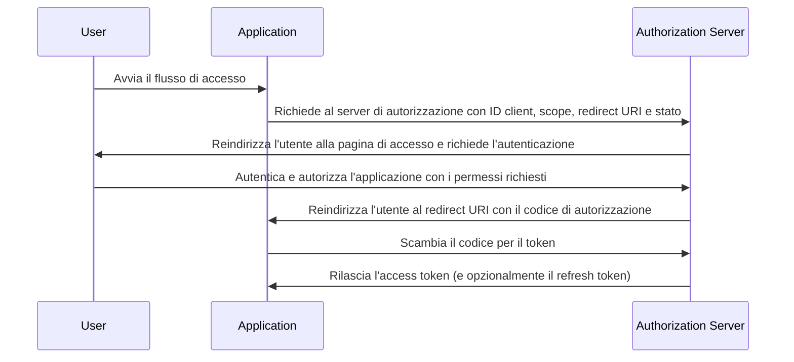

## Cos'è il flusso del codice di autorizzazione (authorization code flow)?

Il flusso del codice di autorizzazione (authorization code flow) (noto anche come concessione del codice di autorizzazione), definito in [OAuth 2.0 RFC 6749, sezione 4.1](https://datatracker.ietf.org/doc/html/rfc6749#section-4.1), è un meccanismo di autorizzazione OAuth 2.0 ampiamente utilizzato che consente alle applicazioni di ottenere un access token per conto di un utente.

Questo flusso è ideale per applicazioni riservate come le tradizionali app web lato server che possono memorizzare in modo sicuro i segreti del client.

Può anche essere utilizzato in modo sicuro per app native e Single Page Applications (SPAs) che non possono memorizzare in modo sicuro i segreti del client quando combinato con l'estensione PKCE (<Ref slug="pkce" />).

## Come funziona il flusso del codice di autorizzazione (authorization code flow)?

Il flusso del codice di autorizzazione (authorization code flow) coinvolge i seguenti passaggi:

1. **Inizio del flusso**: L'utente avvia il flusso tipicamente cliccando su un link o un pulsante nell'applicazione per accedere. L'applicazione reindirizza l'utente all'endpoint di autorizzazione del server di autorizzazione, passando l'ID del client, lo scope richiesto, un redirect URI e un parametro di stato. Il server di autorizzazione convalida i parametri e invita l'utente ad autenticarsi sulla pagina di accesso del server di autorizzazione.
2. **Autenticazione e autorizzazione dell'utente**: L'utente si autentica con il server di autorizzazione e concede all'applicazione il permesso di accedere alle risorse richieste.
3. **Generazione del codice e reindirizzamento**: Il server di autorizzazione genera un codice di autorizzazione e reindirizza l'utente all'applicazione utilizzando il redirect URI fornito in precedenza. Il codice di autorizzazione è incluso nella stringa di query del redirect URI.
4. **Scambio del codice**: L'applicazione estrae il codice di autorizzazione dalla stringa di query e effettua una richiesta POST all'endpoint del token del server di autorizzazione per scambiare il codice di autorizzazione con un access token. L'applicazione deve anche includere l'ID del client, il segreto del client, il redirect URI e il codice di autorizzazione nella richiesta.
5. **Recupero dell'access token**: Il server di autorizzazione convalida il codice di autorizzazione e rilascia un access token (e opzionalmente un refresh token) all'applicazione dopo una convalida riuscita. L'applicazione può quindi utilizzare l'access token per effettuare richieste API autorizzate per conto dell'utente.

I passaggi possono essere illustrati dal seguente diagramma di sequenza:



## Come implementare il flusso del codice di autorizzazione (authorization code flow)?

Ecco un semplice esempio di implementazione del flusso del codice di autorizzazione (authorization code flow), seguendo le linee guida delineate in [OAuth 2.0 RFC 6749, sezione 4.1](https://datatracker.ietf.org/doc/html/rfc6749#section-4.1):

### 1. Configurazione iniziale

Assicurati di avere le seguenti informazioni dal tuo servizio di auth prima di iniziare:

```javascript
const config = {
  clientId: "YOUR_CLIENT_ID",
  clientSecret: "YOUR_CLIENT_SECRET",
  authorizationEndpoint: "https://authorization-server.com/auth",
  tokenEndpoint: "https://authorization-server.com/token",
  redirectUri: "http://localhost:3000/callback",
};
```

Client ID, client secret e redirect URI sono la configurazione della tua applicazione nel servizio di auth.

L'`authorizationEndpoint` e il `tokenEndpoint` sono forniti dal tuo servizio di auth.

Se il tuo server di auth implementa OIDC (<Ref slug="openid-connect" />), puoi ottenere queste informazioni tramite <Ref slug="openid-connect-discovery" />.

### 2. Inizia la richiesta di autorizzazione

Il flusso inizia quando un utente vuole accedere (ad esempio, cliccando un pulsante di login). L'applicazione effettuerà una richiesta di login.

Questa richiesta include parametri come `client ID`, `redirect URI` e `scope`. Quindi reindirizza l'utente all'endpoint di autorizzazione del servizio di auth (la pagina di login del servizio di auth).

L'utente si autenticherà e autorizzerà su questa pagina di login.

```javascript
app.get("/login", (req, res) => {
  const authUrl = new URL(config.authorizationEndpoint);
  authUrl.searchParams.append("response_type", "code");
  authUrl.searchParams.append("client_id", config.clientId);
  authUrl.searchParams.append("redirect_uri", config.redirectUri);
  authUrl.searchParams.append("scope", "openid profile email");
  authUrl.searchParams.append("state", "random_state_string");

  res.redirect(authUrl.toString());
});
```

Nota: Puoi aggiungere più parametri oltre a quelli mostrati nel codice di esempio. Vedi [Definizione completa dei parametri della richiesta di autenticazione](https://openid.net/specs/openid-connect-core-1_0.html#AuthRequest).

### 3. Gestisci il callback del redirect URI e lo scambio di token

Dopo che l'utente completa l'autenticazione e l'autorizzazione sulla pagina di login del servizio di auth, il servizio di auth reindirizza l'utente al redirect URI dell'applicazione. Questo redirect URI include il codice di autorizzazione e i parametri di stato.

L'applicazione estrae il codice di autorizzazione e i parametri di stato dal redirect URI e li scambia per ottenere access e refresh token (se presenti) all'endpoint del token del servizio di auth.

```javascript
app.get("/callback", async (req, res) => {
  const { code, state } = req.query;

  try {
    // Scambia il codice di autorizzazione per un access token e un refresh token
    const tokenResponse = await axios.post(config.tokenEndpoint, {
      grant_type: "authorization_code",
      code,
      redirect_uri: config.redirectUri,
      client_id: config.clientId,
      client_secret: config.clientSecret,
    });

    const { access_token, refresh_token } = tokenResponse.data;
    // Memorizza i token per richieste successive
    req.session.accessToken = access_token;

    res.send("Autenticazione riuscita!");
  } catch (error) {
    res.status(500).send("Scambio del token fallito");
  }
});
```

### 4. Usa l'access token

Una volta ottenuto il token, usalo per accedere alle risorse protette:

```javascript
async function fetchUserProfile(accessToken) {
  const response = await axios.get("https://api.example.com/userinfo", {
    headers: {
      Authorization: `Bearer ${accessToken}`,
    },
  });
  return response.data;
}
```

## Come utilizzare il flusso del codice di autorizzazione (authorization code flow) per client pubblici (app native e SPAs)?

I client pubblici (come app native e SPAs) affrontano sfide di sicurezza uniche quando utilizzano il flusso del codice di autorizzazione (authorization code flow). Queste applicazioni non possono memorizzare in modo sicuro i segreti del client. Il segreto del client sarebbe esposto nel codice JavaScript o all'interno della memoria del dispositivo. Questo rende facile per gli attaccanti estrarre e abusare del segreto.

Pertanto, la sfida principale è come utilizzare il flusso del codice di autorizzazione (authorization code flow) in modo sicuro senza un segreto del client. La specifica OAuth 2.0 ha introdotto l'estensione PKCE (<Ref slug="pkce" />) per risolvere questo problema.

PKCE aggiunge misure di sicurezza aggiuntive per proteggere il flusso del codice di autorizzazione (authorization code flow) per i client pubblici. Previene gli attacchi di intercettazione del codice di autorizzazione anche senza utilizzare un segreto del client. Dai un'occhiata a questo blog per saperne di più su [Come PKCE protegge il flusso del codice di autorizzazione (authorization code flow) per le app native](https://blog.logto.io/how-pkce-protects-the-authorization-code-flow-for-native-apps).

## Come utilizzare il flusso del codice di autorizzazione (authorization code flow) in modo sicuro?

### **Utilizzo di "state" per prevenire attacchi CSRF**

Gli attacchi CSRF (<Ref slug="csrf" />) inducono gli utenti a eseguire azioni indesiderate in un'applicazione web autenticata. Il parametro state aiuta a prevenire questo.

- Genera un valore unico e casuale. Memorizza questo valore lato server.
- Includi il parametro state. Aggiungilo all'URL della richiesta di autorizzazione.
- Verifica lo state al ritorno. Quando il server di autorizzazione reindirizza alla tua app, confronta lo state restituito con il valore memorizzato. Se non corrispondono, rifiuta la richiesta. Questo conferma che la richiesta è originata dalla tua applicazione.

### **Configurazione di redirect URI sicuri**

Il redirect URI è dove il server di autorizzazione invia il codice di autorizzazione dopo l'autenticazione dell'utente. La configurazione sicura è cruciale.

- Registra redirect URI validi. Durante la registrazione dell'app con il server di autorizzazione, specifica i redirect URI consentiti.
- Corrispondenza esatta. Il redirect URI nella richiesta di autorizzazione deve corrispondere esattamente a un URI registrato. Anche una piccola differenza può creare una vulnerabilità.
- Evita URI con caratteri jolly. Se possibile, evita di utilizzare URI con caratteri jolly in produzione. Ampliano la superficie di attacco.
- HTTPS per la produzione. Usa sempre HTTPS per i redirect URI negli ambienti di produzione.

### **Utilizzo di PKCE per tutti i client**

Sebbene PKCE fosse originariamente progettato per i client pubblici, la specifica <Ref slug="oauth-2.1" /> richiede che PKCE sia applicato a tutti i client, inclusi i client riservati, per migliorare la sicurezza complessiva del flusso del codice di autorizzazione (authorization code flow). (Vedi [Applicare PKCE per tutti i client](https://auth.wiki/oauth-2.1#enforcing-pkce-for-all-clients))

## Qual è la differenza tra il flusso del codice di autorizzazione (authorization code flow) e il flusso implicito (implicit flow)?

La principale differenza tra il flusso del codice di autorizzazione (authorization code flow) e il flusso implicito (implicit flow) è come viene ottenuto l'access token:

- **Flusso del codice di autorizzazione (authorization code flow)**: L'applicazione client riceve prima un codice di autorizzazione dall'endpoint di autorizzazione, quindi lo scambia per un access token in una successiva richiesta POST all'endpoint del token.
- **Flusso implicito (implicit flow)**: L'applicazione client riceve direttamente l'access token nel frammento dell'URL del redirect URI dopo l'autorizzazione dell'utente.

Scopri di più su <Ref slug="implicit-flow" />.

## Qual è la differenza tra il flusso del codice di autorizzazione (authorization code flow) e il flusso delle credenziali del client (client credentials flow)?

La principale differenza tra il flusso del codice di autorizzazione (authorization code flow) e il flusso delle credenziali del client (client credentials flow) è il contesto in cui viene utilizzato il flusso:

- **Flusso del codice di autorizzazione (authorization code flow)**: Utilizzato quando l'applicazione client deve accedere alle risorse per conto di un utente. Il flusso coinvolge l'autenticazione e l'autorizzazione dell'utente.
- **Flusso delle credenziali del client (client credentials flow)**: Utilizzato quando l'applicazione client deve accedere alle risorse per conto proprio. Il flusso coinvolge l'autenticazione del client ma non l'autenticazione dell'utente, ed è più adatto per la comunicazione machine-to-machine.

Scopri di più su <Ref slug="client-credentials-flow" />.

<SeeAlso
  slugs={[
    "device-flow",
    "implicit-flow",
    "client-credentials-flow",
    "pkce",
    "openid-connect",
    "openid-connect-discovery",
    "csrf",
    "oauth-2.1",
  ]}
/>

<Resources urls={[
  "https://datatracker.ietf.org/doc/html/rfc6749",
  "https://openid.net/specs/openid-connect-core-1_0.html#AuthRequest",
  "https://blog.logto.io/how-pkce-protects-the-authorization-code-flow-for-native-apps"
]} />