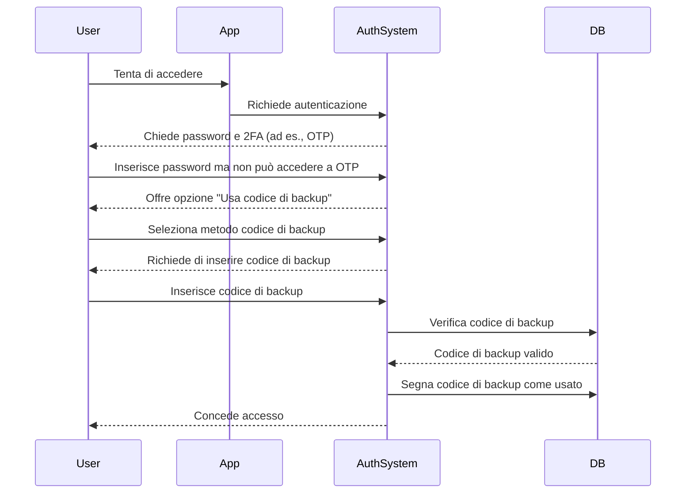

## Cos'è un codice di backup?

Un codice di backup (chiamato anche codice di recupero) è un insieme di codici generati casualmente e monouso che fungono da metodo di autenticazione di riserva quando le tue opzioni MFA principali, come SMS, app di autenticazione o passkey, non sono disponibili. Pensali come chiavi di emergenza che garantiscono sempre l'accesso al tuo account, anche se perdi il telefono, hai problemi di rete o incontri guasti tecnici.

## Come funziona un codice di backup?

I codici di backup forniscono un modo semplice ma sicuro per riottenere l'accesso al tuo account quando i metodi MFA standard falliscono. Ecco come funzionano:

1. **Generazione**: Il sistema crea un insieme unico di codici (tipicamente da 8 a 12 caratteri ciascuno) durante la configurazione MFA.
2. **Conservazione**: Ti viene chiesto di salvare questi codici in modo sicuro, offline (ad esempio, stampati su carta) o in un gestore di password crittografato.
3. **Utilizzo**: Se non puoi utilizzare il tuo metodo MFA principale, inserisci uno dei tuoi codici di backup per autenticarti.
4. **Invalidazione**: Ogni codice viene automaticamente disabilitato dopo l'uso per prevenire il riutilizzo.

## Quando usare un codice di backup?

I codici di backup diventeranno obsoleti? L'MFA dovrebbe ancora supportarli?

Assolutamente. I codici di backup rimangono una rete di sicurezza critica per l'MFA. Mentre metodi più recenti come le passkey e FIDO2 stanno guadagnando terreno, i codici di backup offrono un'opzione di recupero universalmente accessibile e indipendente dal dispositivo. Sono una salvaguardia a basso costo e alto valore e dovrebbero sempre essere supportati insieme ai metodi MFA moderni.

Usa un codice di backup quando:

- Il tuo dispositivo MFA principale non è disponibile (ad es., telefono perso, batteria scarica).
- Problemi di rete impediscono la consegna di SMS/email.
- La tua app di autenticazione non riesce a sincronizzarsi.
- Il tuo token hardware non funziona.

## Come usare un codice di backup in modo sicuro?

Per garantire che i tuoi codici di backup rimangano sicuri:

1. **Conservali offline**
    - Salvali in una cartella crittografata sul tuo dispositivo.
    - Stampali e conservali in un luogo sicuro (ad es., una cassaforte con tastiera).
    - Evita di conservarli in formati digitali non sicuri (ad es., app di note online).
2. **Usa un gestore di password**
    - La maggior parte dei gestori di password (ad es., 1Password, LastPass) offre una funzione di note sicure.
        - Crea una nuova voce: "Codici di Backup – [Nome del Servizio]"
        - Copia e incolla i tuoi codici di backup, quindi abilita la crittografia.
    - Se usi Google Password Manager, puoi:
        - Trovare la voce del servizio pertinente.
        - Modificarla e aggiungere una nota per i tuoi codici di backup, etichettando i codici come "Usati/Non usati" per tenerne traccia.
        - In questo modo, quando compili automaticamente le password, puoi accedere rapidamente ai tuoi codici di backup quando necessario.
3. **Sostituisci i codici usati**
    - Rigenera nuovi codici se hai usato la maggior parte di essi o sospetti che siano stati compromessi.

## Progettare un'esperienza MFA con codici di backup

Per gli sviluppatori che implementano codici di backup, segui queste migliori pratiche:

1. **Non fare affidamento solo sui codici di backup**
Sono un ripiego di emergenza, non un metodo MFA primario. Offri sempre TOTP, passkey o altre opzioni robuste.
2. **Fornisci 8–10 codici di default**
    
    Questo bilancia l'usabilità (abbastanza per emergenze rare) e la sicurezza (minimizza il rischio di furto in massa).
    
3. **Imponi l'uso una tantum**
    
    Invalida automaticamente i codici dopo l'uso.
    
4. **Rigenera automaticamente i codici quando esauriti**
    
    Previeni i blocchi emettendo nuovi codici una volta che un utente esaurisce il suo set corrente.
    
5. **Consenti la rigenerazione manuale con verifica rigorosa**
    
    Permetti agli utenti di generare nuovi codici se perdono i loro, ma richiedi la riautenticazione (ad es., conferma email/SMS/password).
    

## Codici di backup vs. Password: Qual è la differenza?

| Caratteristica | Codici di backup | Password |
| --- | --- | --- |
| **Scopo** | Ripiego una tantum quando l'MFA fallisce | Metodo di autenticazione primario |
| **Formato** | Generato dal sistema, alfanumerico | Scelto dall'utente, spesso mix di caratteri |
| **Conservazione** | Hash (spesso non salato, poiché sono monouso) | Hash + salato (per prevenire attacchi con tabelle arcobaleno) |
| **Utilizzo** | Disabilitato dopo un uso | Riutilizzabile fino a modifica |
| **Rigenerazione** | Il sistema emette nuovi set | L'utente reimposta manualmente |
| **Sicurezza** | Deve essere conservato in modo sicuro | Vulnerabile se debole o riutilizzato |

**Note chiave sulla sicurezza:**

- Entrambi dovrebbero essere lunghi e generati casualmente per resistere agli attacchi di forza bruta.
- Le password richiedono salatura perché gli utenti spesso le riutilizzano.
- I codici di backup tipicamente non necessitano di salatura: sono monouso e generati casualmente, rendendo improbabili gli exploit su larga scala.

<Resources
  urls={[
    "https://docs.logto.io/end-user-flows/mfa",
    "https://auth-wiki.logto.io/mfa",
    "https://auth-wiki.logto.io/totp"
  ]}
/>