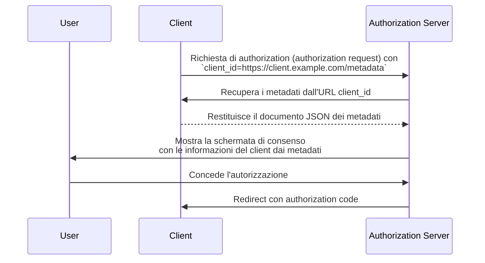

## Che cos'è un Documento dei metadati del Client ID (Client ID Metadata Document)?

Un Documento dei metadati del Client ID (Client ID Metadata Document) è un meccanismo definito nella specifica [OAuth Client ID Metadata Document](https://datatracker.ietf.org/doc/draft-ietf-oauth-client-id-metadata-document/) che consente a un <Ref slug="client" /> OAuth 2.0 di identificarsi presso un <Ref slug="authorization-server" /> senza registrazione preventiva.

L'idea centrale: invece di ricevere un `client_id` dal authorization server (tramite registrazione manuale o [Dynamic Client Registration](https://datatracker.ietf.org/doc/html/rfc7591)), il client **usa un URL HTTPS come proprio `client_id`**. Questo URL punta a un documento JSON contenente i metadati del client — nome, redirect URI, grant type supportati e altro. Il authorization server recupera questo documento quando incontra un `client_id` basato su URL.

Questo approccio è talvolta abbreviato come **CIMD** (Client ID Metadata Document) nella comunità.

## Come funziona?

Quando un client utilizza un Documento dei metadati del Client ID (Client ID Metadata Document), il flusso OAuth aggiunge un passaggio: il authorization server risolve l'URL `client_id` per recuperare i metadati del client.



Ecco cosa succede passo dopo passo:

1. Il client avvia una <Ref slug="authorization-request" /> usando il proprio URL come `client_id` (ad esempio, `https://client.example.com/oauth-client`).
2. Il authorization server riconosce il `client_id` come URL e lo recupera tramite HTTPS.
3. La risposta è un documento JSON contenente i metadati standard del client OAuth.
4. Il authorization server valida i metadati, mostra le informazioni di consenso all'utente e prosegue con il flusso OAuth.
5. Le richieste successive possono utilizzare i metadati in cache secondo le intestazioni di caching HTTP.

### Il documento dei metadati

Il documento dei metadati è un oggetto JSON che utilizza gli stessi campi definiti in [RFC 7591 (OAuth 2.0 Dynamic Client Registration Protocol)](https://datatracker.ietf.org/doc/html/rfc7591). Deve includere un campo `client_id` il cui valore corrisponde esattamente all'URL.

Ecco un esempio:

```json
{
  "client_id": "https://client.example.com/oauth-client",
  "client_name": "My Application",
  "redirect_uris": ["https://client.example.com/callback"],
  "grant_types": ["authorization_code", "refresh_token"],
  "response_types": ["code"],
  "token_endpoint_auth_method": "none",
  "scope": "openid profile email"
}
```

### Requisiti per l'URL identificatore del client

La specifica impone requisiti rigorosi su cosa costituisce un URL identificatore del client valido:

- **Deve usare HTTPS** — niente HTTP semplice o altri schemi.
- **Deve includere una componente path** — un dominio nudo come `https://example.com` non è valido.
- **Non deve contenere** componenti fragment, username o password.
- **Non deve contenere** segmenti di percorso con punto singolo (`.`) o doppio punto (`..`).
- Le query string sono permesse ma sconsigliate.
- I numeri di porta sono permessi.

Ad esempio:
- `https://client.example.com/oauth-client` — valido
- `http://client.example.com/oauth-client` — non valido (non HTTPS)
- `https://example.com` — non valido (nessun path)
- `https://client.example.com/../oauth-client` — non valido (segmento con punto)

## Perché non usare i metodi di registrazione esistenti?

Per capire perché esiste questa specifica, considera i limiti degli approcci esistenti:

### Registrazione statica

Nelle implementazioni OAuth tradizionali, uno sviluppatore registra manualmente il client presso il authorization server — tipicamente tramite una console di amministrazione — e riceve un `client_id`. Questo funziona quando conosci in anticipo i tuoi client.

Non funziona per ecosistemi aperti dove qualsiasi client potrebbe dover connettersi. Non puoi pre-registrare ogni possibile agente AI o client MCP.

### Dynamic Client Registration (DCR)

[Dynamic Client Registration (RFC 7591)](https://datatracker.ietf.org/doc/html/rfc7591) consente ai client di registrarsi programmaticamente inviando i propri metadati a un endpoint di registrazione. Il server crea un `client_id` e memorizza la registrazione.

Questo funziona, ma crea stato lato server: ogni registrazione produce un record che deve essere memorizzato, mantenuto e infine eliminato. In un ecosistema aperto con molti client, il authorization server accumula registrazioni — la maggior parte delle quali potrebbe essere usata una sola volta e poi abbandonata.

DCR inoltre non ha un meccanismo integrato per verificare che un client sia chi dichiara di essere. Qualsiasi client può registrarsi con qualsiasi nome o logo.

### Vantaggi del Documento dei metadati del Client ID (Client ID Metadata Document)

L'approccio del Documento dei metadati del Client ID (Client ID Metadata Document) affronta questi problemi:

| Aspetto | Registrazione statica | DCR | Documento dei metadati del Client ID |
|--------|-------------------|-----|----------------------------|
| Stato lato server | Sì (record memorizzati) | Sì (record memorizzati) | No (recuperato su richiesta) |
| Registrazione preventiva richiesta | Sì | No | No |
| Verifica dell'identità | Revisione manuale | Nessuna integrata | Proprietà del dominio tramite HTTPS |
| Pulizia necessaria | Sì | Sì (record abbandonati) | No (autopulizia tramite cache HTTP) |
| Il client controlla i metadati | No | Al momento della registrazione | Sì (aggiornabile in qualsiasi momento) |

L'intuizione chiave è che **la proprietà del dominio diventa l'ancora di fiducia**. Solo chi controlla `client.example.com` può ospitare contenuti su `https://client.example.com/oauth-client`. Il certificato HTTPS lo dimostra senza ulteriori verifiche.

## Vincoli di autenticazione

Poiché non esiste un segreto condiviso in anticipo tra il client e il authorization server, non possono essere utilizzati metodi di autenticazione basati su segreto simmetrico. Il documento dei metadati **non deve** includere:

- `client_secret_post`
- `client_secret_basic`
- `client_secret_jwt`
- Qualsiasi metodo che si basi su un segreto simmetrico condiviso

I campi `client_secret` e `client_secret_expires_at` non devono nemmeno apparire nel documento.

Se il client deve autenticarsi oltre ad essere un public client, può usare la crittografia asimmetrica. Il client pubblica le proprie chiavi pubbliche nel documento dei metadati (tramite una proprietà `jwks` o un riferimento `jwks_uri`) e si autentica all'endpoint token usando `private_key_jwt`. Il authorization server verifica la firma JWT rispetto al <Ref slug="jwk">JWK</Ref> pubblicato.

## Come scopre il supporto il authorization server?

I authorization server indicano il supporto per i Documenti dei metadati del Client ID (Client ID Metadata Document) includendo la seguente proprietà nei loro <Ref slug="authorization-server-metadata" />:

```json
{
  "client_id_metadata_document_supported": true
}
```

I client possono controllare questo flag prima di avviare un flusso di autorizzazione con un `client_id` basato su URL. Se il authorization server non pubblicizza il supporto, il client dovrebbe ricorrere ad altri metodi di registrazione.

## Considerazioni di sicurezza

### Protezione SSRF

Quando il authorization server recupera l'URL dei metadati, sta effettuando una richiesta HTTP a un URL fornito dal client. Questo è un potenziale vettore di Server-Side Request Forgery (SSRF). Le implementazioni dovrebbero:

- Bloccare le richieste verso indirizzi IP privati e loopback (ad esempio, `127.0.0.1`, `10.x.x.x`, `192.168.x.x`)
- Rivalutare gli indirizzi di destinazione dopo aver seguito i redirect
- Imporre limiti alla dimensione della risposta (la specifica raccomanda un massimo di 5 KB)
- Impostare timeout appropriati

### Caching

I authorization server dovrebbero rispettare le intestazioni di cache HTTP (`Cache-Control`, `ETag`) quando memorizzano i metadati. Tuttavia:

- **Non memorizzare in cache le risposte di errore** — un errore temporaneo non dovrebbe bloccare permanentemente un client.
- I server possono imporre durate minime e massime di cache indipendentemente da quanto specificato dal server del client.

### Prevenzione del phishing

Un client malevolo potrebbe impostare `client_name` su un nome di un brand affidabile e `logo_uri` sul suo logo. I authorization server dovrebbero mitigare questo rischio:

- Mostrando sempre l'hostname del `client_id` insieme al nome del client nelle schermate di consenso
- Prefetchando e moderando le immagini dei loghi invece di caricarle direttamente dal client

### Attestazione del redirect URI

Un vantaggio di sicurezza rispetto a DCR: i <Ref slug="redirect-uri">redirect URI</Ref> nel documento dei metadati sono ospitati sul dominio del client, serviti tramite HTTPS. Questo crea un legame più forte tra l'identità del client e i suoi redirect URI rispetto ai valori auto-dichiarati in una richiesta di registrazione.

## Servizi di Documento dei metadati del Client ID (Client ID Metadata Document Services)

La specifica definisce anche i **Servizi di Documento dei metadati del Client ID (Client ID Metadata Document Services)** — servizi web di terze parti che ospitano documenti di metadati per conto degli sviluppatori.

Questo risolve un problema pratico: durante lo sviluppo locale, gli sviluppatori non hanno un URL pubblico accessibile per ospitare i propri metadati. Un Servizio di Documento dei metadati del Client ID (Client ID Metadata Document Service) fornisce un URL pubblico stabile che i authorization server possono recuperare, mentre lo sviluppatore lavora in locale. Questo evita la necessità di esporre le macchine locali a Internet o di configurare tunnel per testare i flussi OAuth.

<SeeAlso slugs={["client", "authorization-server-metadata", "redirect-uri", "jwk"]} />

<Resources
  urls={[
    "https://datatracker.ietf.org/doc/draft-ietf-oauth-client-id-metadata-document/",
    "https://datatracker.ietf.org/doc/html/rfc7591",
    "https://datatracker.ietf.org/doc/html/rfc8414",
  ]}
/>
