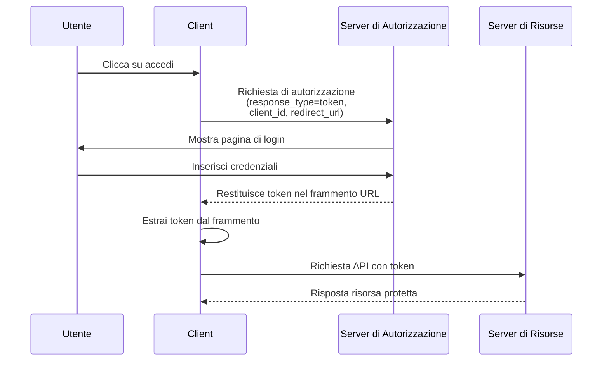

## Cos'è il flusso implicito (implicit flow)?

Il flusso implicito (implicit flow) di OAuth 2.0 è un metodo di autenticazione che consente alle applicazioni client-only (come le SPA e le app native) di ricevere token direttamente attraverso frammenti URL dal server di autorizzazione senza fornire un client secret.

Il flusso implicito (implicit flow) è progettato per applicazioni client-only, poiché funzionano completamente nel browser o sul dispositivo dell'utente e non possono memorizzare in modo sicuro i client secret.

Il flusso implicito (implicit flow) è stato ufficialmente deprecato in <Ref slug="oauth-2.1" /> per motivi di sicurezza (che verranno menzionati di seguito). Le applicazioni client-only dovrebbero ora utilizzare il <Ref slug="authorization-code-flow" /> con l'estensione <Ref slug="pkce" />.

## Come funziona il flusso implicito (implicit flow)?

I passaggi principali del flusso implicito (implicit flow) sono i seguenti:

Nota:

- Il client deve solo fornire un `client_id` nella richiesta di autorizzazione, senza richiedere un `client_secret`.  
  Questo perché questi client non possono memorizzare in modo sicuro i secret, quindi questo flusso non richiede un client secret.

- Il parametro `response_type` è impostato su `token`, istruendo il server di autorizzazione a restituire direttamente l'access token invece di un codice di autorizzazione.  
  In OIDC (<Ref slug="openid-connect" />), il `response_type` è `id_token` o `id_token token`, e il servizio di autenticazione restituirà i token corrispondenti in base ai diversi tipi di risposta.

- Il token viene restituito direttamente nel frammento URL. Ciò significa che il token è esposto nell'URL e può essere facilmente accessibile da altre applicazioni o script.

## Il flusso implicito (implicit flow) è sicuro?

No, il flusso implicito (implicit flow) in OAuth 2.0 è generalmente considerato meno sicuro rispetto ad altri flussi come il flusso del codice di autorizzazione (authorization code flow).

Non è raccomandato per la maggior parte dei casi d'uso a causa di diverse vulnerabilità:

- **Esposizione del token nell'URL**
   - Gli access token appaiono direttamente nell'URL del browser (dopo il simbolo #)
   - Questi token possono essere:
     - Salvati nella cronologia del browser
     - Trapassati attraverso gli header referrer
     - Catturati da codice JavaScript malevolo sulla stessa pagina

- **Nessuna autenticazione del client**
   - L'applicazione client non deve dimostrare la propria identità
   - Ciò significa che chiunque conosca il `client_id` può fingere di essere un client legittimo

- **Nessun refresh token**
   - Questo flusso non supporta i refresh token
   - Gli utenti devono effettuare nuovamente il login quando gli access token scadono
   - Per evitare login frequenti, gli utenti potrebbero memorizzare i token in modi non sicuri

- **Vulnerabile agli attacchi XSS**
   - Tutti i token sono gestiti nel browser
   - Se il sito web subisce un attacco XSS (Cross-Site Scripting)
   - Il codice JavaScript degli attaccanti può facilmente rubare questi token

A causa di queste preoccupazioni di sicurezza, il flusso implicito (implicit flow) è stato deprecato in <Ref slug="oauth-2.1" />. Le applicazioni client-only dovrebbero ora utilizzare il <Ref slug="authorization-code-flow" /> con l'estensione <Ref slug="pkce" />.

Puoi consultare [Cos'è PKCE: dai concetti di base alla comprensione approfondita](https://blog.logto.io/how-pkce-protects-the-authorization-code-flow-for-native-apps) per imparare come PKCE protegge il flusso del codice di autorizzazione per le applicazioni client-only.

<SeeAlso
  slugs={["oauth-2.1", "authorization-code-flow", "pkce", "openid-connect"]}
/>

<Resources
  urls={[
    "https://blog.logto.io/implicit-flow-is-dead",
    {
      url: "https://tools.ietf.org/html/rfc6749#section-4.2",
      result: {
        ogTitle: "The OAuth 2.0 Authorization Framework: Implicit Grant",
        ogDescription:
          "Il tipo di concessione implicita è utilizzato per ottenere access token (non supporta l'emissione di refresh token) ed è ottimizzato per client pubblici noti per operare un particolare URI di reindirizzamento. Questi client sono tipicamente implementati in un browser utilizzando un linguaggio di scripting come JavaScript.",
      },
    },
    "https://openid.net/specs/openid-connect-core-1_0.html",
    "https://blog.logto.io/how-pkce-protects-the-authorization-code-flow-for-native-apps",
  ]}
/>