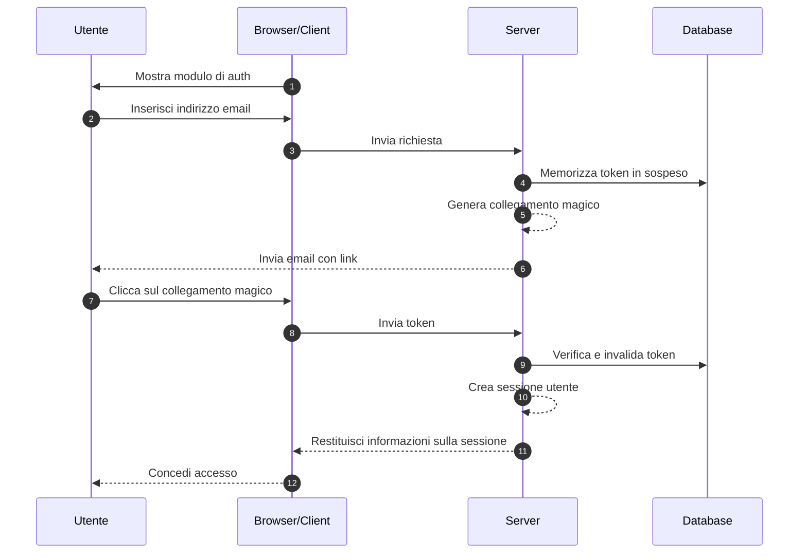
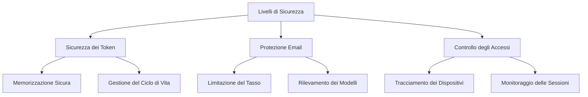

## Cosa sono i collegamenti magici (Magic links)?

Un collegamento magico (Magic link) è un URL sicuro e a tempo limitato che consente l'autenticazione passwordless sia per i processi di registrazione che di accesso. Invece di creare e ricordare password, gli utenti ricevono un link speciale via email che garantisce loro accesso immediato. Pensalo come una chiave digitale che funziona solo una volta: quando la clicchi, sei autenticato, e poi quella chiave diventa invalida.

Ad esempio, quando ti iscrivi a Medium o provi ad accedere a Slack, invece di impostare o inserire una password, queste piattaforme ti inviano un'email con un link sicuro. Un clic, e sei autenticato. Questo approccio ha guadagnato notevole popolarità perché combina sicurezza e semplicità.

## Come funzionano i collegamenti magici (Magic links)?

Il processo è semplice dal punto di vista dell'utente, ma coinvolge meccanismi di sicurezza sofisticati dietro le quinte. Ecco cosa succede durante un tipico flusso di autenticazione con collegamento magico (magic link):



## Qual è la struttura di un collegamento magico (Magic link)?

Un tipico collegamento magico (magic link) è composto da diversi componenti:

- URL di base dell'applicazione
- Endpoint di autenticazione
- Parametro token
- Parametri aggiuntivi (opzionali)

Ad esempio:

```
https://app.example.com/verify-auth?token=abc123...&redirect=/dashboard
```

## Come viene generato il token di un collegamento magico (Magic link)?

Quando un utente richiede un collegamento magico (ad esempio, cliccando su "Accedi con Email"), è necessario generare un token sicuro e imprevedibile. Questo token è cruciale poiché diventa essenzialmente una password temporanea.

Il token deve essere generato utilizzando un <Ref slug='csprng' />. Un CSPRNG utilizza l'entropia dall'hardware del tuo sistema (come il tempo di digitazione, i movimenti del mouse, il rumore della ventola, ecc.) per generare numeri veramente casuali che sono impossibili da prevedere, anche se un attaccante conosce output precedenti.

Ad esempio, in Node.js:

```javascript
import crypto from "node:crypto";

// Genera un token casuale sicuro
const token = crypto.randomBytes(32).toString("base64url");
// Risultato: qualcosa come 'dBjftJeZ4CVP-mB92K27uhbUJU1p1r_wW1gFWFOEjXk'

// Alternativa usando Web Crypto API (disponibile in Node.js e browser)
const buffer = crypto.getRandomValues(new Uint8Array(32));
const token2 = Buffer.from(buffer).toString("base64url");
```

Requisiti per un token sicuro:

- Generato tramite CSPRNG per garantire l'imprevedibilità
- Lungo almeno 32 byte (256 bit di entropia)
- Codificato in modo sicuro per URL (base64url elimina caratteri problematici)
- Limitato nel tempo e monouso per prevenire attacchi di replay
- Memorizzato in modo sicuro con metadati (scadenza, informazioni utente)

## Come proteggere l'autenticazione con collegamento magico (Magic link)

La sicurezza dei collegamenti magici (magic link) richiede un approccio completo su più livelli. Mentre la consegna delle email e i modelli di accesso sono critici, la gestione sicura dei token rimane il fulcro della sicurezza del sistema.

### Fondamenti di sicurezza dei token

La sicurezza dei collegamenti magici (magic link) dipende fortemente dalla corretta implementazione dei token (vedi il contenuto sopra). Ogni token deve essere crittograficamente sicuro e gestito correttamente durante il suo ciclo di vita. Il sistema dovrebbe imporre una scadenza rigorosa del token (tipicamente 15-30 minuti) e l'invalidazione immediata dopo l'uso.

Quando si memorizzano i token, trattali con lo stesso livello di sicurezza delle password:

- Hash dei token prima della memorizzazione per prevenire l'esposizione
- Implementa la pulizia automatica dei token scaduti
- Mantieni una traccia di audit dell'uso e dell'invalidazione dei token
- Memorizza i metadati associati (ora di creazione, utente previsto, informazioni sul dispositivo)

### Sicurezza nella consegna delle email

L'email serve come canale di consegna principale per i collegamenti magici (magic link), rendendola un potenziale bersaglio per gli attacchi. Implementare il rate limiting è essenziale per prevenire tentativi di forza bruta e proteggere dagli attacchi di email bombing. Ad esempio, potresti limitare gli utenti a 5 richieste di collegamento magico all'ora dallo stesso indirizzo IP.

Inoltre, monitorare modelli di attività insoliti aiuta a rilevare potenziali violazioni della sicurezza. Questo include:

- Più richieste da IP diversi per la stessa email
- Modelli di accesso geografici insoliti
- Richieste rapide che indicano attacchi automatizzati

### Controllo degli accessi e monitoraggio

Il fingerprinting dei dispositivi aggiunge un ulteriore livello di sicurezza tracciando modelli coerenti di comportamento degli utenti. Quando un tentativo di accesso proviene da un nuovo dispositivo o posizione, puoi implementare passaggi di verifica aggiuntivi o avvisare l'utente.

Per una maggiore sicurezza in applicazioni sensibili:

- Combina i collegamenti magici (magic link) con fattori di autenticazione aggiuntivi
- Implementa il monitoraggio continuo delle sessioni
- Registra tutti gli eventi di autenticazione per tracce di audit
- Aggiungi la verifica basata sul dispositivo per nuove posizioni



## Collegamenti magici (Magic links) vs SMS / Email OTP

Sia i collegamenti magici (Magic Links) che gli SMS / Email OTP si basano su canali esterni per la verifica.

I collegamenti magici inviano un URL monouso all'email dell'utente, mentre gli OTP inviano un codice di verifica al loro telefono o email.

I collegamenti magici offrono un'esperienza desktop superiore poiché gli utenti semplicemente cliccano sul link per completare la verifica, eliminando la necessità di inserire manualmente i codici. Possono anche trasportare informazioni contestuali aggiuntive, consentendo flussi di autenticazione più sofisticati.

Tuttavia, in scenari mobili, gli SMS OTP potrebbero offrire una migliore usabilità poiché gli utenti possono visualizzare rapidamente e inserire i codici di verifica.

## Collegamenti magici (Magic links) vs app di autenticazione

Rispetto ai codici OTP generati dalle app di autenticazione, i collegamenti magici (Magic Links) non richiedono agli utenti di installare applicazioni aggiuntive e funzionano senza problemi su tutti i dispositivi. Questo riduce l'attrito, in particolare per gli utenti non tecnici. Tuttavia, le app di autenticazione generano codici OTP con una migliore affidabilità in tempo reale, indipendentemente dalla velocità di consegna e disponibilità del server email.

Per scenari che richiedono frequenti autenticazioni con requisiti di alta sicurezza, le app di autenticazione potrebbero essere la scelta preferita.

## Quando utilizzare i collegamenti magici (Magic links)

I collegamenti magici (Magic Links) sono particolarmente efficaci per applicazioni aziendali e enterprise dove gli utenti tipicamente accedono meno frequentemente, come strumenti di gestione dei progetti o dashboard di reportistica. In questi scenari, il leggero ritardo nella consegna delle email è trascurabile rispetto alla comodità di non gestire password.

### Scenari ideali

Questi metodi di autenticazione brillano nei contesti aziendali dove l'email è già il canale di comunicazione principale. Ad esempio, piattaforme di collaborazione come Slack o Notion sfruttano efficacemente i collegamenti magici perché:

- Gli utenti monitorano già attivamente la loro email
- Le sessioni di accesso tendono a essere di lunga durata
- L'obiettivo è ridurre l'attrito nel processo di autenticazione

I collegamenti magici sono anche eccellenti per i flussi di registrazione degli utenti nei prodotti SaaS dove l'ottimizzazione della conversione è cruciale. Quando gli utenti possono iniziare a utilizzare il tuo servizio con solo un indirizzo email, riduce significativamente i tassi di abbandono durante il processo di onboarding.

### Quando considerare alternative

Tuttavia, i collegamenti magici potrebbero non essere la scelta migliore per applicazioni che richiedono frequenti autenticazioni. Le app di mobile banking, ad esempio, necessitano di metodi di autenticazione rapidi e affidabili poiché gli utenti potrebbero controllare il loro saldo più volte al giorno. In tali casi, l'autenticazione biometrica o i codici PIN spesso forniscono una migliore esperienza utente.

Considera metodi di autenticazione alternativi quando:

- La tua applicazione è principalmente basata su mobile
- Gli utenti necessitano di accesso immediato senza dipendenza dall'email
- L'ambiente richiede l'autenticazione multifattoriale
- I ritardi nella consegna delle email potrebbero influire significativamente sull'esperienza utente

La chiave è allineare il tuo metodo di autenticazione con i modelli di comportamento degli utenti e i requisiti di sicurezza. Mentre i collegamenti magici offrono un'eccellente sicurezza con un attrito minimo, dovrebbero far parte di una strategia di autenticazione più ampia piuttosto che essere l'unica soluzione.

<SeeAlso slugs={["csprng", "passwordless", "otp", "totp"]} />