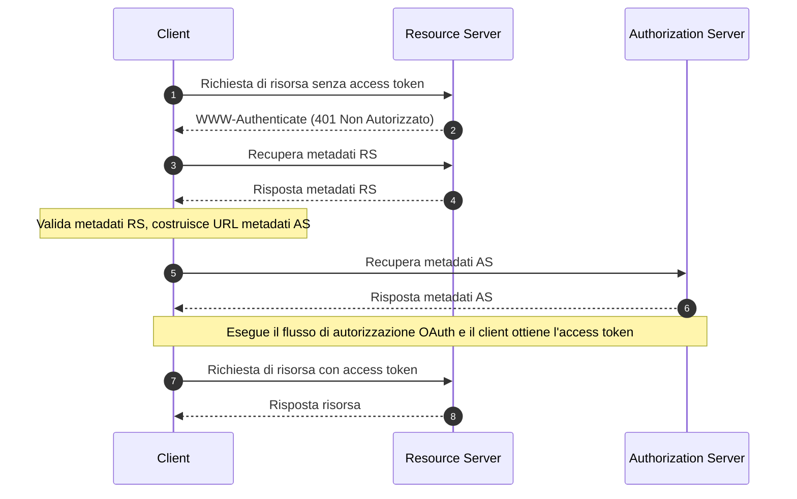

## Cosa sono i Metadati delle Risorse Protette di OAuth 2.0?

I Metadati delle Risorse Protette di OAuth 2.0 sono un formato standardizzato definito in [RFC 9728](https://datatracker.ietf.org/doc/html/rfc9728). Aiuta i client e i server di autorizzazione a comprendere come interagire con le risorse protette.

Questo formato di metadati fornisce informazioni essenziali su:
- Capacità del server delle risorse
- Formati di token supportati
- Meccanismi di sicurezza richiesti
- Relazioni con il server di autorizzazione
- Scope e permessi disponibili

## Quali sono i vantaggi dei Metadati delle Risorse Protette?

Nel sistema OAuth 2.0, ci sono quattro ruoli di base:
- <Ref slug="authorization-server"/>: Emette access token ai client dopo aver autenticato con successo il proprietario della risorsa
- <Ref slug="client"/>: Applicazione che richiede l'accesso alle risorse protette
- <Ref slug="resource-owner"/>: Entità in grado di concedere l'accesso alle risorse protette
- <Ref slug="resource-server"/>: Server che ospita risorse protette

Tradizionalmente, quando un client ha bisogno di accedere a risorse protette, deve prima scoprire e interagire con il server di autorizzazione per ottenere i token necessari. Il ruolo del Resource Server era principalmente limitato alla convalida dei token e alla fornitura di risorse, con tutti i dettagli di autenticazione e autorizzazione coordinati tramite il server di autorizzazione e l'applicazione client.

Questo significava che i client non avevano un modo standardizzato per scoprire i requisiti o le capacità specifiche di un Resource Server direttamente.

I Metadati delle Risorse Protette trasformano questa dinamica consentendo ai Resource Server di pubblicare attivamente i loro requisiti e capacità e portano diversi vantaggi chiave:
- Scoperta Diretta: I client possono ora apprendere i requisiti di un Resource Server direttamente dalla fonte
- Autonomia Migliorata: I Resource Server possono specificare esplicitamente i formati di token supportati, i meccanismi di sicurezza e i server di autorizzazione fidati
- Interoperabilità Migliorata: Un formato standardizzato assicura una comunicazione coerente dei requisiti di accesso attraverso diverse implementazioni
- Configurazione Dinamica: I Resource Server possono aggiornare i loro requisiti senza fare affidamento su modifiche del server di autorizzazione

## Come funzionano i Metadati delle Risorse Protette di OAuth 2.0?

I Metadati delle Risorse Protette operano all'interno dell'ecosistema OAuth 2.0 attraverso un processo standardizzato di scoperta e interazione:



Il documento dei metadati del server delle risorse è un oggetto JSON che contiene i seguenti campi:

```json
   {
     "resource": "https://api.example.com",
     "authorization_servers": [
       "https://auth.example.com"
     ],
     "scopes_supported": ["read", "write"],
     "token_formats_supported": ["jwt"],
     "token_introspection_endpoint": "https://api.example.com/introspect",
     "dpop_signing_alg_values_supported": ["ES256", "PS256"]
   }
   ```

E una volta che il client ha ricevuto il documento dei metadati, può usarlo per configurarsi e interagire con il server delle risorse principalmente secondo i seguenti campi:

- `resource`: Identificatore per la risorsa protetta
- `authorization_servers`: Elenco dei server di autorizzazione autorizzati
- `scopes_supported`: Scope disponibili per questa risorsa
- `token_formats_supported`: Formati di token supportati
- `token_introspection_endpoint`: Endpoint per la convalida del token
- `dpop_signing_alg_values_supported`: Algoritmi DPoP supportati

## Come scoprire gli endpoint dei Metadati delle Risorse Protette di OAuth 2.0?

Ci sono due meccanismi principali di scoperta per i Metadati delle Risorse Protette:

1. **Scoperta tramite Header WWW-Authenticate (Basata su Flusso)**:

Quando un client effettua una richiesta non autorizzata a una risorsa protetta, il server risponde con un codice di stato 401 e include l'URL dei metadati nell'header WWW-Authenticate:

```bash
# 1. Il client effettua una richiesta senza token
GET /api/resource HTTP/1.1
Host: api.example.com

# 2. Il server risponde con 401 e URL dei metadati
HTTP/1.1 401 Unauthorized
WWW-Authenticate: Bearer realm="example",
  scope="read write",
  resource_metadata_url="https://api.example.com/.well-known/oauth-resource-server"
```

L'header fornisce:
- Identificazione del realm della risorsa
- Scope richiesti
- Posizione dell'URL dei metadati

2. **Scoperta Diretta tramite URI Ben Conosciuto**:

Puoi accedere direttamente ai metadati effettuando una richiesta GET all'endpoint ben conosciuto:

```bash
GET /.well-known/oauth-resource-server HTTP/1.1
Host: api.example.com
```

L'endpoint segue un formato standardizzato:
- URI di base: `https://api.example.com`
- Percorso ben conosciuto: `/.well-known/oauth-resource-server`
- URL completo: `https://api.example.com/.well-known/oauth-resource-server`

## Come funziona l'header WWW-Authenticate nei Metadati delle Risorse Protette?

L'header WWW-Authenticate è un componente chiave nei Metadati delle Risorse Protette per implementare il meccanismo di scoperta automatica. Sfrutta l'header HTTP standard `WWW-Authenticate` per trasmettere informazioni sui metadati, consentendo ai client di scoprire e configurare automaticamente i requisiti di accesso per i server delle risorse.

Quando un client tenta per la prima volta di accedere a una risorsa protetta senza fornire un access token, il server delle risorse risponde con un codice di stato 401 Non Autorizzato e include un header WWW-Authenticate:

```
WWW-Authenticate: Bearer realm="example",
  scope="read write",
  resource_metadata_url="https://api.example.com/.well-known/oauth-resource-server"
```

Questo header può contenere diversi pezzi chiave di informazioni:
- `Bearer`: Indica che si tratta di uno schema di autenticazione OAuth 2.0 Bearer Token
- `realm`: Definisce lo spazio di protezione della risorsa
- `scope`: Specifica i permessi di accesso richiesti
- `resource_metadata_url`: Indica la posizione del documento dei metadati contenente la configurazione completa del server delle risorse

Dopo aver ricevuto questo header, il client estrae il `resource_metadata_url` e recupera il documento completo dei metadati da quell'URL.

Basandosi sulle informazioni sui metadati ottenute, il client può determinare i server di autorizzazione appropriati, i formati di token supportati, gli scope disponibili e altri dettagli di configurazione per configurare correttamente le richieste di autenticazione.

## Come proteggere i Metadati delle Risorse Protette di OAuth 2.0?

Le considerazioni essenziali sulla sicurezza includono:

1. **Sicurezza del Trasporto**:
   - Uso obbligatorio di TLS
   - Validazione dei certificati
   - Gestione sicura delle connessioni

2. **Integrità dei Metadati**:
   - Validazione della fonte
   - Verifica delle firme
   - Strategie di caching sicure

3. **Controllo degli Accessi**:
   - Limitazione della velocità
   - Validazione delle richieste
   - Monitoraggio degli abusi

## Come implementare i Metadati delle Risorse Protette di OAuth 2.0?

Ecco come i Metadati delle Risorse Protette di OAuth 2.0 sono implementati attraverso diversi componenti:

1. **Implementazione del Resource Server**

Il server delle risorse risponde con uno stato 401 Non Autorizzato e include l'URL dei metadati nell'header WWW-Authenticate quando riceve un tentativo di accesso non autorizzato:

```
HTTP/1.1 401 Unauthorized
WWW-Authenticate: Bearer realm="example",
  resource_metadata_url="https://api.example.com/.well-known/oauth-resource-server"
```

2. **Implementazione del Client**

Il client implementa una funzione asincrona per gestire l'accesso alle risorse. Quando riceve una risposta 401, questa funzione estrae l'URL dei metadati dall'header WWW-Authenticate, recupera i metadati e li utilizza per la configurazione del client:

```javascript
async function handleResourceAccess(response) {
  if (response.status === 401) {
    const wwwAuthenticate = response.headers.get('WWW-Authenticate');
    const metadataUrl = extractMetadataUrl(wwwAuthenticate);
    const metadata = await fetchMetadata(metadataUrl);
    // Configurazione del client basata sui metadati
  }
}
```

3. **Struttura del Documento dei Metadati**

Il server delle risorse fornisce un documento dei metadati come oggetto JSON contenente:
- Identificatore della risorsa
- Elenco dei server di autorizzazione autorizzati
- Scope supportati
- Formati di token supportati
- Algoritmi di firma DPoP supportati

Ecco un esempio del documento dei metadati:

```json
{
  "resource": "https://api.example.com",
  "authorization_servers": ["https://auth.example.com"],
  "scopes_supported": ["read", "write"],
  "token_formats_supported": ["jwt"],
  "dpop_signing_alg_values_supported": ["ES256"]
}
```

Questi componenti lavorano insieme per formare un'implementazione completa dei Metadati delle Risorse Protette di OAuth 2.0. Attraverso questa implementazione, i client possono scoprire e configurare automaticamente i parametri necessari per accedere alle risorse protette.

<SeeAlso slugs={["resource-server", "authorization-server"]} />

<Resources urls={[
  "https://datatracker.ietf.org/doc/html/rfc9728",
]} />