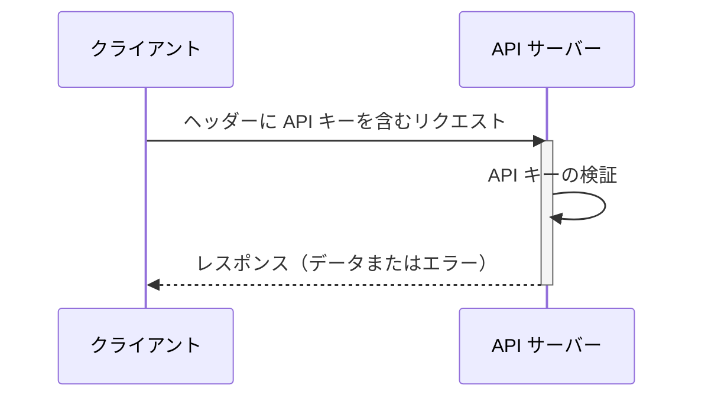

## API キーとは何ですか？

API キーは、API にアクセスするクライアントを認証するための秘密のトークンです。これはアプリケーションのパスワードのようなもので、特定の API へのアクセスを許可します。ビルへのアクセスに使うキーのようなものと考えてください。キーはアクセスを許可しますが、必ずしもあなたが誰であるかを識別するわけではありません。

## API キーはどのように機能しますか？

API キーは、シンプルなリクエストとレスポンスのプロセスを通じて機能します。

1. **リクエスト:** アプリケーションは API キーを含むリクエストを API に送信します。キーはリクエストのヘッダーに送信されることが多いです。例えば、ヘッダーは次のようになります: `x-api-key: your_actual_api_key`。ヘッダー名や値の形式に関する単一の標準はありません。

2. **検証:** API サーバーは提供されたキーをデータベースと照合します。

3. **レスポンス:** キーが有効であれば、サーバーはアクセスを許可し、要求されたデータを返します。無効であれば、アクセスは拒否されます。

以下はプロセスを示すシーケンス図です:

## API キーの利点と欠点は何ですか？

API キーが有用な点と欠点を見てみましょう:

### 利点

- **非常に簡単に使用できる**: リクエストにキーを追加するだけで完了です！家の鍵を使うようなもので、複雑な手順は必要ありません。

- **追跡が簡単**: 誰が API を使用しているか知りたいですか？API キーはそれを簡単にします。どのアプリが呼び出しを行っているか、どのくらいの頻度で行っているかを確認できます。

- **迅速なレート制限**: キーごとに制限を設定することで、API の過剰使用を防ぎます。クラブの入口で出入りを数えるバウンサーのようなものです。

- **公開データに最適**: 非機密情報（天気データや公開統計など）を共有する場合、API キーは最適です。

### 欠点

- **現代の代替手段よりも安全性が低い**: API キーは、<Ref slug="oauth-2.0" /> や <Ref slug="jwt" /> などの他の形式の API 認証ほど効果的ではありません。基本的なロックと現代のセキュリティシステムを比較するようなものです。しかし、API 使用状況を追跡し、API セキュリティを開始する最も簡単な方法であるため、依然として人気があります。

- **セキュリティリスク**: API キーは、家の鍵を玄関マットの下に置いておくようなものです。誰かがそれを見つけたら、永遠に使用できます。理由は次のとおりです:
  - コード内で見えることが多い
  - 自動的に期限切れにならない
  - 漏洩した場合（公開 GitHub リポジトリなど）、誰でも使用できる

- **ユーザーを区別できない**: 一部の企業はユーザーを識別できる「API キー」を使用していますが（例: Stripe）、従来の API キーは誰が誰であるかを教えてくれません。どのアプリケーションがリクエストを行っているかだけを教えてくれます。

- **静的である**: 現代の認証トークンとは異なり、API キーは通常永遠に同じままです。これにより:
  - 自動的なセキュリティ更新がない
  - キーを回転させるための手動作業が必要
  - キーが露出した場合のリスクが高い

## API キーの使用例は何ですか？

- サービス間通信: API キーは、アプリケーションが CLI を通じて直接 API と通信する必要があるシナリオに適しています。例: OpenAI API の呼び出し。
- 公開 API: API を公開する際、API キーはシンプルなアクセス制御方法を提供します。
- 簡略化されたセットアップ: 特に開発段階での迅速かつ簡単な認証ニーズに対応します。Machine-to-machine 認証とは異なり、API キーは事前のクライアント登録を必要とせず、access token に交換する必要もありません。リクエストのパラメータとして API キーを渡すだけで、単純に機能します。

実際のシナリオでは、製品を構築する際の最も一般的な目的は製品統合です。ここに典型的な使用例があります:

### 例: Stripe との統合

Stripe は、異なるプラットフォームやアプリケーションとの安全な統合のために API キーを使用します。これらのキーは、開発者ダッシュボードを通じて作成、表示、削除、管理できます。API キーを使用することで、Stripe のチェックアウトや請求機能を製品に統合できます。

## Personal Access Tokens (PAT) と Machine-to-Machine (M2M) の違いは何ですか？

API キーについて話すとき、personal access tokens と <Ref slug="machine-to-machine" /> も一緒に言及されることがあります。これらはすべて CLI コマンドを通じてプログラム的に API リソースにアクセスしたり、バックエンドサービス間の通信を確立したりすることができます。

### Personal Access Tokens (PATs)

personal access token も文字列ですが、***特定のユーザーの*** アイデンティティと権限を表し、認証またはログインが成功すると動的に生成され、通常は有限の寿命を持ちますが、更新可能です。ユーザー固有のデータと機能へのきめ細かいアクセス制御を提供し、CLI ツール、スクリプト、または個人の API アクセスに一般的に使用されます。主な違いは、より具体的でユーザー固有のアクションに使用されることです。

### Machine-to-Machine (M2M)

M2M 通信は、広義では人間の関与なしにデバイスが自動的にデータを交換することです。

<Ref slug="openid-connect" />（または <Ref slug="oauth-2.0" />）の文脈では、M2M アプリケーションは <Ref slug="client-credentials-flow" /> を使用します。これは [OAuth 2.0 RFC 6749 プロトコル](https://datatracker.ietf.org/doc/html/rfc6749) で定義されており、同様の標準プロトコルをサポートしています。通常、クライアントアプリケーション（マシンまたはサービス）が自分自身またはユーザーの代理としてリソースにアクセスします。信頼されたクライアントのみがバックエンドサービスにアクセスできる状況に理想的です。

<SeeAlso slugs={["machine-to-machine"]} />