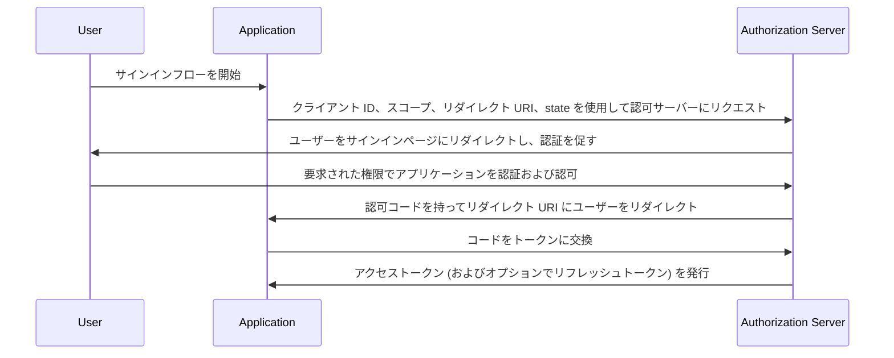

## 認可コードフロー (Authorization Code Flow) とは？

認可コードフロー (別名: 認可コードグラント) は、[OAuth 2.0 RFC 6749, セクション 4.1](https://datatracker.ietf.org/doc/html/rfc6749#section-4.1) で定義されている、ユーザーの代わりにアプリケーションがアクセストークンを取得できるようにする、広く使用されている OAuth 2.0 認可メカニズムです。

このフローは、クライアントシークレットを安全に保存できる従来のサーバーサイド Web アプリのような機密性の高いアプリケーションに最適です。

また、PKCE (<Ref slug="pkce" />) 拡張と組み合わせることで、クライアントシークレットを安全に保存できないネイティブアプリやシングルページアプリケーション (SPA) に対しても安全に使用できます。

## 認可コードフロー (Authorization Code Flow) はどのように機能するのか？

認可コードフローは以下のステップを含みます：

1. **フローの開始**: ユーザーは通常、アプリケーション内のリンクやボタンをクリックしてサインインすることでフローを開始します。アプリケーションは、クライアント ID、要求されたスコープ、リダイレクト URI、および state パラメータを渡して、ユーザーを認可サーバーの認可エンドポイントにリダイレクトします。認可サーバーはパラメータを検証し、ユーザーに認可サーバーのサインインページで認証を促します。
2. **ユーザー認証と認可**: ユーザーは認可サーバーで認証し、要求されたリソースへのアクセスをアプリケーションに許可します。
3. **コード生成とリダイレクト**: 認可サーバーは認可コードを生成し、ユーザーを以前に提供されたリダイレクト URI を使用してアプリケーションにリダイレクトします。認可コードはリダイレクト URI のクエリ文字列に含まれています。
4. **コード交換**: アプリケーションはクエリ文字列から認可コードを抽出し、認可サーバーのトークンエンドポイントに POST リクエストを送信して、認可コードをアクセストークンに交換します。リクエストにはクライアント ID、クライアントシークレット、リダイレクト URI、および認可コードも含める必要があります。
5. **アクセストークンの取得**: 認可サーバーは認可コードを検証し、検証が成功するとアプリケーションにアクセストークン (およびオプションでリフレッシュトークン) を発行します。その後、アプリケーションはアクセストークンを使用して、ユーザーの代わりに認可された API リクエストを行うことができます。

このステップは次のシーケンス図で示されます：



## 認可コードフロー (Authorization Code Flow) を実装するには？

以下は、[OAuth 2.0 RFC 6749, セクション 4.1](https://datatracker.ietf.org/doc/html/rfc6749#section-4.1) に記載されたガイドラインに従って、認可コードフローを実装する簡単な例です：

### 1. 初期設定

開始する前に、auth サービスから以下の情報を取得してください：

```javascript
const config = {
  clientId: "YOUR_CLIENT_ID",
  clientSecret: "YOUR_CLIENT_SECRET",
  authorizationEndpoint: "https://authorization-server.com/auth",
  tokenEndpoint: "https://authorization-server.com/token",
  redirectUri: "http://localhost:3000/callback",
};
```

クライアント ID、クライアントシークレット、およびリダイレクト URI は、auth サービス内のアプリケーションの設定です。

`authorizationEndpoint` と `tokenEndpoint` は、auth サービスによって提供されます。

auth サーバーが OIDC (<Ref slug="openid-connect" />) を実装している場合、<Ref slug="openid-connect-discovery" /> を通じてこの情報を取得できます。

### 2. 認可リクエストの開始

フローは、ユーザーがログインしたいときに開始されます (例えば、ログインボタンをクリックすることで)。アプリケーションはログインリクエストを行います。

このリクエストには、`client ID`、`redirect URI`、および `scope` などのパラメータが含まれます。その後、ユーザーを auth サービスの認可エンドポイント (auth サービスのログインページ) にリダイレクトします。

ユーザーはこのログインページで認証および認可を行います。

```javascript
app.get("/login", (req, res) => {
  const authUrl = new URL(config.authorizationEndpoint);
  authUrl.searchParams.append("response_type", "code");
  authUrl.searchParams.append("client_id", config.clientId);
  authUrl.searchParams.append("redirect_uri", config.redirectUri);
  authUrl.searchParams.append("scope", "openid profile email");
  authUrl.searchParams.append("state", "random_state_string");

  res.redirect(authUrl.toString());
});
```

注意: この例のコードに示されている以上のパラメータを追加することができます。[完全な認証リクエストパラメータの定義](https://openid.net/specs/openid-connect-core-1_0.html#AuthRequest) を参照してください。

### 3. リダイレクト URI コールバックとトークン交換の処理

ユーザーが auth サービスのログインページで認証および認可を完了した後、auth サービスはユーザーをアプリケーションのリダイレクト URI にリダイレクトします。このリダイレクト URI には、認可コードと state パラメータが含まれています。

アプリケーションはリダイレクト URI から認可コードと state パラメータを抽出し、auth サービスのトークンエンドポイントでアクセストークンとリフレッシュトークン (あれば) に交換します。

```javascript
app.get("/callback", async (req, res) => {
  const { code, state } = req.query;

  try {
    // 認可コードをアクセストークンとリフレッシュトークンに交換
    const tokenResponse = await axios.post(config.tokenEndpoint, {
      grant_type: "authorization_code",
      code,
      redirect_uri: config.redirectUri,
      client_id: config.clientId,
      client_secret: config.clientSecret,
    });

    const { access_token, refresh_token } = tokenResponse.data;
    // 後続のリクエストのためにトークンを保存
    req.session.accessToken = access_token;

    res.send("認証に成功しました！");
  } catch (error) {
    res.status(500).send("トークン交換に失敗しました");
  }
});
```

### 4. アクセストークンの使用

トークンを取得したら、それを使用して保護されたリソースにアクセスします：

```javascript
async function fetchUserProfile(accessToken) {
  const response = await axios.get("https://api.example.com/userinfo", {
    headers: {
      Authorization: `Bearer ${accessToken}`,
    },
  });
  return response.data;
}
```

## 公開クライアント (ネイティブアプリや SPA) に対して認可コードフローを使用するには？

公開クライアント (ネイティブアプリや SPA) は、認可コードフローを使用する際に特有のセキュリティ上の課題に直面します。これらのアプリケーションはクライアントシークレットを安全に保存できません。クライアントシークレットは JavaScript コードやデバイスのストレージ内で露出されるため、攻撃者がシークレットを抽出して悪用するのが容易になります。

したがって、クライアントシークレットなしで認可コードフローを安全に使用する方法が重要な課題です。OAuth 2.0 仕様は、この問題を解決するために PKCE (<Ref slug="pkce" />) 拡張を導入しました。

PKCE は、公開クライアントのために認可コードフローを保護するための追加のセキュリティ対策を提供します。クライアントシークレットを使用せずに認可コードのインターセプション攻撃を防ぎます。詳細は、[PKCE が OAuth 2.0 認可コードフローをどのように保護するか](https://blog.logto.io/how-pkce-protects-the-authorization-code-flow-for-native-apps) を参照してください。

## 認可コードフロー (Authorization Code Flow) を安全に使用するには？

### **"state" を使用して CSRF 攻撃を防ぐ**

CSRF (<Ref slug="csrf" />) 攻撃は、認証された Web アプリケーションでユーザーに望まないアクションを実行させるものです。state パラメータはこれを防ぐのに役立ちます。

- 一意でランダムな値を生成します。この値をサーバー側に保存します。
- state パラメータを含めます。認可リクエスト URL に追加します。
- 戻ってきたときに state を検証します。認可サーバーがアプリにリダイレクトしたとき、返された state と保存された値を比較します。一致しない場合はリクエストを拒否します。これにより、リクエストがアプリケーションから発信されたことが確認されます。

### **安全なリダイレクト URI の設定**

リダイレクト URI は、ユーザー認証後に認可サーバーが認可コードを送信する場所です。安全な設定が重要です。

- 有効なリダイレクト URI を登録します。認可サーバーへのアプリ登録時に、許可されたリダイレクト URI を指定します。
- 正確な一致。認可リクエストのリダイレクト URI は、登録された URI と正確に一致する必要があります。わずかな違いでも脆弱性を生む可能性があります。
- ワイルドカード URI を避ける。可能であれば、本番環境でワイルドカード URI の使用を避けます。攻撃の対象範囲が広がります。
- 本番環境では HTTPS を使用。リダイレクト URI には常に本番環境で HTTPS を使用します。

### **すべてのクライアントに PKCE を使用**

PKCE はもともと公開クライアントのために設計されましたが、<Ref slug="oauth-2.1" /> 仕様では、すべてのクライアント (機密クライアントを含む) に対して PKCE を強制することが求められています。これにより、認可コードフローの全体的なセキュリティが向上します。([すべてのクライアントに対する PKCE の強制](https://auth.wiki/oauth-2.1#enforcing-pkce-for-all-clients) を参照)

## 認可コードフロー (Authorization Code Flow) とインプリシットフロー (Implicit Flow) の違いは何ですか？

認可コードフローとインプリシットフローの主な違いは、アクセストークンの取得方法です：

- **認可コードフロー**: クライアントアプリケーションは、最初に認可エンドポイントから認可コードを受け取り、その後、トークンエンドポイントへの POST リクエストでそれをアクセストークンに交換します。
- **インプリシットフロー**: クライアントアプリケーションは、ユーザー認可後にリダイレクト URI の URL フラグメント内で直接アクセストークンを受け取ります。

<Ref slug="implicit-flow" /> について詳しく学びましょう。

## 認可コードフロー (Authorization Code Flow) とクライアントクレデンシャルフロー (Client Credentials Flow) の違いは何ですか？

認可コードフローとクライアントクレデンシャルフローの主な違いは、フローが使用されるコンテキストです：

- **認可コードフロー**: クライアントアプリケーションがユーザーの代わりにリソースにアクセスする必要がある場合に使用されます。このフローにはユーザー認証と認可が含まれます。
- **クライアントクレデンシャルフロー**: クライアントアプリケーションが自分自身の代わりにリソースにアクセスする必要がある場合に使用されます。このフローにはクライアント認証が含まれますが、ユーザー認証は含まれません。機械間通信に最適です。

<Ref slug="client-credentials-flow" /> について詳しく学びましょう。

<SeeAlso
  slugs={[
    "device-flow",
    "implicit-flow",
    "client-credentials-flow",
    "pkce",
    "openid-connect",
    "openid-connect-discovery",
    "csrf",
    "oauth-2.1",
  ]}
/>

<Resources urls={[
  "https://datatracker.ietf.org/doc/html/rfc6749",
  "https://openid.net/specs/openid-connect-core-1_0.html#AuthRequest",
  "https://blog.logto.io/how-pkce-protects-the-authorization-code-flow-for-native-apps"
]} />