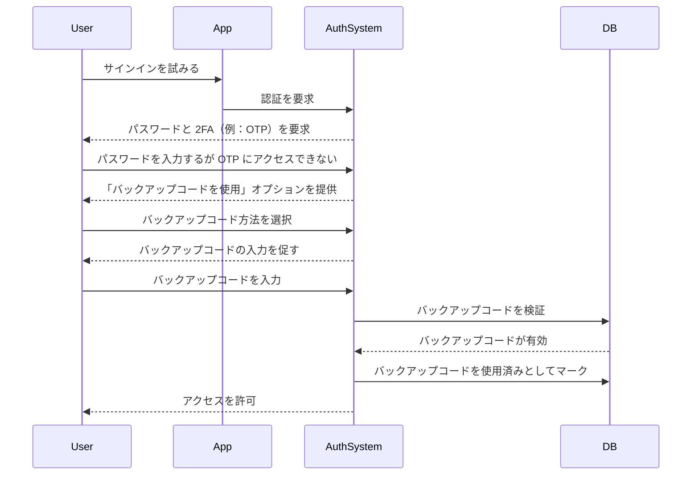

## バックアップコードとは？

バックアップコード（リカバリーコードとも呼ばれる）は、SMS、認証アプリ、パスキーなどの主要な MFA オプションが利用できない場合に、代替の認証方法として機能する、ランダムに生成された一回限りのコードのセットです。これらは、電話を紛失したり、ネットワークの問題が発生したり、技術的な障害に遭遇した場合でも、常にアカウントにアクセスできるようにする緊急キーと考えてください。

## バックアップコードはどのように機能するのか？

バックアップコードは、標準の MFA 方法が失敗したときにアカウントへのアクセスを取り戻すための簡単で安全な方法を提供します。以下はその仕組みです：

1. **生成**: システムは、MFA 設定時に一意のコードセット（通常は各コードが 8～12 文字）を作成します。
2. **保存**: これらのコードを安全に保存するよう促されます。オフライン（例：紙に印刷）または暗号化されたパスワードマネージャーに保存します。
3. **使用**: 主要な MFA 方法を使用できない場合、バックアップコードのいずれかを入力して認証します。
4. **無効化**: 各コードは使用後に自動的に無効化され、再利用を防ぎます。

## バックアップコードをいつ使用するか？

バックアップコードは廃れるのでしょうか？MFA はそれらをサポートし続けるべきでしょうか？

もちろんです。バックアップコードは MFA にとって重要な安全ネットです。パスキーや FIDO2 のような新しい方法が普及している一方で、バックアップコードは普遍的にアクセス可能でデバイスに依存しないリカバリーオプションを提供します。低コストで高価値の安全策であり、現代の MFA 方法と共に常にサポートされるべきです。

バックアップコードを使用するのは以下の場合です：

- 主要な MFA デバイスが利用できない（例：電話の紛失、バッテリー切れ）。
- ネットワークの問題で SMS/メールの配信が妨げられる。
- 認証アプリが同期に失敗する。
- ハードウェアトークンが故障する。

## バックアップコードを安全に使用する方法

バックアップコードを安全に保つために：

1. **オフラインで保存する**
    - デバイスの暗号化されたフォルダに保存する。
    - 印刷して安全な場所（例：キーパッドセーフ）に保管する。
    - 安全でないデジタル形式（例：オンラインノートアプリ）での保存を避ける。
2. **パスワードマネージャーを使用する**
    - ほとんどのパスワードマネージャー（例：1Password、LastPass）は安全なノート機能を提供しています。
        - 新しいエントリを作成：「バックアップコード – [サービス名]」
        - バックアップコードをコピーして貼り付け、暗号化を有効にする。
    - Google パスワードマネージャーを使用する場合：
        - 関連するサービスエントリを見つける。
        - それを編集し、バックアップコードのメモを追加し、コードを「使用済み/未使用」とラベル付けして追跡する。
        - これにより、パスワードを自動入力する際に、必要なときにすぐにバックアップコードにアクセスできます。
3. **使用済みコードを置き換える**
    - ほとんどのコードを使用した場合や、コードが危険にさらされたと疑われる場合は、新しいコードを再生成する。

## バックアップコードを使用した MFA エクスペリエンスの設計

バックアップコードを実装する開発者は、以下のベストプラクティスに従ってください：

1. **バックアップコードのみに依存しない**
   それらは緊急時の代替手段であり、主要な MFA 方法ではありません。常に TOTP、パスキー、または他の堅牢なオプションを提供してください。
2. **デフォルトで 8～10 のコードを提供する**
    
    これは、使いやすさ（まれな緊急時に十分）とセキュリティ（大量盗難リスクを最小化）をバランスします。
    
3. **一度の使用を強制する**
    
    使用後にコードを自動的に無効化します。
    
4. **枯渇時にコードを自動再生成する**
    
    ユーザーが現在のセットを使い果たした場合に新しいコードを発行してロックアウトを防ぎます。
    
5. **厳格な検証で手動再生成を許可する**
    
    ユーザーがコードを紛失した場合に新しいコードを生成できるようにしますが、再認証（例：メール/SMS/パスワード確認）を要求します。
    

## バックアップコードとパスワードの違いは何か？

| 機能 | バックアップコード | パスワード |
| --- | --- | --- |
| **目的** | MFA が失敗したときの一時的な代替手段 | 主な認証方法 |
| **形式** | システム生成、英数字 | ユーザーが選択、しばしば文字の混合 |
| **保存** | ハッシュ化（しばしばソルトなし、単一使用のため） | ハッシュ化 + ソルト化（レインボーテーブル攻撃を防ぐため） |
| **使用** | 一度使用後に無効化 | 変更されるまで再利用可能 |
| **再生成** | システムが新しいセットを発行 | ユーザーが手動でリセット |
| **セキュリティ** | 安全に保存する必要がある | 弱いまたは再利用されると脆弱 |

**重要なセキュリティノート：**

- 両方ともブルートフォース攻撃に耐えるために長くランダムに生成されるべきです。
- パスワードはしばしば再利用されるため、ソルト化が必要です。
- バックアップコードは通常ソルト化を必要としません。単一使用でランダムに生成されるため、大規模な攻撃は起こりにくいです。

<Resources
  urls={[
    "https://docs.logto.io/end-user-flows/mfa",
    "https://auth-wiki.logto.io/mfa",
    "https://auth-wiki.logto.io/totp"
  ]}
/>