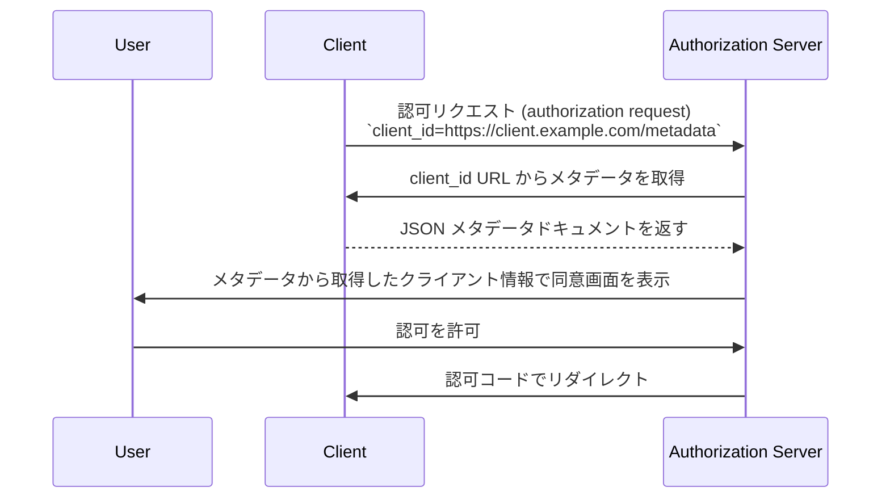

## クライアント ID メタデータドキュメント (Client ID Metadata Document) とは？

クライアント ID メタデータドキュメント (Client ID Metadata Document) は、[OAuth Client ID Metadata Document](https://datatracker.ietf.org/doc/draft-ietf-oauth-client-id-metadata-document/) 仕様で定義された仕組みであり、OAuth 2.0 <Ref slug="client" /> が事前登録なしで <Ref slug="authorization-server" /> に自身を識別できるようにします。

コアとなるアイデアは、authorization server から `client_id` を受け取る（手動登録や [Dynamic Client Registration](https://datatracker.ietf.org/doc/html/rfc7591) を通じて）代わりに、クライアントが **HTTPS URL を `client_id` として使用する** ことです。その URL はクライアントのメタデータ（名前、redirect URI、サポートする grant type など）を含む JSON ドキュメントを指します。authorization server は URL ベースの `client_id` を受け取った際にこのドキュメントを取得します。

このアプローチはコミュニティ内で **CIMD**（Client ID Metadata Document）と略されることもあります。

## どのように動作するのか？

クライアントがクライアント ID メタデータドキュメント (Client ID Metadata Document) を使用する場合、OAuth フローに 1 ステップ追加されます：authorization server が `client_id` の URL を解決し、クライアントのメタデータを取得します。



ステップごとの流れは以下の通りです：

1. クライアントは自身の URL を `client_id`（例：`https://client.example.com/oauth-client`）として <Ref slug="authorization-request" /> を開始します。
2. authorization server は `client_id` が URL であることを認識し、HTTPS 経由で取得します。
3. レスポンスは標準的な OAuth クライアントメタデータを含む JSON ドキュメントです。
4. authorization server はメタデータを検証し、ユーザーに同意情報を表示し、OAuth フローを継続します。
5. 以降のリクエストでは HTTP キャッシュヘッダーに従いキャッシュされたメタデータを利用できます。

### メタデータドキュメント

メタデータドキュメントは [RFC 7591 (OAuth 2.0 Dynamic Client Registration Protocol)](https://datatracker.ietf.org/doc/html/rfc7591) で定義されたフィールドと同じものを使う JSON オブジェクトです。`client_id` フィールドは URL と完全一致する値でなければなりません。

例：

```json
{
  "client_id": "https://client.example.com/oauth-client",
  "client_name": "My Application",
  "redirect_uris": ["https://client.example.com/callback"],
  "grant_types": ["authorization_code", "refresh_token"],
  "response_types": ["code"],
  "token_endpoint_auth_method": "none",
  "scope": "openid profile email"
}
```

### クライアント識別子 URL の要件

仕様では有効なクライアント識別子 URL に厳格な要件を設けています：

- **HTTPS を使用すること** — プレーン HTTP や他のスキームは不可
- **パスコンポーネントを含むこと** — `https://example.com` のようなドメインのみは無効
- **フラグメント、ユーザー名、パスワードコンポーネントを含まないこと**
- **単一ドット（`.`）や二重ドット（`..`）のパスセグメントを含まないこと**
- クエリ文字列は許可されるが推奨されない
- ポート番号は許可される

例：
- `https://client.example.com/oauth-client` — 有効
- `http://client.example.com/oauth-client` — 無効（HTTPS でない）
- `https://example.com` — 無効（パスなし）
- `https://client.example.com/../oauth-client` — 無効（ドットセグメント）

## 既存の登録方法を使わない理由

この仕様が存在する理由を理解するには、既存アプローチの制限を考える必要があります：

### 静的登録 (Static registration)

従来の OAuth 導入では、開発者が管理コンソールなどを通じて手動でクライアントを authorization server に登録し、`client_id` を受け取ります。これはクライアントが事前に分かっている場合に有効です。

しかし、どんなクライアントでも接続する可能性があるオープンなエコシステムでは機能しません。すべての AI エージェントや MCP クライアントを事前登録することはできません。

### Dynamic Client Registration (DCR)

[Dynamic Client Registration (RFC 7591)](https://datatracker.ietf.org/doc/html/rfc7591) では、クライアントがメタデータを登録エンドポイントに送信してプログラム的に登録できます。サーバーは `client_id` を生成し、登録情報を保存します。

これは機能しますが、サーバー側に状態が生じます：登録ごとにレコードが作成され、保存・管理・最終的にはクリーンアップが必要です。多くのクライアントが存在するオープンなエコシステムでは、authorization server に登録が蓄積されますが、その多くは一度使われて放置される可能性があります。

また、DCR にはクライアントが主張する身元を検証する仕組みが組み込まれていません。どんなクライアントでも任意の名前やロゴで登録できます。

### クライアント ID メタデータドキュメント (Client ID Metadata Document) の利点

クライアント ID メタデータドキュメント (Client ID Metadata Document) アプローチはこれらの課題を解決します：

| 項目 | 静的登録 | DCR | クライアント ID メタデータドキュメント |
|--------|-------------------|-----|----------------------------|
| サーバー側の状態 | あり（記録を保存） | あり（記録を保存） | なし（必要時に取得） |
| 事前登録が必要か | あり | なし | なし |
| 身元確認 | 手動審査 | 組み込みなし | HTTPS によるドメイン所有 |
| クリーンアップが必要か | あり | あり（放置記録） | なし（HTTP キャッシュで自動） |
| クライアントがメタデータを管理 | いいえ | 登録時のみ | 可能（いつでも更新可） |

重要なポイントは、**ドメイン所有が信頼のアンカーになる** ということです。`client.example.com` を管理する者だけが `https://client.example.com/oauth-client` でコンテンツをホストできます。HTTPS 証明書がこれを証明し、追加の検証ステップは不要です。

## 認証 (Authentication) の制約

クライアントと authorization server の間に事前共有シークレットが存在しないため、対称シークレットベースの認証 (authentication) 方法は使用できません。メタデータドキュメントには **以下を含めてはいけません**：

- `client_secret_post`
- `client_secret_basic`
- `client_secret_jwt`
- 共有対称シークレットに依存する認証 (authentication) 方法

また、`client_secret` および `client_secret_expires_at` フィールドもドキュメントに含めてはいけません。

クライアントがパブリッククライアント以上の認証 (authentication) を必要とする場合、非対称暗号を利用できます。クライアントはメタデータドキュメント内に公開鍵（`jwks` プロパティまたは `jwks_uri` 参照）を公開し、token エンドポイントで `private_key_jwt` を使って認証 (authentication) します。authorization server は公開された <Ref slug="jwk">JWK</Ref> で JWT 署名を検証します。

## authorization server はどうやってサポートを発見するか？

authorization server は、<Ref slug="authorization-server-metadata" /> に以下のプロパティを含めることでクライアント ID メタデータドキュメント (Client ID Metadata Document) のサポートを示します：

```json
{
  "client_id_metadata_document_supported": true
}
```

クライアントは URL ベースの `client_id` で認可フローを開始する前にこのフラグを確認できます。authorization server がサポートを広告していない場合、クライアントは他の登録方法にフォールバックすべきです。

## セキュリティ上の考慮事項

### SSRF 対策

authorization server がメタデータ URL を取得する際、クライアントが指定した URL への HTTP リクエストを行います。これはサーバーサイドリクエストフォージェリ (SSRF) のベクターとなり得ます。実装時は以下に注意してください：

- プライベートやループバック IP アドレス（例：`127.0.0.1`, `10.x.x.x`, `192.168.x.x`）へのリクエストをブロックする
- リダイレクト後もターゲットアドレスを再検証する
- レスポンスサイズ制限を設ける（仕様では最大 5 KB を推奨）
- 適切なタイムアウトを設定する

### キャッシュ

authorization server はメタデータをキャッシュする際、HTTP キャッシュヘッダー（`Cache-Control`, `ETag`）を尊重すべきです。ただし：

- **エラーレスポンスはキャッシュしないこと** — 一時的な障害でクライアントを永久にブロックしない
- サーバーはクライアントサーバーが指定した値に関わらず、最小・最大キャッシュ期間を強制できる

### フィッシング防止

悪意のあるクライアントが `client_name` に信頼されたブランド名、`logo_uri` にそのロゴを設定する可能性があります。authorization server は以下の対策を講じるべきです：

- 同意画面でクライアント名とともに必ず `client_id` のホスト名を表示する
- ロゴ画像は直接クライアントから読み込まず、事前取得やモデレーションを行う

### リダイレクト URI の証明

DCR と比べたセキュリティ上の利点として、メタデータドキュメント内の <Ref slug="redirect-uri">redirect URI</Ref> はクライアントのドメインで HTTPS で提供されます。これにより、登録リクエストで自己申告する値よりもクライアントの識別と redirect URI の結びつきが強化されます。

## クライアント ID メタデータドキュメントサービス

仕様では **クライアント ID メタデータドキュメントサービス (Client ID Metadata Document Services)** も定義されています。これは開発者に代わってメタデータドキュメントをホストするサードパーティの Web サービスです。

この仕組みは実用的なギャップを埋めます：ローカル開発中、開発者はメタデータをホストする公開 URL を持っていません。クライアント ID メタデータドキュメントサービスは authorization server が取得できる安定した公開 URL を提供し、開発者はローカルで作業できます。これにより、ローカルマシンをインターネットに公開したり、OAuth フローのテストのためにトンネルを設定する必要がなくなります。

<SeeAlso slugs={["client", "authorization-server-metadata", "redirect-uri", "jwk"]} />

<Resources
  urls={[
    "https://datatracker.ietf.org/doc/draft-ietf-oauth-client-id-metadata-document/",
    "https://datatracker.ietf.org/doc/html/rfc7591",
    "https://datatracker.ietf.org/doc/html/rfc8414",
  ]}
/>
