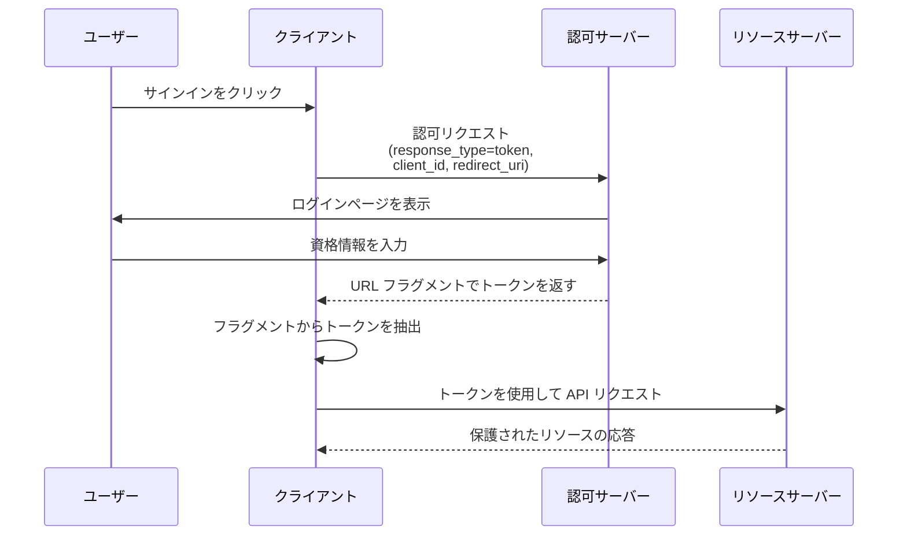

## インプリシットフロー (Implicit flow) とは？

OAuth 2.0 のインプリシットフロー (Implicit flow) は、クライアントシークレットを提供せずに、クライアントのみのアプリケーション（SPA やネイティブアプリなど）が認可サーバーから URL フラグメントを通じて直接トークンを受け取ることを可能にする認証方法です。

インプリシットフロー (Implicit flow) は、クライアントシークレットを安全に保存できないブラウザやユーザーのデバイス上で完全に動作するクライアントのみのアプリケーション向けに設計されています。

インプリシットフロー (Implicit flow) は、セキュリティ上の理由から <Ref slug="oauth-2.1" /> で公式に廃止されました（以下で説明します）。クライアントのみのアプリケーションは、代わりに <Ref slug="pkce" /> 拡張機能を使用した <Ref slug="authorization-code-flow" /> を使用する必要があります。

## インプリシットフロー (Implicit flow) はどのように機能するのか？

インプリシットフロー (Implicit flow) の主なステップは次のとおりです：

注意：

- クライアントは認可リクエストで `client_id` を提供するだけでよく、`client_secret` は必要ありません。  
  これは、これらのクライアントがシークレットを安全に保存できないため、このフローではクライアントシークレットを必要としないからです。

- `response_type` パラメータは `token` に設定されており、認可サーバーに認可コードの代わりに直接アクセストークンを返すよう指示します。  
  OIDC (<Ref slug="openid-connect" />) では、`response_type` は `id_token` または `id_token token` であり、認証サービスは異なるレスポンスタイプに基づいて対応するトークンを返します。

- トークンは URL フラグメントで直接返されます。これは、トークンが URL に露出し、他のアプリケーションやスクリプトによって簡単にアクセスできることを意味します。

## インプリシットフロー (Implicit flow) は安全か？

いいえ、OAuth 2.0 のインプリシットフロー (Implicit flow) は、一般的に認可コードフローのような他のフローよりも安全性が低いと考えられています。

いくつかの脆弱性のため、ほとんどのユースケースには推奨されません：

- **URL でのトークンの露出**
   - アクセストークンはブラウザの URL に直接表示されます（# 記号の後）
   - これらのトークンは以下のように：
     - ブラウザ履歴に保存される
     - リファラーヘッダーを通じて漏洩する
     - 同じページ上の悪意のある JavaScript コードによって捕捉される

- **クライアント認証なし**
   - クライアントアプリケーションはそのアイデンティティを証明する必要がない
   - これは、`client_id` を知っている誰もが正当なクライアントのふりをすることができることを意味します

- **リフレッシュトークンなし**
   - このフローはリフレッシュトークンをサポートしていない
   - アクセストークンが期限切れになると、ユーザーは再度ログインする必要がある
   - 頻繁なログインを避けるために、ユーザーはトークンを安全でない方法で保存するかもしれません

- **XSS 攻撃に対する脆弱性**
   - すべてのトークンはブラウザで処理される
   - ウェブサイトが XSS 攻撃（クロスサイトスクリプティング）を受けた場合
   - 攻撃者の JavaScript コードがこれらのトークンを簡単に盗むことができる

これらのセキュリティ上の懸念から、インプリシットフロー (Implicit flow) は <Ref slug="oauth-2.1" /> で廃止されました。クライアントのみのアプリケーションは、代わりに <Ref slug="pkce" /> 拡張機能を使用した <Ref slug="authorization-code-flow" /> を使用する必要があります。

<Ref slug="pkce" /> がクライアントのみのアプリケーションのために認可コードフローをどのように保護するかを学ぶには、[PKCE の基本概念から深い理解まで](https://blog.logto.io/how-pkce-protects-the-authorization-code-flow-for-native-apps) をチェックしてください。

<SeeAlso
  slugs={["oauth-2.1", "authorization-code-flow", "pkce", "openid-connect"]}
/>

<Resources
  urls={[
    "https://blog.logto.io/implicit-flow-is-dead",
    {
      url: "https://tools.ietf.org/html/rfc6749#section-4.2",
      result: {
        ogTitle: "The OAuth 2.0 Authorization Framework: Implicit Grant",
        ogDescription:
          "インプリシットグラントタイプはアクセストークンを取得するために使用され（リフレッシュトークンの発行はサポートされていません）、特定のリダイレクト URI を操作することが知られているパブリッククライアントに最適化されています。これらのクライアントは通常、JavaScript などのスクリプト言語を使用してブラウザで実装されます。",
      },
    },
    "https://openid.net/specs/openid-connect-core-1_0.html",
    "https://blog.logto.io/how-pkce-protects-the-authorization-code-flow-for-native-apps",
  ]}
/>